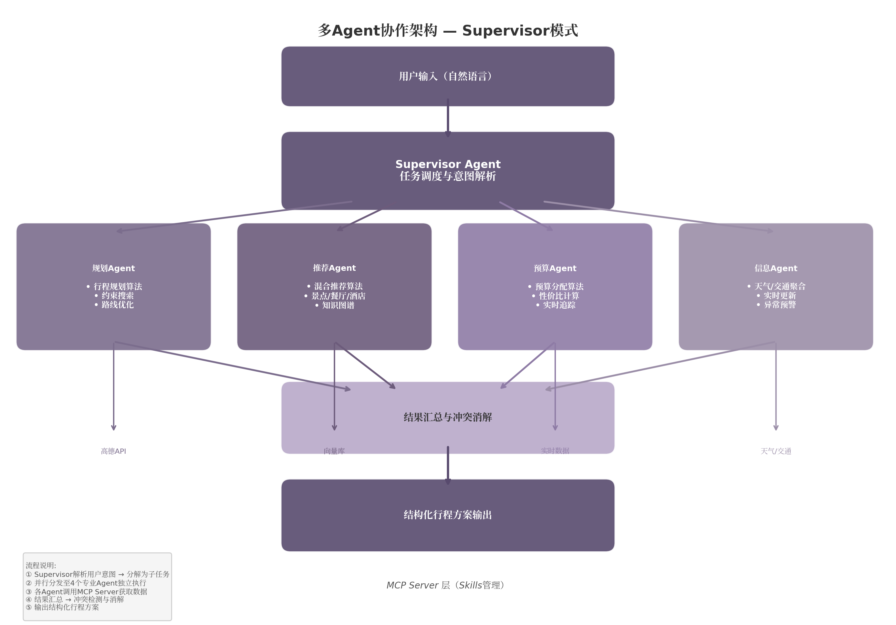
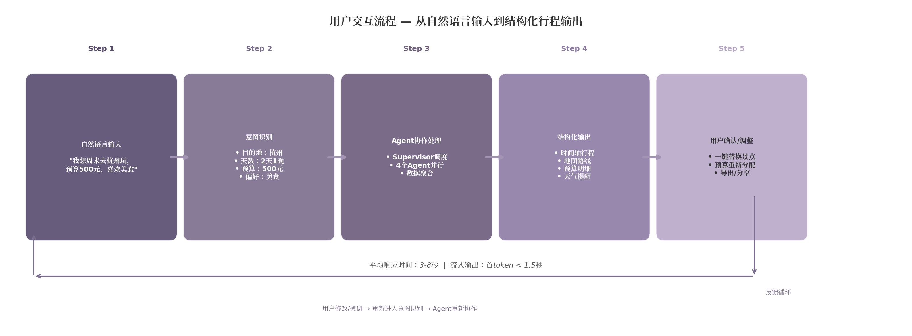

## 3. 产品方案设计

### 3.1 产品方向选择：旅游助手

#### 3.1.1 旅游助手优于提效助手的四大理由

在为多Agent协作系统选择产品方向时，团队曾在"个人提效助手"与"旅游助手"两个方向之间进行评估。全球个人AI助手市场预计从2024年的22.3亿美元增长至2034年的563亿美元，年复合增长率（CAGR）达38.1%[^187^]，且82%的办公人群面临多工具切换的痛点[^466^]，表面看提效助手似乎拥有更大的市场空间。然而，经过对技术可行性、数据成本、架构展示力和差异化空间的综合评估，旅游助手展现出四项不可替代的优势。

第一，旅游数据的获取成本极低。高德地图API为个人认证开发者提供30万次/日的免费调用额度，并发限制200 QPS[^530^]；和风天气API为个人开发者提供5万次/月的免费请求额度，2025年2月平均降幅达35%且额外增加了初始免费配额。相较之下，提效助手需要深度集成Slack、Notion、Jira、Google Calendar等企业级SaaS工具，每一项API授权均涉及OAuth2.0流程和付费墙，且用户散落在数十个不互联的工具中的数字足迹，使AI助手难以获取统一的上下文体验[^471^]。

第二，多Agent架构在旅游场景中具有天然的适配性。旅游规划问题本身可分解为"去哪里""怎么规划路线""花多少钱""天气交通如何"四个相对独立的子任务，恰好对应规划Agent、推荐Agent、预算Agent和信息Agent四个专业模块。Mastra框架的旅游Agent实现已验证了这一架构的可行性——通过调用航班搜索、酒店搜索、景点搜索等工具，各Agent专注于自身擅长的领域完成协作[^461^]。成熟的AI旅游助手普遍采用此类多Agent协作架构，各Agent分别负责历史景点、建筑、文化体验、美食、酒店、最佳旅行时间、打包建议等专项任务[^467^]。

第三，细分差异化空间大。竞品分析显示，当前市场上的AI旅游工具（MindTrip、Stardrift、Layla等）多面向国际旅行和中高端消费群体，在周末周边游、学生穷游等细分场景上覆盖不足。黄山AI旅行助手"AI伴游"上线以来累计服务近41万游客，自动处理咨询服务超97万次，产生订单超6万笔，证明国内旅游+AI的市场需求已被验证[^496^]。针对18—28岁学生群体设计一款聚焦"周末周边游+假期穷游"的产品，能够有效避开与通用工具的正面竞争。

第四，技术展示更为直观。旅游助手的输出——包含时间轴、地图路线、预算明细的可视化行程——在面试和项目展示中的直观性远胜于提效助手的"自动整理待办事项"。评委可通过一句"我想周末去杭州，预算500元"直观感受系统的规划能力和多Agent协作效果，这种即时反馈是提效助手难以比拟的。

#### 3.1.2 目标用户画像：18—28岁学生群体

产品将目标用户锁定为18—28岁在校学生群体，核心特征包括：月均可支配收入1{,}500—3{,}000元，对价格高度敏感；出行频率以每学期的2—3次周末周边游（单程200公里以内）和1—2次假期穷游（3—7天）为主；信息获取习惯依赖小红书、抖音等社交平台，但常面临"收藏了攻略却不会规划"的困境；对新技术接受度高，愿意为节省时间体验AI产品，但对付费功能较为谨慎。

这一群体的旅游决策链路可概括为：在社交平台获取灵感 → 在地图App查距离 → 在OTA平台比价 → 在备忘录手写行程 → 旅行中反复切换多个App查看信息。产品目标是将这一分散在5个以上App中的行为链路，压缩为与单一AI助手的对话式交互。

#### 3.1.3 核心痛点分析

办公场景82%的多工具切换痛点[^466^]，在旅游场景中被映射为三个更具体的用户困境。"不知道去哪"——用户在小红书看到大量碎片化内容但难以根据个人偏好和时间预算做出选择；"不知道怎么规划"——手动规划需要考虑景点距离、开放时间、交通衔接、用餐安排等十余个变量，认知负荷极高；"超预算"——大多数工具将预算作为事后统计功能，用户在规划阶段缺乏费用约束的实时感知。

竞品分析进一步验证了这一痛点。MindTrip拥有超过1{,}100万个POI（兴趣点）和2{,}050万美元融资，但缺乏预算感知能力，其AI建议有时被用户反馈"像是为了预订佣金而非旅行质量优化"。Wanderlog虽然提供协作编辑功能，但免费版 generous 的模式依赖于$39.99/年的Pro版变现，且用户反馈其界面在同时处理多人编辑和地图展示时存在卡顿。这些竞品在设计理念上的共性缺陷——忽视预算前置设计、缺乏针对中文市场的景点数据、未优化学生群体的价格敏感度——构成了本产品的差异化切入点。

### 3.2 多Agent协作架构设计

#### 3.2.1 规划Agent：行程规划算法

规划Agent是系统的核心模块，负责根据用户输入的约束条件生成个性化行程方案。其技术实现基于约束满足问题（Constraint Satisfaction Problem, CSP）框架，将行程规划建模为多目标优化问题：在时间窗口、预算上限、用户偏好、地理可达性四类硬约束下，最大化景点覆盖度与用户体验评分。

具体而言，规划Agent的执行流程分为五个步骤。第一步为意图识别，判断用户请求属于"完整行程规划""单日优化"还是"路线调整"三类。第二步为约束解析，从自然语言中提取时间（出发/返回日期）、预算（总额及分项上限）、偏好（文化/自然/美食/购物等标签）和人员构成（成人/儿童数量）四类参数。第三步为候选生成，基于约束条件从高德POI数据库中筛选符合条件的景点组合，使用贪心算法生成初始候选集。第四步为路线优化，以旅行商问题（Traveling Salesman Problem, TSP）的近似算法对每日景点顺序进行优化，目标是最小化交通时间。第五步为预算校验，确保总费用（门票+餐饮+交通+住宿）在预算范围内，若超出则触发降配策略（如替换为免费景点、调整餐厅档次）。

#### 3.2.2 推荐Agent：混合推荐算法

推荐Agent负责景点、餐厅和酒店的个性化推荐，采用三层混合推荐策略：协同过滤（Collaborative Filtering）层基于相似用户的历史行为推荐，内容推荐（Content-Based）层基于景点特征与用户偏好的匹配度排序，知识图谱（Knowledge Graph）层利用景点间的语义关联（如"西湖→龙井村→丝绸博物馆"的文化地理链路）扩展推荐多样性。三层的权重分配为4:3:3，通过加权融合生成最终推荐列表。

推荐Agent依赖向量数据库实现语义检索功能。景点、餐厅和酒店的信息被嵌入为768维向量，存储于PostgreSQL+pgvector中。当用户输入"我想看古建筑"时，系统通过向量相似度搜索将查询语义映射为与古建筑相关的POI，而非依赖关键词匹配。这种语义检索能力使推荐能够跨越字面含义，理解用户的真实意图。

#### 3.2.3 预算Agent：预算分配算法

预算Agent是产品最核心的差异化模块，其设计理念为"预算作为输入"（Budget as Input）——在行程生成阶段即根据预算约束自动筛选酒店、交通和活动，而非事后统计。这一设计直接回应了学生群体对超预算的高度敏感性。

预算Agent的工作流程包括：首先，接收总预算后按照预设比例自动分配至交通（30%）、住宿（25%）、餐饮（25%）、门票与活动（15%）和机动（5%）五个类别，用户可手动调整分配比例。其次，每个类别内执行性价比计算，以"体验评分/价格"作为核心排序指标，在保证不低于最低体验阈值的前提下选择性价比最高的选项。第三，行程生成后实时追踪预估花费，当某项超支时自动触发跨类别调剂（如减少住宿开支增加餐饮预算）。最后，在行程展示页面提供实时花费仪表盘，让用户对每一分钱的去向有清晰感知。

#### 3.2.4 信息Agent：天气/交通/景点信息聚合

信息Agent是系统的实时数据中枢，负责天气查询、交通状况获取和景点信息聚合三项任务。天气数据来自和风天气API，覆盖实时天气、7日预报、空气质量、灾害预警和天文数据（日出/日落时间），免费版提供5万次/月的调用额度[^530^]。交通数据来自高德地图API的路径规划和实时路况服务，个人认证开发者可获得30万次/日的免费额度[^530^]。景点信息通过高德POI搜索API获取，结合本地缓存的景点详情数据库（开放时间、门票价格、特色标签）提供完整信息。

信息Agent的设计强调异常预警能力：当检测到目的地将出现暴雨、高温或景点临时闭馆等情况时，自动在行程中插入预警提示并推荐替代方案。这一能力使系统从"被动回答"升级为"主动代理"，在问题发生前提前介入。

#### 3.2.5 Agent间协作流程

四个专业Agent的协作采用Supervisor模式（主管调度模式），由Supervisor Agent统一协调通信流和任务委派。业界实践表明，Supervisor模式适用于旅游、客服、综合问答等中小型业务场景，在灵活性和可控性之间取得了最佳平衡，约90%的多Agent团队可从中受益[^473^]。相较Hierarchical分层树形架构（适合政企金融的复杂模块）和Pipeline流水线模式（适合文档处理），Supervisor模式的扁平结构更适合旅游场景的快速响应需求。

**流程一：Agent协作流程（如上图所示）**。用户以自然语言输入需求后，Supervisor Agent首先进行意图解析，识别用户请求涉及的任务类型（如"规划杭州3日游，预算800元"需要同时触发规划、推荐、预算和信息四个Agent）。随后Supervisor将任务并行分发至相关子Agent：规划Agent负责生成行程框架，推荐Agent填充景点和餐厅，预算Agent校验费用约束，信息Agent获取天气和交通数据。各Agent通过MCP（Model Context Protocol，模型上下文协议）Server调用外部工具获取实时数据，独立完成后将结果返回Supervisor。Supervisor执行结果汇总与冲突消解——例如当规划Agent推荐的景点超出预算Agent的限额时，优先采纳预算Agent的约束并通知规划Agent降配。最终，Supervisor将经过校验和整合的结构化行程方案返回给用户。

这一架构的并行设计显著提升了响应效率。Datawhale的智能旅行助手实践显示，采用层级调度模式后，开发效率较平等群聊模式提升10倍以上，任务成功率从不到30%提升至超过90%。在生产级多Agent系统中，3—7个Agent的数量被认为是最优区间，超过10个Agent需要非常成熟的工程团队维护[^483^]。本产品采用4个专业Agent的精简架构，在覆盖核心功能的同时保持了系统的可维护性。

### 3.3 核心功能设计

#### 3.3.1 MVP功能清单

MVP（Minimum Viable Product，最小可行产品）阶段聚焦三个核心功能，遵循"完善3个功能优于做10个 mediocre 功能"的产品原则。这一策略的核心逻辑在于：多Agent系统的协作复杂度随Agent数量呈超线性增长，每增加一个Agent，通信路径和错误传播风险均呈指数级上升[^483^]。MVP阶段的目标不是展示功能的广度，而是证明多Agent协作在旅游场景中的有效性和可靠性。

三个MVP核心功能为：智能行程规划（用户输入目的地+天数+预算+偏好 → 系统输出完整的多日行程方案）、景点推荐（基于用户偏好和地理位置推荐景点/餐厅/酒店，支持混合推荐算法的多层融合）、预算管理（预算前置输入、分项自动分配、实时花费追踪和超预算预警）。

#### 3.3.2 V1.0扩展功能

V1.0阶段在MVP基础上增加四项扩展功能：酒店比价（聚合携程、去哪儿等平台的价格数据，提供同酒店跨平台价格对比）、路线优化（在地图上可视化展示行程路线，支持"少走回头路"的智能排序）、天气预警（集成和风天气的灾害预警API，在异常天气前主动推送行程调整建议）、行程分享（支持一键生成图文行程卡片，分享至微信/小红书等社交平台）。

#### 3.3.3 V2.0高级功能

V2.0阶段面向高级用户场景引入四项高级功能：离线缓存（将已生成的行程信息缓存至本地，支持无网络环境下的查看和导航）、语音交互（支持语音输入规划需求和语音播报行程提醒）、多人协作规划（类似Google Docs的实时协作编辑，多人可同时编辑同一行程并各自标记偏好）、智能相册（根据行程时间轴自动整理旅行照片，生成带地理位置标记的回忆游记）。

下表展示了三个版本的功能矩阵，从用户价值、技术复杂度、依赖条件和实现优先级四个维度进行比较。

| 功能模块 | 版本 | 用户价值 | 技术复杂度 | 外部依赖 | 优先级 |
|---------|------|---------|-----------|---------|--------|
| 智能行程规划 | MVP | 极高（核心价值） | 高（多Agent协作+CSP求解） | 高德POI API | P0 |
| 景点推荐 | MVP | 极高（差异化点） | 中高（向量检索+混合推荐） | pgvector向量库 | P0 |
| 预算管理 | MVP | 极高（差异化点） | 中（约束分配算法） | 无（纯算法） | P0 |
| 酒店比价 | V1.0 | 高（变现路径） | 中（多源数据聚合） | 携程/去哪儿API | P1 |
| 路线优化 | V1.0 | 高（体验提升） | 中（TSP近似算法） | 高德路径规划API | P1 |
| 天气预警 | V1.0 | 中高（主动服务） | 低（API集成） | 和风天气API | P1 |
| 行程分享 | V1.0 | 中（社交传播） | 低（模板生成） | 无 | P2 |
| 离线缓存 | V2.0 | 高（场景刚需） | 高（本地存储+同步） | 无 | P2 |
| 语音交互 | V2.0 | 中（交互升级） | 高（ASR+TTS集成） | 语音识别API | P2 |
| 多人协作 | V2.0 | 中（细分需求） | 高（OT冲突处理） | WebSocket | P3 |
| 智能相册 | V2.0 | 低（增值功能） | 中（图像处理） | 图像识别API | P3 |

功能矩阵的分析揭示了几个关键产品决策。首先，三个MVP功能均标记为P0且用户价值极高，因为它们共同构成了"对话式输入 → 完整行程输出"的核心闭环，缺少任一环节都将导致用户体验断裂。其次，预算管理的实现依赖纯算法而无需外部API，这意味着团队可在项目早期即独立完成开发，不受第三方接口申请流程的阻塞——这一"零外部依赖"特性使其成为MVP中最可控的功能模块。第三，V1.0阶段的酒店比价直接关联商业化路径——通过Affiliate佣金模式，用户经由产品链接完成酒店预订后，产品方可获得佣金分成，黄山AI伴游已通过此模式促成1.88亿元订单[^496^]。最后，V2.0阶段的离线缓存和语音交互虽然技术复杂度高，但在旅游场景中的用户价值显著：竞品分析显示，Wanderlog仅Pro版（$39.99/年）提供离线访问，Stardrift仅支持导出PDF离线使用，将离线能力作为免费功能提供将是产品的有力差异化。

### 3.4 用户体验设计

#### 3.4.1 交互流程

产品的交互设计遵循"对话式输入 → 意图识别 → Agent协作 → 结构化输出 → 用户确认"的五步模型，替代传统搜索模式的多页面跳转。这一流程的核心设计理念是"可预期性"——把系统做什么、风险多大、是否需要确认提前暴露给用户，塑造用户对AI能力的稳定预期[^478^]。

**流程二：用户交互流程（如上图所示）**。用户以自然语言输入需求（如"我想周末去杭州玩，预算500元，喜欢美食"），系统在Step 2进行意图识别，将非结构化文本解析为结构化参数（目的地：杭州；天数：2天1晚；预算：500元；偏好标签：美食）。Step 3触发多Agent协作处理——Supervisor Agent并行调度规划Agent、推荐Agent、预算Agent和信息Agent，各Agent通过MCP Server调用外部数据源完成子任务，平均响应时间3—8秒，流式输出模式下首token延迟低于1.5秒。Step 4将各Agent结果整合为结构化输出，包含时间轴形式的行程安排、地图上的路线可视化、分项预算明细和天气提醒。Step 5允许用户对行程进行一键调整——替换某个景点、重新分配预算或修改出行日期——任何调整都会触发反馈循环，重新进入意图识别和Agent协作流程。

#### 3.4.2 关键交互细节

行程可视化采用"时间轴+地图"的双视图设计。左侧为按时间顺序排列的行程卡片，每张卡片包含景点名称、开放时间、建议游览时长、预估费用和简要介绍；右侧为高德地图嵌入视图，以彩色路线连接当日景点，标注交通方式和时间。双视图的联动设计允许用户点击时间轴上的任一景点时，地图自动定位至该位置并展开详情浮层。

预算仪表盘采用环形图（donut chart）展示五大费用类别的占比，每个类别可展开查看明细列表。当鼠标悬停在某个景点上时，仪表盘实时高亮该景点所属的费用类别和金额，建立行程与预算之间的直观关联。超预算时环形图变为警示色，系统同步推送降配建议（如"将午餐从人均120元调整至人均60元，可节省60元"）。

一键调整功能覆盖三类高频修改场景："换一批景点"（保持时间和预算不变，替换为同类别其他景点）、"压缩预算"（在总预算降低时自动调整各环节配置）和"加一天/减一天"（动态重排行程密度）。每次调整后系统实时重新计算路线和预算，响应时间控制在2秒以内。

#### 3.4.3 离线能力设计

离线能力是旅游助手在景区弱网环境下的刚需功能。设计方案采用三层缓存策略：第一层为行程数据缓存，用户生成行程后，完整的行程信息（景点详情、地图路线、预算明细）自动缓存至本地IndexedDB，支持离线查看。第二层为地图瓦片缓存，利用高德地图的离线地图SDK预下载目的地周边地图瓦片，确保无网络时仍可查看基础地图和路线。第三层为信息快照缓存，天气和交通信息在联网时获取后缓存4小时，过期后显示"信息可能已过期"提示。

联网后的自动同步机制处理两类场景：用户在线时获取的最新数据（如实时天气更新）自动覆盖缓存；用户在离线状态下对行程的修改（如手动调整景点顺序）在联网后上传至服务端，服务端进行冲突检测并提示用户确认。这一设计使离线功能从"只读缓存"升级为"可读写+冲突处理"的完整体验。

### 3.5 数据源与API

#### 3.5.1 免费API资源清单

产品采用全免费API策略，在MVP阶段不依赖任何付费数据源。核心API资源包括：高德地图Web服务API，个人认证后提供30万次/日调用额度，并发限制200 QPS，覆盖地理编码、逆地理编码、路径规划、POI搜索、行政区划查询等功能[^530^]；和风天气API，非商业用户每月5万次免费请求额度，支持实时天气、3日/7日预报、空气质量、灾害预警和天文数据[^530^]；去哪儿网开放平台提供机票、火车票、度假产品的搜索接口（商业化预订需单独申请授权）；此外，文化和旅游部公开的A级旅游景区名录、各地市政府公开的景点开放数据等政府开放数据集，作为POI信息的补充数据源。

免费API的调用限额对产品设计构成了实际约束。以一次完整的行程规划为例：规划Agent需调用高德POI搜索约10次（目的地景点筛选）、路径规划约5次（每日路线优化），信息Agent需调用天气API 1次（目的地预报），推荐Agent需调用向量检索若干次（本地服务，不消耗外部配额）。单次规划的外部API调用总量约16次，以高德30万次/日的额度计算，理论日服务容量约为18{,}750次完整规划，对MVP阶段的学生项目完全充足。

#### 3.5.2 数据存储策略

数据存储采用三层架构。PostgreSQL作为主数据库存储结构化数据（用户表、会话表、消息表、行程表），利用JSONB字段类型灵活存储行程内容的嵌套结构，同时通过pgvector扩展支持768维向量存储，用于景点语义检索。Redis作为缓存层，承担会话状态管理（TTL 30分钟）、API响应缓存（TTL 1小时）、速率限制和Pub/Sub消息通知四项职能，将高频读取操作从PostgreSQL卸载。向量库在开发环境使用pgvector（零额外基础设施），在生产环境迁移至Milvus以获得更好的并发性能和水平扩展能力。

景点和POI数据的初始化策略为：通过高德API批量获取目标城市（首批覆盖北京、上海、杭州、南京、苏州等高校集中城市）的景点、餐厅、交通枢纽信息，经过去重、清洗和向量化处理后存入PostgreSQL，形成约5万条POI的本地数据库。此后通过定时任务（每日凌晨）增量同步数据更新，将实时API调用降至最低。

#### 3.5.3 API配额管理与降级策略

免费API额度的有限性要求系统必须具备优雅的降级能力。配额管理模块采用三级策略：正常模式下所有Agent均可调用实时API获取最新数据；当高德API日调用量超过80%阈值（24万次）时，系统切换至缓存优先模式——信息Agent优先返回Redis缓存数据，仅在缓存缺失时触发实时调用，同时向用户显示"数据可能非最新"的提示标签；当额度用尽时，系统进入纯本地模式，完全依赖PostgreSQL中的POI数据库和天气缓存，核心规划功能不受影响，仅实时性有所降低。

降级策略的设计遵循"有损服务"原则：在资源受限时优先保证核心功能（行程规划和预算管理）的可用性，而非追求所有功能的完美体验。这一思路借鉴了分布式系统中的熔断（Circuit Breaker）模式，将API配额视为一种会耗尽的资源，提前设计好耗尽后的系统行为，避免因第三方服务异常导致整个系统不可用。对于和风天气API，系统额外集成了彩云天气（1{,}000次/天）和心知天气（无调用限制，QPS为1）作为备选数据源，在主源耗尽时自动切换，确保天气信息的高可用性。
