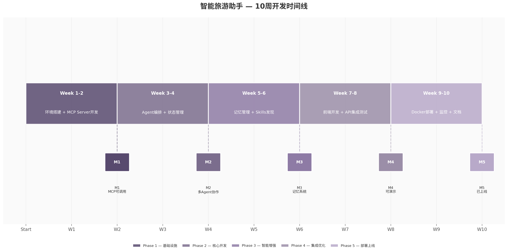

## 5. 项目开发路线图

多Agent系统的开发遵循"基础设施先行、核心功能攻坚、智能特性增强、集成优化收尾"的递进逻辑。研究表明，多Agent系统在生产环境的失败率高达41%-87%，其中约79%的失败归因于协调缺陷而非底层模型能力不足[^1^]。这意味着开发过程中对架构一致性和集成测试的投入必须前置，而非留到项目末期补救。本章基于10周迭代周期，提供从环境搭建到部署上线的完整开发路线，每周均设定明确的交付标准和验收条件。

### 5.1 开发阶段规划

#### 5.1.1 Week 1-2：环境搭建与MCP Server开发

项目启动阶段的核心目标是建立标准化的开发环境和可独立调用的工具链。基础设施的健壮性直接决定后续迭代的效率——使用Docker Compose进行统一编排已被验证为生产就绪方案，支持AI Agent工作流的一键部署[^2^]。这两周的具体任务分解如下：项目脚手架搭建（Git仓库初始化、目录结构规划、CI/CD流水线配置）、Docker开发环境构建（包含PostgreSQL 16 + pgvector、Redis 7.2、Qdrant向量数据库的后编排）、数据库初始化（用户表、会话表、消息表、行程表的迁移脚本与种子数据）。

工具链开发是本阶段的重点。MCP（Model Context Protocol，模型上下文协议）作为Agent与外部工具连接的事实标准，提供Tools、Resources、Prompts三种原语，使用JSON-RPC 2.0消息格式进行通信[^3^]。项目需要实现3个核心MCP Server：Weather MCP Server（对接和风天气API，提供实时天气和7日预报查询）、Scenic MCP Server（对接高德地图POI搜索，支持景点信息检索和详情查询）、Traffic MCP Server（对接高德路线规划，提供交通方式对比和路线优化）。每个MCP Server都需要完整的单元测试覆盖，确保参数校验、错误处理和响应格式化符合协议规范。Week 2结束时，3个MCP Server应能通过标准Client独立调用，工具链的输入输出契约稳定。

#### 5.1.2 Week 3-4：Agent编排核心开发

进入核心开发阶段，首要任务是构建基于LangGraph Supervisor模式的多Agent编排系统。CallSphere AI的实证分析指出，Supervisor模式是90%多Agent团队的正确选择——相比单Agent架构，它在成功率上提升约18个百分点（从71%提升至89%），虽然Token成本增加约3倍，但对于高价值的旅游规划任务而言，这一成本增量完全可接受[^4^]。`create_supervisor` API支持多级层次结构构建，是快速搭建Supervisor模式的推荐方式[^5^]。

4个专业Agent的开发是本阶段的核心交付物。Planning Agent（规划Agent）负责行程生成与路线优化，集成TSP（旅行商问题）近似算法进行每日游览路线优化；Recommend Agent（推荐Agent）负责景点、餐厅、酒店的个性化推荐，基于用户偏好和协同过滤实现混合排序；Info Agent（信息Agent）负责天气、交通、景点信息的并行聚合查询，利用LangGraph的并行节点执行能力（扇出/扇入模式）同时发起多个外部调用[^6^]；Memory Agent（记忆Agent）负责用户偏好的提取、存储和检索，与Mem0记忆层交互。Week 4结束时，Supervisor应能根据用户意图准确路由任务到对应Agent，Agent之间的状态传递和错误传递机制必须跑通。

#### 5.1.3 Week 5-6：记忆管理集成与Skills动态发现

Week 5-6聚焦于系统的"智能增强层"。记忆管理是Agent项目的隐形杀手——80%的Demo项目因缺乏跨会话记忆和上下文管理而在面试追问中暴露短板[^7^]。Mem0框架在LOCOMO（Long Context Multi-session Optimization）基准测试中比OpenAI Assistants记忆方案提升26%的相对表现，在p95延迟上降低91%，Token成本节省超过90%[^8^]。集成Mem0需要完成以下工作：配置Qdrant作为向量存储后端、实现BAAI/bge-large-zh-v1.5 embedding模型部署、编写记忆提取和检索接口、建立用户偏好自动提取机制。

Redis在本阶段承担短期记忆（Short-Term Memory，STM）层角色，负责当前会话状态缓存（TTL 30分钟）、近期消息历史和临时上下文管理。PostgreSQL则通过LangGraph Checkpointer机制实现图状态的持久化，确保Agent工作流可以在任意节点恢复执行[^9^]。Skills动态发现机制也在本阶段实现：当MCP Server数量增多时，采用渐进式披露（Progressive Disclosure）策略——先加载粗粒度的Skills类别描述，匹配用户需求后再按需加载详细的工具Schema，避免一次性加载全部工具定义导致的Token爆炸问题。

#### 5.1.4 Week 7-8：前端开发与API集成测试

前端开发采用Streamlit作为MVP阶段的快速原型工具。Streamlit适合数据可视化和业务工具场景，可在数小时内搭建可交互的界面[^10^]。Week 7的核心任务包括：聊天界面（消息历史展示、流式输出、工具调用确认弹窗）、会话管理（历史会话列表、会话创建/切换/删除）、行程可视化（时间线展示、地图集成、预算统计）。FastAPI后端同步开发REST API端点（聊天、会话、用户、行程管理）和WebSocket服务（支持SSE流式输出），遵循"薄端点、厚服务"的设计哲学——端点只负责验证输入、认证用户和限流，业务逻辑交给服务层处理[^11^]。

Week 8进入集成测试阶段。测试覆盖三层：单元测试（Agent逻辑、工具调用、记忆操作）、集成测试（API端到端调用链、MCP Server通信）、性能测试（并发请求处理、延迟分布、Token消耗统计）。重点验证场景包括：多Agent协作的完整流程（从用户输入到最终行程生成）、跨会话记忆保持（用户三天前提到偏好海鲜，新会话中推荐餐厅时应体现该偏好）、错误恢复机制（工具调用失败后的重试和降级）。Week 8结束时，系统应达到完整功能可用状态，可以向面试官进行全流程演示。

#### 5.1.5 Week 9-10：部署上线与文档完善

最后两周的目标是将系统从零成本部署到可公开访问的状态。阿里云为学信网在籍高校学生提供免费ECS云服务器（t6 2核2G 1M带宽 40G云盘），完成实验任务后可0元续费6个月[^12^]。这为学生项目提供了零成本上线的可行路径——"已上线运营"的Agent项目与"本地Demo"在秋招中的差距是数量级的[^13^]。

部署工作分解如下：Week 9完成生产环境配置（Docker Compose生产编排文件、Nginx反向代理+SSL证书、环境变量安全管理）、监控系统搭建（Prometheus + Grafana用于基础设施指标，LangSmith用于Agent调用链追踪）、性能优化（Redis缓存策略、数据库连接池调优、pgvector HNSW索引构建）。Week 10专注于文档完善和运营准备：技术文档（API文档、架构说明、部署手册）、README撰写（项目简述、技术选型理由、架构图、演示截图）、用户手册和常见问题。监控告警配置覆盖关键指标——Token使用量、API延迟P95/P99、工具调用成功率、错误率阈值告警。Week 10结束时，系统应已接收实际用户访问请求，具备完整的访问日志和监控数据。

### 5.2 关键里程碑与交付物

以下路线图表格汇总5个关键里程碑的定义、验收标准和交付物清单。

| 里程碑 | 时间节点 | 验收标准 | 核心交付物 | 风险信号 |
|:---:|:---:|:---|:---|:---|
| M1 MCP工具链打通 | Week 2 | 3个MCP Server可独立调用，单元测试通过率≥90%，API响应延迟<2s | MCP Gateway代码、3个Server实现、测试报告 | 工具注册失败、Schema不匹配 |
| M2 多Agent协作跑通 | Week 4 | Supervisor路由准确率≥85%，端到端测试通过率≥80%，Agent间状态传递正确 | Supervisor图定义、4个Agent实现、集成测试报告 | 死循环、路由错误、状态丢失 |
| M3 记忆系统工作 | Week 6 | 跨会话偏好记忆准确率≥80%，记忆检索延迟<500ms，上下文压缩有效 | Mem0集成代码、记忆管理接口、性能测试报告 | 记忆丢失、检索延迟过高 |
| M4 完整功能可用 | Week 8 | 全流程功能覆盖率100%，核心场景可演示，P95延迟<5s | Streamlit前端、完整API、演示脚本 | 前端兼容性、性能不达标 |
| M5 已上线运营 | Week 10 | 公网可访问，监控正常运行，有实际访问记录，文档完整 | 部署架构、监控Dashboard、技术文档 | 部署失败、安全漏洞 |

M1是项目的基础关卡。如果Week 2结束时MCP Server的调用链路仍不稳定，后续所有依赖工具调用的Agent开发都将受阻。建议Week 2的前3天优先完成Weather MCP（功能最简单、API最稳定），以此验证MCP框架的端到端流程，再扩展到Scenic和Traffic MCP。

M2是技术深度的核心验证点。面试官评估Agent项目的核心标准是"项目存在的合理性 = 真实问题 × 现成方案的不足"[^14^]。在M2阶段，必须确保多Agent之间的协作展示了真正的自主决策能力——Agent之间有任务委托、状态共享和错误传递，而非简单的固定路由分发。业界共识认为，固定router分发任务到独立处理器最后汇总的模式属于Workflow而非真正的Multi-Agent[^15^]。

M3解决记忆管理这一高频面试考点。大厂Agent面试真题中，"Agent的短期记忆和长期记忆分别怎么实现？""如果历史记录量非常大，怎么优化查询效率？""有没有做记忆衰退，避免旧数据干扰新任务？"属于标准追问清单[^16^]。Mem0通过提取-更新流水线选择性存储显著信息，旧数据不会被删除而是通过时间推理处理——检索时新数据的权重更高[^17^]。

M4是面向秋招的演示就绪状态。Week 8应准备3-5分钟的演示脚本，重点展示多Agent协作的实时过程、工具调用的完整链路、错误恢复场景和长对话中的记忆保持能力[^18^]。M5则将项目从"Demo"升级为"产品"——有实际用户访问记录的项目在简历中具备显著差异化优势。

### 5.3 风险与应对

#### 5.3.1 技术风险：API额度不足与外部依赖失效

旅游助手依赖多个第三方API（和风天气、高德地图、LLM提供商），额度不足或服务变更可能导致功能不可用。和风天气免费版提供5万次/月调用额度，高德地图Key每日限30万次[^19^]，对于演示和小规模使用足够，但在开发测试阶段容易因频繁调用耗尽额度。应对策略采用三层防护：第一层是多源备份——天气服务同时对接和风天气和OpenWeatherMap作为备选，地图服务同时接入高德和百度；第二层是本地Mock数据，为每个MCP Server构建Mock模式，当外部API不可用时返回预置的真实数据（如北京7日天气预报、上海TOP20景点信息），确保开发测试不中断；第三层是请求缓存，使用Redis缓存高频查询结果（TTL按数据类型设置，天气1小时、景点24小时），降低API调用频率。

工具调用失败的处理策略需要分层设计。研究表明，生产级Agent应将错误分为可恢复错误（网络超时、限流→指数退避重试）、可降级错误（主模型不可用→切换到备用模型）、不可恢复错误（权限不足→向用户报告）[^20^]。Agent级别的自愈机制要求工具调用失败后返回错误信息给Agent，由LLM自主决定下一步（修改参数重试、尝试替代工具或告知用户）。指数退避策略建议起始延迟1秒、上限30秒、抖动范围±25%，最大尝试次数4次[^21^]。

#### 5.3.2 时间风险：功能做不完与范围蔓延

10周开发周期对多Agent系统而言时间紧张。研究指出，多Agent系统的协作复杂度呈非线性增长——3个Agent的协作复杂度不是1个Agent的3倍而是约10倍，每增加一个Agent，通信路径呈指数增长[^22^]。MVP优先策略要求核心功能必须完整、可选功能可以裁剪。具体裁剪原则如下：MCP Server只做3个（Weather/Scenic/Traffic），Hotel/Flight MCP标记为后续扩展；前端只用Streamlit，React版本在秋招结束后再启动；Skills动态发现机制先实现基础版本（全量加载+简单匹配），渐进式披露优化后续迭代。

技术债务管理策略要求每迭代周期预留20%的重构时间，债务系数Dt（待修复问题数/新增代码行数）控制在0.3以下[^23^]。Week 4和Week 8设为"功能冻结点"——里程碑达成后48小时内只允许Bug修复，不接受新需求，确保里程碑交付的稳定性。

#### 5.3.3 成本风险：LLM调用费用控制

LLM API调用是项目的主要运营成本。以GPT-4o-mini为例（输入$0.15/1M tokens，输出$0.60/1M tokens），假设日均50次对话、每次消耗约3K tokens，月度费用约$3-5，对学生项目可接受。但若使用GPT-4o（输入$2.50/1M tokens，输出$10.00/1M tokens），相同用量下月度费用可达$50+，需要严格控制。

成本控制采用三层策略。第一层是缓存优化——语义缓存可将重复查询的响应时间从约2秒降至50毫秒，Token成本降为0[^24^]。实现方式是对常见意图（如"北京天气""上海景点"）的结果进行向量化缓存，相似查询直接返回缓存。第二层是模型路由——简单意图（天气查询、景点搜索）使用轻量模型（GPT-4o-mini或国产免费模型），复杂意图（行程规划、预算优化）才调用强模型（GPT-4o/Claude 3.5 Sonnet）。第三层是本地模型降级——对于开发测试和演示场景，支持切换至Ollama本地部署的开源模型（如Qwen2.5 7B），实现零API成本运行，仅在需要展示最佳效果时切换至云端模型。

上图展示了10周开发周期的完整时间线。5个阶段（Phase 1-5）分别对应基础设施、核心开发、智能增强、集成优化和部署上线，每个阶段跨度2周。阶段之间的里程碑（M1-M5）用菱形标记，代表可验证的交付节点。时间线设计遵循"前置风险"原则——核心架构和关键功能在早期阶段完成，为后期的集成测试和部署预留充足时间缓冲。这种安排确保即使在Week 6或Week 7遇到预期外的问题，仍有2-3周的调整窗口，不影响最终的上线目标。
