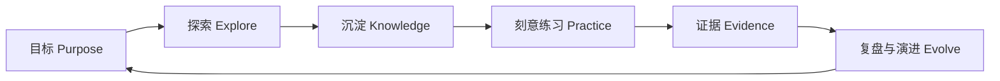
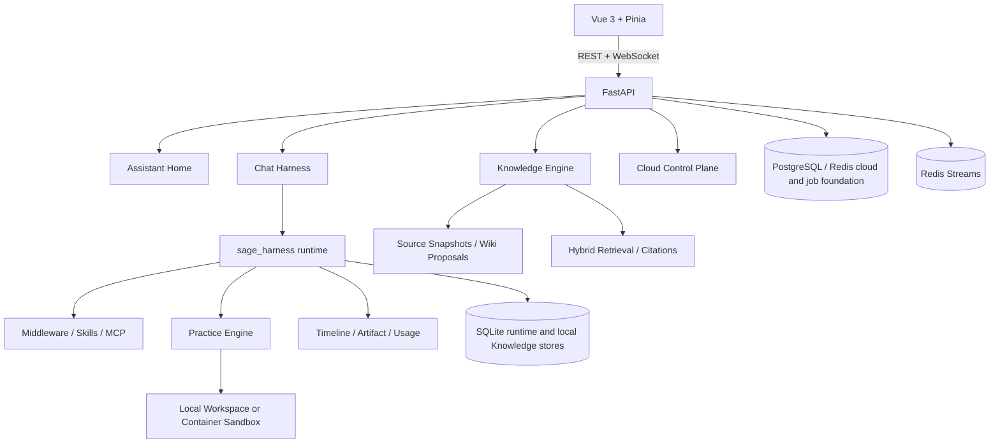

<p align="center">
  
</p>

<h1 align="center">Sage</h1>

<p align="center">
  <strong>Personal AI Learning Companion</strong><br />
  让目标、知识、实践与证据在同一个可恢复的工作台里持续生长。
</p>

<p align="center">
  <a href="https://github.com/ZeroMadLife/sage-agent/actions/workflows/quality.yml"></a>
  <a href="https://github.com/ZeroMadLife/sage-agent/actions/workflows/backend-quality.yml"></a>
  
  
  <a href="LICENSE"></a>
</p>


Sage 是一个本地优先的个人 AI 学习与实践工作台。它把对话、代码仓库、
Markdown/Obsidian 知识、模型 Provider、Skills 和 MCP 工具组织进同一套 Chat Harness，
让一次回答能够继续成为可追溯的知识、实践记录和下一步行动。

Coding 没有被包装成另一个聊天框，而是 Sage 的 **Practice Engine**：用于阅读源码、
修改代码、运行测试并验证理解。Knowledge 保存来源、提案、检索与引用；所有可能改变
代码、长期知识或外部系统的操作都保留证据和控制点。

> **项目状态**：Sage 正在快速开发，当前适合本机使用、架构研究与受控私测。
> 正式公网发布仍需完成生产 Sandbox、租户级 Knowledge 隔离和部署门禁。

## 从一个问题到长期成长



1. **目标**：明确现在要解决的问题，以及为什么值得解决。
2. **探索**：通过对话、网页、代码和本地资料收集上下文。
3. **沉淀**：把来源转为可检索、可引用、可审阅的知识。
4. **练习**：在受控工作区中阅读、修改、执行和验证。
5. **证据**：保留 timeline、artifact、citation、diff 与测试结果，驱动下一轮复盘。

## 产品界面

### 今天：从目标开始


`/#/assistant` 汇总近期会话、本地工作区与知识状态。新任务从这里进入统一 Harness，
而不是在不同功能页面重复创建互不相通的会话运行时。

### Knowledge：从来源到可引用知识


`/#/knowledge` 管理受控来源、知识图谱、Wiki 提案、混合检索和引用。原始快照、提案与
已批准知识彼此分离，避免模型在后台静默改写事实。

### Practice：用真实执行验证理解


`/#/coding/session/:id` 统一呈现 plan、reasoning、tool、approval、reply 与 terminal；
支持工作区工具、Diff、测试、checkpoint、上下文压缩和可恢复 timeline。

公开成长主页 `/#/public` 会把经过筛选的项目、笔记和成长轨迹组织成外部浏览路径，
并已提供不携带私有应用路由的独立静态构建。它目前只提供限定公开 corpus 的确定性问答
与来源回执，不会伪装成已经上线的公网 Harness；稳定 HTTPS 地址将在正式部署后补充到这里。

## 核心能力

| 能力 | 当前实现 |
| --- | --- |
| **Chat Harness** | WebSocket 流式事件、durable timeline、checkpoint、context budget、artifact 与 usage |
| **Practice Engine** | 文件、搜索、Shell、写入、Patch、Diff、Git、审批与运行证据 |
| **Knowledge Platform** | 来源快照、异步摄取、Wiki 提案、混合检索、RRF 与稳定 citation |
| **Runtime Extension** | Skills、MCP、受限子 Agent、Provider capability 与运行配置 |
| **Safety Boundary** | 路径 containment、fresh-read、权限模式、危险操作审批与 Container Sandbox |

Harness 2.0 是新会话的默认 runtime profile。开发机默认使用 `local_workspace`；它只适合
可信本地仓库。production/staging 必须配置 Container Sandbox，不能把宿主机工作区直接
暴露给浏览器任务。

## 架构



通用 Harness 作为独立 Python package 维护在 `packages/sage_harness/`。产品层负责将用户、
Workspace、Knowledge、Sandbox 与前端事件协议适配到稳定端口，避免通用运行时反向依赖
Sage 业务模块。

## 快速开始

### 环境要求

- Python 3.12+
- [uv](https://docs.astral.sh/uv/)
- Node.js 24（与 CI 一致）
- Docker Engine + Docker Compose v2
- macOS、Linux 或 Windows WSL

```bash
git clone https://github.com/ZeroMadLife/sage-agent.git
cd sage-agent

bash scripts/bootstrap-dev-env.sh
cd frontend && npm ci && cd ..
cp .env.example .env
```

在 `.env` 中至少配置一个模型 Provider，例如 `DEEPSEEK_API_KEY`。不要提交 `.env`、
Provider key、OAuth secret 或任何运行凭据。

```bash
bash scripts/dev.sh
```

开发脚本会启动 PostgreSQL/pgvector、Redis、FastAPI 和 Vite：

- Web：`http://127.0.0.1:5173`
- API：`http://127.0.0.1:8000`
- Health：`http://127.0.0.1:8000/health`

开发环境默认执行幂等数据库迁移；生产环境必须在发布流程中显式运行并验证迁移。
完整环境变量与 worktree 联调说明见 [Getting Started](docs/GETTING-STARTED.md)。

## 验证

```bash
# 后端、Ruff、mypy 与完整测试
bash scripts/check.sh

# 前端测试与生产构建
cd frontend
npm run test -- --run
npm run build

# 文档和空白错误
git diff --check
```

GitHub Actions 会在 PR 上重复执行后端质量、前端测试和生产构建门禁。

## 仓库结构

```text
sage-agent/
├── api/                         # FastAPI routes、WebSocket 与云控制面
├── core/
│   ├── coding/                  # Practice Engine、工具与运行协调
│   ├── harness/                 # Sage 到通用 Harness 的适配层
│   ├── knowledge/               # 摄取、图谱、检索、Wiki 与学习证据
│   └── cloud/                   # 身份、Workspace 与 Provider 设置
├── packages/sage_harness/       # 可复用 Chat Harness package
├── frontend/                    # Vue 3 产品界面
├── tests/                       # 后端、API、契约与集成测试
├── release/v7-beta/             # 当前发布说明、评审与学习手册
├── docs/                        # 设计、计划、Review 与运维文档
└── docker-compose.yml           # 本地 PostgreSQL/pgvector + Redis
```

## 当前边界

- `docker-compose.yml` 只编排本地 PostgreSQL/pgvector 与 Redis，不是生产部署栈。
- 公开主页已有独立静态构建、限定资料问答和 loopback 部署面；在域名与 80/443 门禁完成前
  不能描述为公网已发布，也不是公开 Agent，不共享主对话的文件权限。
- Knowledge 已完成本地来源工作流；云端租户级来源与元数据隔离尚未开放。
- Container Sandbox 已有实现与测试，正式公网任务的部署、资源和运维门禁仍需收口。
- Loop Engineer 的代码、测试和设计资料仍保留，但自动扫描服务目前暂停，不属于运行中的产品能力。
- 原 TourSwarm 旅游规划能力作为领域 Skill 与多约束 benchmark 保留，不再是主产品入口。

## 文档

- [V7 Beta 发布入口](release/v7-beta/README.md)
- [持续学习手册](release/v7-beta/learning/00-reading-map.md)
- [Sage V7 产品设计](docs/superpowers/specs/2026-07-15-sage-v7-personal-assistant-knowledge-evolution-design.md)
- [Chat Harness 2.0 设计](docs/superpowers/specs/2026-07-16-sage-chat-harness-v2-design.md)
- [开发环境指南](docs/GETTING-STARTED.md)
- [开发协作约定](AGENTS.md)

## 贡献

- `main` 只保留通过完整发布门禁的版本。
- `dev/sage-v7` 是当前集成分支。
- 功能和修复在独立 worktree 的 `codex/*` 分支完成，通过 PR 合入开发分支。

提交前请保持职责单一，附中文 PR 说明，并提供与改动匹配的测试、构建和
`git diff --check` 证据。

## License

[MIT](LICENSE)
