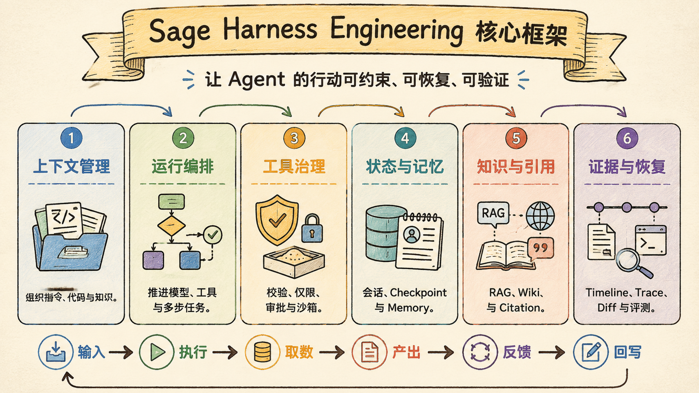
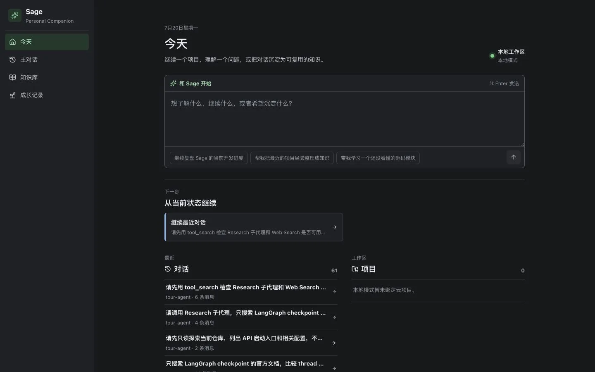
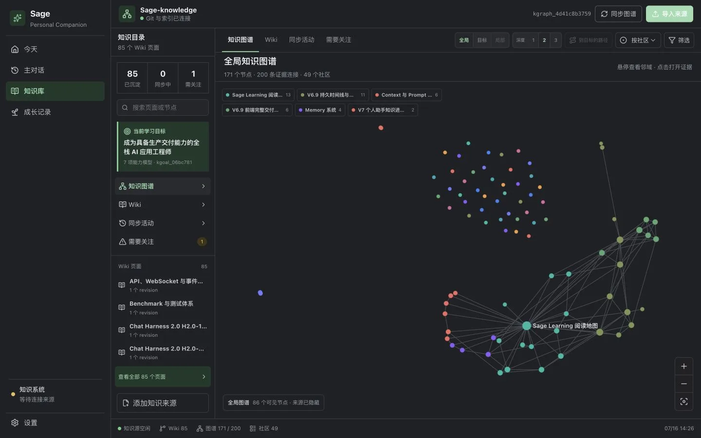
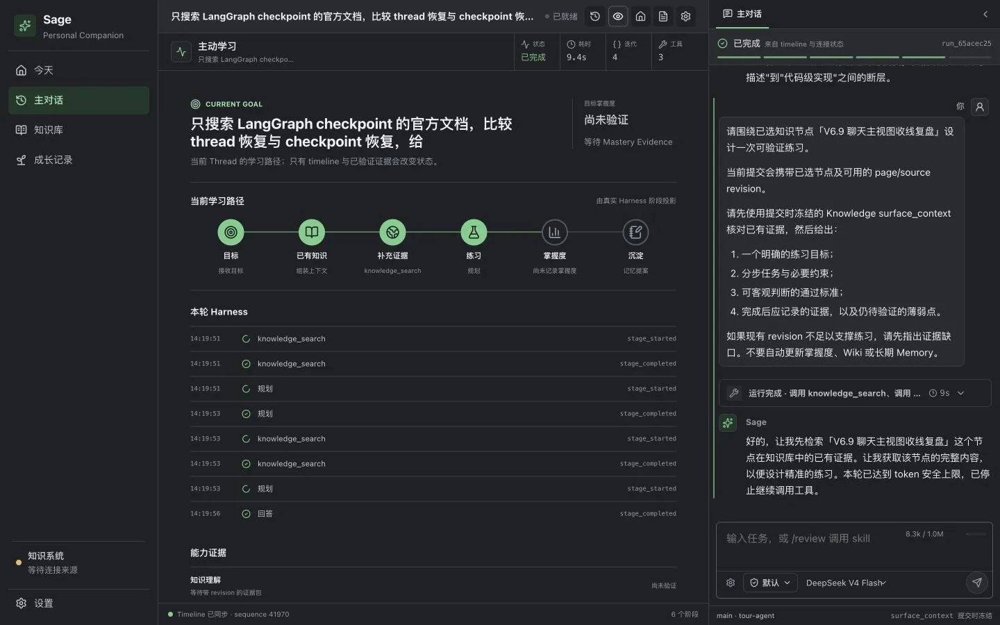
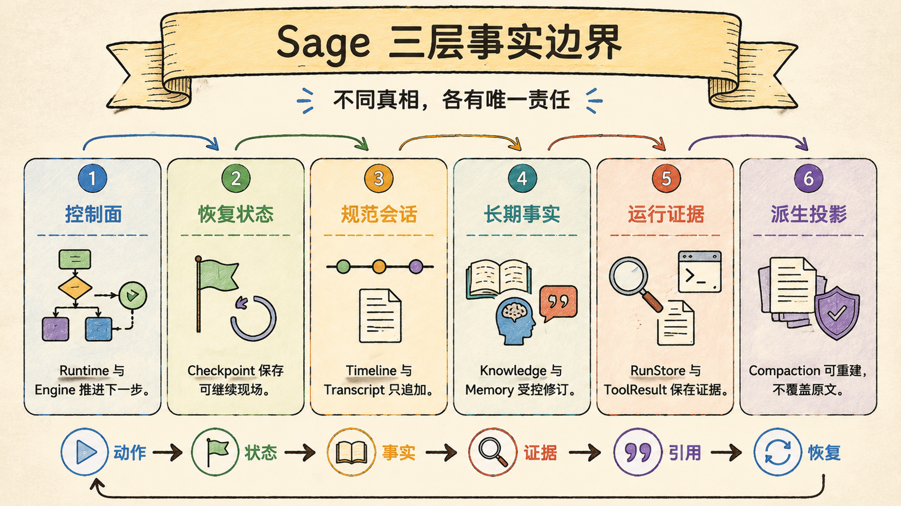

<h1 align="center">Sage</h1>

<p align="center"><strong>本地优先的 Personal AI Learning Companion，把目标、个人知识、真实实践与可验证证据连接成一条可恢复的学习执行链。</strong></p>

<p align="center"><strong>Recall@10 0.578 → 0.814</strong> · <strong>NDCG@10 0.444 → 0.695</strong> · <strong>Sandbox live audit 10/10</strong></p>



<p align="center">
  <a href="release/v1.0.0/SHOWCASE.md"><strong>3 分钟了解项目</strong></a>
  · <a href="release/v1.0.0/learning/00-reading-map.md">架构学习手册</a>
  · <a href="docs/GETTING-STARTED.md">开发指南</a>
</p>

<p align="center">
  <a href="https://github.com/ZeroMadLife/sage-agent/actions/workflows/quality.yml"></a>
  <a href="https://github.com/ZeroMadLife/sage-agent/actions/workflows/backend-quality.yml"></a>
  
  
  <a href="LICENSE"></a>
</p>



## Sage 做什么

Sage 不是给聊天框增加几个工具，而是一个**本地优先的个人 AI 学习与实践工作台**。
用户从一个目标或问题开始，Sage 在同一套 Agent Harness 中组织对话、Markdown/Obsidian、
代码仓库、模型 Provider、Skills 与 MCP 工具，并把执行过程沉淀为可以恢复和复核的证据。

```text
目标 Goal
  -> 探索 Explore：对话、网页、代码与个人资料
  -> 知识 Knowledge：来源、revision、proposal、检索与 citation
  -> 实践 Practice：工具、审批、工作区、测试与 diff
  -> 证据 Evidence：timeline、artifact、trace 与 benchmark
  -> 演进 Evolve：复盘、记忆与下一轮目标
```

三个产品表面共用同一条运行事实：

| 产品表面 | 解决的问题 | 核心边界 |
| --- | --- | --- |
| **Assistant** | 从目标、研究或练习进入统一任务 | 不为每个页面重复创建一套 Agent runtime |
| **Knowledge** | 把个人资料变成可检索、可引用、可审阅的知识 | 模型只能提出 proposal，不能静默改写长期事实 |
| **Practice Engine** | 阅读源码、修改代码、运行工具并验证理解 | 路径、权限、审批、Sandbox 与运行证据共同约束动作 |

> **运行方式**：v1.0.0 当前仅供本地自用，不提供在线入口，也不执行自动 Canary 部署。
> 仓库保留独立 Public Agent 与公开构建能力，后续重新开放前仍需完成生产环境、安全与
> 域名验收。

## 真实产品界面

### Knowledge：从来源到可引用知识



Knowledge 管理来源快照、revision、Wiki proposal、混合检索与稳定 citation。原始来源、
模型提案和已批准知识彼此分离，长期事实的变化可以审阅和追踪。

### Practice：让理解接受真实执行验证



Practice Engine 在同一条 Timeline 中呈现 context、model、tool、approval、answer 与 terminal；
断线或刷新后从持久化事件恢复，而不是由前端猜测 Agent 进行到了哪里。

## 架构：让 Agent 可约束、可恢复、可验证

一次请求从 Vue 进入 FastAPI，由 Runtime 选择执行路径，再经 Engine / LangGraph 和受控工具
推进。模型负责提出下一步，系统负责校验、授权、执行、持久化与留下证据。

| 架构部分 | 当前职责 |
| --- | --- |
| **上下文管理** | 组织指令、代码、知识与预算，长输出转为有界 preview + artifact 引用 |
| **运行编排** | 推进模型、工具、多步任务、checkpoint 与可恢复终态 |
| **工具治理** | schema 校验、能力发现、permission、policy、approval 与 Sandbox |
| **状态与记忆** | Session、Transcript、Memory、Checkpoint、Todo 与 Subagent 各守生命周期 |
| **知识与引用** | 来源快照、Wiki proposal、SQLite FTS5 + hashing + RRF、稳定 citation |
| **证据与恢复** | Timeline、RunStore、Diff、Artifact 与 Evaluation 支撑重放和回归 |

通用 Harness 独立维护在 [`packages/sage_harness/`](packages/sage_harness/)；Sage 产品层负责把
用户、Workspace、Knowledge、Sandbox 和前端事件协议适配到稳定端口，避免通用运行时反向
依赖业务模块。完整请求链、模块入口和设计权衡见
[总体架构](release/v1.0.0/learning/01-overall-architecture.md)。

## 事实为什么要分层



- **控制面**决定下一步做什么、谁可以执行：Vue → FastAPI → Runtime → Engine → Tool。
- **状态面**保存任务如何继续、长期事实是什么：Session、Checkpoint、Transcript、Knowledge、Memory。
- **证据面**回答刚才发生了什么、结果如何复核：Timeline、Run trace、Diff、Artifact、Benchmark。

实时 UI 不是事实源，压缩摘要不能覆盖 canonical transcript，模型生成内容不能自动升级为
Knowledge。各存储通过 `session_id`、`run_id`、`revision`、`citation_id` 与 `artifact_ref`
连接，而不是复制一份万能对象。详细边界见
[三层架构与事实边界](release/v1.0.0/learning/02-three-planes-fact-boundary.md)。

## 核心能力

| 能力 | 已实现的工程机制 |
| --- | --- |
| **Chat Harness** | SSE / WebSocket 流式事件、durable timeline、checkpoint、context budget 与 usage |
| **Practice Engine** | 文件、搜索、Shell、Patch、Diff、Git、审批、测试与运行工件 |
| **Knowledge Platform** | 来源 revision、Wiki proposal、可插拔 Embedding、RRF、校准拒答、显式一跳关系检索与 citation |
| **Runtime Extension** | Skills、MCP、受限子 Agent、Provider capability 与运行配置 |
| **Safety Boundary** | 路径 containment、fresh-read、权限模式、危险操作审批与 Container Sandbox |
| **Release Engineering** | 前后端质量门禁、不可变镜像、同 SHA Canary、公开/私有隔离与共同回滚 |

## 可复现工程证据

| 能力 | 当前证据 | 仍未解决 |
| --- | --- | --- |
| **RAG Retrieval Ablation v1** | PostgreSQL exact hybrid 上对 Contextual metadata、Parent-Child、Semantic Boundary 和 bounded Cross-Encoder 做 selection/frozen-test 单变量消融；Cross-Encoder selection NDCG +0.045，但 Recall -0.043、P95 1436 ms，四个候选均不默认开启 | 当前语料无超过 4000 字符的 block，Semantic Boundary 未被正式数据触发；Parent-Child selection 增益低于门禁 |
| **RAG Semantic Gate v1** | 当前官方语料的冻结 test 上，本地 ONNX semantic + PostgreSQL hybrid 将 Recall@10 从 0.889 提升到 0.944、MRR 从 0.683 提升到 0.771，citation support 保持 1.0 | test 没有 semantic-paraphrase case，激活门禁 fail closed，因此仍不默认启用；generation quality 尚未评测 |
| **RAG Failure Trace v1** | SQLite/PostgreSQL 使用 HMAC query 指纹与有界候选 trace；80 case x 3 route 的 41 个失败行全部归入唯一主要类型，且三路 Recall/MRR/NDCG 与未观测 baseline 完全相同 | 默认关闭；线上没有金标，不能把 `gate_rejected` 直接称为误拒；长期 retention 尚未实现 |
| **Abstention + Relation v1** | 当前 `2026-07-27.1` 语料上，Hashing test 无答案准确率从 0 提升到 0.50（Recall@10：0.66 → 0.62）；14 条显式链接切片 AllRecall@10 从 0.25 提升到 1.00 | Relation 仅 12 条可回答、2 条无答案；只证明 citation-bound 1-hop，不代表完整 GraphRAG |
| **Sandbox Level 1 v2** | 10/10 live audit；禁网、只读 rootfs、`CapEff=0`、`NoNewPrivs=1`、资源限制与终态清理 | workspace 仍整体可写，生产 image digest 尚未固定 |
| **Memory Lifecycle v1** | 40/40 确定性场景；proposal 隔离、supersession、retraction、consolidation 门禁与 workspace 恢复 | 自动事实抽取、语义 consolidation 与 TTL 尚未完成 |

评测协议、复现命令和 clean source commit 见
[RAG 语义门禁报告](docs/evals/knowledge-semantic-gate-v1.md)、
[RAG 分块与重排消融报告](docs/evals/knowledge-retrieval-ablation-v1.md)、
[RAG 失败可观测性报告](docs/evals/knowledge-retrieval-observability-v1.md)、
[历史 RAG 报告](docs/evals/knowledge-benchmark-v2.md)、
[拒答与关系检索报告](docs/evals/knowledge-relation-abstention-v1.md)、
[Sandbox 报告](docs/evals/container-sandbox-level1-v2.md) 与
[Memory 报告](docs/evals/memory-lifecycle-v1.md)。这里的 case 数证明对应工程不变量，不把
确定性回归包装成真实用户准确率。

## 技术栈

- **前端**：Vue 3、TypeScript、Pinia、Vite、Vitest
- **后端与 Agent**：Python 3.12、FastAPI、LangChain、LangGraph、Pydantic、pytest
- **状态与检索**：PostgreSQL、Redis、SQLite FTS5、可插拔 Embedding、RRF、evidence graph
- **协议与扩展**：REST、WebSocket、SSE、MCP、Skills
- **部署与质量**：Docker Compose、GitHub Actions、Ruff、mypy、Canary controller

> PostgreSQL/pgvector 是本地基础设施与可替换检索方向；Knowledge 当前默认检索仍是
> SQLite FTS5 + deterministic hashing + RRF，不把路线图写成已上线能力。

## 快速开始

### 环境要求

- Python 3.12+
- [uv](https://docs.astral.sh/uv/)
- Node.js 24（与 CI 一致）
- Docker Engine + Docker Compose v2
- macOS、Linux 或 Windows WSL

```bash
git clone https://github.com/ZeroMadLife/sage-agent.git
cd sage-agent

bash scripts/bootstrap-dev-env.sh
cd frontend && npm ci && cd ..
cp .env.example .env
```

在根目录 `.env` 中至少配置一个模型 Provider，例如 `DEEPSEEK_API_KEY`。不要提交 `.env`、
Provider key、OAuth secret 或任何运行凭据。

```bash
bash scripts/dev.sh
```

启动后访问：

- Web：`http://127.0.0.1:5173`
- API：`http://127.0.0.1:8000`
- Health：`http://127.0.0.1:8000/health`
- Search：`http://127.0.0.1:8088`（仅本机，供 Harness `search_web` 使用）

完整环境变量、数据库迁移和 worktree 联调说明见
[Getting Started](docs/GETTING-STARTED.md)。

## 验证

```bash
# 后端测试、Ruff 与 mypy
bash scripts/check.sh

# 前端测试和两套生产构建
npm --prefix frontend run test -- --run
npm --prefix frontend run build
npm --prefix frontend run build:public

# 文档与空白错误
git diff --check
```

GitHub Actions 会在 PR 与集成分支上重复执行后端、前端和公开镜像隔离门禁。完整发布验收见
[v1.0.0 验收清单](release/v1.0.0/TESTING.md)。

## 仓库结构

```text
sage-agent/
├── api/                         # FastAPI routes、SSE 与云控制面
├── core/
│   ├── coding/                  # Practice Engine、工具与运行协调
│   ├── harness/                 # Sage 到通用 Harness 的适配层
│   └── knowledge/               # 摄取、图谱、检索、Wiki 与学习证据
├── packages/sage_harness/       # 可复用 Chat Harness package
├── frontend/                    # Vue 3 产品界面与公开工程主页
├── public_agent/                # 只读 PublishedPackage 的受限公开 Agent
├── tests/                       # 后端、API、契约与集成测试
├── release/v1.0.0/             # 正式版本说明、架构图与持续学习手册
└── docs/                        # 产品、设计、开发与运维文档
```

## 当前边界

- `local_workspace` 只适合可信开发机；公网任务必须使用经过 admission 和资源限制验证的 Sandbox。
- Container Sandbox 的 workspace 仍是可写 bind mount，生产 rootless 环境需复跑 live audit 并固定 image digest。
- Knowledge 已完成本地来源工作流；云端租户级来源与元数据隔离尚未开放。
- RAG 已加入固定 snapshot 的本地语义 Provider 与 route-specific Gate v2；当前 test 缺少 semantic-paraphrase 覆盖，candidate 保持 opt-in，回答生成质量尚未评测。
- Relation retrieval 当前只扩展带原文 citation 的显式一跳链接；实体三元组、多跳路径、PPR 与 community GraphRAG 尚未实现。
- 公开主页不是公网 Harness，不具备私人应用的文件、知识、记忆或工具权限。
- 飞书入口与自动 Canary 部署当前均已停止；`v1.0.0` tag 不代表服务器已经部署。

## 深入阅读

- [v1.0.0 Showcase](release/v1.0.0/SHOWCASE.md)：3 分钟理解产品与工程亮点
- [v1.0.0 正式版本入口](release/v1.0.0/README.md)：版本事实、可用能力与发布边界
- [持续学习手册](release/v1.0.0/learning/00-reading-map.md)：从架构边界到验证证据
- [工具执行闭环](release/v1.0.0/learning/05-tools-execution-pipeline.md)：工具如何被发现、校验、授权和执行
- [Knowledge 与 RAG](release/v1.0.0/learning/09-knowledge-rag-retrieval.md)：来源、proposal、检索与 citation
- [安全与审计](release/v1.0.0/learning/12-security-audit.md)：权限、Sandbox 与公网边界
- [开发协作约定](AGENTS.md)

## 分支与贡献

- `main` 只保留通过完整发布门禁的版本。
- `dev/sage-v7` 是当前 V7 集成分支。
- 功能和修复在独立 worktree 的 `codex/*` 分支完成，通过 PR 合入开发分支。

提交前请保持职责单一，附中文 PR 说明，并提供与改动匹配的测试、构建和
`git diff --check` 证据。

## License

[MIT](LICENSE)
