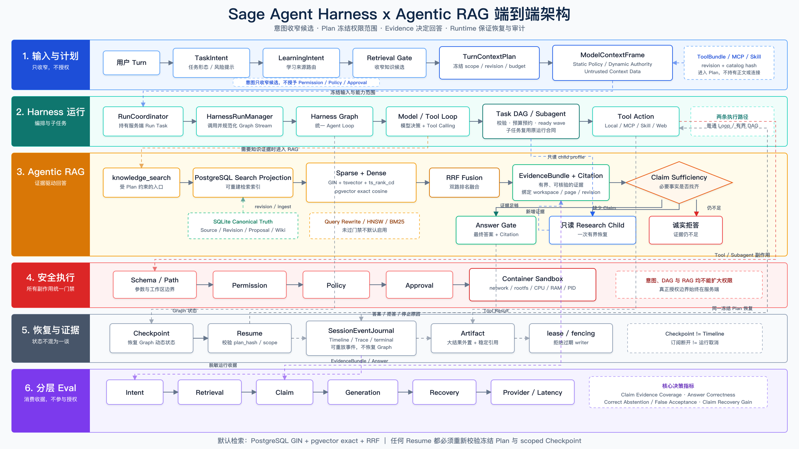
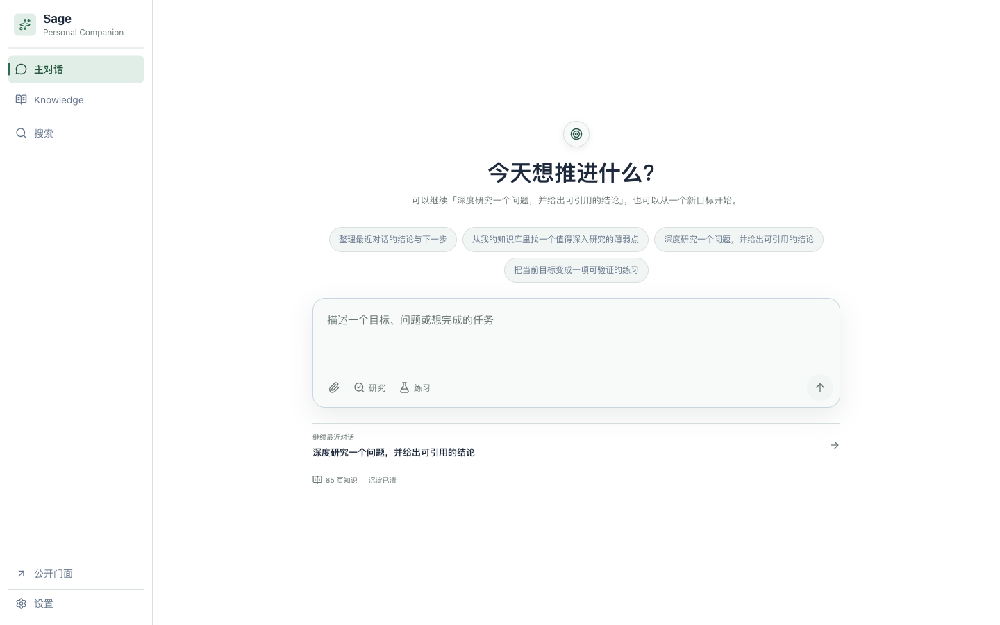
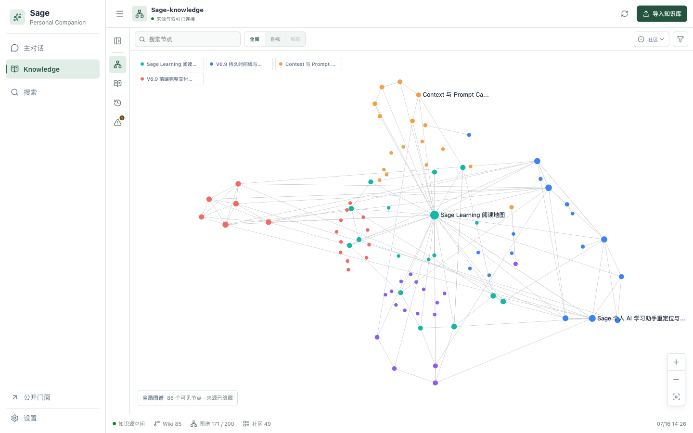
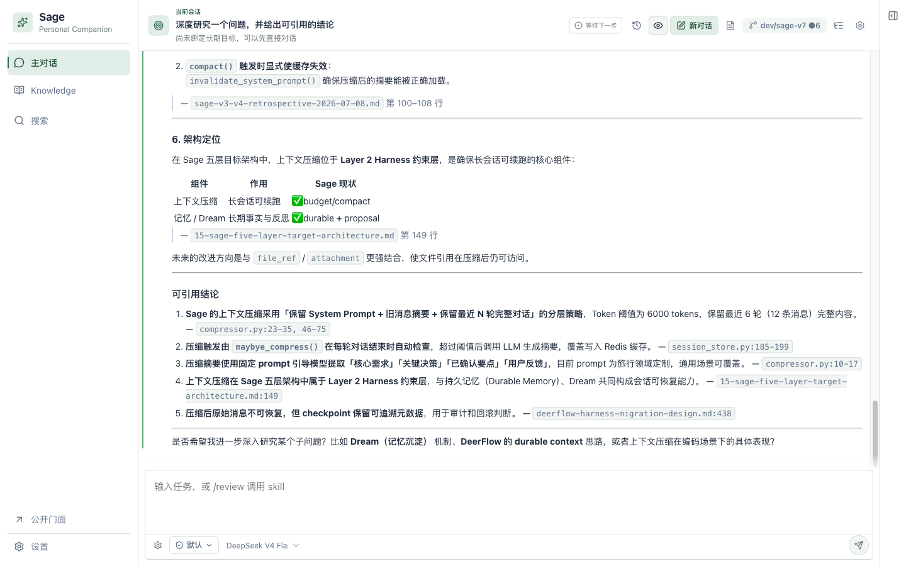

<h1 align="center">Sage</h1>

<p align="center"><strong>本地优先的 Personal AI Learning Companion，把目标、个人知识、真实实践与可验证证据连接成一条可恢复的 Agent 执行链。</strong></p>

<p align="center"><strong>模块化 Agent Harness</strong> · <strong>PostgreSQL Agentic RAG</strong> · <strong>Sandbox 纵深防御</strong> · <strong>分层 Eval</strong></p>

<p align="center">
  <a href="https://github.com/ZeroMadLife/sage-agent/actions/workflows/quality.yml"></a>
  <a href="https://github.com/ZeroMadLife/sage-agent/actions/workflows/backend-quality.yml"></a>
  
  
  <a href="LICENSE"></a>
</p>



> [可编辑 SVG 总体图](docs/assets/architecture/sage-harness-rag-integrated-v1-zh.svg) · [架构图资产说明](docs/assets/architecture/README.md)

<p align="center">
  <a href="release/v1.1.0/README.md"><strong>v1.1.0 发布入口</strong></a>
  · <a href="release/v1.1.0/TESTING.md">发布验收</a>
  · <a href="#产品运行截图">产品运行截图</a>
  · <a href="docs/GETTING-STARTED.md">开发指南</a>
</p>

## 产品运行截图

### Assistant：从目标进入统一任务



### Knowledge：从来源形成可引用知识



### Practice：用真实执行验证理解



截图由当前分支前后端启动后，通过 Playwright 在本地 `1440x900` 视口采集；其中 Practice
截图来自一条真实会话的运行时间线。它们用于展示当前界面，不代表公网部署或生产 SLA。

## Sage 是什么

Sage 不是给聊天框加几个工具，而是一个本地优先的个人 AI 学习与实践工作台。它把对话、个人知识、代码仓库、工具执行、审批、Sandbox 和评测放进同一个 Agent Harness，并把运行过程沉淀为可恢复、可复核的证据。

```text
目标 Goal
  -> 探索 Explore：对话、网页、代码与个人资料
  -> 知识 Knowledge：来源、revision、检索与 citation
  -> 实践 Practice：工具、审批、工作区与测试
  -> 证据 Evidence：Timeline、Artifact、Trace 与 Eval
  -> 演进 Evolve：复盘、记忆与下一轮目标
```

三个产品表面共享同一条运行事实，不各自复制 Agent runtime：

| 产品表面 | 解决的问题 | 当前边界 |
| --- | --- | --- |
| **Assistant** | 从目标、问题或研究进入统一任务 | 负责进入运行链，不单独维护另一套执行状态 |
| **Knowledge** | 把来源变成可检索、可引用、可审阅的知识 | 原始事实、revision 和模型 proposal 分开保存 |
| **Practice Engine** | 阅读源码、修改代码、运行工具并验证理解 | 工具动作必须经过权限、策略、审批和 Sandbox |

当前仓库面向本地开发与学习使用，不提供私人工作区的公网入口，也不把公开 Agent 当成私人 Harness。

## 一次请求如何运行

```text
用户 Turn
  -> TaskIntent / LearningIntent admission
  -> Retrieval Gate + ToolBundle
  -> immutable TurnContextPlan / plan_hash
  -> Harness Graph / bounded Task DAG
  -> Model / Tool execution
  -> Permission -> Policy -> Approval -> Container Sandbox
  -> PostgreSQL hybrid retrieval
  -> EvidenceBundle + Claim Sufficiency
  -> Answer / bounded Research child / honest abstention
  -> Checkpoint / Timeline / Trace / Artifact
```

意图识别只负责收窄候选，不授予权限。真正的授权边界在服务端 Permission、Policy、Approval 与 Sandbox；Resume 也必须重新验证 frozen Plan 和 scoped Checkpoint，不能从 Timeline 反推权限。

## 五个关键工程决策

### 1. 模块化 Harness 与有界编排

通用 `packages/sage_harness/` 通过 ports、middleware 和 capability registry 接入 Model、Tool、MCP 与 Skill，Sage 产品层只负责适配。复杂任务由模型提出受限 JSON `task_dag`，服务端校验 schema、依赖、环、预算和 canonical hash 后按 ready wave 执行；子任务继续复用原有权限链。

`TurnContextPlan` 固化本轮 scope，Checkpoint 保存 Graph 的动态状态，Timeline 保存可重放事件，Artifact 保存大结果，lease/fencing 拒绝过期 writer。订阅断开不等于运行取消。

### 2. PostgreSQL Agentic RAG 与证据门禁

SQLite 仍是便携默认和 canonical truth；真实长书与质量优先路径使用可重建的 PostgreSQL search projection：

```text
GIN + tsvector + ts_rank_cd  ->  sparse retrieval
pgvector exact cosine        ->  dense retrieval
RRF                          ->  fused ranking
```

检索结果先组成 citation-bound `EvidenceBundle`，再由 Claim Sufficiency Gate 决定直接回答、进入只读 Research child，或诚实拒答。可选 `pg_textsearch BM25`、HNSW 和 Query Rewrite 都必须重新通过质量、延迟、成本和稳定性门禁。

### 3. 分层 Eval 与架构决策门禁

Eval 按 `intent -> retrieval -> claim -> generation -> recovery -> provider/latency` 分层，避免把一次 Demo 的结果误认为系统质量。核心指标是 First-pass Claim Evidence Coverage、Answer Correctness、Correct Abstention/False Acceptance 和 Claim Recovery Gain；Faithfulness 只回答生成 Claim 是否被现有证据支持，不能代替 Answer Correctness。

### 4. Proposal-first 长期记忆治理

长期事实先进入 pending proposal，只有显式批准后才成为 active fact。SQLite schema v2 以 revision CAS 和 append-only event 管理 `active -> superseded/retracted` 生命周期；Consolidation 只把带 evidence refs 的运行证据整理为 proposal，不自动批准，也不让 Markdown 旧投影重新进入 Context。

### 5. Sandbox 纵深防御

动作依次经过参数 schema、workspace path containment、Permission、Policy、Approval，再进入 Container Sandbox。Sandbox 当前使用 seccomp、`cap-drop ALL`、`no-new-privileges`、只读 rootfs、禁网、CPU/RAM/PID/ulimit 和 mount 漂移校验。workspace 仍是可写 bind mount，生产 image digest、rootless live audit 和内核级隔离尚未宣称完成。

## 当前可复核证据

以下结果基于 `dev/sage-v7@9b8c8de1` 的阶段收口；它们是受控工程证据，不是统一的线上准确率。

| 证据 | 已验证结果 | 解释边界 |
| --- | --- | --- |
| Harness deterministic benchmark | 10 个 Runtime + Tool Stack 场景；task completion/policy compliance `1.0`；本地 P95 `382ms` | 使用 `ScriptedApiClient`，不是实时模型质量或公网 SLA |
| 80-case versioned RAG Eval | 9 份 snapshot，`dev/calibration/frozen-test=40/20/20`；Recall@10 `0.889 -> 1.000`、MRR `0.683 -> 0.806`、NDCG@10 `0.701 -> 0.852` | 固定语料的离线检索/排序结果；frozen test 尚未覆盖 `semantic_paraphrase` |
| Query Rewrite 消融 | 4 个困难 case：Claim Coverage `0.4444 -> 0.8333`，Recall@10 `0.6111 -> 0.8889`，串行 P95 `11.397s -> 20.861s` | `oracle_manual` 上界，不代表真实模型改写；仅条件触发 |
| HNSW 门禁 | 两本真实长书、`5,220` chunks；exact P95 `101.878ms`；四档 Oracle Recall@10 都是 `1.0` | 没有稳定延迟净收益，当前保持 exact，HNSW 未上线 |
| Memory lifecycle | 40/40 确定性场景 | 验证 proposal 隔离、撤回/替代、重启恢复与 workspace 隔离；不是自然语言记忆准确率 |
| Sandbox live audit | Docker Desktop Level 1 `10/10` | 不等于内核级逃逸证明或生产 rootless 已验收 |
| 完整质量门禁 | `1956 passed, 12 skipped`；PR #143 合入后 RAG/Knowledge + Harness 回归 `334 passed, 12 skipped` | 当前代码与 CI 收据；本地 `.env` 漂移不属于代码结论 |

14-case 长书 E2E 仍是 `seed_manual`，Answer Correctness、Provider Failure 与 P95 用来暴露问题，不能包装成生产准确率。下一阶段需要扩大 Gold 到 30-50 条并独立 review、接入真实复杂度 Gate、降低 Provider Failure/P95，再考虑更新对外项目表述。

## 能力矩阵

| 能力 | 当前实现 |
| --- | --- |
| **Chat Harness** | SSE/WebSocket 事件、durable Timeline、Checkpoint、Context Budget、Artifact 与 usage |
| **Practice Engine** | 文件、搜索、Shell、Patch、Diff、Git、审批、测试与运行工件 |
| **Knowledge Platform** | 来源 revision、Wiki proposal、SQLite/PostgreSQL 检索投影、Embedding、RRF 与 citation |
| **Long-term Memory** | workspace-scoped proposal、revision CAS、事实撤回/替代、证据事件与 active-only recall |
| **Runtime Extension** | Skills、MCP、受限子 Agent、Provider capability 与运行配置 |
| **Safety Boundary** | 路径 containment、权限模式、审批、Container Sandbox 与终态清理 |
| **Evaluation** | versioned corpus、retrieval/claim/generation/recovery 分层指标与 release gate |

## 快速开始

### 环境要求

- Python 3.12+
- [uv](https://docs.astral.sh/uv/)
- Node.js 24（与 CI 一致）
- Docker Engine + Docker Compose v2
- macOS、Linux 或 Windows WSL

```bash
git clone https://github.com/ZeroMadLife/sage-agent.git
cd sage-agent

bash scripts/quickstart.sh
```

首次运行会创建权限为 `0600` 的本地 `.env`、准备 Python/前端依赖并执行环境检查；
检查通过后会启动现有 FastAPI、Vue 与 Docker Compose 链路。至少配置一个模型 Provider
后，重新执行同一命令即可进入真实 Agent 会话。只做检查、不启动服务时使用：

```bash
bash scripts/quickstart.sh --check
```

需要分别调试已有启动链路时，仍可直接使用 `bash scripts/dev.sh`；完整手动安装步骤见
[Getting Started](docs/GETTING-STARTED.md)。

启动后访问：

- Web：`http://127.0.0.1:5173`
- API：`http://127.0.0.1:8000`
- Health：`http://127.0.0.1:8000/health`

至少配置一个模型 Provider。`.env`、Provider key、OAuth secret 和运行凭据不得提交。

部署边界：`local` 使用 `scripts/quickstart.sh`；`private-canary` 继续由
`scripts/deployctl.py` 和受控 Compose 管理；`public` 尚未开放，不复用本地 `.env` 或开发登录。

## 验证

```bash
# 后端测试、Ruff 与 mypy
bash scripts/check.sh

# 前端测试与生产构建
npm --prefix frontend run test -- --run
npm --prefix frontend run build
npm --prefix frontend run build:public

# 文档与空白错误
git diff --check
```

PR 与 `dev/sage-v7` 会重复执行质量门禁；发布到 `main` 前还需要使用同一个 commit SHA 完成发布、部署、回滚和人工验收。

## 仓库结构

```text
sage-agent/
├── api/                         # FastAPI routes、SSE 与控制面
├── core/coding/                 # Practice Engine、工具与运行协调
├── core/harness/                # Sage 到通用 Harness 的适配层
├── core/knowledge/              # 摄取、检索、Wiki 与学习证据
├── packages/sage_harness/       # 可复用 Harness package
├── frontend/                    # Vue 3 产品界面
├── public_agent/                # 受限公开 Agent
├── tests/                       # 后端、API、契约与集成测试
├── docs/                        # 产品、设计、Eval、Resume 与开发文档
└── release/                     # 版本说明、验收与学习材料
```

## 当前边界

- SQLite 是便携 canonical/default 路径；PostgreSQL 是真实长书与质量优先的可重建 search projection。
- BM25、HNSW、Query Rewrite 和 Cross-Encoder 都是可插拔候选，不因为出现在技术栈里就默认启用。
- E2E Gold 仍需扩大并独立 review；当前 `seed_manual` 指标不能写成生产准确率。
- workspace 仍为可写 bind mount；生产 image digest、rootless live audit 和更强隔离仍待收口。
- 公开 Agent 只访问 PublishedPackage 与受限资料，不具备私人工作区的文件、知识、记忆或工具权限。
- 本地 `.env` 的知识源路径、Web Search 与 PostgreSQL 测试配置可能漂移，联调前需要单独校正。

## 深入阅读

- [v1.1.0 发布入口](release/v1.1.0/README.md)：版本事实、可用能力与发布边界
- [v1.1.0 变更记录](release/v1.1.0/CHANGELOG.md)：本版本交付与不交付的能力
- [v1.1.0 发布验收](release/v1.1.0/TESTING.md)：自动化门禁与复现实验入口
- [v1.1.0 架构评审](release/v1.1.0/REVIEW.md)：架构取舍、风险和发布结论
- [阶段总复盘](docs/evals/sage-harness-rag-stage-closeout-v1.md)：当前 Harness、RAG、Eval 与 Sandbox 的共同事实源
- [Harness 输入分层 PRD](docs/superpowers/specs/2026-08-08-sage-harness-input-layers-prd.md)
- [Task DAG V1 PRD](docs/superpowers/specs/2026-08-09-sage-task-dag-v1-prd.md)
- [Query Rewrite 与 HNSW PRD](docs/superpowers/specs/2026-08-10-sage-book-rag-query-rewrite-hnsw-prd.md)
- [最终 Query Rewrite/HNSW 评测](docs/evals/book-learning-query-rewrite-hnsw-v1.md)
- [Memory 生命周期评测](docs/evals/memory-lifecycle-v1.md)
- [PostgreSQL 检索实现](core/knowledge/postgres_retrieval.py)
- [开发协作约定](AGENTS.md)

## 分支与贡献

- `main` 只保留通过完整发布门禁、可部署上线的版本。
- `dev/sage-v7` 是当前开发集成分支。
- 功能、修复、文档和评测在独立 worktree 的 `feat/*`、`fix/*`、`docs/*`、`eval/*` 短期分支完成，通过 PR 合入开发分支。
- 测试/ staging 使用 `dev/sage-v7` 上的不可变 commit SHA；同一个 SHA 通过发布门禁后再晋级到 `main`。

提交前请保持职责单一，并附中文 PR 说明、匹配改动的测试/构建证据和 `git diff --check` 结果。

## License

[MIT](LICENSE)
