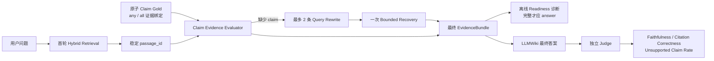

# Sage 长书学习 RAG / LLMWiki / Agentic RAG v1 收口

> 日期：2026-08-08
> 状态：真实公共领域 TXT、检索、有界 recovery、claim-aware sufficiency 与真实 LLMWiki generation 均已跑通；claim evaluator 暂为离线诊断，仍不是生产准确率

## 产品行为

用户继续在主对话提问，不需要先选择书。服务端按学习意图决定是否读取本地书籍 Knowledge：

1. 单一概念且证据充分时，直接把带 citation 的 EvidenceBundle 放入父模型上下文。
2. 比较、跨书或多跳问题首轮证据不足时，只允许一次有界 recovery；可以拆成最多两个定向 Research 分支。
3. 服务端合并真实 citation，生成模型只能读取当前 parent run 授权的 EvidenceBundle。
4. 第二轮没有新增证据、来源冲突未解、bundle 为空或答案没有 citation 时，fail closed，返回拒答。
5. 用户只看最终答案；轮次、rewrite、child 数量、停止原因进入 bounded receipt，Citation Inspector 再按需展开，不展示 CoT。

## 本轮真实语料与数据边界

- 语料为 Project Gutenberg 公共领域《西遊記》和 *The Wealth of Nations*，合计 4,733,020 bytes。
- TXT parser `sage.txt@1.1.0` 保留 `BOOK -> CHAPTER -> PART` heading path，citation 使用完整路径，避免《国富论》不同 Book 的同名章节碰撞。
- Benchmark `sage-book-learning-v1@2026-08-06.1` 当前 14 条：10 条 answerable、3 条 multi-document、4 条 unanswerable/hard negative；状态为 `seed_manual`，不是人工冻结生产集。
- 本轮发现并修正 1 条 gold：悟空加入取经队伍的第十四回此前被漏标。修改后必须同步 dataset SHA-256，旧报告均视为历史诊断，不与新 gold 混算。
- 长书容量从隐藏的 2,000 chunk 上限改为策略字段默认 20,000，并在报告记录 block coverage/truncation。当前完整语料覆盖 5,185/5,185 个正文 block，baseline 5,220 chunks。

## Retrieval 阶段

指标回答“正确章节有没有找回、排在第几、是否拖慢”：Recall@10、Precision@10、MRR、NDCG@10、Hit Rate、unanswerable accuracy、P50/P95，以及 block coverage。

完整语料上的已运行诊断（seed gold；不等同生产准确率）：

| 策略 | provider | Recall@10 | MRR | NDCG@10 | chunks | P50/P95 | 结论 |
| --- | --- | ---: | ---: | ---: | ---: | ---: | --- |
| baseline | `sage.hashing` | 0.650 | 0.525 | 0.556 | 5,220 | 553/759 ms | 便宜基线，非语义召回 |
| baseline | FastEmbed multilingual | 0.700 | 0.520 | 0.565 | 5,220 | 1,133/2,345 ms | 语义模型提高覆盖但 SQLite 扫描变慢 |
| contextual_chunk | FastEmbed multilingual | 0.750 | 0.523 | 0.582 | 5,220 | 859/1,569 ms | 当前 seed 候选最优，但仍未经过 frozen split |
| parent_child | FastEmbed multilingual | 0.750* | 0.608* | 0.647* | 25,836 | 4,614/6,329 ms | child 找、parent 答的方向成立，成本过高 |
| semantic_boundary | FastEmbed multilingual | 0.700* | 0.520* | 0.565* | 5,240 | 1,111/1,852 ms | 当前长 block 样本太少，未证明增益 |

`*` 标记表示运行时使用 gold 修正前的同一语料诊断报告，只能用于方向判断；正式比较需在
gold v1.1 扩充后重跑。contextual row 使用修正后 gold；recovery 另有最多 2 个 rewrite 的独立
v2 收据。所有报告还明确写入 provider revision、parser revision、chunk strategy 和 source dirty 状态。

当前可执行结论：

- 不把 semantic boundary 直接设为默认；先补后半章节和真正长 block 的 query gold。
- contextual chunk 作为候选策略保留，下一轮重点看跨书和 hard negative，而不是只看总 Recall。
- parent-child 需要异步索引、向量缓存和 PostgreSQL/pgvector 或 parent projection；不能把 25k child 的 SQLite exact scan 直接放到交互路径。

## Bounded Recovery / Agentic 阶段

`scripts/evaluate_book_learning_recovery.py` 在同一索引上比较首轮 query 和一次人工审计 rewrite，
每个 case 最多 2 个并行 rewrite。当前协议明确是 `oracle_manual`，用于隔离“索引能力”和
“意图改写能力”，不是小模型效果；统计对象是进入 EvidenceBundle token budget 前的候选 passages，
不是最终答案已实际消费的上下文。

FastEmbed + contextual chunk 的 4-case 收据（3 条 answerable、1 条 unanswerable）：

- answerable candidate evidence recall 从 0.1667 提升到 0.8889，incremental gain 0.7222；
  三者都有增量证据，但没有被 2-query 预算全部找齐。无答案 case 不再以空 gold 计作 100% 召回。
- gold-evidence 完整度代理从 0 提升到 0.6667，说明 recovery 有效但仍不是满覆盖；无答案
  case 只进入 false acceptance / correct abstention，不再抬高 claim coverage。
- 这里的 claim coverage 是“gold passages 是否全部找齐”的代理，不是模型已经抽取并验证了
  答案声明；真实 claim-level 指标必须等生成层输出后再计算。
- rewrite intent drift 0.000（人工标签，不能替代模型改写评测）。
- 两次同口径 v3/v4 收据中，14 条 first-pass query 的 P50 为 917-3,078 ms、P95 为
  1,993-9,420 ms；recovery 分支并行估计 P95 为 2,044-5,727 ms。延迟来自本地 SQLite exact
  scan，受机器负载影响明显，当前 worktree 为 dirty，只用于识别成本瓶颈，不作为生产 SLA。
- 以“非空检索即回答”的无 gate 代理决策计算，unanswerable 子集 false acceptance 1.00、correct
  abstention 0.0：当前最紧的缺口是 relevance/证据充分性 gate，不能把这个代理值当成最终模型回答率。

### Score-only relevance gate 诊断

在 clean source `e81ba1f` 上重跑 FastEmbed + contextual，整体 Recall@10/MRR/NDCG 为
`0.750/0.523/0.582`，P50/P95 为 `845/1,600 ms`。随后只用 dev split 校准现有
`KnowledgeRelevancePolicy` 的 sparse/dense 绝对阈值，得到候选 `krp_d4cc98e315dde2ab`：

- dev 仅 3 条（2 answerable、1 unanswerable），校准后 answerable Recall 保持 1.0，但
  unanswerable accuracy 仍为 0；
- untouched test 上 unanswerable accuracy 从 0 提升到 0.333，但 answerable Recall 从
  0.583 降到 0.333，MRR 从 0.422 降到 0.333；
- 因此该 policy 不激活、不提交到生产 policy 目录。当前 score distribution 无法同时分开
  相关章节与 hard negative，且 dev 样本太少；下一步必须扩充 calibration gold，并加入
  claim-aware sufficiency（问题需要哪些声明、当前 citation 覆盖哪些声明），而不是继续抬高分数阈值。

运行时 `BookLearningCoordinator` 已把同一策略落到服务端：最多 2 个 research child、最多 2 轮检索、EvidenceBundle 绑定 parent run、无新 citation 或无 citation 生成就拒答。它不依赖模型自报 confidence；confidence 只能作为评测字段。

## Claim-aware Sufficiency v1

上一版 Gate 只能根据 citation/source 数量粗略推断 `primary_evidence`、`independent_evidence`，
不能回答“问题要求的每个事实是否都已经有证据”。本轮新增独立离线层，暂不改变线上
`BookLearningCoordinator` 的放行逻辑：



### Gold 怎么构造

- 14 条 query 单独维护为 `evals/book_learning_claim_gold_v1.jsonl`，避免改动严格的 Benchmark v2 schema；当前共 15 个原子 claim。
- `any` 表示多个候选 passage 命中任意一个即可支持 claim；`all` 表示多段证据必须全部找回。
- `book-zh-003` 不再把悟空和八戒合成一句：悟空加入、八戒加入分别标注，其中八戒需要第十八、十九回共同覆盖。
- 两条跨书问题各拆成“书 A 证据、书 B 证据、双侧比较”3 个 claim；只找到一侧不能算完整。
- 4 条 unanswerable 不绑定正向 claim，预期决策固定为 `abstain`；检索到相似章节也不能把它变成可回答。

### 最新真实收据

| 阶段 | 核心结果 | 产品解释 |
| --- | ---: | --- |
| Top-10 首轮检索 | claim evidence coverage **0.7333**；bundle completeness **0.7000** | 10 条可回答问题中，7 条已经找齐全部必要 claim；它比“至少命中一个章节”更严格 |
| 真实 generation 完成子集 | claim evidence coverage **0.6667**；bundle completeness **0.6250** | 排除 2 条 provider failure 后，8 条可回答 case 中 5 条证据完整 |
| 实际 recovery | claim recovery gain **0.0000**；resolution **0.0000** | planner 虽触发 rewrite，但没有新增 gold claim 证据；证明触发 Agentic 不等于恢复有效 |
| 离线 Readiness | precision / recall **1.0000 / 0.8000** | 5 个完整 bundle 中 4 个放行、1 个未放行，3 个不完整 bundle 均拒答；只适用于本轮 8 条完成 answerable case |
| 生成可信度 | Faithfulness **1.0000**；citation correctness **1.0000**；unsupported claim rate **0.0000** | 仅 4 个最终回答、12 个生成 claims 的独立 judge 标签，不能外推为生产忠实度 |
| 无答案安全 | false acceptance **0.0000**；correct abstention **1.0000** | 4 条 hard negative 全部拒答，样本仍不足以激活线上 Gate |

这里最重要的边界是：`claim evidence coverage` 只判断“必要 passage 是否找齐”；
`Faithfulness` 判断“最终答案里的事实是否都能被 EvidenceBundle 支持”；`citation correctness`
再判断“答案引用的具体 passage 是否真的支持对应 claim”。三者不能互相替代。

可直接复核历史收据，无需重新调用模型：

```bash
PYTHONPATH="$PWD/packages/sage_harness:$PWD" \
  /Users/zeromadlife/Desktop/tour-agent/.venv/bin/python \
  scripts/evaluate_book_learning_claims.py \
  --report .coding/evals/book-learning-generation-742f131-top10-full.json \
  --output .coding/evals/book-learning-claim-generation-v1.json
```

可提交的汇总收据为
`evals/reports/book_learning_claim_evidence_v1_2026-08-08.json`；它记录 claim gold 和两个 ignored
源收据的 SHA-256，不提交书籍原文、答案上下文或凭据。

## LLMWiki / Generation / E2E 阶段

LLMWiki 负责把检索上下文变成可审计的学习答案，指标分三类：

- 硬门禁：required claim coverage、unsupported claim rate、citation correctness、false acceptance、correct abstention。
- 生成辅助：context precision/recall、faithfulness、answer relevance、noise sensitivity；RAGAS 只作为辅助，不替代 citation/claim 门禁。
- 用户体验：最终答案相关性、是否明确边界、Citation Inspector 是否能定位原文；不展示模型 CoT。

`evals/book_learning_stages.py` 已提供 `evaluate_recovery` 和 `evaluate_generation`，要求 faithfulness/answer relevance 作为显式离线标签输入。新增 `scripts/evaluate_book_learning_generation.py` 作为真实 LLMWiki 入口：生成模型负责受限 planner/rewrite 和最终答案，独立 judge 只检查 claim、citation、faithfulness 与 answer relevance；服务端 citation contract 先于 judge 做 fail-closed。它不输出 CoT，也不把原文写入跟踪报告。

### 真实模型收据与答案正确率复跑（clean source）

在 clean source `742f131`、`sage-book-learning-v1@2026-08-06.1`、FastEmbed + `contextual_chunk`、Top-10 上，使用 Doubao `Doubao-Seed-2.0-pro` 负责 planner/rewrite/answer，DeepSeek `deepseek-v4-flash` 负责独立 claim/citation judge，14 条完整跑通（10 answerable、4 unanswerable）。报告：`.coding/evals/book-learning-generation-742f131-top10-full.json`（ignored，本地不入 Git）。评测客户端显式关闭 SDK 隐式重试，并把 60 秒 timeout 写入每次收据；因此 provider failure 与质量分母可分开解释。

| 维度 | 结果 | 产品解释 |
| --- | ---: | --- |
| provider failure | 2/14 = **0.1429** | 供应商失败不计入质量分母；仍高于 0.05 运行目标，先修 timeout/retry/fallback |
| 已完成质量评测 | 12/14 | 质量指标只在完成 judge 的 case 上计算，避免网络故障污染分数 |
| answerable 最终回答率 | 4/8 = **0.5000** | 4 条通过服务端 citation contract + judge；其余可回答 case 因证据不足或 provider failure 停止 |
| 全部 case 接受回答率 | 4/14 = **0.2857** | 含 provider failure 和安全拒答，反映当前端到端可用性，不是检索 Recall |
| Answer Claim Coverage / Correctness | **0.5000 / 0.5000** | 只有一半完成的可回答 case 覆盖全部必要 Gold Claim 且无矛盾，答案正确率不能由 Faithfulness 代替 |
| unsupported claim rate | **0.0000** | 已生成的 12 个 claims 全部被独立 judge 支持；这是完成 case 的结果 |
| citation correctness | **1.0000** | 已接受回答的 citation 均来自当前 EvidenceBundle 且被 judge 支持 |
| unanswerable false acceptance / correct abstention | **0.0000 / 1.0000** | 4 条 hard negative 全部拒答；当前 gate 对无答案有效，但样本仍小 |
| context precision / recall | **0.1441 / 0.6875** | Top-10 增加上下文但噪声仍高，跨书和缺失 claim 仍是主要缺口 |
| judge faithfulness / answer relevance | **1.0000 / 1.0000** | 仅 4 条真实回答有独立标签，RAGAS-compatible 辅助指标，不能单独作为上线门禁 |
| token / P50 / P95 | **216,095 / 49,167 / 138,752 ms** | 评测串行、包含 clean index 与 bounded recovery；成本因无冻结价格表保持 `null` |

这轮确认了完整闭环已经可运行：问题进入首轮 RAG，planner 判断是否 recovery，最多两条 rewrite 合并 EvidenceBundle，answer 生成后由 citation contract 和独立 judge 双重检查，证据不足或模型超时则 fail closed。Top-10 相比 Top-8 没有提高 Answer Correctness，实际 rewrite 仍没有补回缺失 claim；下一阶段应先让 Planner 消费显式 `missing_claim_ids/statements`，再优化跨书召回和 context budget，最后才校准是否把 claim-aware 判断接入线上 Gate。

推荐复现命令（Key 只注入单次进程，不写入报告）：

```bash
PYTHONPATH="$PWD/packages/sage_harness:$PWD" \
  /Users/zeromadlife/Desktop/tour-agent/.venv/bin/python \
  scripts/evaluate_book_learning_generation.py --skip-fetch \
  --generator-model doubao:Doubao-Seed-2.0-pro \
  --judge-model deepseek:deepseek-v4-flash \
  --strategy contextual_chunk --request-timeout-seconds 60 \
  --output .coding/evals/book-learning-generation.json
```

首轮可用 `--case-id` 组合中文、英文、跨书和 hard negative 做协议 smoke，再跑完整 14 条；模型超时、非结构化返回或 provider 异常会记录为 secret-free failure receipt，不会把失败转成质量数字。

## 验证入口

```bash
PYTHONPATH="$PWD/packages/sage_harness:$PWD" \
  /Users/zeromadlife/Desktop/tour-agent/.venv/bin/python \
  -m pytest tests/evals/test_book_learning_stages.py \
  tests/evals/test_book_learning_claims.py \
  tests/evals/test_book_learning_agentic.py \
  tests/scripts/test_evaluate_book_learning_claims.py \
  tests/scripts/test_evaluate_book_learning_generation.py \
  tests/scripts/test_evaluate_book_learning_recovery.py \
  tests/core/knowledge/parsing/test_txt.py \
  tests/core/knowledge/test_benchmark.py -q

PYTHONPATH="$PWD/packages/sage_harness:$PWD" \
  /Users/zeromadlife/Desktop/tour-agent/.venv/bin/python \
  scripts/benchmark_book_learning_retrieval.py --skip-fetch \
  --provider-factory scripts.benchmark_providers.fastembed_local:create_provider \
  --strategy contextual_chunk --output .coding/evals/book-learning-retrieval.json

PYTHONPATH="$PWD/packages/sage_harness:$PWD" \
  /Users/zeromadlife/Desktop/tour-agent/.venv/bin/python \
  scripts/evaluate_book_learning_recovery.py --skip-fetch \
  --provider-factory scripts.benchmark_providers.fastembed_local:create_provider \
  --strategy contextual_chunk --output .coding/evals/book-learning-recovery.json
```

## 下一阶段

先把 seed 扩展到 30-50 条并独立 review，特别补后半章节、跨书拆解、不可回答数值和相似 hard negative；再做 dev/calibration/test gate。优先用 `claim_recovery_gain` 定位 decomposition/rewrite 为什么没有补回缺失证据，稳定后才把 claim-aware sufficiency 作为线上 Gate 候选。随后比较 single-pass、bounded recovery、Agentic 多分支的端到端 claim coverage、Faithfulness、citation support、provider failure、成本和 P95。意图小模型/SFT/RL 和更多 agent 协同留在这条离线回路稳定之后，避免放大错误路由。
