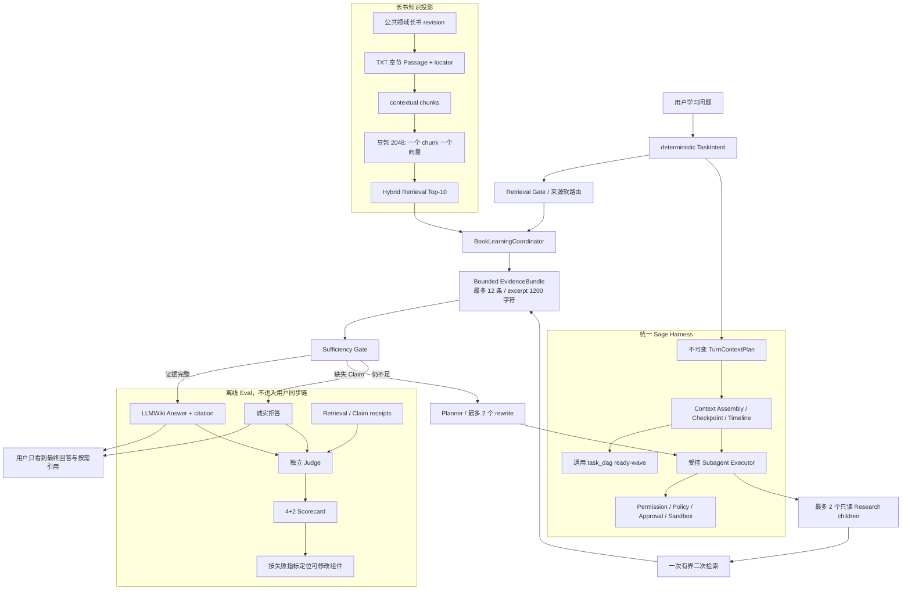

# Sage 长书 Embedding Provider 与 Agentic RAG 最终收口 v1

> 日期：2026-08-09
> clean eval source：`3ee7111`
> 范围：2 本公共领域长书、5,220 个 contextual chunks、14 条 seed、15 个原子 Gold Claim
> 状态：豆包已选为长书质量优先模型；便携默认仍保持本地 Provider，线上激活需单独配置

## 产品结论

Sage 不要求用户先选书。用户只提出学习问题，系统在后台完成来源软路由、首轮检索、必要时的
一次有界补检索、证据充分性判断以及回答或拒答。纯 TXT 场景固定一个 chunk 对应一个向量和
一个 citation，不能为了调用多模态融合接口而把多个 chunk 融成不可追溯的向量。

本轮选择 **豆包 2048 + contextual chunk + Top-10** 作为长书质量优先配置。理由是豆包在同一
Gold 下的必要事实覆盖、Recall 和 NDCG 均为三家最高；FastEmbed 保留为无 Key 消融和离线
回退，百炼当前纯文本长书不选。这个决策不是“豆包延迟也最好”：clean SQLite exact P95 为
`5.174s`，仍超过 3 秒目标，部署优化责任落在 PostgreSQL pgvector、经评测的降维或索引路径。

| Provider | Claim Coverage | Recall@10 | MRR | NDCG@10 | SQLite P95 | 产品角色 |
| --- | ---: | ---: | ---: | ---: | ---: | --- |
| FastEmbed 384 | 0.7333 | 0.7500 | 0.5233 | 0.5822 | **0.930s** | 无 Key 回退 / 消融基线 |
| 豆包 2048 | **0.8333** | **0.8833** | 0.7200 | **0.7204** | 5.174s | **长书质量优先模型** |
| 百炼 Qwen3-VL 1024 | 0.7000 | 0.7333 | **0.7500** | 0.7173 | 3.415s | 当前纯 TXT 不选 |

豆包首次建库调用 5,234 次、约 161.8 万输入 token，单次 Provider 请求 P95 约 `294ms`；本轮
clean 检索 5,234/5,234 命中 hash-only 向量缓存，没有重复调用云 Embedding。价格表未冻结，
成本保持 `null`，不能写成成本收益。缓存不保存正文、查询明文或凭据，也不进入 Git。

## Passage 与 Chunk

`Passage` 是 Gold 中“能够证明某个 Claim 的逻辑证据区间”，当前通常是章节级；`Chunk` 是
系统实际切分、建向量、召回和绑定 citation 的物理索引单元。

```text
章节 Passage: 西游记.txt#第十四回
├── Chunk A -> vector -> kcite_a
├── Chunk B -> vector -> kcite_b
└── Chunk C -> vector -> kcite_c
```

系统通过 `source_relative_path + heading_path` 把召回 chunk 投影回稳定 passage ID。所以
“Claim 的正确 passage 被找回”表示 Top-K 至少命中了该章节下的一个 chunk：

- `coverage_mode=any`：候选 passage 中任意一个被命中即可；
- `coverage_mode=all`：指定的多个 passage 都必须至少命中一个 chunk。

当前 Gold 是章节级，不等于已经验证了句子级证据定位。下一版 Gold 应补充 chunk/excerpt 级
标注，用于继续诊断“章节找对但句子没找准”的情况。

## 产品与评测架构



TaskIntent 只收窄 Retrieval、ToolBundle 和 DAG 候选，不能授予 Permission、Policy、Approval 或
Sandbox 权限。Resume 读取冻结 Plan，不重新分析输入，也不重复运行 BookLearningCoordinator。
长书 Coordinator 复用 Harness 的 Subagent Executor；`task_dag` 是主模型处理通用复杂任务的
编排入口，两者共享权限和证据基础设施，但长书回答不强制额外走一遍通用 DAG。

在线用户链只运行 Planner/Gate/Answer。独立 Judge 只属于离线 Eval，不把评测延迟和模型思考
过程展示给用户，也不要求保存 Chain-of-Thought。

## 最终 4+2 主指标

clean retrieval 与 generation 均绑定 `3ee7111`。答案质量只在 13 个完成 case 中计算，其中
9 个为可回答 case；1 个 case 在 Answer 阶段 timeout，不能从质量分母中静默消失。

| 类型 | 主指标 | clean 结果 | 对应责任模块 |
| --- | --- | ---: | --- |
| 质量 | First-pass Claim Evidence Coverage | **0.8333** | chunk / embedding / reranker |
| 质量 | Answer Correctness | **0.4444** | Answer prompt / Answer Gate / 模型方差 |
| 质量 | Correct Abstention / False Acceptance | **1.0000 / 0.0000** | Sufficiency Gate |
| 质量 | Claim Recovery Gain | **0.1296** | decomposition / rewrite |
| 运行 | Provider Failure Rate | **1/14 = 0.0714** | timeout / retry / fallback |
| 运行 | End-to-end P95 | **227.836s** | Planner / Answer / 离线 Judge 调用预算 |

辅助诊断：Faithfulness `1.0`、Citation Correctness `1.0`、Context Precision `0.3529`、Context
Recall `0.9630`、Recovery Resolution `0.5`。Faithfulness 只说明本轮生成的 claim 有证据支持，
不能替代只有 `0.4444` 的 Answer Correctness。

相同 bounded 配置的另一轮诊断曾得到 Answer Correctness `0.6667`，因此当前真实结论是
**答案正确率存在明显 Provider/Judge 方差，尚未稳定**，不能挑高分包装。

## Evidence Budget 的收益与边界

EvidenceBundle 现在最多 12 条 evidence，每条 excerpt 最多 1,200 字符，并优先保留不同
passage。它是上下文保护和故障隔离，不改变首轮 Top-K，也不把多个 chunk 合成一个 citation。

未限 Evidence 的诊断运行有 4/14 Answer/Judge timeout；bounded clean 运行降为 1/14，P95 为
`227.836s`。但两轮 source 状态和完成样本数不同，总 token 也不能直接比较；本轮不宣称
Evidence Budget 已稳定提升 Answer Correctness，只确认它减少了超长上下文暴露面并改善了
完成率。端到端延迟仍远高于在线目标。

## 下一步

1. 长书质量配置选豆包；部署前在 PostgreSQL pgvector exact 或经评测的降维上复跑相同 Gold，
   目标是把检索 P95 压回 3 秒内，同时保持 `0.8333` Claim Coverage。
2. 将在线 Planner/Gate/Answer 与离线 Judge 彻底分离，压缩串行模型调用；不继续增大 Top-K。
3. 针对 Answer Correctness 方差固定 temperature/seed（若 Provider 支持），增加重复运行和置信区间，
   再优化 Answer Gate，而不是依据单轮高分选 prompt。
4. 把 14 条 seed 扩到 30-50 条并独立 review，冻结 calibration/test；增加 chunk/excerpt 级 Gold。
5. Recovery Gain 已越过 0.05 诊断目标，下一步优化 recovery admission，减少对完整 case 和 hard
   negative 的无效触发。

机器可读汇总见
`evals/reports/book_learning_embedding_provider_tradeoff_v1_2026-08-09.json`。原始报告保存在
ignored `.coding/evals/`；可提交汇总只保存指标、边界和 SHA-256。
