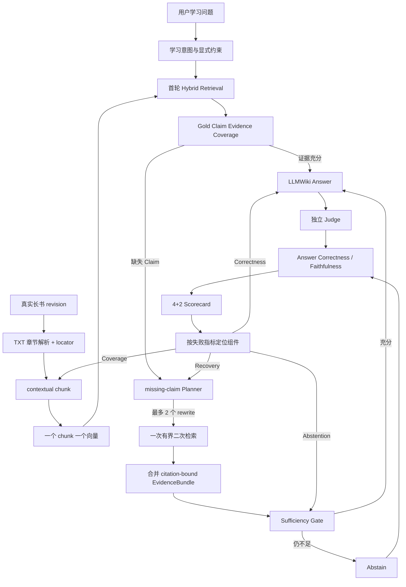

# Sage 长书 Embedding Provider 与 Agentic RAG 收口 v1

> 日期：2026-08-09
> clean source：`0123456`
> 范围：2 本公共领域长书、5,220 个 contextual chunks、14 条 seed、15 个原子 Gold Claim
> 状态：真实豆包/百炼/FastEmbed 对比与 missing-claim generation 已完成；线上默认未修改

## 产品结论

本轮不把“模型能力更多”当成选型理由。纯 TXT 长书要求一个 chunk 对应一个向量和一个可追溯
citation，因此豆包一次只发送一个文本，百炼必须使用 `enable_fusion=false`。多模态融合只保留给
未来的图文页级对象，不能把多个 chunk 融成一个向量。

当前继续使用 **FastEmbed + contextual chunk + Top-10**。豆包是质量候选，但在当前 SQLite
精确向量检索上超出 3 秒预算；百炼的 MRR 较好，但首轮必要事实覆盖和 Recall 都没有超过
FastEmbed，且本机网络入口出现过 fail-closed TLS 故障。

| Provider | Claim Coverage | Recall@10 | MRR | NDCG@10 | 隔离 P95 | 结论 |
| --- | ---: | ---: | ---: | ---: | ---: | --- |
| FastEmbed 384 | 0.7333 | 0.7500 | 0.5233 | 0.5822 | **930 ms** | 保持当前默认 |
| 豆包 2048 | **0.8333** | **0.8833** | 0.7200 | **0.7204** | 6,724 ms | 质量候选，延迟阻塞 |
| 百炼 Qwen3-VL 1024 | 0.7000 | 0.7333 | **0.7500** | 0.7173 | 3,415 ms | 当前纯 TXT 不选 |

这些数字只适用于当前 `seed_manual`。豆包首次建库调用 5,234 次、约 161.8 万输入 token；
价格表未冻结，因此成本保持 `null`，不能写入简历成本收益。百炼支持非融合批量，但一次并发
全量运行因 TLS EOF fail closed，最终依靠模型 revision + role + 文本 SHA-256 的本地向量缓存
恢复。缓存不保存正文、查询明文或凭据，也不进入 Git。

## 完整流程

评测不保存 Chain-of-Thought。Planner 只输出结构化 decision/rewrite，最终用户仍只看到答案、
拒答和按需展开的 citation。

## 当前 4+2 主指标

真实 FastEmbed generation 使用豆包生成、DeepSeek Judge、Top-10 和 120 秒单阶段 timeout：

| 类型 | 指标 | 旧值 | 当前值 | 结论 |
| --- | --- | ---: | ---: | --- |
| 质量 | First-pass Claim Evidence Coverage | 0.7333 | 0.7333 | 仍低于 0.80 |
| 质量 | Answer Correctness | 0.5000 | **0.6000** | 有提升，仍需优化 |
| 质量 | Correct Abstention / False Acceptance | 1.0 / 0.0 | **1.0 / 0.0** | 当前 4 个 hard negative 守住 |
| 质量 | Claim Recovery Gain | 0.0000 | **0.0333** | 首次正收益，低于 0.05 目标 |
| 运行 | Provider Failure Rate | 0.1429 | **0.0000** | 本轮 14/14 完成 |
| 运行 | End-to-end P95 | 138,752 ms | 150,772 ms | token/多轮代价仍过高 |

辅助诊断为 Answer Claim Coverage `0.60`、Faithfulness `1.0`（仅 7 个最终回答）、Citation
Correctness `1.0`、Context Precision `0.1743`、Context Recall `0.80`。Faithfulness 仍不代表答案
正确；它只表示已生成的 31 个 claim 都能被当前 EvidenceBundle 支持。

missing-claim Planner 只在 `book-cross-002` 补回 `wealth_money`，使最终 Claim Coverage 从
`0→0.3333`；`book-zh-003` 和 `book-cross-001` 仍未补回必要 Claim，所以
`Recovery Resolution=0`。Planner 还对若干首轮已完整的 case 和 hard negative 触发 rewrite，
导致总 token 从旧版 216,095 增至 297,954。这是下一轮要优化的“无效 recovery 激活”，不是
继续增加 Top-K。

## Oracle 上限与真实能力

人工 audited rewrite 的 evidence recall 上限为：FastEmbed `0.1667→0.8889`、豆包
`0.6111→0.8889`、百炼 `0.1111→1.0`。这证明二次检索可以补证据，但 oracle runner 使用
“非空结果即回答”的简化决策，三家都误接收了 hard negative，不能作为拒答安全证据。

真实 Planner + Gate 则保持 False Acceptance `0`，但 Recovery Gain 只有 `0.0333`。因此面试时
应表述为：**我们先用 oracle rewrite 测检索上限，再用真实 Planner 测实际收益，并用拒答 Gate
阻止“召回了新 chunk”被误当成“证据已经充分”。**

## 下一步

1. 保持 FastEmbed 线上默认；不把本轮候选写入生产 policy。
2. 在 PostgreSQL pgvector exact 上复跑豆包 2048，或评测供应商支持的降维；只有 P95 回到
   3 秒内且 Claim Coverage 保持优势才激活。
3. 优化 recovery admission：先判断缺失事实是否可检索、rewrite 是否新增 citation，再决定
   第二轮，目标是降低无效激活和 token，同时让 Recovery Gain 超过 0.05。
4. 把 14 条 seed 扩到 30-50 条并独立 review，冻结 calibration/test 后再写面试准确率。
5. 端到端 P95 的下一责任模块是 Planner/Generator/Judge 调用与上下文预算，不是 Embedding。

机器可读汇总见
`evals/reports/book_learning_embedding_provider_tradeoff_v1_2026-08-09.json`。所有原始报告都在
ignored `.coding/evals/`，汇总只保存指标、边界和 SHA-256，不保存书籍正文或 Provider key。
