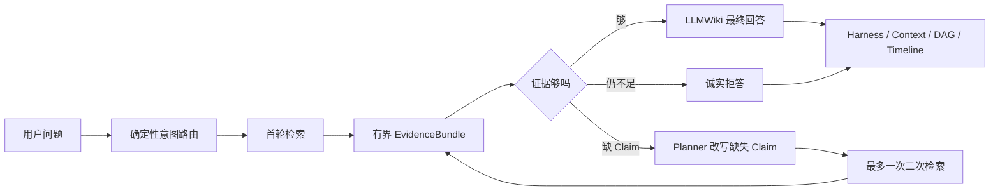
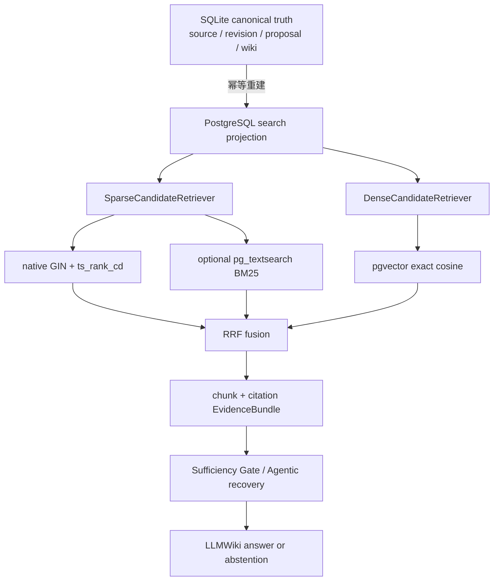

# Sage 长书 PostgreSQL 检索策略与端到端收口 v1

> 日期：2026-08-10
> 分支：`feat/book-rag-postgres-strategies`
> 基线：`dev/sage-v7@2a2e7a0`
> 数据：2 本公共领域长书、5,220 个 contextual chunks、14 条 seed、15 个 Gold Claim
> Gold 状态：`seed_manual`，本报告用于工程决策，不作为生产准确率

## 一句话结论

Sage 没有把 SQLite 的知识事实迁走，而是把 PostgreSQL 做成可重建的搜索投影。当前长书质量优先
策略是 **豆包 2048 维 + pgvector exact dense-first**；native PostgreSQL FTS 与
`pg_textsearch` BM25 都通过同一个稀疏策略接口接入，保留为可替换实现和离线对照，不与
Agentic RAG、Harness 或 Task DAG 绑定。

## 用户看到的产品流程

用户只提出学习问题，例如“解释分工为什么能提高生产力”。Sage 后台自动完成：



用户默认不需要选书。来源选择是后台软路由；引用和章节可以按需展开。检索策略只负责产生
证据候选，回答、拒答和运行权限仍由统一 Harness 的边界控制。

## 数据与模块边界



### Canonical 与投影

- SQLite 保留 source、revision、proposal、Wiki 和可审计事实，是唯一的知识真相层。
- PostgreSQL 只保存 workspace/source revision/chunk/citation/embedding/tsvector 等可重建字段。
- PostgreSQL 投影损坏、模型换代或策略切换时，可以按 revision 删除并重建；不会修改原始知识。
- `PostgresKnowledgeIndex` 只依赖 `SparseCandidateRetriever`、`DenseCandidateRetriever` 和
  `RankFusionPolicy`，因此后续加入 reranker、HNSW 或其他 BM25 实现不需要改业务协调器。

### Passage 与 Chunk

`Passage` 是 Gold 中能够证明 Claim 的逻辑证据区间，当前通常映射到章节；`Chunk` 是系统
实际切分、建向量、检索和绑定 citation 的物理单元。一个 passage 通常包含多个 chunk：

```text
第十四回（Gold passage）
├── chunk A -> vector -> citation A
├── chunk B -> vector -> citation B
└── chunk C -> vector -> citation C
```

因此“正确的 C 对应 passage 被找回”在当前 Gold 中表示：Top-K 至少命中了该 passage 下的一个
chunk。下一版 Gold 要继续细化到 chunk/excerpt，才能诊断“章节找对了但句子没有找准”。

## 策略对比收据

固定相同语料、Gold、豆包模型、Top-K=10 和 PostgreSQL projection，仅改变检索路线：

| 策略 | Recall@10 | MRR | NDCG@10 | Claim Coverage | 检索 P95 | 结论 |
| --- | ---: | ---: | ---: | ---: | ---: | --- |
| native hybrid（GIN + pgvector + RRF） | 0.8333 | 0.7833 | 0.7629 | 0.8000 | 157.5 ms | 稳健对照 |
| **dense-first（pgvector exact）** | **0.8833** | **0.8083** | **0.7778** | **0.8333** | **101.9 ms** | **当前候选默认** |
| BM25 sparse-only（pg_textsearch） | 0.7000 | 0.5500 | 0.5856 | 0.7000 | 58.8 ms | 关键词密集场景 |
| BM25 hybrid + RRF | 0.8333 | 0.7200 | 0.6977 | 0.8000 | 2056.6 ms | 不作为默认 |

这里的 dense-first 是一次 exact cosine scan，并非 ANN；5,220 chunks 的规模下已经比旧 SQLite
2048 维扫描快，但规模继续增长时应单独做 HNSW/降维 gate。BM25 的高速度不抵消当前质量和
中文分词不确定性，因此只作为可插拔实验路线。

## 真实端到端结果

同一 14-case seed 集合使用 `Doubao-Seed-2.0-pro` 做 Planner/Answer、DeepSeek 做离线 Judge；
每次模型调用 timeout 为 90 秒。检索路线不同，但 Provider/Judge 存在运行方差，因此下表用于
暴露系统问题，不能单独归因成某个检索策略造成的答案提升或下降：

| E2E 路线 | 完成 / 总数 | Answer Correctness | Abstention / False Acceptance | Recovery Gain | Provider Failure | P95 |
| --- | ---: | ---: | ---: | ---: | ---: | ---: |
| native hybrid | 12 / 14 | **0.6250** | 1.0 / 0.0 | **0.0833** | 2 / 14 = 0.1429 | 239.847 s |
| dense-first | 11 / 14 | 0.5714 | 1.0 / 0.0 | 0.0000 | 3 / 14 = 0.2143 | 229.740 s |

dense-first 的检索 Recall、MRR、NDCG、Claim Coverage 都更高，但单轮端到端并未同步变好。
本轮没有把两个不同时间的 Provider 运行包装成严格 A/B：可确定的是 dense-first 应进入默认检索
候选；Answer prompt、rewrite admission 和 Provider fallback 仍需单独优化与重复评测。dense-first
完成样本的 Faithfulness 为 `1.0`、Citation Correctness 为 `0.9091`、Answer Relevance 为 `0.8`；
这再次说明 Faithfulness 高不等于 Answer Correctness 高。

## 面试只讲的 4+2 指标

主面板只保留能直接决定修改哪个模块的六个结果：

| 问题 | 指标 | 低了改哪里 |
| --- | --- | --- |
| 首轮证据找齐了吗 | First-pass Claim Evidence Coverage | chunk、embedding、reranker |
| 最终回答正确吗 | Answer Correctness | Answer prompt、Answer Gate、模型稳定性 |
| 没证据时守住了吗 | Correct Abstention + False Acceptance | Sufficiency Gate |
| 二次检索补回事实了吗 | Claim Recovery Gain | claim decomposition、query rewrite |
| 服务稳定吗 | Provider Failure Rate | timeout、retry、fallback |
| 用户等多久 | End-to-end P95 | context budget、索引、Provider 调用预算 |

`Recall/MRR/NDCG`、Context Precision、Citation Correctness、Faithfulness、Answer Relevance 是
诊断指标。特别是 Faithfulness 只回答“生成 Claim 是否被 EvidenceBundle 支持”，不能证明
检索到的证据本身正确，所以不能替代 Answer Correctness。

## Agentic RAG 与 Harness/DAG 的关系

Agentic RAG 当前只在首轮证据不足时触发：Planner 接收缺失 Claim，生成有界 rewrite，最多执行
一次补检索；仍然不足就拒答。它复用 Harness 的 Permission、Policy、Approval、Sandbox、
Checkpoint、Timeline，不复制一套新的聊天运行时。通用 Task DAG 负责复杂任务编排，长书
Coordinator 是其中的受控 Research 分支；两者共享安全与运行基础设施，但检索策略本身不依赖
某个 DAG 节点实现。

## 本阶段工程交付与边界

- 已完成 PostgreSQL sparse/dense/hybrid 选择，native FTS 与 BM25 解耦，SQLite 误传 PG 策略和
  非法 retrieval mode 均 fail closed。
- 已完成 PG16 默认实例与 PG17 + pgvector + pg_textsearch 隔离实例的真实对照。
- Harness、Context Assembly、Agentic RAG、Task DAG 已在当前祖先链中；端到端收据以本分支
  的统一入口为准，不把单元测试当成线上准确率。
- Gold 仍是 seed_manual，14 条 query 不能包装成生产效果；需要扩到 30-50 条并独立 review，
  冻结 calibration/test 后再设 release gate。
- 当前建议：先默认豆包 dense-first；后续只一次改一个组件，按 4+2 归因。BM25 作为关键词
  场景开关保留，HNSW/降维等性能优化另开 scale gate。
- 当前重大问题不是检索速度，而是端到端 Provider Failure 超过 5% 目标、Answer Correctness 低于
  0.8 目标，以及 dense-first 的 Recovery Gain 为 0；下一轮应先修复 Provider fallback，再对
  missing-claim rewrite 做独立离线消融。

架构图：`docs/assets/book-rag-postgres/book-rag-postgres-agentic-architecture-v1-zh.png`。
机器收据：`evals/reports/book_learning_postgres_strategy_v1_2026-08-10.json`。
