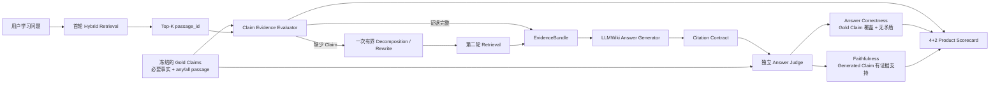

# Sage 长书 RAG 四项核心 KPI 与策略选择 v1

> 日期：2026-08-08
> clean source：`742f131`
> 状态：Scorecard、原子 Gold Claim Judge、五策略 clean retrieval 与 Top-10 真实 generation 已完成；线上策略仍未修改
> 数据边界：14 条 `seed_manual`、15 个原子 Gold Claim，不代表生产准确率或 SLA

## 产品结论

Sage 的主面板不平铺所有 RAG 指标，只回答四个产品问题：

| 产品问题 | 主指标 | 失败时优先修改 |
| --- | --- | --- |
| 首轮有没有找齐回答所需证据 | `First-pass Claim Evidence Coverage` | chunk、embedding、reranker |
| 最终答案是否覆盖正确事实且没有矛盾 | `Answer Correctness`，辅以 `Answer Claim Coverage` | answer prompt、answer gate |
| 没有证据时是否守住拒答 | `Correct Abstention` + `False Acceptance` | sufficiency gate |
| 第二轮检索是否补回了缺失事实 | `Claim Recovery Gain` | query decomposition、rewrite |

运行质量只保留 `Provider Failure Rate` 和 `P95 Latency`。MRR、NDCG、Context Precision、
Citation Correctness、Faithfulness 等指标保留在 diagnostics，只有主指标失败时才用于归因。



这里不要求模型输出 Chain-of-Thought。Planner、检索、生成和 Judge 只保存结构化 receipt；
用户仍只看到最终答案和按需展开的引用。

## Claim 与答案正确率

### Gold Claim

Gold Claim 是人工提前标注并冻结的最小必要事实，用来判断检索和答案是否覆盖完整。例如：

```text
C1：分工提高熟练度
C2：分工减少任务切换时间
C3：分工促进机器发明和使用
```

每个 Claim 绑定一个或多个 passage，并声明 `any` 或 `all`。检索层只检查稳定
`passage_id` 是否满足绑定，不调用 LLM 推断支持关系。

### Generated Claim

Generated Claim 是最终答案实际说出的事实。独立 Judge 检查它是否被 EvidenceBundle 支持，
用于 Faithfulness、Unsupported Claim Rate 和 Citation Correctness。

两个方向不能混用：

```text
Gold Claim -> 最终答案是否覆盖        = Answer Claim Coverage / Correctness
Generated Claim -> Evidence 是否支持  = Faithfulness
```

`Faithfulness=1` 只说明模型没有超出当前证据；如果检索证据本身不完整或错误，它不能证明
答案正确。

本轮新增的答案指标只在 `evaluation_status=completed` 的可回答 case 上计算，provider failure
不进入质量分母：

```text
Answer Claim Coverage
= covered Gold Claims / required Gold Claims

每个可回答 case 的 Answer Correctness = 1，当且仅当：
1. 最终决策为 answer；
2. 所有必要 Gold Claim 都被最终答案覆盖；
3. contradicted_gold_claim_ids 为空。

总体 Answer Correctness
= 正确 case 数 / 完成评测的可回答 case 数
```

## 五种检索策略 clean 对比

以下五个收据均绑定 clean source `3902827`，使用同一公共领域双书语料、同一 14 条 Gold、
同一 FastEmbed revision 和 Top-10。延迟为本机 SQLite exact scan 单次收据，只用于本轮选择，
不是生产 SLA。

| 策略 | Claim Coverage | Recall@10 | MRR | NDCG@10 | P95 | chunks | 结论 |
| --- | ---: | ---: | ---: | ---: | ---: | ---: | --- |
| baseline | 0.7000 | 0.700 | 0.520 | 0.565 | 1,602 ms | 5,220 | 便宜基线，覆盖较低 |
| contextual_chunk | **0.7333** | **0.750** | 0.523 | 0.582 | **522 ms** | 5,220 | 当前综合最优候选 |
| parent_child | **0.7333** | **0.750** | 0.608 | **0.647** | 3,510 ms | 25,836 | 排序更好，Claim 无增益且超 3s 预算 |
| described_parent_child | 0.7000 | 0.700 | **0.625** | 0.643 | 4,442 ms | 25,622 | 描述没有补回 Claim，成本更高 |
| semantic_boundary | 0.7000 | 0.700 | 0.520 | 0.565 | 871 ms | 5,240 | 当前语料仍未证明增益 |

策略选择器要求 corpus、dataset、embedding 和 Top-K 完全一致，要求所有候选都有 Claim
receipt，并拒绝 dirty source。交互 P95 预算冻结为 3,000 ms；在预算内先比较 Claim Coverage，
再比较 Recall、NDCG、MRR 和延迟。因此本轮推荐 `contextual_chunk`，状态仅为
`offline_candidate`，没有修改线上默认 policy。

## 当前 4+2 Scorecard

以下数字来自 clean source `742f131` 的 Top-10 真实 generation 收据；14 条 seed 中 12 条完成
Judge，2 条 provider failure 被排除在答案质量分母之外。一次评测批次的 provider 波动仍然很大，
所以这些数字是可复现诊断，不是生产准确率：

| 类型 | 指标 | 当前值 | 组件结论 |
| --- | --- | ---: | --- |
| 质量 | First-pass Claim Evidence Coverage | 0.7333 | 低于 0.80，继续看 chunk/embedding/reranker |
| 质量 | Answer Claim Coverage | 0.5000 | 低于 0.80，检查 evidence completeness 与 answer gate |
| 质量 | Answer Correctness | 0.5000 | 低于 0.80，检查 answer prompt / answer gate |
| 质量 | Correct Abstention / False Acceptance | 1.0000 / 0.0000 | 当前 4 条 hard negative 守住，样本仍小 |
| 质量 | Claim Recovery Gain | 0.0000 | 下一优先级为 decomposition/rewrite |
| 运行 | Provider Failure Rate | 0.1429 | 高于 0.05，优化 provider timeout/retry/fallback |
| 运行 | P95 Latency | 138,752 ms | 远高于 5 秒，优化 context budget、provider 与索引路径 |

阈值只用于离线归因：Coverage/Correctness 目标 0.80，Correct Abstention 目标 0.95，False
Acceptance 上限 0.05，Recovery Gain 目标 0.05，Provider Failure 上限 0.05，端到端 P95
上限 5 秒。当前 gold 尚未冻结，阈值不接入线上 Gate。

## 复现入口

```bash
PYTHONPATH="$PWD/packages/sage_harness:$PWD" \
  /Users/zeromadlife/Desktop/tour-agent/.venv/bin/python \
  scripts/evaluate_book_learning_scorecard.py \
  --retrieval-report .coding/evals/book-learning-retrieval.json \
  --generation-report .coding/evals/book-learning-generation.json \
  --output .coding/evals/book-learning-scorecard.json
```

可重复传入 `--strategy-report NAME=PATH` 做策略比较。输入文件只记录路径和 SHA-256；可提交
的汇总报告不得包含原始书籍、EvidenceBundle 正文、答案上下文或 provider credential。

## 下一阶段边界

1. 离线评测已把显式 `missing_claim_ids/statements` 传给 Planner，且不暴露 Gold passage ID；
   下一次真实模型复跑用 Claim Recovery Gain 判断是否真的补回，而不是只看新增 chunk。该输入
   当前是 gold-guided diagnostic，不接入线上 Gate。
2. gold 扩展到 30-50 条并做独立 review，再划分 calibration/test，之后才讨论线上 Gate。
3. parent-child 只有在 bounded projection、缓存或 PostgreSQL live 将 P95 压回预算，且 Claim
   Coverage 真正超过 contextual 时才重新进入候选。
4. 先降低 provider failure/P95，再比较 Top-K 和上下文预算；Top-10 没有改善 Answer Correctness，
   不能通过继续堆叠上下文解决答案缺失。
5. 意图小模型、SFT/RL 和更多 Agent 协同留在这条评测回路稳定后，避免放大错误路由。
