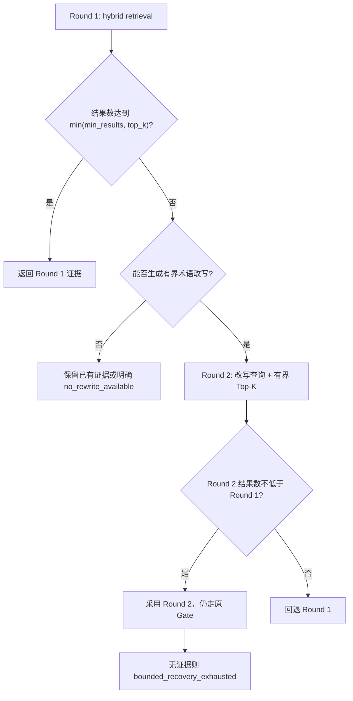

# Sage RAG 有界检索恢复 v1

> 状态：PR-5B 审阅稿
>
> selection 报告：[knowledge_bounded_recovery_postgres_selection_v1_2026-07-28.json](../../evals/reports/knowledge_bounded_recovery_postgres_selection_v1_2026-07-28.json)
>
> final 报告：[knowledge_bounded_recovery_postgres_final_v1_2026-07-28.json](../../evals/reports/knowledge_bounded_recovery_postgres_final_v1_2026-07-28.json)

## 1. 这次解决什么

PR-5A 已能区分 ingestion、retrieval、ranking、Gate、context 等失败层，但只负责观测。PR-5B
只处理其中一种可在线识别的失败：初次检索结果占用不足，并且查询中存在经过评测的中英技术术语差异。

本版本提供：

- 一次初始检索加最多一次恢复检索，硬上限为两轮；
- 仅在结果数不足且术语改写实际发生时重试；
- 第二轮按配置将 `top_k` 最多扩大两倍，同时受绝对上限和已校准 Gate 的 `top_k` 约束；
- 两轮都经过同一个 relevance Gate，不降低阈值；
- API 和 Coding Tool 只返回轮次、触发原因、结果数和拒答原因，不返回改写文本；
- `retrieval_runs` 用相同的原始查询 HMAC 关联两轮，第二轮额外记录改写 HMAC；
- 外部 Web 不进入可信补召回链路。

## 2. 状态机



恢复触发看的是 Gate 后的可用结果数。因此 Gate 拒绝全部候选时可以进入第二轮，但第二轮仍使用相同阈值。
该设计修复查询表达与语料术语不一致的问题，不把“多搜一次”当成绕过拒答的通道。

## 3. 为什么选择确定性术语扩展

PR-5A 的 deterministic hybrid selection 中有两条 retrieval failure：

| Case | 初始现象 | 语料中的官方术语 |
|---|---|---|
| `ragv1-dev-16a` | 返回 3 条错误的 pgvector 证据 | `filtering`、`fewer matching rows`、`iterative scans` |
| `ragv1-calibration-07b` | 返回 0 条证据 | `filter columns`、`selective`、`exact indexes` |

两条失败都来自中文问题与英文官方文档之间的术语错位。固定词表具备以下边界：

- 可复现、零模型调用成本，适合先验证恢复状态机；
- 规则按短语匹配，不按 case ID 或完整问题硬编码；
- 只追加有限个术语，查询总长仍不超过 2,000 字符；
- 无匹配时不重试，避免 no-answer 查询因盲目扩大召回而增加误接纳。

它不是通用 Query Understanding。后续若引入 LLM rewrite，必须单独评测改写正确性、提示注入、成本和延迟，
不能直接替换当前可审计基线。

## 4. 为什么没有加入更多恢复动作

本轮没有降低 Gate、没有接 Web、没有强制图扩展，也没有为 sparse、dense 和 exact-field 各发一轮请求。
原因是两条已知 retrieval failure 已被一次 rewritten hybrid 解决；额外路线会增加延迟和错误面，却没有新增召回收益。

同理，Parent-Child、语义切分、Contextual Chunk 和 Cross-Encoder 属于 PR-6 的独立消融变量。把它们混入
PR-5B 会无法回答“收益究竟来自哪一层”。

## 5. 评测协议

- 后端：PostgreSQL GIN + `ts_rank_cd` + pgvector exact + RRF；未使用 ANN/HNSW。
- Provider：deterministic Hashing，成本为 0；该 Provider 不具备真实语义能力。
- Route：`hybrid`。
- `top_k=10`，`candidate_k=50`，token budget 为 3,000。
- selection 只使用 dev + calibration；Gate 在 baseline calibration 上确定后原样用于 candidate。
- final 使用 calibration + frozen test，并从 selection 报告读取同一 Gate 阈值。
- selection 和 final 均限制最多两轮，P95 预算为 100 ms。
- test 未参与术语规则、恢复策略或 Gate 选择。

固定 Gate 阈值为 `0.03131881575727918`。selection 与 final 的 baseline/candidate 均完全一致。

## 6. Selection 结果

| 指标（dev + calibration） | Baseline | Recovery | 变化 |
|---|---:|---:|---:|
| Recall@10 | 0.939655 | 0.974138 | +0.034483 |
| Candidate Recall | 0.965517 | 1.000000 | +0.034483 |
| MRR | 0.686754 | 0.721237 | +0.034483 |
| NDCG@10 | 0.734989 | 0.769472 | +0.034483 |
| Retrieval failure 数 | 2 | 0 | -2 |
| 已知失败子集 Recall@10 | 0.000000 | 1.000000 | +1.000000 |
| False acceptance 数 | 1 | 1 | 0 |
| P95 | 8.780 ms | 19.344 ms | +10.564 ms，仍低于 100 ms 预算 |
| 估算模型成本 | 0 USD | 0 USD | 0 |

selection 没有任何 case 的 Recall@10 下降。报告 SHA-256 为
`0997287c847df3e77cbf6680578289b8d314cb79b4a766159b44f59f343257d9`，源代码为干净
commit `b637b359766df4a8488a08df3e7b56e4708704cb`。

## 7. Frozen Test 结果

冻结 test 原本没有 retrieval failure，因此不能宣称“test 失败子集提升”。正确结论是恢复策略在 test 上没有回归：

| 指标（frozen test） | Baseline | Recovery |
|---|---:|---:|
| Recall@10 | 0.888889 | 0.888889 |
| Candidate Recall | 1.000000 | 1.000000 |
| MRR | 0.682540 | 0.682540 |
| NDCG@10 | 0.701009 | 0.701009 |
| False acceptance | 0 | 0 |
| False rejection | 2 | 2 |

final 同时复验 calibration：`ragv1-calibration-07b` 的 Recall@10 从 0 提升到 1，False acceptance
仍为 1，候选 P95 为 8.588 ms，模型成本为 0。final 报告 SHA-256 为
`63b94ac03f76ffc53f73c8631b1b227830b3c978d7b9e99a67f9404134b7e0d4`，源代码为干净
commit `3b86140ecee7bbd39e655755556008b2909773fd`。

P95 低于预算，但本地单次运行的数值波动不能表述为性能优化。

## 8. 运行时与隐私边界

默认配置保持 `KNOWLEDGE_RECOVERY_ENABLED=false`。原因是当前规则只在固定官方语料和版本化 Eval 上验证；
换语料、Provider 或业务域后应重新跑 selection/final 再开启。

可配置项：

```dotenv
KNOWLEDGE_RECOVERY_ENABLED=false
KNOWLEDGE_RECOVERY_MIN_RESULTS=4
KNOWLEDGE_RECOVERY_TOP_K_MULTIPLIER=2
KNOWLEDGE_RECOVERY_MAX_TOP_K=20
```

生产 trace 不保存原始查询、改写文本、chunk 文本、来源路径或异常消息。Round 2 的 `query_hash` 仍是原始查询
HMAC，`rewrite_hash` 是改写后查询 HMAC；两者都按 workspace 隔离。

## 9. 可复现命令

```bash
PYTHONPATH=. .venv/bin/python scripts/evaluate_knowledge_recovery.py \
  --stage selection \
  --backend postgres \
  --postgres-dsn "$SAGE_TEST_POSTGRES_DSN" \
  --output evals/reports/knowledge_bounded_recovery_postgres_selection_v1_2026-07-28.json

PYTHONPATH=. .venv/bin/python scripts/evaluate_knowledge_recovery.py \
  --stage final \
  --backend postgres \
  --postgres-dsn "$SAGE_TEST_POSTGRES_DSN" \
  --selection-report evals/reports/knowledge_bounded_recovery_postgres_selection_v1_2026-07-28.json \
  --output evals/reports/knowledge_bounded_recovery_postgres_final_v1_2026-07-28.json
```

## 10. 简历与面试表述边界

可以写：在 PostgreSQL exact hybrid selection 的 58 条可回答样本上，将 Recall@10 从 93.97% 提升到
97.41%，将 2 条已知 retrieval failure 清零，失败子集 Recall@10 从 0 提升到 100%；Gate 阈值不变，
no-answer 误接纳数不增加，冻结 test 无检索回归。

不能写：

- “线上召回率提升 3.45%”，本项目没有线上流量实验；
- “语义模型召回提升”，正式 PR-5B 指标使用的是 deterministic Hashing；
- “P95 降低”，当前只有本地短基准且存在波动；
- “解决所有召回失败”，本轮只覆盖结果占用不足且能生成审计改写的失败；
- “多轮 Agent 自主检索”，实现上是最多两轮的确定性恢复状态机。
