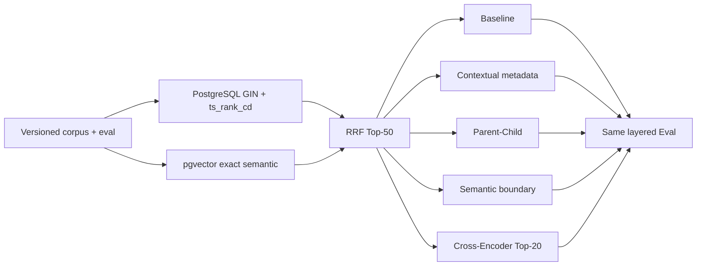

# Sage RAG 分块与重排独立消融 v1

## 结论

PR-6 在同一份版本化 corpus/eval、同一 PostgreSQL exact hybrid 链路和同一
真实语义 Provider 上，独立比较了四个候选：

1. deterministic contextual metadata；
2. Parent-Child；
3. 超大 block semantic boundary；
4. RRF 后 bounded Cross-Encoder。

四个候选的 selection 都没有通过预先冻结的门禁，因此默认检索策略保持
parser-block + `4000/160`，不开启任何 PR-6 候选。不使用 final/test 的结果追认
selection 失败的策略，也不把门禁从 `0.01` 临时改成 `0.009` 让 Parent-Child
通过。

这个结论不是“四种方法都无效”，而是“当前 9 份官方语料、49 个 parser block
和 80 条评测案例不支持把任何候选升级为默认”。

## 固定实验协议



- selection：`dev + calibration`；final：`calibration + frozen test`。
- test 不用于选策略、调参或 Gate 校准。
- 只评估 `hybrid`；Top-K `10`，candidate-K `50`，token budget `3000`。
- 使用固定 revision 的 FastEmbed multilingual MiniLM，PostgreSQL 使用 exact pgvector；
  不使用 HNSW/ANN。
- PR-5B recovery 关闭，避免分块/重排与 query rewrite 同时改变后无法归因。
- 每个 candidate 在 selection 的 calibration split 独立校准 Gate；final 复用各自的
  冻结阈值。Cross-Encoder score 先 sigmoid 到 `[0, 1]`，不复用 RRF 分数域的阈值。
- query 不预缓存，其 embedding 计入检索延迟；模型下载/初始化单独记录，
  Cross-Encoder 的查询推理计入 P95。
- `workspace_row_bytes` 是当前 workspace 的 PostgreSQL 逻辑行体积，用于候选间
  对比；它不是共享表的物理索引大小，不能当作生产容量预测。

## 独立开关如何保证可归因

`KnowledgeAblationPolicy.strategy` 是单值枚举，只允许 `baseline`、`contextual_chunk`、
`parent_child`、`semantic_boundary` 或 `cross_encoder`。它不接受多选数组，
因此评测代码无法把四个策略叠加后冒充单变量消融。

默认 `baseline` 的 chunk ID、corpus revision、chunk count 与三路检索指标与 PR-2
报告逐项相同。PR-6 没有在 Settings 或 `.env.example` 暴露运行时开关，候选
只存在于可复现评测链路。

## Selection：dev + calibration

Baseline：Recall@10 `1.000000`，MRR `0.791112`，NDCG@10 `0.831347`，
citation support `1.000000`，P95 `34.805 ms`，49 chunks，logical row bytes `175120`，
no-answer false acceptance `1`。

| 策略 | Recall@10 | MRR | NDCG@10 | P95 ms | chunks | row bytes | 启用结论 |
| --- | ---: | ---: | ---: | ---: | ---: | ---: | --- |
| Contextual metadata | 1.000000 | 0.796305 | 0.834362 | 39.464 | 49 | 180016 | 失败；目标 delta `0.003015 < 0.01` |
| Parent-Child | 1.000000 | 0.797845 | 0.841130 | 35.775 | 109 | 355736 | 失败；目标 delta `0.009783 < 0.01` |
| Semantic boundary | 1.000000 | 0.791112 | 0.831347 | 33.038 | 49 | 175120 | 失败；正式语料可触发 block 为 0 |
| Cross-Encoder | 0.956897 | 0.877874 | 0.876574 | 1435.744 | 49 | 175120 | 失败；Recall `-0.043103`，P95 超 250 ms |

### Contextual metadata

Baseline 已经将 title/heading 写入 sparse/dense 输入。本候选只新增可复现的
`Source / Title / Section / Content` 元数据前缀，不修改可引用正文。它不是 Anthropic
文章中用 LLM 为每个 chunk 生成 50-100 token 语义背景的完整 Contextual
Retrieval，不能直接复用对方的降失败率数字。官方方法与域内评测建议见
[Anthropic Contextual Retrieval](https://www.anthropic.com/engineering/contextual-retrieval)。

本数据上 NDCG 只增加 `0.003015`，还伴随 required-claim extractive proxy
`-0.004134`，因此不启用。

### Parent-Child

实现语义是“小 child 作为 sparse/dense 检索输入，原 parser block 作为可引用
parent 正文，返回前按 parent 去重”，不是仅仅把 chunk size 调小后换名。这与
[LangChain ParentDocumentRetriever](https://reference.langchain.com/python/langchain-classic/retrievers/parent_document_retriever/ParentDocumentRetriever)
的“小子块检索、大父块返回”取舍一致，但 Sage 保留自己的 revision/citation 合同。

Selection NDCG delta `0.009783`，只比 `0.01` 门禁少 `0.000217`；不因为接近
就改阈值。它还把 chunks 从 49 增加到 109（`2.224x`），logical row bytes
从 175120 增加到 355736（`2.031x`）。

### Semantic boundary

策略只替换“超过 4000 字符的 parser block”的二次切分：按句分割，计算相邻
句向量的 cosine distance，在 95th percentile 断点切开，并保留最小 chunk 和
4000 字符硬上限。算法对照的主要来源是
[LangChain Experimental `SemanticChunker`](https://github.com/langchain-ai/langchain-experimental/blob/main/libs/experimental/langchain_experimental/text_splitter.py)；
Sage 没有引入该已归档实验包，而是使用现有固定 revision 的 Provider 和同一算法
不变量。

当前 49 个 block 的最大长度为 359，没有一个超过 4000。因此 selection/final
与 baseline 完全相同，只能结论“评测集未触发”，不能结论“语义切分无效”。
合成长 block 测试已证明语义距离断点能把“检索”和“部署”两类句子分开。

### Cross-Encoder

使用 MIT license 的 `BAAI/bge-reranker-base`，Hugging Face snapshot 固定为
`2cfc18c9415c912f9d8155881c133215df768a70`，通过 FastEmbed 0.8.0 ONNX 执行。
只重排 RRF 后 Top-20，其余候选保留原顺序。这符合
[Qdrant FastEmbed reranker 文档](https://qdrant.tech/documentation/fastembed/fastembed-rerankers/)
和 [FastEmbed 官方仓库](https://github.com/qdrant/fastembed) 的二阶段有界重排用法。

Selection 上 MRR `+0.086761`、NDCG `+0.045228`、false acceptance `-1`，但
Recall@10 `-0.043103`，P95 从 `34.805 ms` 上升到 `1435.744 ms`。这说明
候选能把部分正确结果排得更靠前，但也会把另一些金标挤出 Top-10，而且当前
CPU 延迟远超 `250 ms` 门禁。不能只选最好看的 MRR/NDCG 宣布上线。

## Final：calibration + frozen test

Final 使用 selection 中各自的冻结 Gate。Baseline：Recall@10 `0.972222`，
MRR `0.765046`，NDCG@10 `0.791999`，citation support `1.000000`，P95
`37.599 ms`，false acceptance `1`。

| 策略 | Recall@10 delta | MRR delta | NDCG delta | P95 ms | final gate | 默认资格 |
| --- | ---: | ---: | ---: | ---: | --- | --- |
| Contextual metadata | 0.000000 | -0.024967 | -0.016063 | 46.397 | 失败 | 无；selection 失败 |
| Parent-Child | 0.000000 | +0.010185 | +0.012875 | 42.045 | 通过 | 无；selection 失败，test 不追认 |
| Semantic boundary | 0.000000 | 0.000000 | 0.000000 | 44.213 | 失败 | 无；未触发 |
| Cross-Encoder | -0.013889 | +0.170139 | +0.084203 | 1475.902 | 失败 | 无；Recall/P95 失败 |

Parent-Child 在 final 达到了 `+0.012875` NDCG，但如果因此改成默认，就等于用
test 集进行策略选择。所以 `eligible_for_default=false`。

## 验收门禁

每个候选同时检查：

- 策略目标增益至少 `0.01`；
- Recall@10 delta 不低于 `-0.001`；
- citation support delta 不低于 `-0.001`；
- no-answer false acceptance 不增加；
- P95 不超过 `250 ms`；
- 估算成本不超过 `$0.01`；
- chunk 数和 logical row bytes 不超过 baseline 的 4 倍；
- Semantic Boundary 至少有 1 个正式语料 block 真实触发。

这些门禁不只看一个平均数：Cross-Encoder 展示了“NDCG 大幅改善，但 Recall 和
延迟不可接受”的典型 tradeoff；Parent-Child 则展示了“质量接近门禁，但体积翻倍
且 selection 不足”。

## 复现

```bash
python scripts/evaluate_knowledge_ablation.py \
  --stage selection \
  --output evals/reports/knowledge_retrieval_ablation_postgres_selection_v1_2026-07-28.json

python scripts/evaluate_knowledge_ablation.py \
  --stage final \
  --selection-report evals/reports/knowledge_retrieval_ablation_postgres_selection_v1_2026-07-28.json \
  --output evals/reports/knowledge_retrieval_ablation_postgres_final_v1_2026-07-28.json \
  --local-files-only
```

PostgreSQL DSN 从环境读取，不写入命令、报告或 Git。Final 拒绝覆盖已有输出，并验证
selection 阶段、候选集和冻结 test 协议。

## 证据索引

- selection report：
  `evals/reports/knowledge_retrieval_ablation_postgres_selection_v1_2026-07-28.json`
  - clean source：`5f563f471fa259aafa8f828fc1d43289b460d78b`
  - SHA256：`60f7047eb5599c0c18900572b99d55c32931660327fb5822b63fdf73f4ae2741`
- final report：
  `evals/reports/knowledge_retrieval_ablation_postgres_final_v1_2026-07-28.json`
  - clean source：`473141045928efa3addd8702a0661ba84c9e8c8c`
  - SHA256：`7696363e1be3bcd4ba1b2838c14611d1ce32e94485c12b91896e00f64e6a5458`
- 两次评测后 PostgreSQL `sage-eval-*` document 和 retrieval run 残留均为 0。

## 面试与简历边界

可讲：为 PostgreSQL hybrid RAG 建立单变量消融框架，对 Contextual metadata、
Parent-Child、Semantic Boundary 和 bounded Cross-Encoder 使用 selection/frozen-test
协议比较质量、引用、延迟、chunk 与存储代价；根据门禁拒绝默认开启四个
候选。Cross-Encoder 的 selection NDCG `+0.045228`，但 Recall `-0.043103`、
P95 `1435.744 ms`，所以保留 baseline。

不可讲：已上线 Cross-Encoder/Parent-Child；语义切分被证明无效；Contextual Retrieval
达到 Anthropic 公布指标；物理索引体积就是 `workspace_row_bytes`；在 test 上看到
Parent-Child 达标后再说 selection 也通过。
