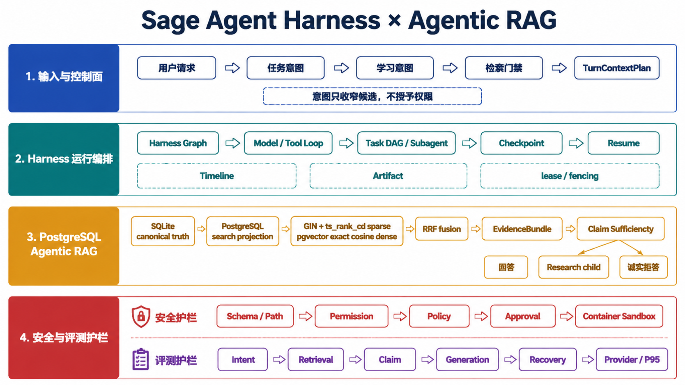
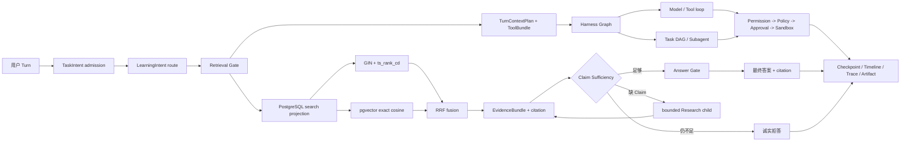

# Sage Harness × Agentic RAG 阶段总复盘 v1

> 日期：2026-08-10
> 集成基线：`dev/sage-v7@9b8c8de11a3e7debc7135cc01ad94b3562c87272`
> 范围：Harness 模块化、Context/Tool admission、Task DAG、PostgreSQL Agentic RAG、Eval 与 Sandbox 事实收口
> 目的：作为简历、架构图和面试准备的共同事实源，不替代各阶段 PRD 与机器报告

## 一句话结论

Sage 已从“一个能调用工具和知识库的 Agent”演进为一条可约束、可恢复、可评测的执行链：

```text
用户输入
  -> 任务/学习意图只收窄候选
  -> 不可变 TurnContextPlan 冻结本轮 scope
  -> Harness / Task DAG 有界编排模型、工具和子任务
  -> PostgreSQL hybrid RAG 产生 citation-bound EvidenceBundle
  -> Claim Sufficiency 决定回答、受控恢复或拒答
  -> Permission / Policy / Approval / Sandbox 约束副作用
  -> Checkpoint / Timeline / Trace / Artifact 支撑恢复与评测
```

最终架构图：



## 两条开发主线

### 1. Harness：把 Agent Loop 变成可治理的运行时

这轮 Harness 的核心不是增加更多 Agent，而是把“谁选择、谁授权、谁执行、谁记录”拆开。

| 工程问题 | 关键决策 | 当前结果 |
| --- | --- | --- |
| Sage 业务代码和 Agent Loop 相互耦合 | 通用能力收敛到 `packages/sage_harness`，Sage 产品层只通过 ports、middleware、capability registry 和 adapter 接入 | Model、Tool、MCP、Skill、Sandbox、Knowledge 可复用同一运行合同 |
| 意图判断容易被误当作权限判断 | `TaskIntentAnalyzer` 与 `LearningIntentRouter` 只做 admission，最多减少 Retrieval/ToolBundle 候选 | Permission、Policy、Approval、Sandbox 仍是最终权限边界 |
| Resume 时重新分析输入会产生 scope 漂移 | 使用不可变 `TurnContextPlan`、`plan_hash`、ToolBundle/MCP/Skill revision 和 scoped Checkpoint 恢复 | Plan、scope、catalog 或 binding 不匹配时 fail closed |
| 多子任务可能绕过预算或权限 | 主模型只提出 `task_dag` JSON；服务端校验 schema、依赖、环、profile、预算和 canonical hash，再按 ready wave 有界调度 | 最多 6 节点、并发 3；子任务继续复用原有 Permission/Policy/Approval/Sandbox |
| 前端断线容易被误判为任务取消 | Checkpoint 保存图状态，Timeline 保存可重放事件，lease/fencing 拒绝旧 writer，Artifact 保存大结果 | 订阅断开不等于 run 停止；Resume 不从 Timeline 反推权限 |

主要交付：

- [Harness 输入分层 PRD](../superpowers/specs/2026-08-08-sage-harness-input-layers-prd.md)：F1-F4 已合入，涵盖 ModelContextFrame、ToolBundle、MCP/Skill 生命周期和任务意图 admission。
- [Task DAG V1 PRD](../superpowers/specs/2026-08-09-sage-task-dag-v1-prd.md)：PR #138，服务端有界编排、预算预约、失败传播、Resume 与脱敏事件。
- Harness deterministic benchmark：10 个场景全部通过，task completion `1.0`、tool success `0.9375`、policy compliance `1.0`、本地 P95 `382 ms`；使用 `ScriptedApiClient`，不是线上 SLA。

### 2. RAG：从一次检索升级为证据充分性驱动的受控恢复

这轮 RAG 的核心不是“换一个向量库”，而是明确事实层、搜索投影、检索策略、证据门禁和恢复策略的边界。

| 工程问题 | 关键决策 | 当前结果 |
| --- | --- | --- |
| 本地事实和搜索索引混在一起，策略切换风险大 | SQLite 保留 source/revision/proposal/Wiki canonical truth；PostgreSQL 只做可重建 search projection | 索引损坏、Embedding 换代或策略切换不修改原始知识事实 |
| 中文语义与代码/术语关键词并存 | 产品质量路径默认 native `GIN + tsvector + ts_rank_cd` sparse、pgvector exact cosine dense、应用层 RRF | BM25 通过 `pg_textsearch` 保留为可插拔实验路线，不作为默认 |
| 首轮 Top-K 命中不等于回答所需 Claim 已找齐 | 使用 passage-bound Gold 与 Claim Sufficiency Gate 评估 EvidenceBundle | 证据足够才回答；缺 Claim 时进入有界恢复；仍不足则拒答 |
| Query Rewrite 可能提升召回，也可能增加延迟和意图漂移 | 保留原问题，仅对复杂问题评估一次受控 rewrite；当前先做 `oracle_manual` 上界消融 | 4 个困难 case Claim Coverage `0.4444 -> 0.8333`，但串行 P95 约增加 1.8 倍，因此仍是条件候选 |
| “向量多就应该上 HNSW”缺少真实门禁 | 在两本真实长书、5,220 chunks 上以 exact Top-10 为 oracle 测试 `halfvec` HNSW 四档 | 四档 Oracle Recall@10 都为 `1.0`，但无稳定延迟净收益，结论为 `keep_exact_hnsw_not_eligible` |

主要交付：

- [PostgreSQL 检索策略与端到端报告](book-learning-postgres-strategy-v1.md)：PR #140/#141，拆分 sparse、dense、fusion，确定 native hybrid 默认和 BM25 回退边界。
- [Query Rewrite 与 HNSW 门禁 PRD](../superpowers/specs/2026-08-10-sage-book-rag-query-rewrite-hnsw-prd.md)：PR #143，明确 Rewrite 与 ANN 的激活条件。
- [最终评测报告](book-learning-query-rewrite-hnsw-v1.md)：保存 Query Rewrite、exact/HNSW、延迟和 cleanup 收据。
- [PostgreSQL 检索实现](../../core/knowledge/postgres_retrieval.py)：可插拔 sparse/dense/fusion 合同与 exact/HNSW 评测入口。

## 合并后的完整执行链



## 评测证据与解释边界

| 证据 | 已验证结果 | 可以说明 | 不能说明 |
| --- | --- | --- | --- |
| 80-case versioned RAG Eval | 9 snapshots，`40/20/20`；语义候选相对 Hashing hybrid 的 Recall@10 `0.889 -> 1.000`、MRR `0.683 -> 0.806`、NDCG@10 `0.701 -> 0.852` | 固定语料上的检索与排序提升 | 线上答案准确率；test 没有 `semantic_paraphrase` |
| 14-case 长书 E2E seed | native hybrid Answer Correctness `0.6250`、Correct Abstention `1.0`、False Acceptance `0`、Recovery Gain `0.0833`、Provider Failure `2/14` | Eval 能暴露生成、恢复和 Provider 稳定性问题 | 生产准确率；Gold 仍为 `seed_manual` |
| 4-case Query Rewrite 消融 | Claim Coverage `0.4444 -> 0.8333`、Recall@10 `0.6111 -> 0.8889` | 人工改写的质量上界与延迟代价 | 真实模型 Rewrite 效果；不支持默认开启 |
| 5,220-chunk ANN 门禁 | exact P95 `101.878 ms`；HNSW 四档 Oracle Recall@10 `1.0` 但无稳定提速 | 当前规模应保留 exact | 生产 SLA；HNSW 已上线 |
| Harness benchmark | 10/10 场景，task completion/policy compliance `1.0` | Runtime + Tool Stack 的本地确定性回归 | 实时模型质量或公网服务 SLA |
| Sandbox live audit | 10/10 | Docker Desktop 下 Level 1 安全配置与行为 | 内核级逃逸证明或生产 rootless 已验收 |

PR #143 的可复核验证为：新增聚焦测试 `23 passed`、RAG/Knowledge + Harness 回归 `334 passed, 12 skipped`、完整门禁 `1956 passed, 12 skipped`，四项 GitHub checks 通过。合入后的其他定向数字如果没有报告或 PR 收据，不进入简历。

## 简历修改决策

旧版四条是 Harness、RAG、Context、Sandbox。当前建议改成：

1. **模块化 Harness 与有界编排**：突出 package boundary、不可变 Plan、Task DAG、恢复和权限复用。
2. **PostgreSQL Agentic RAG**：突出 canonical truth/search projection、hybrid、Claim Sufficiency 与受控 Research child。
3. **分层 Eval 与决策门禁**：突出 80-case、4+2 指标、Query Rewrite/HNSW/BM25 为什么没有盲目默认开启。
4. **Sandbox 纵深防御**：保留参数校验、Permission/Policy/Approval、容器约束和已知边界。

Context Budget、Artifact、Timeline 不删除，而是收进第一条 Harness；这样两页简历能把位置留给新的 RAG 与 Eval 决策。

完整候选文案见 [Sage 项目经历 v3](../resume/sage-project-experience-v3-draft.md)。

## 尚未完成的边界

- Query Rewrite 仍是 `oracle_manual` 离线候选，尚未接入真实模型复杂度 Gate。
- 14-case/15-claim Gold 仍是 `seed_manual`，需要扩大到 30-50 条并独立 review，再冻结 calibration/test。
- E2E Provider Failure 与 P95 仍高，Answer Correctness 未达到建议的 `0.8` 门槛。
- SQLite 是便携 canonical/default 路径；PostgreSQL 是真实长书与质量优先搜索投影，不能写成所有安装都强制依赖 PostgreSQL。
- workspace 仍为可写 bind mount；生产 image digest、生产 rootless live audit 和内核级隔离未完成。
- HNSW、BM25、Query Rewrite 都是通过门禁保留的候选，不是线上默认能力。
- 根目录 `.env` 的知识源路径、Web Search 与 PostgreSQL 测试配置存在本机漂移；联调前需单独校正，未改变本次代码与 CI 结论。

## 下一阶段：转入面试准备

工程阶段到这里停止继续堆 RAG 策略。下一阶段按以下顺序训练：

1. 30 秒讲清 Sage 解决什么问题、为什么需要 Harness；
2. 2 分钟讲清一次 Turn 从 admission 到 citation 的完整链路；
3. 闭卷解释五个关键决策：Harness 拆包、Plan/Checkpoint 边界、PostgreSQL hybrid、Query Rewrite 条件化、exact/HNSW 门禁；
4. 用现有失败数字回答“你们效果不好怎么办”，展示 Eval 归因而不是回避；
5. 最后再做压力追问：权限、安全、恢复、Gold 泄漏、Provider 方差和线上化边界。

题单见 [Sage Harness/RAG/Sandbox 面试准备](../resume/sage-harness-rag-interview-guide-v1.md)。
