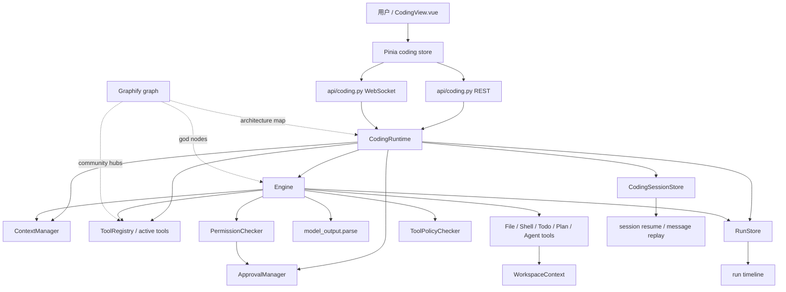

# Sage v3/v4 源码复盘与学习笔记

> 日期：2026-07-08
> 范围：Sage v3 实现提交 + Sage v4 runtime contract 设计提交
> 目标：把本轮开发从“提交列表”沉淀成可复习的架构笔记，并记录 Graphify 图谱刷新状态。

## 1. 本次复盘边界

本轮复盘覆盖当前 `main` 上从 Sage v3 到 Sage v4 设计段的提交。

关键边界：

| 段落 | 提交范围 | 性质 |
| --- | --- | --- |
| v3 前置 prompt | `df963ef`、`e590121` | Sage v3 目标与 tool search 方向补充 |
| Sage v3 实现 | `0ee8755..771fb21` | Coding runtime、工具系统、approval、run/session history、resume/replay、deferred tool search |
| Sage v4 设计 | `34b00fa..14a5dad` | Hermes-style runtime contract 设计与 v4.1 实施计划 |

本轮源码差异大致为：

- 55 个文件变化
- 约 7705 行新增、454 行删除
- 主体集中在 `core/coding/`、`api/coding.py`、`frontend/src/stores/coding.ts`、`frontend/src/components/*`、`tests/core/coding/*`、`tests/api/test_coding_routes.py`

需要注意：`826feef` 是项目重定位为 Sage Agent 的过渡提交；本复盘把它作为 v3 的背景，不算入 v3 实现主体。

## 2. 一句话总结

Sage v3 把网页端 Coding Agent 从“能跑工具调用”推进到“具备工作台生命周期”：它开始有稳定 prompt cache、可发现的工具元数据、审批安全闭环、run trace、session resume、message replay 和 deferred tool search。

Sage v4 不是继续堆功能，而是把 v3 中已经显现的边界问题提升为 runtime contract：事件要 typed，工具执行要从 Engine 拆出，前端 WebSocket 和事件归约要从大 store 中拆出。

## 3. 架构全景



v3 的主链路可以用这个路径记：

```text
frontend/src/views/CodingView.vue
-> frontend/src/stores/coding.ts
-> api/coding.py REST + WebSocket
-> core/coding/runtime.py::CodingRuntime.run_turn()
-> core/coding/engine.py::Engine.run_turn()
-> ContextManager.build()
-> model.complete()
-> model_output.parse()
-> PermissionChecker / ToolPolicyChecker / ApprovalManager
-> RegisteredTool.execute()
-> RunStore trace + SessionStore state
-> WebSocket event
-> coding store handleServerEvent()
```

## 4. Sage v3 学习重点

### 4.1 Prompt caching：把“省 token”变成 runtime 语义

核心文件：

- `core/coding/context_manager.py`
- `core/coding/runtime.py`
- `core/coding/compact.py`
- `tests/core/coding/test_context_compact.py`

v3 新增 `ContextManager.build_system_prompt_once()`，把 system prompt 拆成：

- stable：Sage 身份、工具指引、工具列表
- context：当前 workspace repository 上下文
- volatile：日期级 session date

关键学习点：

- prompt cache 不是简单 memoization，而是 session 生命周期的一部分。
- volatile tier 只用日期，不用分钟秒，避免每轮对话都破坏 prompt prefix cache。
- `compact()` 发生真实压缩时显式 `invalidate_system_prompt()`，说明“上下文变化”必须有清楚失效点。

这一段是 v4 runtime contract 的前奏：以后 tool activation、skill injection、memory refresh 都需要类似的失效语义。

### 4.2 工具系统装饰器化：从表驱动走向可发现插件

核心文件：

- `core/coding/tools/registry.py`
- `core/coding/tools/base.py`
- `core/coding/tools/file_tools.py`
- `core/coding/tools/shell_tool.py`
- `core/coding/tools/todo_tools.py`
- `core/coding/tools/plan_tools.py`
- `core/coding/tools/agent_tools.py`
- `tests/core/coding/test_tools.py`

v3 把原先集中在 `registry.py` 的工具实现拆成模块，并通过 `@register_tool(...)` 注册元数据：

- `category`
- `requires_approval`
- `timeout`
- `deferred`
- `schema_model`
- `handler`

学习点：

- 工具不再只是 callable，而是 runtime 可推理的对象。
- permission、approval、prompt injection、tool search 都依赖工具元数据。
- `registry.py` 现在更像 composition root：负责发现、校验、组装，而不是塞满具体工具逻辑。

### 4.3 Deferred tool search：降低 prompt 常驻工具压力

核心文件：

- `core/coding/tools/registry.py`
- `core/coding/engine.py`
- `core/coding/runtime.py`
- `tests/core/coding/test_engine.py`
- `tests/core/coding/test_todo_plan_worker_runtime.py`

v3 引入 Claude Code 风格的轻量工具发现：

- 常驻工具：`list_files`、`read_file`、`search`、`run_shell`、`write_file`、`patch_file`、`tool_search`
- deferred 工具：todo、plan、agent、worker 相关工具
- `tool_search` 命中后写入 session 级 `activated_tools`
- 下一轮模型请求才把完整 schema 注入 prompt
- resume 后保留已激活工具

学习点：

- 这是一种 prompt budget 管理方式，也是一种能力渐进披露机制。
- deferred tools 必须持久化到 session，否则 resume 后模型会忘记已经激活过的能力。
- 这也解释了为什么 tool registry 需要 `deferred` 元数据。

### 4.4 Approval：从“工具危险”到“运行时协商”

核心文件：

- `core/coding/approval.py`
- `core/coding/permissions.py`
- `core/coding/engine.py`
- `api/coding.py`
- `frontend/src/components/CodingApprovalCard.vue`
- `frontend/src/stores/coding.ts`
- `tests/core/coding/test_approval.py`
- `tests/api/test_coding_routes.py`

v3 的审批闭环包括：

- `ApprovalManager.submit()` 创建 pending approval
- `Engine` 发出 `approval_required` 事件
- 前端展示 approval card 和 diff preview
- REST `approval/respond` 决定 allow/deny/session/always
- `Engine` 等待 approval event，但通过 `asyncio.to_thread(..., 1.0)` 避免阻塞 event loop
- stop run 时 `cancel_session()` 唤醒 pending approval，避免后端挂住

学习点：

- approval 不是前端弹窗功能，而是 runtime 的暂停/继续协议。
- `run_shell` 的危险命令检测只是第一层；写文件、patch 文件的 diff preview 是第二层用户判断。
- `requires_approval=False` 让工具可以表达“它有副作用，但由更细策略治理”，这比只看 `risky` 更有弹性。

### 4.5 Run history：trace 从日志变成产品事实来源

核心文件：

- `core/coding/run_store.py`
- `api/coding.py`
- `frontend/src/components/CodingSidebar.vue`
- `tests/core/coding/test_run_store.py`

v3 把每次 run 的事件写入 `trace.jsonl`，再派生：

- run summary
- status
- event count
- tool count
- error count
- last event type
- readable timeline

学习点：

- trace 不是调试副产物，而是 UI、恢复、审计、后续评测都能复用的事实来源。
- timeline 层把 `model_requested`、`tool_call`、`tool_result`、`approval_required` 等原始事件翻译为可读 worklog。
- 这正是 v4 要 typed event 的原因：如果事件 shape 继续是松散 dict，trace 越重要，风险越高。

### 4.6 Session history / resume / replay：工作台生命周期闭环

核心文件：

- `core/coding/session_store.py`
- `core/coding/runtime.py`
- `api/coding.py`
- `frontend/src/components/CodingSidebar.vue`
- `frontend/src/stores/coding.ts`
- `tests/core/coding/test_session_store.py`
- `tests/core/coding/test_todo_plan_worker_runtime.py`

v3 补齐：

- 创建 session 时立即持久化
- session list
- runtime resume
- message replay
- new session
- session switch

学习点：

- resume 恢复的是可继续对话的 session 状态，不恢复运行中的 run 和 pending approval。
- replay 只恢复 user/assistant 消息，tool 轨迹由 run timeline 承担，这是正确的信息层级。
- API 对 persisted `workspace_root` 做边界校验，避免恢复到配置 workspace 外部。

### 4.7 前端工作台：功能齐了，但 store 已经变宽

核心文件：

- `frontend/src/stores/coding.ts`
- `frontend/src/components/CodingApprovalCard.vue`
- `frontend/src/components/CodingToolActivity.vue`
- `frontend/src/components/CodingSidebar.vue`
- `frontend/src/api/coding.ts`
- `frontend/src/types/api.ts`

v3 的前端收束了很多工作台能力：

- approval card + diff modal
- tool activity 摘要、折叠、截断、diff 高亮
- stop run
- session list / new session / resume
- run list / run detail timeline
- file tree cache
- git status refresh
- skills 搜索与分组

学习点：

- `coding.ts` 已经同时承担 socket lifecycle、event reduction、approval polling、workspace refresh、session/run 切换。
- v4 前端拆 `codingEvents.ts` 和 `codingStream.ts` 很合理，因为现在继续加 reconnect / reattach 会让 store 变脆。
- v3 的 UX 方向是“worklog 是 metadata，不抢 assistant final 的层级”，这和 Hermes WebUI 对照点一致。

## 5. Sage v4 学习重点

核心文档：

- `docs/superpowers/specs/2026-07-08-sage-v4-hermes-runtime-contract-design.md`
- `docs/superpowers/plans/2026-07-08-sage-v4.1-runtime-contract.md`

v4 的本质不是新功能，而是给 v3 已经跑通的功能建立契约。

### 5.1 后端 contract

目标：

- 新增 `core/coding/events.py`
- 定义 typed `RunEvent`
- `Engine` / `CodingRuntime` 统一通过事件构造函数产出 payload
- 新增 `core/coding/tool_executor.py`
- 从 `Engine._execute_tool_payload()` 拆出 permission、policy、approval、timeout、tool execution、result normalization
- `RunStore` 继续兼容 dict，但内部优先吃 typed event dump

关键原因：

- 当前 `Engine` 同时做模型循环、工具权限、审批等待、工具执行、event 构造，职责太宽。
- 当前事件是松散 dict，WebSocket、RunStore、前端类型依赖约定，缺少后端源头约束。
- trace 越成为产品事实来源，事件越需要类型契约。

### 5.2 前端 contract

目标：

- 新增 `frontend/src/stores/codingEvents.ts`
- 新增 `frontend/src/stores/codingStream.ts`
- `coding.ts` 保留公开 store API，但把事件归约和 socket 生命周期委托出去
- `frontend/src/types/api.ts` 对 event 增加可选 `run_id` / `created_at`

关键原因：

- 当前 store 已经是工作台大脑。
- session switch 时需要 stream ownership，不能让旧 run 事件覆盖新 UI。
- 后续 live run recovery / reconnect / reattach 都依赖更清楚的 event reducer。

## 6. Graphify 更新记录

本次已运行：

```bash
graphify update .
```

结果：

- 图谱刷新到当前 `HEAD`：`14a5dad6`
- `3353` nodes
- `5203` edges
- `469` communities
- `graphify-out/GRAPH_REPORT.md`
- `graphify-out/graph.json`
- `graphify-out/graph.html`

Graphify 报告中的核心节点：

| God node | 边数 | 复盘解读 |
| --- | ---: | --- |
| `Itinerary` | 87 | 旅游 Agent 旧主线仍是图谱中心之一 |
| `WorkspaceContext` | 76 | Coding Agent 的文件安全边界 |
| `create_app()` | 43 | API 组装入口 |
| `CodingRuntime` | 41 | v3 的 session 状态中枢 |
| `ToolResult` | 39 | 工具执行输出契约的当前核心 |
| `ContextManager` | 33 | prompt cache 和预算控制核心 |
| `RegisteredTool` | 31 | 工具元数据与执行边界 |

Graphify 也提示：

- 本机 Graphify package 是 `0.9.8`，skill 文档是 `0.8.46`
- `graphify update .` 是代码图谱增量更新，无 LLM token cost
- 文档、paper、image 的语义重抽需要 AI assistant 的 `/graphify --update` 语义路径，或配置 `GEMINI_API_KEY` / `GOOGLE_API_KEY`
- `graphify-out/` 被 `.gitignore` 忽略，所以本次图谱产物不会随本复盘文档一起提交

这意味着：本次仓库文档记录了 Graphify 更新结果，但没有把 2MB+ 图谱产物纳入 git。

## 7. 技术债与后续检查点

### 7.1 `Engine` 职责过宽

当前 `core/coding/engine.py` 仍然同时负责：

- prompt build
- model call
- model output parse
- tool payload normalize
- permission check
- policy check
- approval wait
- tool execution
- event dict construction
- history append

这是 v4 `ToolExecutor` 的主要拆分对象。

### 7.2 `RunStore` 的 session 归属还不够显式

当前 `CodingRuntime` 使用：

```python
self.run_store = RunStore(self.storage_root / "runs")
```

而 API 是：

```text
GET /api/v1/coding/{session_id}/runs
GET /api/v1/coding/{session_id}/runs/{run_id}
```

这意味着路由是 session-scoped，但 `RunStore` 根目录目前更像全局 `.coding/runs`。如果多个 session 共享同一个 storage root，后续应明确：

- run event 内是否必须包含 `session_id`
- list/get run 是否要按 session 过滤
- run 目录是否应按 session 分层

这不是 v3 立即失败的问题，但它是 v4 runtime contract 应该顺手解决或至少锁定测试的边界。

### 7.3 前端 store 需要拆分前先补 reducer 测试

`frontend/src/stores/coding.ts` 现在有大量状态变更副作用。v4 拆分前应该先用测试锁住这些行为：

- `model_requested` 更新 context chars
- `tool_call` 创建/追加 tool activity
- `tool_result` 更新 tool status，并触发 workspace refresh
- `approval_required` 设置 pending approval
- `final` / `cancelled` / `step_limit` 收束 assistant message
- session switch 时旧 socket 不能继续写状态

### 7.4 Graphify 语义图需要在 v4 实施后完整重抽

本次 `graphify update .` 刷新了代码图谱，但 v4 两个设计文档是文档语义节点，当前 CLI update 没有做语义重抽。v4.1 实现完成后，建议再跑一次完整语义路径，重点确认：

- `RunEvent`
- `ToolExecutor`
- `codingEvents.ts`
- `codingStream.ts`
- `RunStore`
- `SessionEventBus`

这些节点是否形成新的 community hub。

## 8. 复盘时可以这样学

建议学习顺序：

1. 先读 `docs/plans/08-SAGE-V3.md`，建立 v3 功能地图。
2. 再读 `core/coding/runtime.py`，理解 session 状态在哪里。
3. 读 `core/coding/engine.py`，理解一轮 turn 如何推进。
4. 读 `core/coding/tools/registry.py` 和几个 tool module，理解工具如何注册和执行。
5. 读 `core/coding/approval.py` + `frontend/src/components/CodingApprovalCard.vue`，理解审批闭环。
6. 读 `core/coding/run_store.py` + `frontend/src/components/CodingSidebar.vue`，理解 trace 如何变成 timeline。
7. 最后读 v4 设计文档，带着“Engine 过宽、store 过宽、event 太松”这三个问题看，它会非常顺。

最短心智模型：

```text
v3 = 让 Sage 可以像工作台一样跑起来、停下来、审阅、恢复、复盘。
v4 = 让这些能力不再靠约定拼在一起，而是拥有稳定事件契约和清晰执行边界。
```

## 9. 本轮提交建议

本轮新增的是复盘文档，不修改业务源码。建议提交信息：

```text
docs(sage): add v3-v4 retrospective notes
```
