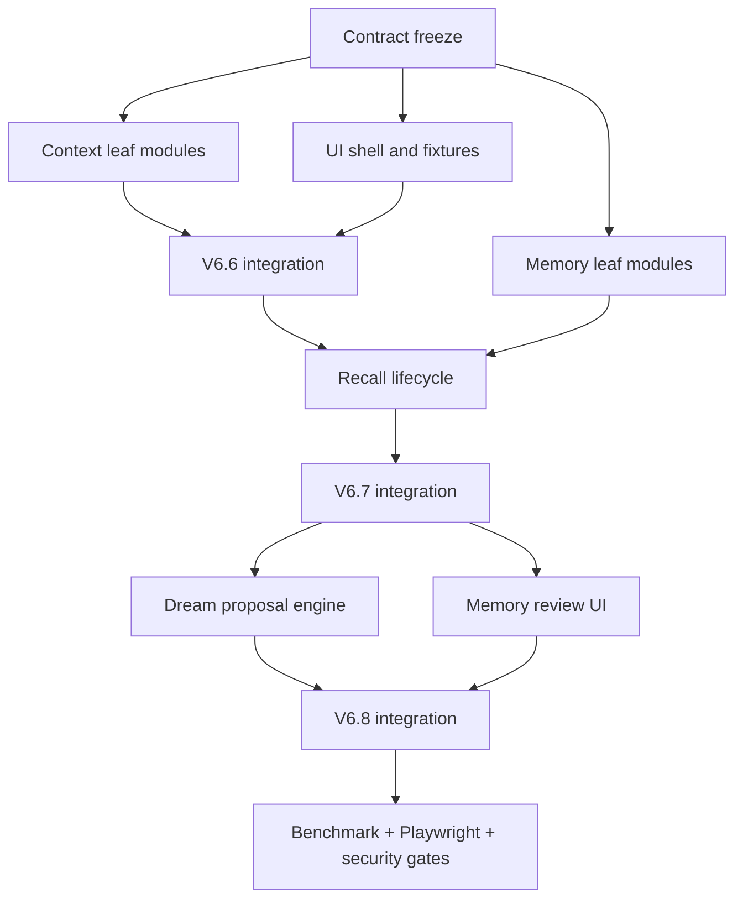

# Sage V6 Context and Memory Agent Orchestration Implementation Plan

> **For agentic workers:** REQUIRED SUB-SKILL: Use superpowers:subagent-driven-development (recommended) or superpowers:executing-plans to implement this plan task-by-task. Steps use checkbox (`- [ ]`) syntax for tracking.

**Goal:** Deliver V6.6-V6.8 through parallel agents without conflicting edits, while preserving one integration owner for runtime, API, events, and frontend composition.

**Architecture:** Three leaf agents build isolated Context, Memory/Dream, and UI modules in worktrees. One Integration Agent freezes contracts, owns all shared composition files, merges one tested slice at a time, and runs the cross-system verification gates.

**Tech Stack:** Git worktrees, Python 3.11, FastAPI, Pydantic v2, pytest, Vue 3, Pinia, TypeScript, Vitest, Playwright.

---

## Required Reading

- `docs/superpowers/specs/2026-07-11-sage-v6-context-memory-evolution-design.md`
- `docs/superpowers/plans/2026-07-11-sage-v6-context-compaction.md`
- `docs/superpowers/plans/2026-07-11-sage-v6-memory-lifecycle.md`
- `docs/superpowers/plans/2026-07-11-sage-v6-dream-reflection.md`
- `docs/superpowers/plans/2026-07-11-sage-v6-hermes-ui-alignment.md`

## Exclusive Ownership

Only the Integration Agent may modify these files during parallel waves:

```text
core/coding/runtime.py
core/coding/engine/engine.py
core/coding/engine/events.py
core/coding/context/__init__.py
core/coding/memory/__init__.py
core/coding/persistence/__init__.py
core/coding/tools/memory_tools.py
api/coding.py
api/schemas.py
frontend/src/views/CodingView.vue
frontend/src/stores/coding.ts
frontend/src/stores/codingEvents.ts
frontend/src/types/api.ts
frontend/src/components/coding/index.ts
frontend/src/main.ts
frontend/src/style.css
frontend/package.json
frontend/package-lock.json
```

Leaf agents may add new modules and focused tests in their assigned directories. They must not resolve conflicts by editing an exclusive file.

## Agent Map

| Agent | Owns | Must not edit |
| --- | --- | --- |
| A0 Integration | shared files, contract snapshots, merges, full verification | unrelated product modules |
| A1 Context | `core/coding/context/` new modules, transcript/tool artifact stores, context tests | Runtime/API/frontend shared files |
| A2 Memory/Dream | `core/coding/memory/` new modules, memory tests | Runtime/API/frontend shared files |
| A3 Studio UI | new leaf components, domain stores/APIs/types, coding tokens, component tests | `CodingView`, root coding store/event reducer, package files |
| A4 QA, second wave | benchmark scenarios, Playwright specs, security review notes | production behavior except narrow test hooks approved by A0 |

## Dependency Graph



### Task 1: Freeze Contracts and Baseline

**Files:**
- Modify: `docs/superpowers/specs/2026-07-11-sage-v6-context-memory-evolution-design.md`
- Create: `tests/contracts/coding_v6_contracts.json`
- Create: `tests/contracts/test_coding_v6_contracts.py`

- [ ] **Step 1: Record the baseline without changing it**

Run:

```bash
git status --short
git rev-parse HEAD
pytest tests/core/coding tests/api/test_coding_routes.py tests/evals/test_benchmark.py -q
cd frontend && npm run test -- --run
cd frontend && npm run build
```

Expected: existing unrelated changes remain listed; all baseline verification commands pass before feature branches are merged.

- [ ] **Step 2: Add a transport-neutral contract fixture**

Create `tests/contracts/coding_v6_contracts.json`:

```json
{
  "context_usage_updated": {
    "required": ["session_id", "run_id", "used_tokens", "model_limit_tokens", "output_reserve_tokens", "effective_limit_tokens", "usage_ratio", "level", "estimated", "compactable"]
  },
  "memory_proposal_ready": {
    "required": ["session_id", "run_id", "reflection_id", "proposal_id", "candidate_count", "base_revision"]
  }
}
```

Create `tests/contracts/test_coding_v6_contracts.py`:

```python
"""Cross-agent contract fixture tests."""

import json
from pathlib import Path


def test_contract_fixture_contains_required_domain_ids() -> None:
    path = Path("tests/contracts/coding_v6_contracts.json")
    contract = json.loads(path.read_text(encoding="utf-8"))
    assert "session_id" in contract["context_usage_updated"]["required"]
    assert "proposal_id" in contract["memory_proposal_ready"]["required"]
    assert "base_revision" in contract["memory_proposal_ready"]["required"]
```

- [ ] **Step 3: Run the fixture test**

Run:

```bash
pytest tests/contracts/test_coding_v6_contracts.py -q
```

Expected: PASS. Leaf agents use this fixture while production event classes are implemented in the integration branch.

- [ ] **Step 4: Commit the frozen contract test on the integration branch**

```bash
git add docs/superpowers/specs/2026-07-11-sage-v6-context-memory-evolution-design.md tests/contracts/coding_v6_contracts.json tests/contracts/test_coding_v6_contracts.py
git commit -m "test(sage-v6): freeze context and memory contracts"
```

### Task 2: Run Wave 1 in Three Worktrees

**Files:**
- Context worktree: files listed by the Context plan Tasks 1-4
- Memory worktree: files listed by the Memory plan Tasks 1-4
- UI worktree: files listed by the UI plan Tasks 1-3

- [ ] **Step 1: Create isolated worktrees**

Use the `using-git-worktrees` skill at execution time. Create branches with these names:

```text
codex/v6-context-core
codex/v6-memory-core
codex/v6-studio-ui-leaves
```

- [ ] **Step 2: Dispatch exact subplans**

```text
A1 -> 2026-07-11-sage-v6-context-compaction.md Tasks 1-4
A2 -> 2026-07-11-sage-v6-memory-lifecycle.md Tasks 1-4
A3 -> 2026-07-11-sage-v6-hermes-ui-alignment.md Tasks 1-3
```

- [ ] **Step 3: Require focused verification before review**

```bash
pytest tests/core/coding/test_context_budget.py tests/core/coding/test_context_projection.py tests/core/coding/test_context_compactor.py -q
pytest tests/core/coding/test_memory_store.py tests/core/coding/test_memory_working.py tests/core/coding/test_memory_recall.py -q
cd frontend && npm run test -- --run src/stores/codingContext.test.ts src/stores/codingMemory.test.ts
```

Expected: each command passes in its owning worktree.

- [ ] **Step 4: Review contracts before merge**

Reject a leaf branch if it changes an exclusive file, invents a different event name, writes memory without provenance, mutates raw transcript during compaction, or imports Hermes Studio source/assets.

### Task 3: Integrate V6.6 Context

**Files:**
- Modify: all backend exclusive files needed by the Context plan
- Modify: frontend exclusive files needed by the Context plan

- [ ] **Step 1: Merge the reviewed Context leaf commit**

Run the repository's normal non-interactive merge or cherry-pick flow. Resolve no behavior conflict by discarding user changes.

- [ ] **Step 2: Implement the shared-file adapter from Context plan Task 5**

The adapter must follow this order:

```python
prepared = await context_controller.on_turn_start(
    history=self.session["history"],
    user_message=user_message,
    run_id=run_id,
)
async for event in engine.run_turn(
    user_message,
    prepared_context=prepared,
    append_user=False,
):
    yield event
```

- [ ] **Step 3: Run V6.6 gates**

```bash
pytest tests/core/coding/test_context_*.py tests/core/coding/test_transcript_store.py tests/core/coding/test_tool_result_store.py -q
pytest tests/core/coding/test_engine.py tests/core/coding/test_runtime_run_lifecycle.py tests/api/test_coding_context_routes.py -q
cd frontend && npm run test -- --run src/stores/codingContext.test.ts
```

Expected: all pass; compaction failure tests prove raw transcript and active context are preserved.

- [ ] **Step 4: Commit V6.6 integration**

```bash
git add core/coding api tests frontend/src
git commit -m "feat(sage-v6): integrate safe context compaction"
```

### Task 4: Integrate V6.7 Memory Recall

**Files:**
- Modify: memory and integration files listed by the Memory plan

- [ ] **Step 1: Merge the reviewed Memory core commit**

- [ ] **Step 2: Connect current-turn working memory before Engine construction**

```python
memory_context = self.memory_manager.on_turn_start(
    current_user_message=user_message,
    session=self.session,
    runtime_mode=self.runtime_mode,
    permission_mode=self.permission_mode,
)
```

- [ ] **Step 3: Run V6.7 gates**

```bash
pytest tests/core/coding/test_memory_*.py tests/core/coding/test_runtime_memory_lifecycle.py -q
pytest tests/api/test_coding_memory_routes.py tests/evals/test_benchmark.py -q
cd frontend && npm run test -- --run src/stores/codingMemory.test.ts
```

Expected: relevant cross-session fact is recalled; unrelated/stale facts are absent; recall failure does not fail a run.

- [ ] **Step 4: Commit V6.7 integration**

```bash
git add core/coding api tests frontend/src
git commit -m "feat(sage-v6): integrate revisioned memory recall"
```

### Task 5: Run Wave 2 for Dream and Review UI

**Files:**
- Dream agent: files in Dream plan Tasks 1-4
- UI agent: files in UI plan Tasks 4-6
- QA agent: benchmark and Playwright files only

- [ ] **Step 1: Dispatch three bounded tasks**

```text
A1 -> Dream proposal store, policy, reflection runner, scheduler
A2 -> Memory proposal API fixture tests and benchmark scenarios
A3 -> Memory proposal UI, responsive inspector, Playwright fixtures
```

- [ ] **Step 2: Enforce the runtime-agent restriction**

The Dream runner must expose an empty tool list and must not import `WorkerManager`, `ToolExecutor`, shell tools, file tools, MCP, or skill tools.

- [ ] **Step 3: Integrate persist-before-event behavior**

```python
proposal = await self.memory_manager.request_reflection(evidence)
if proposal is not None:
    self.session_event_bus.emit(
        "memory_proposal_ready",
        {
            "session_id": proposal.session_id,
            "run_id": proposal.parent_run_id,
            "reflection_id": proposal.reflection_id,
            "proposal_id": proposal.proposal_id,
            "candidate_count": len(proposal.changes),
            "base_revision": proposal.base_revision,
        },
    )
```

The store call must complete before `emit`.

- [ ] **Step 4: Commit V6.8 integration**

```bash
git add core/coding api tests frontend
git commit -m "feat(sage-v6): add governed dream proposals"
```

### Task 6: Final QA and Documentation Reconciliation

**Files:**
- Modify: `docs/superpowers/specs/2026-07-11-sage-v6-context-memory-evolution-design.md`
- Modify: Obsidian learning notes named in the design handoff

- [ ] **Step 1: Run backend verification**

```bash
pytest tests/core/coding tests/api/test_coding_routes.py tests/api/test_coding_context_routes.py tests/api/test_coding_memory_routes.py tests/evals/test_benchmark.py -q
bash scripts/check.sh
python -m evals.coding.runner
```

Expected: all tests pass and the benchmark report includes context continuity and Dream governance metrics.

- [ ] **Step 2: Run frontend verification**

```bash
cd frontend && npm run test -- --run
cd frontend && npm run build
cd frontend && npx playwright test
```

Expected: unit tests, production build, desktop and mobile Playwright flows pass.

- [ ] **Step 3: Run security and data-loss review**

Verify:

```text
raw transcript survives summary failure
large tool artifacts cannot escape the session evidence root
memory rejects likely secrets and unprovenanced inference
stale proposal approval returns 409
background review never delays run_finished
mobile UI exposes both session rail and inspector
```

- [ ] **Step 4: Reconcile documentation with the implemented source**

Update status fields only after source and tests prove the behavior. Do not mark auto reflection enabled if the default flag remains false.

- [ ] **Step 5: Commit the verified milestone**

```bash
git add docs tests evals frontend/e2e
git commit -m "docs(sage-v6): verify context memory and dream milestone"
```
