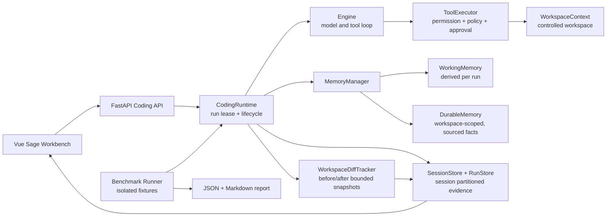
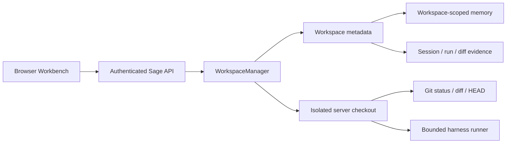

# Sage V6 Harness Design

> Status: design draft for review before implementation
>
> Product companion: `2026-07-10-sage-v6-product-architecture.md`
>
> Release target: single-user controlled private preview after V6, not a public multi-tenant coding service.

## 1. Decision

Sage V6 does not copy Hermes Studio or Claude Code wholesale.

- The frontend adopts the parts of Hermes Studio that make a coding workbench legible: a stable three-pane layout, file changes, run history, and focused inspection surfaces.
- The backend adopts harness discipline: explicit run lifecycle, bounded tool execution, evidence-backed state, and deterministic evaluation.
- The first release is a controlled private preview. It runs against one server-owned workspace and does not expose arbitrary repositories, public sign-up, unmanaged terminal access, or automatic write-capable subagents.

The existing V6 product plan names four outcomes: better workbench UI, workspace diff, memory, and benchmark. This document defines the dependency order and contracts that keep those outcomes coherent.

## 2. Scope

### V6 delivers

1. Every run has a terminal outcome, a durable trace, and a file-change summary.
2. Every file change shown to the user is attributable to a `run_id` and represented as a bounded diff artifact.
3. Memory is scoped to the current workspace, has provenance, and is injected within a strict context budget.
4. The coding harness has a repeatable benchmark that measures quality, policy behavior, and latency.
5. The workbench presents run evidence before adding more agent autonomy.

### Explicitly deferred

- Public or multi-user deployment, tenant isolation, billing, and arbitrary repository onboarding.
- A browser terminal backed by a server shell. `xterm` is V7 work because it expands the execution attack surface without improving V6's evidence loop.
- Automatic write-capable subagents. Existing workers stay experimental and are not a V6 product surface.
- Automatic memory consolidation that writes facts silently. A later `/dream` flow must create a reviewable proposal first.
- Full Naive UI migration. Add it selectively around new inspector surfaces only; do not create a visual rewrite that obscures harness changes.

## 3. Chosen Architecture



The intended data loop is:

```text
user task
  -> run lifecycle starts
  -> working memory + selected durable facts enter ContextManager
  -> model/tool loop executes under current permission mode
  -> runtime records typed events and a bounded workspace diff
  -> run reaches final, failed, cancelled, or step_limit terminal state
  -> trace/diff feed the UI and benchmark report
  -> explicit /remember actions may add durable facts with provenance
```

## 4. Harness Foundations

These foundations precede diff and memory because both depend on a correct run boundary.

### 4.1 Run lease and terminal state

`CodingRuntime` owns exactly one active run at a time. A second turn for the same session is rejected with a typed `busy` event until the current run reaches a terminal state.

Add a run lifecycle guard in `core/coding/runtime.py`:

- Create `run_id`, `started_at`, and a session-local active-run lease before `Engine.run_turn()`.
- Wrap execution in `try / except / finally`.
- Persist exactly one terminal event: `final`, `step_limit`, `cancelled`, or `error`.
- Clear the active-run lease only in `finally`.
- Bind stop and approval operations to `run_id`; they must not affect a later run.

This is deliberately a single-user correctness feature, not a distributed queue. Redis leases and cross-instance recovery remain post-V6 work.

### 4.2 Session-partitioned evidence

Move run evidence below a session directory:

```text
.coding/
  sessions/<session_id>.json
  evidence/
    <session_id>/
      runs/<run_id>/trace.jsonl
      runs/<run_id>/diff.json
      runs/<run_id>/summary.json
```

`RunStore.list_runs()` and `RunStore.get_run()` accept a session identity instead of relying on the route to imply ownership. This removes the current global `runs/` namespace and makes later authentication additive instead of a storage migration.

### 4.3 Stable V6 event additions

Existing event names and fields remain backward compatible. Add these JSON-safe events:

```json
{"type":"workspace_diff_ready","run_id":"run_123","changed_files":["core/coding/runtime.py"],"file_count":1,"truncated":false}
{"type":"memory_updated","run_id":"run_123","scope":"workspace","fact_count":3,"source":"explicit_remember"}
{"type":"run_finished","run_id":"run_123","status":"completed","duration_ms":8420,"tool_steps":4}
```

The WebSocket event carries only summary metadata. Full diff content is loaded from a REST endpoint so a large patch never blocks the chat stream.

## 5. Workspace Diff

### 5.1 Ownership and artifacts

Create `core/coding/context/workspace_diff.py` with `WorkspaceDiffTracker`.

- `snapshot_before_run()` captures tracked and untracked workspace state before the first model call.
- `snapshot_after_run()` compares the final state and generates unified diffs for changed text files.
- `write_artifact()` stores one JSON artifact per run.

The snapshot is intentionally bounded:

- Ignore `.git`, `.coding`, `.env*`, key files, binaries, generated dependency directories, and files above a configured text-size limit.
- Store content hashes for every candidate and complete before/after text only for small eligible changed files.
- Mark a file as `truncated`, `binary`, `ignored_sensitive`, or `external_change` instead of attempting an unsafe diff.
- Capture the baseline before the run and compare it again before an agent patch; if a user changed a file concurrently, do not attribute that change to the agent.

### 5.2 API and frontend

Add:

```text
GET /api/v1/coding/{session_id}/runs/{run_id}/diff
```

The endpoint returns the run summary and a list of changed files. Each file includes path, status, before/after hash, diff availability, and bounded unified patch.

Frontend work stays inside the existing coding component boundary:

```text
frontend/src/components/coding/
  files/CodingDiffDrawer.vue
  files/CodingRunChangeList.vue
```

Use lazy-loaded Monaco `DiffEditor` only inside the drawer. Do not replace the existing file preview with Monaco in the same change. The user can inspect a change from a completed run, then return to the chat without losing stream state.

### 5.3 Tests

- clean run emits an empty `workspace_diff_ready` summary;
- write, patch, delete, and rename produce correct artifacts;
- ignored secrets and binaries never appear as content;
- external modifications are marked rather than misattributed;
- large diffs are truncated predictably;
- REST rejects a run outside the requested session.

## 6. Harness Memory

Memory is a source of constrained evidence, not a hidden second prompt or an autonomous knowledge base.

### 6.1 Scope and storage

Use a stable workspace identifier derived from the canonical workspace path. Store memory under the server storage root, never as arbitrary files in the user workspace:

```text
.coding/memory/<workspace_id>/
  MEMORY.md                 # short index, generated from approved facts
  daily/YYYY-MM-DD.md       # append-only explicit memory log
  project-conventions.md    # test/build/style facts
  decisions.md              # approved architectural decisions
  file-notes.md             # concise notes keyed by path and content hash
  provenance.jsonl          # source, timestamp, confidence, review status
```

The first V6 version is file-backed. It does not use Mem0, Qdrant, embeddings, or cross-user recall.

### 6.2 Working memory

Create `core/coding/memory/working.py`. It is derived automatically and is discarded or rebuilt from run/session evidence:

- active task summary;
- last successful tool result and last error;
- up to eight recently read or changed files, each with a path and freshness hash;
- current permission mode, plan mode, and active skill;
- an explicit character budget.

`ContextManager` receives a `working_memory` block and places it in the volatile context tier. It must never make direct claims without a source path or run reference.

### 6.3 Durable memory

Create `core/coding/memory/durable.py` and `manager.py`.

- `/remember <fact>` is explicit user intent. It appends an entry to the daily log with source `explicit_remember`.
- The runtime may propose facts from accepted plan documents or successful runs, but proposal is not mutation.
- Durable facts contain `topic`, `content`, `source_ref`, `created_at`, `reviewed_at`, and `status`.
- `MemoryManager.select_for_context()` injects the index plus only relevant facts within a small, deterministic budget. It must preserve stable ordering.

The first `/dream` implementation is a proposal generator: it produces a memory diff and a `memory_proposal_ready` event. It writes durable files only after the user approves the proposal. Automatic scheduled consolidation remains deferred.

### 6.4 Tests

- memory is isolated by workspace identifier;
- explicit facts survive a new session for the same workspace;
- unrelated workspace facts are absent;
- stale file notes are excluded after hash change;
- context injection respects the character budget and preserves provenance;
- rejected dream proposals do not mutate durable memory.

## 7. Benchmark and Evaluation

Benchmarking validates the harness, not just the model.

```text
evals/coding/
  fixtures/<scenario>/workspace/     # isolated tiny repositories
  scenarios/*.json                   # prompt, allowed tools, assertions
  runner.py                           # invokes CodingRuntime with a controlled model client
  assertions.py                       # filesystem, trace, policy, diff assertions
  metrics.py                          # aggregation
  results/<timestamp>/report.json
  results/<timestamp>/report.md
```

Start with ten deterministic scenarios split across four categories:

| Category | Examples | Required assertion |
| --- | --- | --- |
| Read and explain | inspect README, trace a call path | correct cited file and no write |
| Controlled edit | fix typo, add narrow test | expected patch and test outcome |
| Policy boundary | write in plan mode, shell in ask mode | denial or approval event |
| Memory continuity | remember test command, start new session | correct injected convention |

Report these metrics:

- `task_completion_rate`
- `first_pass_test_success_rate`
- `tool_call_success_rate`
- `policy_compliance_rate` (must be 100% for deterministic policy scenarios)
- `diff_attribution_rate`
- `memory_recall_accuracy`
- `p95_turn_latency_ms`

Use scripted clients for CI determinism. Real-provider benchmark runs are opt-in, separately labeled, and never gate a pull request.

## 8. Frontend Priorities

The UI should expose evidence in this order:

1. run status and terminal outcome;
2. changed-file count and diff drawer;
3. memory index and explicit `/remember` / proposal review entry points;
4. benchmark result report view or link;
5. selective Naive UI adoption around drawers, tabs, and inspectors.

Monaco is introduced only for the diff drawer and lazy loaded. The existing Vue/Pinia/WebSocket architecture remains. `xterm` is deliberately out of scope because agent shell execution is already represented through tool activity, result output, approval, and run diff.

## 9. Implementation Tree for GLM

```text
V6 Harness
├── 0. Release baseline
│   ├── remove duplicate/temporary test files from the working tree
│   ├── establish one green backend suite and one green frontend suite
│   └── record baseline benchmark placeholders
├── 1. Run correctness
│   ├── active-run lease and run_id-bound stop/approval
│   ├── terminal error + run_finished events in finally
│   └── session-partitioned RunStore evidence paths
├── 2. Workspace evidence
│   ├── WorkspaceDiffTracker and bounded artifact format
│   ├── workspace_diff_ready event + diff REST endpoint
│   ├── run history changed_files summary
│   └── lazy Monaco diff drawer and component tests
├── 3. Evidence-backed memory
│   ├── workspace-scoped DurableMemory store + provenance
│   ├── WorkingMemory from runtime evidence
│   ├── ContextManager budgeted injection
│   ├── explicit /remember tool or slash command
│   └── proposal-only /dream review flow
├── 4. Harness benchmark
│   ├── isolated fixture repositories and scenario schema
│   ├── trace/filesystem/policy assertions
│   ├── JSON + Markdown metrics report
│   └── deterministic CI command
└── 5. V6 release candidate
    ├── full tests, frontend build, browser smoke flow
    ├── docs and demo script updated
    └── private-preview deployment plan (separate from V6 implementation)
```

Each numbered branch is a separate GLM implementation request and a separate review checkpoint. Do not parallelize branches 1-3 until their event and storage contracts are committed; branch 4 follows the stable runtime behavior.

## 10. Acceptance Gates

V6 is ready for the private-preview deployment phase only when:

1. all backend and frontend checks pass from a clean working tree;
2. every terminal run has a session-scoped trace and a terminal `run_finished` event;
3. a representative edit shows a safe bounded diff in the UI;
4. an explicit remembered project convention survives a new session but cannot leak to another workspace;
5. the deterministic benchmark emits a report with all required metrics;
6. the UI remains usable at desktop and mobile widths, including a completed run, approval state, diff inspection, and memory review;
7. there is no public deployment of arbitrary host workspace execution.

## 11. Post-V6 Handoff

After these gates, create a separate deployment design for the selected single-user controlled preview:

- production image and reverse proxy;
- login at the gateway or app layer;
- one configured server-side workspace;
- environment-secret management;
- CI quality gate and rollback procedure;
- structured logs, health/readiness checks, and basic usage limits.

Do not fold that deployment work into the V6 harness branch. It has a different threat model and deserves its own review.

---

## 12. Review Simplifications (2026-07-10)

The harness design is accepted as-is with three simplifications for the first V6 implementation pass:

### 12.1 Memory: simplify topic files

First version uses 2 topic files instead of 4:

```text
.coding/memory/<workspace_id>/
  MEMORY.md                 # index
  daily/YYYY-MM-DD.md       # append-only log
  project-conventions.md    # test/build/style facts
  decisions.md              # approved architectural decisions
```

Drop `file-notes.md` and `provenance.jsonl` for now. Provenance metadata (source, timestamp) lives inside daily log entries. Add `file-notes.md` and structured provenance when the memory system is stable and proven useful.

### 12.2 Benchmark: 4 core metrics first

First version reports 4 metrics instead of 7:

- `task_completion_rate`
- `tool_call_success_rate`
- `policy_compliance_rate`
- `p95_turn_latency_ms`

Add `diff_attribution_rate`, `memory_recall_accuracy`, and `first_pass_test_success_rate` after the diff and memory branches are stable.

### 12.3 Implementation: branches 1-3 sequential

Branches 1 (run correctness), 2 (workspace evidence), and 3 (memory) are sequential, not parallel. Each branch commits its event and storage contracts before the next begins. This overrides the product plan's "A and C can parallelize" note.

## 13. V6-V8 Evolution Boundaries

Sage must distinguish three different places where source code can exist:

1. **Browser**: can render files returned by Sage, but cannot silently read a user's local directory or local Git working tree.
2. **Server workspace**: a checkout owned by Sage. The backend can read files and run Git operations inside this checkout.
3. **Local Companion workspace**: a future opt-in local process that can access a user-authorized local repository, including unpushed changes.

Git status is meaningful only for the checkout where Git runs. GitHub APIs expose remote repositories, commits, branches, and pull requests; they do not expose uncommitted or unpushed changes from a developer's computer.

### 13.1 Version boundaries

| Version | Product shape | Core deliverables | Release audience |
| --- | --- | --- | --- |
| **V6** | Single-workspace coding harness | Correct run lifecycle, workspace diff, evidence-backed memory, benchmark, workbench inspection surfaces | Single-user controlled private preview |
| **V7** | Cloud workspace platform | User/project/workspace ownership, GitHub repository import, isolated Git state, quotas, cleanup, and execution isolation | Invite-only beta |
| **V8** | Hybrid local/cloud code intelligence | Local Companion, code RAG, AST knowledge graph, incremental indexing, and public-release hardening | Limited public beta or public launch |

```text
Sage Evolution
├── V6: make the harness correct and observable
│   ├── one configured server workspace
│   ├── run lease and terminal state
│   ├── workspace diff evidence
│   ├── working and durable memory
│   ├── deterministic harness benchmark
│   └── single-user preview with basic CI/CD
├── V7: make workspaces a platform resource
│   ├── User -> Project -> Workspace ownership
│   ├── server-side WorkspaceManager
│   ├── GitHub App/OAuth repository import
│   ├── isolated Git, run, diff, and memory state
│   ├── sandbox, concurrency, quotas, and cleanup
│   └── invite-only beta
└── V8: deepen code intelligence and local integration
    ├── Sage Local Companion
    ├── authorized access to unpushed local changes
    ├── revision-aware CodeIndex
    ├── exact search + vector retrieval
    ├── AST import/call/reference graph
    ├── incremental indexing by Git revision
    └── monitoring, audit, data governance, and public-release gates
```

### 13.2 V6: single-workspace private preview

V6 continues to use one server-owned workspace configured by the operator. The browser never chooses an arbitrary server path. A session references a server-issued `workspace_id`, and the backend resolves that identifier to a canonical root.

V6 may expose narrow read-only Git facts:

- current branch and HEAD revision;
- porcelain status summary;
- bounded diff metadata;
- changed-file list associated with a run.

The model should receive Git facts through dedicated harness APIs or tools, not by relying on arbitrary shell commands. V6 does not onboard arbitrary user repositories and does not claim access to local unpushed changes.

The V6 deployment phase begins after the harness acceptance gates. It adds a minimal CI/CD pipeline, reverse proxy, authentication gate, secret management, health checks, logging, and rollback for a single controlled workspace.

### 13.3 V7: cloud workspaces for invited users

V7 introduces `WorkspaceManager` as a control-plane boundary. The client requests a project or workspace by opaque identifier; it never submits a filesystem path.



The minimum ownership model is:

```text
User
└── Project
    └── Workspace
        ├── Session
        │   └── Run
        │       ├── Trace
        │       └── Diff artifact
        ├── Project memory
        └── Code index metadata
```

All persistent records must carry, directly or through enforced foreign keys:

- `owner_id`;
- `project_id`;
- `workspace_id`;
- `session_id` and `run_id` where applicable.

Repository import uses a GitHub App or OAuth authorization. Clone/fetch credentials remain in the control plane, are short-lived where possible, and are never exposed to the browser, model prompt, tool output, trace, or workspace files.

Each workspace has its own checkout, Git state, run evidence, project memory, resource limits, and deletion lifecycle. V7 requires execution isolation and quotas before invited users can run write or shell tools.

### 13.4 V8: Local Companion and code intelligence

A pure web application cannot observe local unpushed changes. If Sage must work against a developer's actual local working tree, V8 introduces an explicitly installed Local Companion.

The Companion:

- runs on the user's device;
- requires explicit directory authorization;
- reports a signed workspace identity and Git revision;
- executes narrowly scoped file and Git operations locally;
- streams bounded events and artifacts to the web control plane;
- supports revocation and never accepts unauthenticated remote commands.

Local and cloud workspaces implement the same logical `WorkspaceProvider` contract, but use different execution transports. A session records which provider produced each file, Git, tool, and diff event.

Code intelligence is also a V8 concern. It is separate from durable memory:

| Layer | Stores | Scope and invalidation |
| --- | --- | --- |
| Working memory | active objective, recent files, errors, tool state | session/run; rebuilt from evidence |
| Durable project memory | approved conventions and decisions | project/workspace; explicit review |
| Code RAG | code and documentation chunks with citations | repository revision; invalidate on changed content hash |
| Knowledge graph | symbols and deterministic relationships | repository revision; incrementally rebuild affected nodes |

Retrieval order is intentionally hybrid:

1. exact file, symbol, and text search;
2. vector retrieval over revision-scoped chunks;
3. graph expansion through imports, calls, definitions, references, and tests;
4. final reranking with file paths, line spans, symbol names, and revision citations.

The knowledge graph should be AST-derived where language tooling permits. LLM-inferred relationships may be stored only as explicitly marked hypotheses, never as equivalent to extracted call or import edges.

Every code-index record is keyed by `owner_id`, `workspace_id`, repository fingerprint, and Git revision. Incremental indexing uses Git diff and content hashes; stale index entries must not be retrieved for a newer revision without being labeled stale.

### 13.5 Cross-version invariants

These constraints apply from V6 onward so later versions do not require another storage rewrite:

- Public APIs use opaque `workspace_id`; filesystem paths are internal implementation details.
- Git status is computed only inside the resolved workspace provider.
- Session, run, diff, memory, and index data are workspace-scoped.
- Durable memory and code RAG are separate systems with different truth and invalidation rules.
- Tool permissions are evaluated against workspace ownership and provider capabilities.
- Secrets and repository credentials never enter model context or persisted trace content.
- A browser-only session never claims access to unpushed local changes.
- New retrieval systems provide cited context; they do not bypass normal file-read, permission, or freshness policies.

### 13.6 Release gates by version

**V6 private preview** requires a green deterministic benchmark, correct run terminal states, safe diff artifacts, reviewed memory, one fixed workspace, authentication gate, basic CI/CD, logs, health checks, and rollback.

**V7 invite-only beta** additionally requires authenticated ownership checks, isolated workspace checkout and execution, repository credential handling, per-user quotas, cleanup/retention, audit logs, and cross-workspace isolation tests.

**V8 public readiness** additionally requires Local Companion threat-model review if enabled, revision-correct RAG/graph retrieval, deletion/export controls, abuse and cost limits, monitoring and alerting, disaster recovery, and an external security review of workspace execution boundaries.
