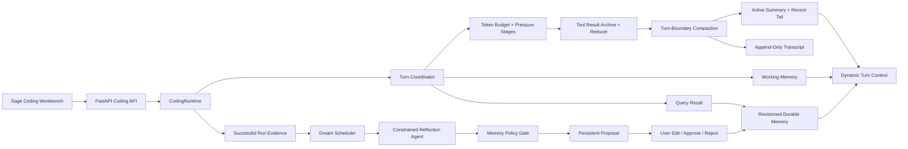

# Sage V6 Context, Memory, Dream, and Workbench Design

> Status: approved for implementation on 2026-07-11
>
> Chosen direction: Plan B, combining Claude Mini's staged context reduction, Hermes Agent's lifecycle boundaries, and OpenClaw's proposal-first governance.
>
> Baseline: `dev/sage-v6` at `2df978a`; this design extends, rather than replaces, `2026-07-10-sage-v6-harness-design.md`.

## 1. Decision

Sage will implement three separate loops instead of one all-purpose summarizer:

1. The context loop keeps the current coding task executable within a model's token window.
2. The memory loop recalls a small set of durable, sourced facts across sessions.
3. The Dream loop delegates reflection to a constrained child agent, but only produces reviewable proposals.

The original transcript remains the evidence source. A compact summary is a lossy handoff, not durable truth. Code RAG and the AST knowledge graph remain separate rebuildable indexes for V8.

The frontend will align with Hermes Studio's observable information architecture and interaction model through an independent Sage implementation. Hermes Studio source, CSS, assets, names, and brand material must not be copied into Sage. The reference repository is BSL 1.1 and commercial SaaS use requires a separate license until its 2029-05-10 change date.

## 2. Current Gaps

The current source has useful V6 foundations, but it does not yet implement the lifecycle in this document:

- `ContextManager` budgets characters, not model tokens.
- `CompactManager` is exercised by tests but is not wired into `CodingRuntime`.
- Session history is clipped during prompt rendering; it is not compacted into a resumable handoff.
- Tool results remain inline and large results have no durable artifact reference.
- Working memory is built before the current user message enters history, so its task summary points at the previous turn.
- Recent file hashes are empty, and durable recall is the first 2000 characters of `MEMORY.md`.
- Dream copies existing facts into an in-memory proposal and duplicates them when approved.
- Proposal approval is not bound to proposal ID, version, workspace revision, or a rollback transaction.
- The general `WorkerManager` lacks reliable cancellation, persistent parent-child traces, and continuous worker history. It is not an acceptable write-capable Dream executor.
- The frontend presents a fixed `60000 chars` ring, hides both side panels on mobile, and has no persistent Memory proposal review surface.

## 3. Non-Negotiable Invariants

1. Compaction never destroys or overwrites the canonical transcript.
2. Semantic compaction normally runs only at a user-turn boundary, before the first model request for that turn.
3. Tool calls and results are never split across a compaction boundary.
4. A failed summary leaves the active context unchanged.
5. Dynamic recall is untrusted data injected into the current turn, not into the frozen system prompt or persisted transcript.
6. Context summaries cannot promote themselves into durable memory.
7. Explicit `/remember` may write a sourced fact directly; every inferred fact requires a proposal.
8. Dream never auto-approves a proposal in V6.
9. Facts derivable from the repository, Git, RAG, or AST graph do not belong in durable memory.
10. REST/storage is the source of truth. WebSocket events are notifications and must be recoverable after reconnect.

## 4. Chosen Architecture



The user-facing loop is:

```text
user message
  -> build current working memory and start recall
  -> inspect token pressure
  -> compact completed old turns when the boundary threshold is reached
  -> assemble frozen prefix + skill + working memory + recall + active history
  -> execute model/tool loop with bounded tool artifacts
  -> persist terminal evidence
  -> optionally schedule non-blocking Dream reflection
  -> surface proposals independently from the main run
```

## 5. Persistence Layout

All data remains under the server storage root, not arbitrary files in the user's repository:

```text
.coding/
  sessions/<session_id>.json
  evidence/<session_id>/
    transcript.jsonl
    compactions/<compaction_id>.json
    runs/<run_id>/
      trace.jsonl
      diff.json
      tool-results/<tool_call_id>.txt
  memory/
    workspaces/<workspace_id>/
      state.json
      MEMORY.md
      project-conventions.md
      decisions.md
      daily/YYYY-MM-DD.md
      proposals/<proposal_id>.json
      reflections/<reflection_id>.json
    users/<user_id>/
      state.json
      MEMORY.md
```

`transcript.jsonl` is append-only and canonical. `sessions/<id>.json` contains only active resumable context and session state. Compaction artifacts record transcript sequence ranges and hashes so a summary can always be traced back to its inputs.

`state.json` is the canonical durable-memory state and contains facts, revision, committed transactions, and proposal-resolution records. Proposal/reflection JSON and human-readable Markdown files are recoverable views/artifacts. Every mutation uses a workspace lock, a temporary file, `fsync` where supported, and `os.replace`; startup reconciles proposal views from canonical state after an interrupted write.

### 5.1 Workspace identity

Path-only hashes are replaced with a scoped repository identity:

```text
workspace_id = sha256(scope_id + repository_identity)
```

For Git repositories, `repository_identity` is the normalized origin URL plus the root commit. This lets worktrees and moved checkouts share workspace memory. A non-Git workspace receives a persisted UUID in the Sage storage registry. V7 prepends the authenticated tenant/user scope so repositories with the same remote do not share memory across users.

## 6. Context Pipeline

### 6.1 Token budget

Every selectable coding model must expose an explicit `context_window_tokens`. Unknown models do not silently inherit a 200K window. Auto-compaction is disabled with a visible configuration error until a context window is configured.

```text
effective_limit = context_window_tokens - output_reserve_tokens
usage_ratio = estimated_input_tokens / effective_limit
```

The counter first calls a model-provided token counter when available. The fallback is a conservative UTF-8 byte estimate and must set `estimated=true` in events and UI.

### 6.2 Pressure stages

| Stage | Ratio of effective limit | Behavior |
| --- | ---: | --- |
| Normal | `< 0.50` | Keep eligible active history unchanged |
| Budget | `>= 0.50` | Historical tool previews capped at 30000 characters |
| Snip | `>= 0.60` | Remove duplicate old reads/searches; preserve latest 3 tool results |
| Auto compact | `>= 0.65` at turn boundary | Generate structured summary and rebuild active history |
| High pressure | `>= 0.70` mid-turn | Cap historical tool previews at 15000 characters |
| Cache override | `>= 0.75` | Permit prefix-affecting reduction even when provider cache is warm |
| Emergency | `>= 0.85` | Stop before another unsafe model call; preserve state for next-turn compaction |

Large tool output is externalized before any reduction. Results above 16 KiB are written to `tool-results/`; active history receives at most 200 lines and 12000 characters plus an artifact reference. Smaller results remain recoverable from the canonical transcript.

### 6.3 Compaction boundary and tail

- Auto-compaction runs before the first model request of a new user turn.
- Manual compaction is allowed only when `active_run_id` is empty.
- Mid-turn pressure may prune old tool previews, but cannot semantically summarize the active turn.
- The recent tail uses a token budget equal to 20% of the normal compaction threshold.
- At least 3 complete user turns are preserved verbatim, with a maximum of 12 turns.
- A turn and its tool items stay together.
- The latest user instruction always overrides historical summary text.

### 6.4 Structured summary

The compactor emits a validated object with these fields:

```text
goal
user_constraints[]
decisions[]
completed_work[]
active_todos[]
files_read[]
files_modified[]
tests[]
errors[]
artifact_refs[]
next_steps[]
source_transcript_range
source_run_ids[]
```

The previous compact summary is input to the next compaction, but the new artifact records both the previous summary and newly archived range. Summary output is bounded by `min(context_window * 5%, 12000 tokens)`.

Quality rules:

- schema validation is mandatory;
- referenced paths, todo IDs, test commands, and artifact IDs must exist in evidence;
- one repair attempt is allowed after a schema/quality failure;
- transient provider calls may retry at most 3 times;
- failed compaction preserves the original active history and starts a 60-second cooldown;
- two consecutive compactions saving less than 10% disable auto-compaction for the session and emit a warning.

## 7. Memory Lifecycle

### 7.1 Separate scopes

| Scope | Examples | Storage |
| --- | --- | --- |
| User | language, response preference, explicitly stated personal preference | `memory/users/<user_id>` |
| Workspace | build commands, architectural decisions, project conventions | `memory/workspaces/<workspace_id>` |
| Working | current goal, todo, recent files, last error/test | rebuilt per run |

The V6 local user ID is `local-user`. V7 replaces it with authenticated identity without changing the memory fact contract.

### 7.2 Fact model

```text
MemoryFact
  id
  scope
  topic
  content
  content_hash
  source_kind
  source_refs[]
  status: active | superseded | archived
  version
  supersedes?
  created_at
  reviewed_at
```

Facts require provenance. A source reference identifies a user statement, approved plan, or run event by session, run, event index, path, and evidence hash where applicable.

### 7.3 Working memory

Working memory is rebuilt with the current user message, not the previous session tail. It is limited to 2000 characters and contains:

- current request and active goal;
- current plan/todo identifiers;
- last successful tool result and last error;
- latest test command and result;
- up to 8 recently read/changed files with content hashes;
- permission mode, plan mode, and active skill;
- evidence references for every derived item.

Stale file notes are excluded when their content hash changes.

### 7.4 Query recall

V6.7 uses deterministic retrieval before adding a vector database:

- query = current user request + active goal + active skill;
- normalize English words and CJK character n-grams;
- score exact phrase, weighted overlap, topic prior, reviewed provenance, and freshness;
- exclude non-active facts, missing provenance, stale file facts, and suspected secrets;
- return at most 5 facts, 800 characters per fact, 4000 characters total;
- keep stable ordering by score, review time, creation time, and fact ID;
- fail open without blocking the coding run.

The generated `MEMORY.md` index may contain up to 200 lines/25 KiB on disk. The frozen session-start index block is capped at 2500 characters. Dynamic recall is wrapped as untrusted memory data in the current user turn and never persisted to history.

## 8. Dream Reflection

### 8.1 Dedicated child agent

Dream uses a dedicated `MemoryReflectionRunner`, not the current general `WorkerManager`.

The reflection child:

- receives an evidence bundle capped at 12000 characters;
- receives at most 10 evidence candidates and the current active fact headers;
- has no shell, filesystem, network, MCP, agent, remember, dream, or skill tools;
- cannot spawn another agent;
- runs one model call with a 30-second timeout and one schema repair attempt;
- emits candidate JSON only;
- never writes durable memory;
- records `reflection_id`, `parent_run_id`, input hashes, model, and outcome.

Repository text and tool output are explicitly fenced as untrusted data. Model-provided confidence is explanatory; the deterministic policy engine recomputes eligibility.

### 8.2 Trigger policy

Manual `/dream` is available after V6.8. Automatic reflection remains disabled by default until the benchmark gate passes.

When enabled, auto reflection requires all of the following:

- at least 3 successful runs or 6 new eligible evidence items since the last cursor;
- no active reflection job and no unresolved proposal;
- 30 minutes since the last reflection for the workspace;
- a completed run, not failed/cancelled/step-limit;
- no policy-denial evidence selected for promotion.

An approved plan or explicit user correction may trigger a proposal without waiting for 3 runs. A general inferred fact requires evidence from at least 2 independent run IDs. Candidates scoring below 0.70 are discarded. No score can auto-approve a candidate in V6.

### 8.3 Proposal model and state machine

```text
MemoryProposal
  proposal_id
  reflection_id
  workspace_id
  session_id
  parent_run_id
  trigger
  base_revision
  version
  status: pending | approved | rejected
  changes[]
  created_at
  resolved_at?

MemoryChange
  change_id
  operation: add | update | merge | archive
  fact_id?
  before?
  after
  reason
  evidence_refs[]
  confidence
  flags[]
```

Only pending proposals are editable. Approval uses optimistic concurrency against `base_revision` and proposal `version`. Approval produces one atomic `MemoryTransaction` with inverse changes. Repeating the same approve/reject/rollback request is idempotent. Rollback is allowed only for the latest unapplied revision chain and otherwise returns a conflict.

## 9. Event Contract

New events are typed and backward compatible:

```json
{"type":"context_usage_updated","session_id":"s1","run_id":"run_1","used_tokens":72000,"model_limit_tokens":200000,"output_reserve_tokens":20000,"effective_limit_tokens":180000,"usage_ratio":0.4,"level":"normal","estimated":true,"compactable":true}
{"type":"context_compaction_started","session_id":"s1","run_id":"","compaction_id":"cmp_1","trigger":"manual","before_tokens":128000}
{"type":"context_compaction_completed","session_id":"s1","run_id":"","compaction_id":"cmp_1","before_tokens":128000,"after_tokens":42000,"archived_items":86,"saved_ratio":0.672}
{"type":"context_compaction_failed","session_id":"s1","run_id":"","compaction_id":"cmp_1","reason":"summary_schema_invalid","preserved_original":true,"retryable":true}
{"type":"memory_reflection_started","session_id":"s1","run_id":"run_1","reflection_id":"ref_1","trigger":"manual"}
{"type":"memory_proposal_ready","session_id":"s1","run_id":"run_1","reflection_id":"ref_1","proposal_id":"memprop_1","candidate_count":3,"base_revision":7}
{"type":"memory_reflection_failed","session_id":"s1","run_id":"run_1","reflection_id":"ref_1","reason":"timeout"}
{"type":"memory_proposal_resolved","session_id":"s1","run_id":"","proposal_id":"memprop_1","status":"approved","memory_revision":8}
{"type":"memory_revision_rolled_back","session_id":"s1","run_id":"","transaction_id":"memtx_1","memory_revision":9}
```

Persistence happens before event emission. Reconnect sends the latest context snapshot and re-surfaces pending proposals from storage. Background memory events are session events, not events appended after a terminal `run_finished` in an already completed run trace.

## 10. API Contract

### Context

```text
GET  /api/v1/coding/{session_id}/context
POST /api/v1/coding/{session_id}/context/compact
```

Manual compact returns `409` while a run or another compaction is active. Unknown model context configuration returns `422` without modifying session state.

### Memory and Dream

```text
POST  /api/v1/coding/{session_id}/memory/reflections
GET   /api/v1/coding/{session_id}/memory
GET   /api/v1/coding/{session_id}/memory/facts
GET   /api/v1/coding/{session_id}/memory/proposals
GET   /api/v1/coding/{session_id}/memory/proposals/{proposal_id}
PATCH /api/v1/coding/{session_id}/memory/proposals/{proposal_id}
POST  /api/v1/coding/{session_id}/memory/proposals/{proposal_id}/approve
POST  /api/v1/coding/{session_id}/memory/proposals/{proposal_id}/reject
POST  /api/v1/coding/{session_id}/memory/transactions/{transaction_id}/rollback
```

All mutation bodies carry `expected_version` or `expected_revision`. Unknown resources return `404`, version conflicts return `409`, and invalid/sensitive edits return `422`. Existing proposal approve/reject endpoints remain as deprecated compatibility shims for one V6 increment and may only resolve a supplied proposal ID.

## 11. Workbench Alignment

Hermes Studio parity means equivalent user workflows, not source parity.

### 11.1 Desktop layout

- `>=1280px`: 248px session rail, flexible conversation, 440px resizable inspector.
- `960-1279px`: session rail remains; inspector becomes a right overlay.
- `<960px`: session rail and inspector are both available through header icon buttons.
- `<=768px`: both are full-screen sheets with safe-area handling and no horizontal overflow.
- Inspector width persists between 360px and 640px.

The inspector tabs are Files, Changes, Runs, and Memory. Terminal remains V7 because a public terminal requires sandboxed workspace execution.

### 11.2 Context and Dream states

The frontend renders backend token state and does not calculate pressure thresholds. Estimated counts are labeled. Compaction started/completed/failed notices remain in the run timeline even after transient banners collapse.

Dream review is independent of the main `isThinking` state. A proposal card shows action, topic, content, evidence, source run, confidence, conflict, and sensitive flags. Sensitive candidates are unchecked by default. The user can edit, approve selected, reject selected, or reject all.

### 11.3 Clean-room rule

Implementation agents receive this design, Sage fixtures, and Sage screenshots. They do not read or copy Hermes Studio source during implementation. Sage uses its own `--sage-*` design tokens, Lucide icons, Chinese copy, and assets. Playwright baselines compare Sage only against Sage's own approved screenshots.

## 12. Build-Time Agent Orchestration

There are two different concepts:

- Sol/Codex build agents develop Sage in isolated worktrees with file ownership and review checkpoints.
- Sage runtime agents execute user tasks. The V6 Dream child is a dedicated constrained reflection runner.

With four concurrent slots, one Integration Agent coordinates up to three leaf agents. Shared composition files are exclusive to the Integration Agent:

```text
core/coding/runtime.py
core/coding/engine/engine.py
core/coding/engine/events.py
api/coding.py
api/schemas.py
frontend/src/views/CodingView.vue
frontend/src/stores/coding.ts
frontend/src/stores/codingEvents.ts
frontend/src/types/api.ts
frontend/src/components/coding/index.ts
frontend/package.json
```

Leaf agents create focused modules and tests. They do not edit shared composition files. Integration occurs after each wave's focused tests pass, followed by contract review and full-suite verification.

## 13. Version Boundaries

| Increment | Goal | Required outcomes |
| --- | --- | --- |
| V6.6 | Context correctness | token budget, transcript archive, tool artifacts, staged pruning, safe compaction, context UI |
| V6.7 | Memory retrieval | stable workspace identity, revisioned store, current-turn working memory, relevant recall, Memory inspector |
| V6.8 | Dream and review closure | constrained reflection child, persistent proposals, edit/approve/reject/rollback, proposal UI, benchmark gates |
| V7 | Invited-user cloud workspaces | authentication, tenant isolation, GitHub import, sandbox, quotas, CI/CD, terminal |
| V8 | Local/cloud code intelligence | Local Companion, Code RAG, AST graph, incremental indexing, public hardening |

General write-capable worker autonomy is not required for V6.8. Reliable cancellation, parent-child run trees, resource quotas, and restart persistence are prerequisites before exposing broader autonomous subagents.

## 14. Evaluation Gates

V6.6 adds deterministic scenarios for:

- long multi-turn continuity after compaction;
- large tool result artifact recovery;
- summary failure preserving active history;
- tool group boundary preservation;
- two ineffective compactions tripping the circuit breaker;
- context cache rebuild only after compact/new session.

V6.7 adds:

- relevant fact selected instead of index prefix;
- unrelated fact excluded;
- current user message present in working memory;
- stale file hash excluded;
- cross-session recall with provenance and budget.

V6.8 adds:

- reflection cannot execute tools or mutate memory;
- injected repository text cannot bypass policy;
- inferred fact needs independent evidence;
- proposal survives restart and reconnect;
- approval is atomic/idempotent;
- reject does not mutate facts;
- rollback restores the exact prior revision;
- background review never delays `run_finished`.

Release requirements remain:

- policy compliance: 100% on deterministic policy scenarios;
- compaction continuity: 100% on deterministic compaction scenarios;
- memory proposal mutation before approval: 0 occurrences;
- transcript recovery after compaction failure: 100%;
- backend and frontend full suites green;
- production frontend build green;
- Playwright desktop/mobile flows free of overlap, inaccessible panels, and stale-event corruption.

## 15. Explicit Non-Goals

- No vector database or embedding dependency in V6.7.
- No Dream write to skills in V6.8.
- No automatic proposal approval.
- No public arbitrary repository path.
- No browser access to unpushed local files without the V8 Local Companion.
- No public terminal before V7 sandboxing.
- No claim that process-local background threads survive restart.

## 16. Implementation Plans

- `docs/superpowers/plans/2026-07-11-sage-v6-context-compaction.md`
- `docs/superpowers/plans/2026-07-11-sage-v6-memory-lifecycle.md`
- `docs/superpowers/plans/2026-07-11-sage-v6-dream-reflection.md`
- `docs/superpowers/plans/2026-07-11-sage-v6-hermes-ui-alignment.md`
- `docs/superpowers/plans/2026-07-11-sage-v6-agent-orchestration.md`

## 17. Primary References

- Claude Mini context: https://diwang.info/claude-code-from-scratch/#/docs/07-context
- Claude Mini memory: https://diwang.info/claude-code-from-scratch/#/docs/08-memory
- Hermes Agent context compressor: https://github.com/NousResearch/hermes-agent/blob/9de9c25f620ff7f1ce0fd5457d596052d5159596/agent/context_compressor.py
- Hermes Agent background review: https://github.com/NousResearch/hermes-agent/blob/9de9c25f620ff7f1ce0fd5457d596052d5159596/agent/background_review.py
- OpenClaw compaction: https://github.com/openclaw/openclaw/blob/7ac8e2e227a318f6f1acd7704b6d377ed6e99364/docs/concepts/compaction.md
- OpenClaw memory: https://github.com/openclaw/openclaw/blob/7ac8e2e227a318f6f1acd7704b6d377ed6e99364/docs/concepts/memory.md
- OpenClaw dreaming: https://github.com/openclaw/openclaw/blob/7ac8e2e227a318f6f1acd7704b6d377ed6e99364/docs/concepts/dreaming.md
- Hermes Studio license: https://github.com/EKKOLearnAI/hermes-studio/blob/01f3c78c3c97b12ed957fb7818a08376e9632f3c/LICENSE
