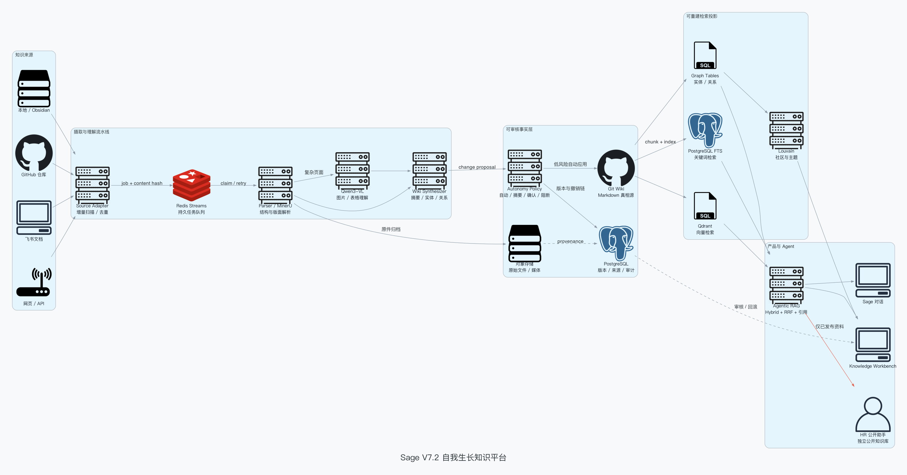

# Sage V7.2 自我生长知识平台总设计

> 日期：2026-07-15
>
> 基线：`dev/sage-v7@fdd7411`
>
> 状态：P2.1 已交付；P2.2-P2.4 待实施
>
> 视觉原型：`docs/assets/v7-2-knowledge-platform/sage-knowledge-workbench.html`

## 1. 产品结论

Sage V7 的核心卖点不是把 Coding Chat 搬到服务器，而是建立一个能够持续吸收项目、笔记和外部资料，并把学习结果沉淀为可追溯知识资产的个人助手。

这里的“自我成长”必须是工程上可验证的闭环：

```text
来源接入 -> 解析与理解 -> Wiki 更新 -> 检索使用
    ^                                  |
    |                                  v
撤销 / 纠错 <- 证据与反馈 <- 对话 / 实践 / 评测
```

它不是模型静默改写自己，也不是每次写入都要求用户逐条审核。默认采用 A 级自治策略：低风险自动应用且可撤销，中风险进入摘要，高风险才确认，泄漏私有数据的动作直接阻断。

## 2. 当前事实与交付边界

### 2.1 已交付的 P2.1

- 白名单 Obsidian Markdown 摄取；
- immutable raw snapshot 和 SHA-256 revision；
- SQLite proposal、event、page revision 审计；
- approve、reject、乐观锁冲突和 rollback proposal；
- Git Wiki、`index.md` 与 append-only `log.md` 投影；
- 前端单文件导入、diff、批准、拒绝和回滚入口；
- 生产环境在租户隔离完成前 fail closed。

以上事实来自 `core/knowledge/store.py`、`api/knowledge.py` 及相应测试。图谱、MinerU、多模态解析、向量检索和 HR RAG 仍是设计目标，不能描述为当前已上线能力。

### 2.2 本设计覆盖的后续阶段

| 阶段 | 核心结果 | 不提前引入 |
| --- | --- | --- |
| V7.2-P2.2 | 文件夹批量摄取、持久任务、结构化解析、两阶段 Wiki 综合、自治门限 | 图数据库、复杂 Agentic Search |
| V7.2-P2.3 | Chunk、PostgreSQL FTS、Qdrant、Hybrid + RRF、稳定引用、Benchmark | Elasticsearch、Milvus |
| V7.2-P2.4 | 实体关系、社区检测、知识图谱、知识缺口与受控深度研究 | Neo4j、Kafka |
| V7.3 | 对话反馈闭环、飞书知识源、Git 同步和持续进化评测 | 私有知识对外发布 |
| V7.4 | 独立 HR 公开资料包、公开 RAG Agent、限流与泄漏测试 | 访问私有工作区、会话或 Memory |

## 3. 设计原则

1. **Git Wiki 是知识真相源**：Markdown、来源 revision 和操作日志必须可读、可 diff、可回滚。
2. **索引只是投影**：全文、向量和图谱都可以从已批准 Wiki 重建，不能成为唯一事实副本。
3. **原件不可变**：原始文档、图片和解析结果按内容哈希归档，Wiki 引用稳定 source revision。
4. **默认自动，例外审核**：用户关注结果与异常，不维护审批队列。
5. **每个结论可追溯**：RAG 回答返回 page revision、source revision、片段和融合分数。
6. **能力可替换**：Parser、OCR、VLM、Embedding、VectorStore 和 GraphProjector 均通过窄接口接入。
7. **先单机可运维，再扩容**：V7 首发使用 Docker Compose、Redis Streams 和独立 Worker；数据与吞吐证明需要后再引入 Kafka、Kubernetes 或专用图数据库。

## 4. 自治门限

### 4.1 四级决策

| 等级 | 示例 | 默认动作 |
| --- | --- | --- |
| L0 阻断 | 密钥、私有会话或内部 Memory 进入公开库；跨租户写入 | 直接拒绝并审计 |
| L1 高风险 | 删除页面、跨主题合并、修改 `purpose.md/schema.md`、HR 发布 | 显式确认 |
| L2 中风险 | 大范围重写、来源冲突、低置信实体关系 | 自动应用到 draft，进入每日/每周摘要，可批量撤销 |
| L3 低风险 | 新来源摘要、追加引用、索引与图谱重建、格式修复 | 自动应用并提供撤销 |

### 4.2 风险评分输入

`AutonomyDecision` 至少考虑：

- `operation`：create/update/merge/delete/publish；
- `visibility_change`：private 到 public 的变更必须升为 L1；
- `scope`：受影响页面、段落和引用数量；
- `confidence`：解析与综合置信度；
- `source_conflict`：是否存在相互矛盾的高质量来源；
- `secret_scan` 与 `pii_scan`；
- `policy_change`：是否修改目的、Schema、权限或生命周期规则。

模型只能提供候选分类和置信度，最终门限由确定性 Policy Engine 强制执行。

### 4.3 撤销语义

“撤销”不执行 `git reset`。系统从目标历史 revision 生成一个反向 proposal，应用后形成新的 page revision 与 Git commit。这样既保留审计链，也支持索引按新 revision 增量更新。

## 5. 总体架构



### 5.1 事实层与投影层

| 层 | 存储 | 职责 |
| --- | --- | --- |
| 原件层 | 本地文件或 S3/OSS | 原始文件、图片、媒体和 parser 产物 |
| Wiki 真相层 | Git repository | Markdown 页面、purpose、schema、index、log |
| 控制元数据 | PostgreSQL；本地 P2.1 暂用 SQLite | source、job、proposal、revision、audit、tenant ownership |
| 任务队列 | Redis Streams | durable claim、ack、retry、dead letter 和进度事件 |
| 全文投影 | PostgreSQL FTS | 关键词召回和 metadata filtering |
| 向量投影 | Qdrant | dense retrieval 与 payload filter |
| 图谱投影 | PostgreSQL edge tables | entity、relation、community、evidence edge |

Qdrant 延续 Sage 当前已存在的 Docker 和 Python 客户端基础，避免再引入一套向量数据库。图谱首版使用 PostgreSQL 表与 Python 图算法，不把 Neo4j 作为 V7.2 上线依赖。

## 6. 多源摄取与异步任务

### 6.1 Source Adapter

统一接口：

```text
scan(cursor) -> SourceDescriptor[]
fetch(source_id, revision) -> ImmutableArtifact
ack(source_id, revision, status)
```

首批 adapter：

- `FilesystemAdapter`：本地目录和 Obsidian；
- `GitHubAdapter`：已授权仓库、commit 和文件 revision；
- `FeishuAdapter`：文档/知识库节点与 revision，V7.3 接入；
- `WebSourceAdapter`：用户明确保存的网页，不把临时搜索自动入库。

浏览器不能提交任意服务器绝对路径。云端只允许 tenant-owned source 与 workspace，所有原始文件保存前执行大小、类型、路径、符号链接、秘密和恶意内容检查。

### 6.2 任务状态机

```text
queued -> claimed -> parsing -> understanding -> synthesizing
      -> policy_check -> applying -> indexing -> completed
```

失败进入 `retry_wait`，超过上限进入 `dead_letter`。Worker 使用租约与心跳；同一 `source_revision + pipeline_version` 具备幂等键。每个阶段写进度事件，刷新或换浏览器后仍能恢复观察。

### 6.3 两阶段 Wiki 综合

1. **Source Understanding**：对单个来源生成结构化摘要、章节、表格、图片描述、实体与候选关系；
2. **Workspace Synthesis**：把新证据与现有 Wiki 合并，产生 page change set、引用和冲突说明。

两阶段分离可以让大批量来源并行解析，同时把跨来源综合限制在受影响页面，避免每次重写整个 Wiki。

## 7. Parser、MinerU 与视觉模型

### 7.1 解析路由

| 内容 | 默认路径 | 升级条件 |
| --- | --- | --- |
| Markdown/代码 | 原生 parser | 语法损坏或编码异常 |
| HTML | Readability + DOM 清洗 | 表格/公式/布局信息重要 |
| 文本 PDF | PDF parser | 读取顺序、表格或公式置信度低 |
| 扫描 PDF/复杂文档 | MinerU adapter | 默认进入异步重任务队列 |
| 图片/图表/截图 | Qwen3-VL Flash | 低置信、关键图或复杂表格升级 Plus |

MinerU 是可选 provider，不嵌入 canonical store。它输出统一 `ParsedDocument`，包括 block、page、bbox、text、media reference、parser version 和 confidence。

### 7.2 百炼视觉模型

默认选择固定版本 `qwen3-vl-flash-2026-01-22`，用于图片、截图、表格和 OCR 后语义校正；复杂图表、低置信页面和高风险公开内容升级到 `qwen3-vl-plus`。固定模型 revision 是为了让同一来源的解析可复现。

凭据从 macOS Keychain 或服务器 Secret 注入，只在 provider 进程可见；CSV 不进入仓库、浏览器、prompt、timeline、Wiki 或日志。

模型输出必须携带 `model_id/model_revision/prompt_version/input_revision`，以便后续重新解析与对比。

## 8. Chunk、向量与检索

### 8.1 Chunk 契约

`KnowledgeChunk` 至少包含：

```text
chunk_id, tenant_id, workspace_id, page_id, page_revision,
source_ids, heading_path, ordinal, text, token_count,
content_hash, visibility, language, embedding_model, embedding_revision
```

Chunk 优先按 Markdown heading、代码块、表格与语义段落切分，禁止只按固定字符截断。稳定 `chunk_id` 从 page revision、heading path、ordinal 和 content hash 派生。

### 8.2 Hybrid Retrieval

```text
query normalization
  -> PostgreSQL FTS top_n
  -> Qdrant dense top_n
  -> optional graph expansion
  -> Reciprocal Rank Fusion
  -> ownership / visibility / revision filter
  -> diversity + token budget assembly
  -> answer with stable citations
```

首版直接使用 RRF，不依赖不同检索器分数校准。回答中的 citation 必须绑定 `page_revision + source_revision`，页面变化后旧回答仍能复现当时证据。

### 8.3 Benchmark 门禁

建立 50 条起步 Golden Queries，至少覆盖项目事实、架构决策、跨文档组合、代码定位、时序变化、冲突来源和无答案场景。记录 `Recall@K`、`MRR`、`NDCG@10`、citation precision、faithfulness、P95 latency 和单查询成本。未通过 Benchmark 不宣称“Agentic RAG 提升准确率”。

## 9. 知识图谱与 Louvain

### 9.1 图模型

首版节点类型：`Page`、`Source`、`Project`、`Concept`、`Person`、`Decision`、`Tool`。边类型：`MENTIONS`、`RELATES_TO`、`DEPENDS_ON`、`SUPERSEDES`、`EVIDENCED_BY`、`CONTRADICTS`。

每条推断边必须记录 evidence chunk、模型 revision、置信度和创建 page revision。没有 evidence 的关系不得进入 verified 图谱。

### 9.2 社区检测

Louvain 运行在已批准图投影的快照上，用于发现主题社区和潜在知识结构，不直接修改 Wiki。社区结果包括 `graph_revision/algorithm_version/resolution/seed`；只有用户确认或确定性规则允许时，社区名称和链接才写回 Wiki。

### 9.3 知识缺口与 Deep Research

知识缺口由以下信号产生：低召回 Golden Query、孤立高价值节点、冲突未解决、重要主题缺少原始来源、页面长期未更新。Deep Research 先生成研究计划和预计来源域，用户确认后才执行 Web Search；搜索结果默认只用于当前答案，用户保存或策略允许后才进入摄取流水线。

## 10. 前端知识门面

设计基线采用四个稳定区域，并遵循 [`Sage Chat Harness 2.0`](./2026-07-16-sage-chat-harness-v2-design.md) 的共享工作台契约：

1. 深色产品栏：对话、知识、来源、搜索、图谱、审计、任务、设置；
2. 知识树：今日学习、自动沉淀、需确认和项目/概念/来源层级；
3. 主画布：图谱、搜索结果、来源或审核列表；
4. Workbench Dock：`Chat / 详情` 双标签；详情承载摘要、来源追溯、关联概念、最新学习与置信度。

桌面常驻可调整宽度、可收起的 Workbench Dock，平板和手机使用 Drawer 或底部标签；底部 Activity Bar 展示持久摄取任务。正文 15-16px，导航与元数据不低于 12px。颜色只承担状态和图社区，不用装饰渐变或卡片堆叠。

交互稿已覆盖：图谱节点选择、类型/社区着色、低风险撤销、高风险审核入口、任务展开、移动导航和移动详情面板。现有 Inspector 内容继续作为“详情”标签的实现基线；侧边 Chat、会话恢复和流式事件统一由 Chat Harness 2.0 提供。交互稿不代表后端图谱和 RAG 已交付。

## 11. HR 公开助手隔离

HR 助手不是私有 Sage 的一个 prompt，而是独立发布系统：

```text
private knowledge workspace
  -> publish proposal (L1)
  -> secret/PII/license scan
  -> immutable public package
  -> separate public index and public agent
```

公开助手只能访问：已发布项目概览、架构图、里程碑、技术复盘、演示和经筛选的公开问答。它不能访问私有 Session、Memory、Git 状态、未提交代码、内部工作区、原始 Obsidian Vault、密钥或私有 RAG。公开服务独立 token、独立 collection、只读权限、限流和泄漏测试。

## 12. P2.2-P2.4 实施顺序

### P2.2-A：持久任务与批量来源

- PostgreSQL knowledge metadata migration；
- Redis Streams job repository、lease、retry、cancel、dead letter；
- 文件夹扫描与内容哈希幂等；
- REST/WS job progress；
- 单机 Worker 与服务重启恢复测试。

验收：导入 1,000 个文件时前端可离开，服务重启后任务继续；重复导入不重复解析；失败文件可单独重试。

### P2.2-B：解析与 Wiki 自治

- `ParsedDocument` 与 parser registry；
- Markdown/HTML/PDF 基础 parser；
- MinerU adapter 和 Qwen3-VL provider；
- Source Understanding + Workspace Synthesis；
- Autonomy Policy、摘要和一键撤销。

验收：低风险来源自动形成 draft Wiki；高风险 publish/delete 不执行；任何应用都能追到 source/model/prompt revision。

### P2.3：Hybrid RAG

- heading-aware chunker 与 stable chunk ID；
- PostgreSQL FTS、Qdrant collection 与 outbox indexer；
- RRF、citation schema、context budget；
- Golden Queries 与离线报告；
- Chat `retrieve_knowledge` tool。

验收：索引可全量重建；跨租户和 visibility filter 在召回前生效；回答无 citation 不允许声称来自知识库。

### P2.4：Graph 与 Knowledge Workbench

- entity/relation extraction 与 evidence edge；
- Louvain snapshot、社区和 graph revision；
- Knowledge Graph API 与增量投影；
- 按本设计稿实现图谱、Inspector、审核和任务 UI；
- gap detection 与受控 research proposal。

验收：点击节点可查看稳定来源；社区结果可复现；删除/回滚页面后图投影最终一致；无证据关系不进入 verified 状态。

## 13. 服务器部署时间点

开发不等待服务器。推荐在 P2.2-A 完成后做第一次 staging 部署，因为届时持久队列、Worker、PostgreSQL migration、对象存储路径和重启恢复会真正影响部署拓扑。P2.1 只适合本地联调；P2.2-A 通过后部署可以尽早验证 Docker Compose、GitHub Actions、域名、反向代理、日志、备份和一键回滚。

首发拓扑：`reverse-proxy + api + frontend + worker + postgres + redis + qdrant + object-storage/volume`。单机阶段不做负载均衡；确认 API 无本地内存粘性、任务由队列持有、文件外置并完成压测后，再增加多个 API/Worker 副本和负载均衡。

## 14. 验收与安全清单

- 同一来源 revision 全链路幂等；
- Worker 崩溃、服务重启和网络短断可恢复；
- 每个自动写入都有 undo 与完整 provenance；
- 高风险和公开发布不允许模型绕过 Policy Engine；
- 密钥、私有路径和原文不进入日志、prompt、timeline 或公开索引；
- FTS、Qdrant 与图谱可从 Git Wiki 重建；
- Retrieval 在召回前执行 tenant、workspace 和 visibility filter；
- 引用固定 revision，旧回答可复现；
- 1,000 文件批量摄取、50 条 Golden Queries 和三视口 UI 回归通过；
- HR 公共索引通过 canary secret 泄漏测试和越权测试。

## 15. Clean-room 与参考边界

- Karpathy `llm-wiki.md` 只提供 Raw Sources、Wiki、Schema、Ingest/Query/Lint 等方法论参考；
- `nashsu/llm_wiki` 作为产品行为与交互参考，不复制 GPLv3 源码、CSS、资源或品牌；
- MinerU、Qdrant、百炼和 Louvain 均通过 Sage 自有契约接入；
- 视觉稿是 Sage 独立生成与实现，不包含 LLM Wiki 或 Hermes 的源码与品牌资产。
