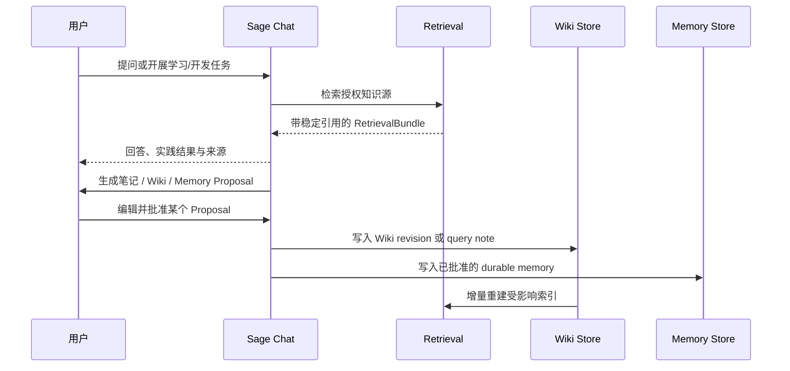

# Sage V7 个人助手、知识构建与受控进化设计

> 日期：2026-07-15  
> 分支：`dev/sage-v7`  
> 基线：`4de761b`  
> 状态：书面规格已确认，进入 V7-P1 实施

## 1. 背景与结论

Sage 已具备稳定的 Coding Chat、持久时间线、运行恢复、Context、Memory Proposal、Provider、工具过程与审批能力，但进入页面仍然表现为 Coding 工作台。首次进入时用户看到大面积空白，不知道 Sage 已连接哪些知识源、可以继续哪些项目、有哪些待确认的笔记或记忆，也无法直观看到“对话如何沉淀为长期知识”。

V7 的主产品正式定义为：

> **Sage Personal AI Learning Companion**  
> 一个连接个人项目、笔记和外部资料，通过检索、对话、实践、验证、复盘与人工批准持续形成知识资产的个人助手。

Coding Runtime 不删除，定位为个人助手中的 **Practice Engine**。它负责源码阅读、代码实验、测试和项目实践，但不再是首页唯一叙事。

本设计确定以下默认决策：

1. 首屏采用“左侧能力菜单 + 中间 Chat”的对话式个人主页；
2. 知识构建采用 LLM Wiki 式持久 Markdown Wiki，但保留独立的原始来源、索引和长期记忆边界；
3. RAG 首版采用 PostgreSQL 全文检索 + pgvector + RRF，不提前引入 Elasticsearch、Milvus、Neo4j 或 Kafka；
4. Dream/Reflection 只能生成 proposal，不能自动修改长期记忆或已验证 Wiki；
5. 飞书开发机器人与 Sage 产品机器人分离；
6. HR 门面只访问独立构建的公开资料包和公开索引；
7. 首次上云使用 Docker Compose + GitHub Actions + 单台服务器，不依赖 Kubernetes。

## 2. 当前能力清单

### 2.1 已交付能力

| 能力 | 当前事实 | V7 中的复用方式 |
| --- | --- | --- |
| Chat 与 Session | 路由化会话、历史列表、切换与恢复 | 作为个人助手的主交互区 |
| Timeline / Run | 事件持久化、replay、run reconnect、终态去重 | 作为检索、工具和实践过程的证据流 |
| Context | 上下文预算、压缩、checkpoint | 保持长期学习任务连续性 |
| Memory | SQLite canonical store、proposal、批准/拒绝 | 保存用户确认过的稳定事实与约束 |
| Tool / Approval | 工具调用、权限模式、审批与结果回放 | 约束 Web Search、知识写入和 Coding Practice |
| Provider | 账户级模型、加密密钥、模型能力与用量 | 为 Chat、摄取、检索重排和反思选择模型 |
| Settings | Provider、Skills、MCP、Memory、Context、Runs | 保留高级配置入口，不常驻首页 |
| Git / Workspace | 当前工作区、Git 状态、文件与 Diff | 作为项目知识源和实践环境 |
| Auth / Control Plane | GitHub OAuth、邀请制、Project/Workspace ownership | 为后续服务器与公开 HR 门面提供身份边界 |

### 2.2 尚未交付能力

- 个人助手首页与知识状态摘要；
- `KnowledgeWorkspace`、`KnowledgeSource` 和持久摄取队列；
- LLM Wiki 式 Markdown 产物与版本管理；
- Sparse/Dense Hybrid Retrieval、RRF、引用与检索评测；
- 对话保存为笔记、Wiki 更新提案与 Lint；
- 飞书开发机器人与产品机器人；
- HR 公开资料包、独立公开索引与公开问答；
- Docker sandbox、持久任务队列和一键部署。

设计项不能描述为当前已上线能力。

## 3. 产品信息架构

### 3.1 左侧菜单

桌面端保持约 228px 的稳定左栏：

1. **今天**：个人助手首页；
2. **历史对话**：现有 Session 列表；
3. **项目**：GitHub/工作区与学习项目；
4. **知识库**：来源、Wiki 页面、搜索、摄取状态；
5. **成长记录**：笔记提案、Memory Proposal、Learning Evidence；
6. **公开主页**：HR 资料发布预览；
7. **设置**：Provider、Skills、MCP、Memory、Context、运行与安全。

移动端左栏变成全屏 Sheet。菜单只负责导航，不把每个模块都常驻在聊天页面。

### 3.2 中间主区域

首次进入 `/assistant` 时显示：

- 当前日期与知识同步状态；
- 主 Composer；
- 继续最近项目、学习主题和整理笔记的快捷入口；
- 最近进行中的项目与学习任务；
- 待确认的笔记、Wiki 更新和 Memory Proposal。

发出消息后进入现有 `/coding/session/:sessionId` 时间线。现有用户消息、助手正文、Run Trace、Tool、Approval、Plan、Diff 与停止能力继续复用。

首页不是营销 Landing Page，也不是知识图谱 Dashboard。图谱、索引参数和摄取日志只在用户主动进入知识库或活动面板时展示。

### 3.3 状态色

视觉保持中性工作台基调，同时让颜色承担稳定语义：

| 颜色 | 用途 |
| --- | --- |
| Sage Green | 已连接、已同步、已批准、可继续 |
| Source Blue | 检索、引用、来源、Wiki 更新 |
| Review Yellow | 待确认笔记、记忆和研究提案 |
| Coral Red | 权限阻止、失败、秘密或风险 |
| Neutral Gray | 普通导航、正文、边框和空状态 |

不使用装饰性渐变、彩色背景块或大面积单一绿色。暗色模式复用现有 Token 系统。

## 4. LLM Wiki 式知识构建

### 4.1 借鉴边界

本设计借鉴 [Karpathy LLM Wiki pattern](https://gist.github.com/karpathy/442a6bf555914893e9891c11519de94f) 的公开方法：原始来源、Wiki、Schema 三层，`Ingest / Query / Lint` 三种操作，`index.md`、`log.md`、YAML frontmatter 与 `[[wikilink]]`。

[nashsu/llm_wiki](https://github.com/nashsu/llm_wiki) 是 GPLv3 项目，其当前形态是 TypeScript 桌面应用与 Rust 后端 Agent 的组合。Sage 只参考其公开呈现的产品行为，例如两阶段摄取、持久队列、来源追溯和 Wiki 维护流程，不复制其源码、UI、资源或实现细节；所有数据契约与代码均按 Sage 需求独立实现。

### 4.2 每个 KnowledgeWorkspace 的逻辑结构

```text
knowledge-workspace/
├── purpose.md                 # 这个知识空间为什么存在
├── schema.md                  # 页面类型、命名、写入和审核规则
├── index.md                   # 页面目录和一行摘要
├── overview.md                # 当前综合概览
├── log.md                     # append-only 操作记录
├── raw/
│   └── sources/               # 不可变来源或来源快照
├── wiki/
│   ├── sources/               # 单来源摘要
│   ├── projects/              # 项目页面
│   ├── concepts/              # 概念页面
│   ├── decisions/             # 架构与产品决策
│   ├── queries/               # 用户确认保存的高价值回答
│   └── learning/              # 学习主题、练习和复盘
├── reviews/                   # 待人工处理的 Wiki 更新提案
└── exports/                   # Obsidian/公开资料包导出
```

本地版可以导出为 Obsidian Vault。云端版的 canonical metadata 存 PostgreSQL，原始文件与 Markdown 版本存受控对象/文件存储；检索索引可以重建，不能反过来成为唯一真相。

### 4.3 Wiki 页面 frontmatter

```yaml
id: page_uuid
type: concept
title: Agent Harness
status: draft
visibility: private
sources:
  - source_id: source_uuid
    revision: sha256
created_at: 2026-07-15T00:00:00Z
updated_at: 2026-07-15T00:00:00Z
revision: 3
```

`status` 使用 `draft | verified | superseded`。`visibility` 使用 `private | public_candidate | published`。模型生成的置信度不能替代来源和人工审核状态。

### 4.4 五种操作

1. **Ingest**：来源归一化、哈希、分析、生成/更新 Wiki Proposal；
2. **Query**：Sparse/Dense 检索、RRF、预算控制、回答与引用；
3. **Save**：将高价值回答生成 Note/Wiki Proposal；
4. **Lint**：检查矛盾、孤立页面、过期来源、缺失链接和秘密；
5. **Publish**：从已验证页面生成 versioned public package。

所有写操作必须先产生 diff 或 proposal。Ingest 可以自动写入 `draft`，但不能把推断页面自动标记为 `verified`。

## 5. RAG 与工具扩展

### 5.1 首版检索管线

```text
query
  -> query normalization / multi-query（可选）
  -> PostgreSQL full-text sparse retrieval
  -> pgvector dense retrieval
  -> RRF fusion
  -> metadata / ownership / visibility filtering
  -> context budget assembly
  -> answer with stable citations
```

首版不声称 PostgreSQL FTS 就是严格 BM25。若离线 Benchmark 证明 sparse ranking 不足，再评估 ParadeDB/Elasticsearch；若向量规模或吞吐证明 pgvector 不足，再评估 Qdrant/Milvus；若图查询成为主瓶颈，再评估 Neo4j。

### 5.2 Retrieval Tool 契约

```text
retrieve_knowledge(
  workspace_id,
  query,
  source_types,
  visibility,
  top_k,
  token_budget
) -> RetrievalBundle
```

`RetrievalBundle` 必须包含 stable citation ID、source revision、片段、分路分数和融合顺序。Prompt 中的引用不能只依赖临时数组下标。

### 5.3 Web Search

Web Search 是外部工具，不是默认可信知识源：

1. Agent 可以检索网页并在当前回答中引用；
2. 用户点击“保存为来源”后才创建 `KnowledgeSource`；
3. 保存时记录 URL、抓取时间、内容哈希、标题和许可提示；
4. 网页内容按不可信输入处理，隔离其中的 prompt injection；
5. Deep Research 的搜索主题和查询必须先展示给用户确认。

### 5.4 Skills 与 MCP

- Skills 决定工作流，例如“学习源码”“费曼讲解”“整理项目复盘”；
- MCP 提供外部工具和数据，例如飞书文档、GitHub、网页搜索；
- RAG 提供知识检索，不负责授权工具；
- `allowed_tools` 继续在执行层强制执行；
- 外部 Skill/MCP 不能通过文档内容自行扩大权限。

## 6. 对话到知识的受控进化



必须区分：

| 产物 | 保存内容 | 是否自动批准 |
| --- | --- | --- |
| Query Note | 有价值的回答、引用与用户补充 | 否 |
| Wiki Proposal | 页面新增、修改、链接或矛盾处理 | 否 |
| Memory Proposal | 用户目标、偏好、稳定约束和已确认事实 | 否 |
| Learning Evidence | 测验、解释、代码实验、测试和项目产物 | 自动记录证据，状态变化仍需评估 |
| Index Update | 已批准页面的 sparse/dense 索引 | 可以自动重建 |

“自我进化”对外描述为：系统能持续提出、审核、写入并评测知识更新，而不是模型能静默修改自己。

## 7. 飞书双通道设计

### 7.1 开发机器人（外部集成边界）

第一阶段复用 [cc-connect 飞书长连接](https://github.com/chenhg5/cc-connect/blob/main/docs/feishu.md)：

```text
指定飞书私有群
  -> cc-connect WebSocket（无需公网 IP）
  -> Codex CLI Agent
  -> per-thread session
  -> per-task worktree / codex/* branch
  -> 测试、diff、结果和审批回传飞书
```

权限采用受控开发模式：

- 仅指定 `open_id` 和指定群；
- 必须 `@机器人`；
- `thread_isolation = true`；
- 可以读取状态、修改短期分支和运行白名单测试；
- 提交、合并、危险 shell、部署和生产数据操作必须单独批准；
- 禁止直接修改 `main`；
- 飞书对话不自动进入个人知识库。

这里的“Codex”是由 cc-connect 启动的 Codex CLI 会话，不是自动接管当前 Codex Desktop 任务。两者通过 Git、设计文档和持久任务状态交接。cc-connect 的安装、飞书应用配置与联调由用户独立完成，不作为 Sage V7-P1 至 P3 的代码交付物；Sage 只在后续需要产品审批或公开 API 时提供稳定接口。

### 7.2 Sage 产品机器人

产品机器人只访问 Sage API：

- 私人问答与知识检索；
- 查看项目/摄取状态；
- 使用飞书卡片批准 Note/Wiki/Memory Proposal；
- 后续可连接飞书文档作为显式 `KnowledgeSource`；
- 不获得 shell、Git 合并或部署权限。

开发机器人和产品机器人使用不同飞书应用、凭据、allowlist 与审计记录。

## 8. HR 公开门面

HR Agent 不是私有 Sage 的一个查询过滤器，而是独立发布产物：

```text
Private KnowledgeWorkspace
  -> 用户选择 public_candidate 页面
  -> secret / PII / license scan
  -> versioned PublishedPackage manifest
  -> 独立 public index + 独立数据库凭据
  -> HR Chat / 项目页 / 架构图 / 里程碑 / 引用
```

公开 Agent 永远不能访问：私有 Session、Memory、Git 凭据、工作区文件、未发布 Wiki、内部 RAG、运行日志或 Provider 密钥。

公开回答必须：

- 提供可点击来源；
- 区分事实、设计目标和未实现计划；
- 不回答资料包以外的私人问题；
- 支持撤回一个 PublishedPackage 并重建公开索引；
- 记录公开查询与滥用限流，不记录敏感原始 prompt。

## 9. 部署与一键上线

首台阿里云服务器采用 Docker Compose：

```text
Caddy / Nginx
  -> Sage Web
  -> Sage API
  -> Worker
  -> PostgreSQL + pgvector
  -> Redis（任务队列/事件，不保存 canonical 知识）
  -> workspace / knowledge volumes
```

一键部署目标：

1. `docker compose up -d` 能从空服务器启动；
2. GitHub Actions 执行测试、构建镜像、推送 registry；
3. 通过受限 SSH deploy user 拉取指定版本并执行 migration；
4. 健康检查通过后切换服务；
5. 失败自动回滚到上一镜像 tag；
6. PostgreSQL、知识文件和配置有定时备份与恢复演练；
7. 密钥只通过服务器 Secret/Environment 注入，不进入仓库或 Actions 日志。

首发不引入 Kubernetes。出现多实例、任务吞吐或故障域需求后再评估。

## 10. 分阶段路线

### V7-P1：个人助手门面与知识引导

用户价值：进入 Sage 即可看到项目、知识源、最近任务和待确认沉淀；Chat 仍是主体验。

范围：

- `/assistant` 首页与左侧菜单；
- `AssistantHomeSummary` 只返回真实数据，不使用生产假数据；
- 知识库空状态和来源引导；
- 复用现有 Chat、Session、Provider、Run Trace；
- 设计 Token 色彩扩展与三视口验收。

不包含：真实 embedding、Wiki 自动写入、飞书或 HR Agent。

### V7-P2：KnowledgeWorkspace 与 Wiki Ingest

- `KnowledgeWorkspace`、`KnowledgeSource`、`SourceRevision`；
- Markdown/Obsidian/GitHub 来源；
- 持久摄取队列、哈希去重、取消、重试和恢复；
- Wiki Draft、index/log、来源追溯和 diff review。

### V7-P3：Hybrid RAG 与 Benchmark

- PostgreSQL FTS + pgvector + RRF；
- citation contract、上下文预算与删除传播；
- Golden Queries、Recall@K、MRR、NDCG@K、citation correctness；
- Web Search 保存为来源。

### V7-P4：受控进化与飞书产品通道

- Query Note、Wiki Proposal、Memory Proposal 统一审核体验；
- 飞书产品机器人卡片审批；
- 为外部 cc-connect 开发机器人保留文档化接入边界，不在 Sage 仓库内重写连接器；
- worktree、权限和审计门禁。

### V7-P5：HR 公开 Agent 与一键部署

- PublishedPackage、独立公开索引与 HR Chat；
- Docker Compose、CI/CD、HTTPS、备份和回滚；
- 单用户私测、公开 Agent 限流和泄漏测试。

## 11. 第一阶段公共契约

### 11.1 路由

- `/#/assistant`：个人助手首页；
- `/#/coding/session/:sessionId`：现有 Chat/Practice Engine；
- `/#/knowledge`：知识源与摄取状态；
- `/#/evolution`：笔记、Wiki 与 Memory Proposal；
- `/#/public`：公开资料包预览；
- `/#/settings/:section`：高级配置。

根路由从 `/coding` 调整为 `/assistant`，旧深链继续有效。

### 11.2 首页 API

```text
GET /api/v1/assistant/home
```

返回：

- current user；
- connected source counts；
- recent active sessions/projects；
- pending proposal counts；
- ingestion/connection status；
- suggested actions（由确定性状态生成，不调用 LLM）。

API 不返回原始密钥、完整 Memory、私有文件内容或未经权限过滤的跨用户统计。

## 12. 错误处理与恢复

- 首页摘要某个分区失败时显示该分区错误，不阻断 Chat；
- 摄取任务先落盘再执行，重启后恢复为 queued/retryable；
- 来源删除必须传播到 Wiki provenance 和索引，不能只删 UI 记录；
- Wiki 写入使用 revision + optimistic lock，冲突生成 ReviewItem；
- RAG 失败时明确降级为“无知识来源回答”，不能伪造引用；
- 飞书重复事件按 event ID 去重；同一 thread 只允许一个 active coding turn；
- 公开索引构建失败时继续服务上一个 PublishedPackage。

## 13. 测试与验收

### V7-P1

- `/assistant` 首次进入、刷新、前进/后退；
- 无知识源、部分连接失败、存在待确认 Proposal；
- 从首页建议动作进入现有 session；
- 旧 `/coding/session/:id` 深链不回归；
- `1440×900`、`1024×768`、`390×844` 浅色/深色截图；
- 键盘导航、ARIA、长中文标题和移动 Sheet。

### Knowledge / RAG

- 相同哈希跳过、变更哈希增量更新、删除传播；
- crash recovery、cancel、retry、并发去重；
- provenance、citation 和 visibility 过滤；
- prompt injection、路径穿越、秘密文件和跨用户访问拒绝；
- Retrieval/Harness/Learning 三层 Benchmark 分开报告。

### 飞书 / HR / 部署

- unauthorized user/group、重复事件、跨 thread 污染；
- 危险操作必须审批，main 与生产默认不可写；
- HR public index 零私有数据命中；
- Docker 空机启动、migration、健康检查、备份恢复和回滚演练。

## 14. 非目标

- 不做生活、购物、日历和邮件全覆盖的通用助手；
- 不在 V7-P1 实现完整知识图谱或自动 Deep Research；
- 不复制 GPLv3 `llm_wiki` 源码；
- 不自动摄取飞书群聊为长期知识；
- 不展示或持久化模型原始思维链；
- 不允许 Dream 静默修改 Memory、Skill 或 verified Wiki；
- 不直接开放宿主机终端；
- 不在首发依赖 Kubernetes、Milvus、Elasticsearch、Neo4j 或 Kafka。

## 15. 已确认决策与剩余门禁

已确认：

- 个人助手首页采用对话式主页；
- 所有产品与安全选择采用本设计中的 A 方案；
- 飞书采用混合架构，第一阶段执行节点在本地；
- 飞书开发权限采用受控模式；
- V6 结束，创建 `dev/sage-v7` 长期集成分支；
- 用户准备服务器后再执行一键部署阶段。
- `llm_wiki` 作为 clean-room 行为参考，Karpathy gist 作为核心知识维护方法论；
- cc-connect 由用户独立配置和调试，不阻塞 Sage 产品开发。

实施状态：

1. 书面规格已由用户确认；
2. 生成 V7-P1 详细实施计划；
3. 在 `dev/sage-v7` 上创建短期 `codex/feat-v7-assistant-home` worktree；
4. 按路由/API/真实数据/三视口完成一个可独立验收的垂直切片。
