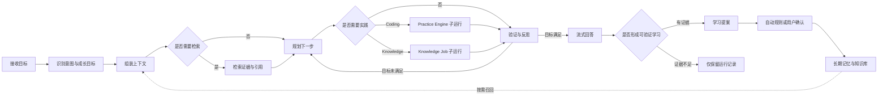

# Sage Chat Harness 2.0 设计

> 日期：2026-07-16
> 状态：已确认，待实施计划
> 适用版本：Sage V7.x
> 可编辑流程图：[Sage Growth Harness 两层运行图与流式联动](https://www.figma.com/board/WcxvFoUG1WyHZnG8W19fIy)

## 1. 设计结论

Sage 只建设一套可复用的 `Chat Harness`。主对话、Knowledge 工作台、Coding Practice Engine 和后续成长页面共享同一套对话壳、会话生命周期、流式事件、工具摘要和恢复语义；各页面只提供自己的主画布、上下文绑定、工具能力和详情面板。

Harness 2.0 的产品边界是：

- Sage 是个人成长助手；
- Coding 是 `Practice Engine`，不是产品总入口；
- Knowledge 是自动摄取、综合、索引和追溯工作台，不以“直接搜索框”作为产品主线；
- Chat 是跨工作台的交互入口，不是把所有业务塞进消息列表；
- 运行图是 timeline 的可视化投影，不是新的运行事实源。

## 2. 当前事实与缺口

### 2.1 已有能力

当前仓库已经具备：

- Coding ReAct 循环：模型可重复调用工具，直到满足目标或达到运行边界；
- durable timeline、run/session 恢复、工具事件、审批事件和 `text_delta`；
- 工作区文件、Diff、运行、记忆等 Coding Inspector 能力；
- Knowledge 来源摄取、异步任务、Wiki proposal、批准/拒绝/回滚；
- revision-aware hybrid retrieval、稳定 citation 和 evidence-gated learning；
- Assistant 首页和 Knowledge 页面路由。

因此 Harness 2.0 不是重写 Agent Runtime，也不是新建第二套聊天后端。

### 2.2 当前缺口

- `CodingView.vue` 同时承担页面布局、会话路由、消息流、运行状态和 Coding 语义，无法直接跨页面复用；
- Chat 子组件直接读取 `coding` store，展示层与运行域耦合；
- Knowledge 页面使用独立操作 UI 和 Job WebSocket，没有统一投影到 Chat Harness；
- timeline 能表达运行事实，但缺少稳定的 Harness 节点、阶段和父子运行标识；
- 产品仍容易被理解为“Coding Agent 加一个 Knowledge 页面”，没有明确的 Growth Harness 总入口。

## 3. 产品信息架构

### 3.1 三种工作台，共用一个 Chat Harness

| Surface | 主画布 | 右侧详情 | Chat 上下文 | 主要能力 |
| --- | --- | --- | --- | --- |
| `growth` | Growth Harness 总览、当前路径、成长任务 | 目标、证据、学习提案 | 当前用户目标与工作区 | 规划、调度、反思、沉淀 |
| `knowledge` | 来源、摄取状态、Wiki、搜索结果、知识图谱 | 来源、引用、revision、任务异常 | 当前来源、页面、节点或选区 | 摄取、解析、综合、索引、检索 |
| `coding` | Practice Engine 运行图、文件、Diff、验证 | 文件、变更、运行、审批 | 当前仓库、文件、Diff 或运行 | 读改测、Shell、代码验证 |

`ChatHarness` 完全复用不等于所有页面使用同一组工具。复用的是交互壳、协议和会话语义；工具清单、权限策略、上下文和详情内容由 Surface Adapter 提供。

### 3.2 Knowledge 页主线

Knowledge 页的默认主线固定为：

```text
导入来源
  -> 自动发现变更
  -> 自动解析与来源理解
  -> 自动生成或更新 Wiki
  -> 自动重建全文、向量和图谱索引
  -> 仅在冲突、失败或高风险变更时要求用户处理
```

搜索和图谱用于查看结果、追溯证据和发现知识缺口，不承担主要摄取操作。用户可以在右侧 Chat Dock 中针对选中来源、页面或图节点提问，但系统仍通过 Knowledge Harness 执行，而不是绕过来源和 revision 契约直接写入知识库。

## 4. Harness 2.0 总流程



此流程保持现有 FigJam 总体结构。Coding 和 Knowledge 都是可下钻的子运行，不能各自复制一套顶层 Harness。

## 5. 前端布局

### 5.1 桌面布局

桌面采用“主画布 + 右侧 Workbench Dock”：

- 主画布占剩余空间，展示当前 Surface；
- Dock 默认宽度 `420px`，允许在 `360px-520px` 间拖动；
- Dock 支持收起，收起后保留一个聊天图标；
- Dock 包含 `Chat` 与 `详情` 两个标签，不再为 Knowledge 叠加第四列 Inspector；
- `Chat` 是默认标签，点击画布节点时可以自动提示详情有更新，但不强制切换；
- 会话历史以抽屉打开，不长期占用主画布宽度。

Knowledge 现有右侧 Inspector 迁入 Dock 的“详情”标签；Coding 的文件、变更、运行和记忆也迁入同一详情容器。主画布和 Chat 不互相遮挡。

### 5.2 平板与移动端

- 平板：主画布全宽，Dock 作为右侧 Drawer；
- 手机：`画布 / 对话 / 详情` 使用底部标签切换；
- 消息流、工具展开和 Composer 不因为切换页面而丢失；
- 移动端不同时展示运行图和 Chat，避免内容被压缩成不可读窄列。

## 6. 前端组件边界

### 6.1 目标结构

```text
components/harness/
  ChatHarnessLayout.vue       # 主画布、Dock、响应式和可调整宽度
  ChatDock.vue                # Header、消息流、工具活动、Composer
  ChatMessageTurn.vue         # 用户与 Assistant 消息
  ChatToolActivity.vue        # 通用工具摘要和审计展开
  HarnessCanvasHost.vue       # Surface 主画布插槽
  HarnessDetailsHost.vue      # Surface 详情插槽
  HarnessRunStatus.vue        # 当前节点、耗时、恢复与错误状态

harness/
  types.ts                    # Surface、context、event、view model 契约
  useHarnessSession.ts        # 会话选择、连接、replay、发送和恢复
  timelineProjection.ts       # timeline -> Chat/Graph view model
  surfaces/
    growth.ts
    knowledge.ts
    coding.ts
```

### 6.2 `ChatHarnessLayout` 契约

页面只负责提供 Surface Adapter 和画布内容：

```ts
interface HarnessSurfaceAdapter {
  id: 'growth' | 'knowledge' | 'coding'
  definitionId: string
  buildContext(): HarnessSurfaceContext
  presentTool(event: HarnessToolEvent): ToolActivityViewModel
  capabilities: HarnessCapability[]
}
```

`ChatDock` 不得直接导入 `useCodingStore()`、Knowledge store 或路由。它只接收统一 view model 和 command handlers。

### 6.3 渐进迁移

不一次性重命名全部 Coding 组件：

1. 先用 adapter 包装现有 `coding` store 和 timeline；
2. 抽出纯展示组件，并保留原 `Coding*` export 作为兼容别名；
3. 让 Knowledge Surface 接入共享 Chat Dock；
4. 最后把 `CodingView.vue` 收敛为 Surface 页面。

这样可以保留已经验证的 replay、审批、自动滚动和 session 恢复行为。

## 7. 会话与上下文契约

### 7.1 会话复用

同一会话可以跨同一 owner、同一 Sage workspace 下的 `growth`、`knowledge` 和 `coding` 路由继续。跨 workspace 时必须选择或创建目标 workspace 的会话，不能把资源绑定偷偷改到另一个 workspace。页面导航不会自动创建会话，也不会自动发送消息。

每一轮提交时冻结当前 Surface 上下文：

```json
{
  "surface_context": {
    "surface": "knowledge",
    "workspace_id": "workspace-1",
    "resource": {
      "type": "knowledge_page",
      "id": "page-42",
      "revision": "rev-8"
    },
    "selection": {
      "type": "graph_node",
      "id": "agent-harness"
    }
  }
}
```

上下文绑定由页面产生、后端验证。后端必须校验 owner、workspace、resource、revision 和当前权限的归属关系；模型不能通过自由文本自行声明 workspace、revision 或权限。一次 run 启动后使用冻结的 `surface_context`，用户切换页面不会改变正在执行的 run。

### 7.2 事实源

- Chat 消息、运行事件和恢复序列继续以 session event journal 为事实源；
- Knowledge 摄取任务继续以 Knowledge Job Store 为事实源；
- Chat timeline 只保存 `operation_ref`、稳定阶段里程碑和终态，不复制完整任务状态；Knowledge Job 的细粒度进度仍从 Job Store/Job Stream 读取，避免把两条 WebSocket 强行合并成一个全序事件流；
- Wiki、索引和图谱继续从已批准 revision 投影；
- Harness Graph 只从 timeline 和任务引用派生。

## 8. 运行事件与图投影

现有事件包络保持兼容，新增可选 Harness 元数据：

```ts
interface HarnessEventMeta {
  definition_id: string
  definition_version: number
  stage_id?: string
  parent_run_id?: string
  operation_ref?: {
    kind: 'knowledge_job' | 'coding_run'
    id: string
  }
}
```

新增通用阶段事件：

- `stage_started`
- `stage_completed`
- `stage_failed`
- `transition_taken`

现有 `tool_call`、`tool_result`、`text_delta`、审批、Diff 和 memory proposal 事件不改名。Graph Projection 根据 `sequence` 计算当前节点、已访问路径、耗时和终态；刷新和断线恢复后必须从相同事件重建出相同画面。历史 definition 无法加载时降级为有序步骤列表，不得阻断会话恢复或审计记录。

## 9. Chat 与工具呈现

### 9.1 流式回答

- 用户消息提交后立即显示；
- 首个 `text_delta` 到达后立即显示 Assistant 正文；
- 思考角色动画只能表达“等待首 token 或工具结果”，不得遮挡正文；
- 用户停留在底部附近时自动跟随；用户主动上滚后暂停跟随并显示“回到最新”；
- `run_finished` 只更新完成状态，不延迟已收到的正文。

### 9.2 工具摘要

工具默认收起，每一项至少显示：

- 人类可读动作，例如“执行命令”“读取文件”“搜索知识”；
- 关键命令、路径或查询摘要；
- 状态、耗时和结果数量；
- 可追溯的 run、job 或 citation 引用。

长 Shell 输出、文件内容和检索结果只在消息中保存截断预览。确需保留完整结果时，工具事件写入受权限、保留周期和大小限制约束的 `artifact_ref`；用户手动展开时再读取。没有 artifact 或结果因敏感策略被丢弃时，UI 明确显示“完整输出未保留”，不能伪造空结果。消息列表不直接渲染完整长输出。

## 10. Surface 行为

### 10.1 Growth

- 默认展示 Harness 总图和本轮路径；
- Practice Engine 和 Knowledge Job 作为子运行节点；
- 点击子运行进入对应 Surface，但保持当前 session；
- 回答后展示学习提案是否写入，而不展示模型私有推理。

### 10.2 Knowledge

- 默认展示来源摄取和 Wiki/索引健康状态；
- 图谱是结果视图，可选中节点后“在对话中询问”；
- 对话可以发起摄取、重试、检索或解释请求，但必须调用现有 Knowledge API/Job；
- 高风险冲突通过详情面板确认，不在普通聊天文本中直接批准；
- 重建索引和批量摄取离开页面后继续运行。

### 10.3 Coding

- 保留现有读改测循环、审批和 workspace diff；
- 主画布展示 Practice Engine 路径或当前工作区内容；
- 详情标签承载文件、变更、运行和记忆；
- Coding 专属权限模式、模型和 reasoning 控件由 adapter 注入 Composer。

## 11. 错误与恢复

- WebSocket 断线：先 replay 缺失 sequence，再恢复实时订阅；
- Knowledge Job 断线：按 job cursor 补齐，Chat 只更新同一 `operation_ref`；
- 页面切换：停止旧 Surface 的临时 UI 订阅，不中止后台 run/job；
- context revision 已过期：阻止写操作，提示刷新选中对象；
- 工具失败：保留命令摘要、错误分类和重试入口，隐藏凭据与敏感输出；
- Harness definition 升级：历史 run 使用事件中记录的 definition version 回放。

## 12. 验收标准

### 12.1 复用

- Growth、Knowledge、Coding 使用同一个 `ChatDock` 和消息组件；
- Chat 展示组件不直接依赖 domain store；
- 同一 session 跨 Surface 后消息顺序和 run 恢复保持一致；
- 不新增第二份 canonical chat store。

### 12.2 运行图

- live event 能高亮当前节点和边；
- replay 后的路径、耗时和终态与实时画面一致；
- Coding 子运行和 Knowledge Job 可以从总图下钻；
- 图的不可用不会阻断 Chat 和实际任务。

### 12.3 Knowledge

- 来源导入到 Wiki/index 的状态可以离开页面后继续；
- Chat 发起的 Knowledge 操作引用真实 job id；
- 图节点问答绑定 page/node revision 和 citation；
- 冲突和高风险写入必须进入确定性审核控件。

### 12.4 前端

- 桌面 Dock 可调整宽度和收起；
- 平板、手机无重叠和横向溢出；
- 流式正文、工具摘要、自动跟随和用户上滚暂停均有测试；
- 支持键盘切换 Chat/详情、焦点返回和 reduced motion。

## 13. 非目标

- 不引入 Apache Burr 作为 Sage Runtime；
- 不复制 waku-agent 的具体视觉或图源码；
- 不展示模型私有 chain-of-thought；
- 不在本阶段替换 Knowledge Job Store、session journal 或索引事实源；
- 不把所有 Knowledge 后台状态写进聊天消息；
- 不为了统一命名进行一次性大规模 API 迁移；
- 不把 Knowledge 页面退化成 RAG 调试搜索框。

## 14. 实施切片边界

Harness 2.0 应拆成四个可独立验证的小版本：

1. **共享 Chat 展示层**：抽离 Chat Dock、消息、工具和 Composer view model，Coding 行为不变；
2. **Workbench Layout**：主画布、右侧 Dock、详情标签和响应式；
3. **Harness Projection**：阶段事件、实时高亮、回放和子运行引用；
4. **Knowledge Surface**：接入 Knowledge 页面、Job 引用、选中节点上下文和异常审核。

Growth Harness 的自动规划与长期成长策略在以上基础设施稳定后接入，不能反过来阻塞 Chat Harness 和 Knowledge Surface 的交付。

## 15. 参考与 clean-room 边界

- Apache Burr 用于理解“显式状态图 + step trace + replay”的产品模式；
- waku-agent 用于理解“主画布实时高亮 + 侧边 Chat Dock + 工具摘要”的交互模式；
- Sage 独立定义事件、布局、组件和视觉，不复制参考项目的具体图稿或代码；
- 本设计以 Sage 当前 timeline、Knowledge Job 和 Wiki revision 契约为实现事实基础。
