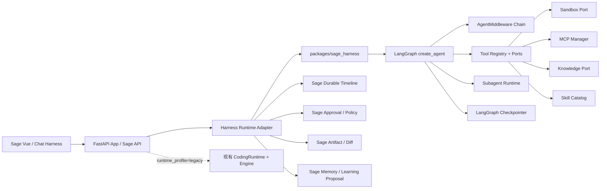

# Sage DeerFlow Harness 兼容迁移设计

> 日期：2026-07-16
>
> 状态：待用户审阅
>
> 目标版本：Sage V7.x
>
> DeerFlow 源码基线：`bytedance/deer-flow@693507870cae26dadf3af487f811eb2bcfe18f87`
>
> 参考书基线：`hawkli-1994/deerflow-book@604d1416e5a8dd0ebcd26db60bb2eadb7a6f9afc`

## 1. 设计结论

Sage 采用 DeerFlow 2.x 的 Harness 架构作为长期运行时方向标，但不把 DeerFlow 整个应用作为第二个服务部署，也不替换 Sage 已经形成的产品事实源。

迁移采用以下固定路线：

1. 将 Sage 后端基线升级到 Python 3.12、LangChain 1.x、LangGraph 1.x。
2. 在仓库内建立可独立测试和发布的 `sage_harness` Python 包，保持 Harness 不反向依赖 FastAPI 应用层。
3. 采用 LangChain `create_agent`、LangGraph checkpoint 和可插拔 `AgentMiddleware` 作为新 Agent 主循环。
4. 保留 Sage Vue、Knowledge、durable timeline、审批、workspace diff、provider 和现有公开 API 契约。
5. 通过 `legacy` / `deerflow_v2` 双运行时逐会话迁移；新运行时未通过同等门禁前，不删除旧 Engine。
6. Tools、MCP、Sandbox、Subagents、上下文压缩和持久记忆按纵向切片逐步接入，不进行一次性大爆炸替换。

这里的“移植 DeerFlow”指移植可验证的运行时结构、状态语义和扩展边界。DeerFlow 的 Next.js UI、Nginx 拓扑、品牌、应用路由和与 Sage 重复的业务模块不进入 Sage。

## 2. 事实基线

### 2.1 Sage 当前事实

Sage 当前已经具备：

- FastAPI + Vue 3 + Pinia + WebSocket；
- 自研 XML 工具协议和可重复 ReAct 循环；
- session/run lease、durable timeline、断线 replay 和终态恢复；
- 工具审批、路径权限、read-before-write、plan mode 和 workspace diff；
- Provider、reasoning、usage、Skills、MCP 和工具搜索；
- 上下文预算、自动/手动压缩、压缩 artifact 和恢复；
- Knowledge revision、citation、检索、摄取 Job 和学习确认门；
- workspace-scoped durable memory 与 proposal-only 学习语义；
- Chat Harness 阶段投影和 Vue 运行路径展示。

当前主要问题不是功能完全缺失，而是运行时职责集中在 `CodingRuntime`、`Engine`、API 和 Store 中，横切行为没有形成稳定的 middleware 组合边界。工具、压缩、记忆、子代理和流协议继续扩展时，回归半径会越来越大。

### 2.2 DeerFlow upstream 当前事实

固定源码基线的关键结构为：

- `backend/packages/harness/deerflow/` 是独立 Harness 包；
- `backend/app/` 是 FastAPI Gateway，依赖 Harness，Harness 不依赖 App；
- Lead Agent 使用 `langchain.agents.create_agent` 生成 LangGraph；
- `ThreadState` 扩展 `AgentState`，通过 reducer 保存 artifacts、delegations、skills、summary 等 durable channel；
- Agent 行为由动态 `AgentMiddleware` 链组合；
- LangGraph checkpointer 保存 thread state，RunManager/StreamBridge 管理长运行和 SSE；
- Tools 统一为 LangChain Tool，按 sandbox、builtin、MCP、community、subagent 组合；
- Subagent 通过 `task` 工具委派，受并发和总量门控；
- Summarization 把摘要保存到独立 `summary_text` channel，而不是伪造普通聊天消息；
- Memory 支持 middleware 自动模式和 model-controlled tool 模式；
- 前端使用 LangGraph `messages-tuple`、`values` 和 `custom` stream 投影会话。

### 2.3 参考书使用边界

参考书第 4、5、6、7、11 章用于理解模块地图、Agent、Skills/Tools、Subagents 和 MCP，但不是最终实现事实源。书中手写 `StateGraph`、固定 18 中间件、部分 Tool Registry 和 Agent Team 示例与固定 upstream commit 不完全一致。

优先级固定为：

```text
DeerFlow 固定源码与测试
  > DeerFlow 官方架构文档
  > 参考书章节
  > Sage 迁移推断
```

任何书中示例与源码冲突时，以固定 commit 的代码和测试为准，并在 Sage 设计中明确偏差。

## 3. 目标与非目标

### 3.1 目标

1. 建立可插拔、可测试、可组合的 Agent Harness 深模块。
2. 用 LangGraph 原生 tool calling 替换新运行时中的 XML `<tool>/<final>` 协议。
3. 保持一次用户目标可以经历多轮模型、工具、审批、子代理和验证，直到完成、取消、失败或达到预算。
4. checkpoint、timeline、artifact 和业务 Store 各自拥有清晰事实边界。
5. 工具、Skills、MCP、Knowledge 和后续领域服务通过稳定 Port 接入同一个 Harness。
6. 支持长会话压缩、持久目标、长期记忆、恢复和可追溯引用。
7. Vue 前端无需切换 React，继续消费统一的 Sage timeline view model。
8. 保留旧会话可读、可恢复和可审计。

### 3.2 非目标

- 不复制 DeerFlow Next.js/React 前端。
- 不引入第二套公开会话 API 或第二个产品入口。
- 不让 checkpoint 取代 Sage timeline 的审计事实。
- 不让模型绕过 Sage 审批、owner、workspace、revision 或持久化确认门。
- 不把 Knowledge Store、Job Store 或图谱复制进 Harness。
- 不在第一阶段启用任意远程 Sandbox 或 Kubernetes Provisioner。
- 不自动迁移旧 session 到新 runtime；旧 session 默认继续使用其创建时的 runtime profile。
- 不展示或保存模型私有 chain-of-thought。

## 4. 目标架构



### 4.1 依赖方向

```text
api / app
  -> core adapters
      -> sage_harness ports
          -> LangChain / LangGraph

sage_harness -X-> api
sage_harness -X-> Vue
sage_harness -X-> Knowledge concrete store
```

新增静态边界测试，禁止 `packages/sage_harness/` 导入 `api.*`、Vue 或 Knowledge 的具体存储实现。

## 5. 目标目录

```text
packages/sage_harness/
  pyproject.toml
  sage_harness/
    agents/
      lead_agent.py
      factory.py
      state.py
      middleware/
    runtime/
      manager.py
      runner.py
      stream.py
      checkpoint.py
    tools/
      registry.py
      metadata.py
      adapters.py
    sandbox/
      base.py
      local.py
    mcp/
      manager.py
      deferred.py
    subagents/
      registry.py
      executor.py
      events.py
    context/
      durable.py
      summarization.py
    memory/
      port.py
      tools.py
    config/
      models.py

core/harness/
  runtime_adapter.py
  event_adapter.py
  approval_adapter.py
  tool_adapters.py
  knowledge_port.py
  memory_port.py
```

`packages/sage_harness` 提供可复用框架；`core/harness` 负责把 Sage 业务事实接到框架 Port。这样后续 Growth、Knowledge、Coding 和其他服务可以复用 Harness，而不依赖 Coding 页面。

## 6. Runtime Profile 与迁移策略

### 6.1 Profile

每个 session 保存不可含糊的 runtime profile：

```text
legacy       当前 CodingRuntime + XML Engine
deerflow_v2  sage_harness + LangGraph create_agent
```

规则：

- profile 在 session 创建时由服务端选择并持久化；
- 一个 run 启动后 profile 不可改变；
- 没有 profile 的历史 session 解释为 `legacy`；
- 切换默认值不迁移既有 session；
- 允许显式创建测试 session 使用 `deerflow_v2`；
- profile 不赋予额外权限，不能由客户端伪造绕过服务端功能开关。

### 6.2 切换顺序

1. `deerflow_v2` 仅测试和本地显式开启。
2. 通过对等功能矩阵后，新增 session 默认 `deerflow_v2`，旧 session 保持 `legacy`。
3. 经过一个稳定小版本后停止创建新的 `legacy` session。
4. 旧 Engine 只在旧 session 无法完成只读回放时才保留；删除前必须完成数据审计。

## 7. ThreadState 契约

新状态以 LangGraph `AgentState` 为基础，增加服务端所有的 durable channel：

```python
class SageThreadState(AgentState):
    thread_data: dict
    surface_context: dict | None
    artifacts: list[dict]
    todos: list[dict]
    goal: dict | None
    delegations: list[dict]
    skill_context: list[dict]
    summary_text: str | None
    memory_refs: list[dict]
    approval_context: dict | None
```

状态规则：

- `messages` 使用 LangGraph 消息 reducer；
- artifacts 按稳定 ID 去重；
- delegations 同一 ID 采用最新状态，终态不可降级；
- skill context 保存引用和版本，不保存完整 Skill 正文；
- `summary_text` 是独立 channel，不伪装成聊天消息；
- `surface_context` 在 run 开始时由 API 验证并冻结；
- approval context 只能由服务端 policy adapter 写入；
- memory refs 只保存稳定引用，长期事实仍由 Memory/Knowledge Store 持有。

## 8. Middleware Chain

Sage 不按书中固定数量复制中间件，而按职责和执行顺序建立动态链。第一版顺序固定为：

1. `InputSanitizationMiddleware`：净化用户输入和不可信边界标记。
2. `ToolOutputBudgetMiddleware`：限制重新进入模型的 ToolResult 大小。
3. `RemoteContentSanitizationMiddleware`：处理网页、MCP 和外部来源注入。
4. `ThreadContextMiddleware`：注入 owner、workspace、thread、run 和冻结 surface context。
5. `SandboxMiddleware`：获取本轮 Sandbox capability。
6. `DanglingToolCallMiddleware`：修复被中断后缺失 ToolMessage 的历史。
7. `ProviderErrorMiddleware`：将模型错误分类为可恢复或终止错误。
8. `SagePolicyMiddleware`：执行路径、plan mode、权限和工具风险策略。
9. `ApprovalInterruptMiddleware`：高风险工具在执行前产生 durable approval 并中断 graph。
10. `ReadBeforeWriteMiddleware`：写入前校验当前文件内容指纹。
11. `ToolProgressMiddleware`：识别无新信息和重复失败。
12. `ToolErrorMiddleware`：把工具异常归一为模型可消费 ToolMessage。
13. `DurableContextMiddleware`：投影 summary、goal、delegation、skill 和 memory refs。
14. `SummarizationMiddleware`：达到预算时压缩旧消息并更新 `summary_text`。
15. `TodoMiddleware`：仅在 plan capability 开启时提供任务账本。
16. `MemoryMiddleware`：默认 proposal-only；不直接持久化高风险学习。
17. `DeferredToolMiddleware`：先暴露目录，按需提升完整 Tool schema。
18. `SubagentLimitMiddleware`：限制并发和单 run 总委派数。
19. `LoopDetectionMiddleware`：阻断重复工具签名和无进展循环。
20. `TokenBudgetMiddleware`：限制单 run 模型 token 与成本。
21. `TerminalResponseMiddleware`：工具结束后禁止静默成功。
22. `ClarificationMiddleware`：最后处理需要用户澄清的中断。

每个中间件必须声明：

- 作用 hook；
- 读写的 state channel；
- 失败是 fail-open 还是 fail-closed；
- 产生的 timeline event；
- 与相邻中间件的顺序测试。

权限、审批、路径安全、owner 和 revision 必须 fail-closed。遥测、标题和非关键摘要可以降级，但必须留下错误事件。

## 9. Agent Loop 与原生 Tool Calling

新运行时使用 `create_agent` 的标准循环：

```text
model
  -> 无 tool_calls：terminal response
  -> 有 tool_calls：policy / approval / execute
  -> ToolMessage 写入 state
  -> model 继续判断
  -> 达成目标、澄清、中断、失败或预算终止
```

新运行时不再要求模型输出 `<tool>` 和 `<final>`。Provider 必须支持 LangChain 标准 tool binding；不支持结构化 tool calling 的 Provider 只能使用 `legacy`，直到有经过测试的兼容适配器。

运行终止必须归一为：

- `succeeded`
- `failed`
- `cancelled`
- `interrupted`
- `budget_exhausted`

不允许没有 assistant 内容、没有明确错误、却标记成功的静默终态。

## 10. Checkpoint、Timeline 与恢复

### 10.1 事实边界

- LangGraph checkpointer：Agent 执行状态和 graph resume 的事实源。
- Sage timeline：用户可见审计、流式 replay 和 UI 投影的事实源。
- Transcript Store：规范化消息查询与历史兼容。
- Knowledge/Memory/Job Store：各业务对象的事实源。
- Artifact Store：长输出、Diff、文件和生成物的事实源。

这些存储通过稳定引用关联，不互相复制完整对象。

### 10.2 事件适配

`HarnessEventAdapter` 将 LangGraph stream 转为现有 Sage 包络：

```text
messages-tuple -> text_delta / reasoning_summary（若 Provider 提供公开摘要）
tool call      -> tool_call / approval_required
ToolMessage    -> tool_result
custom         -> harness / subagent / todo / artifact
checkpoint     -> run_checkpointed
terminal       -> run_finished
```

规则：

- timeline sequence 只由 SessionEventJournal 分配；
- event 使用 `run_id + source_event_id` 去重；
- 先持久化关键事件，再发送实时流；
- WebSocket 断线仍按 sequence replay；
- checkpoint 成功但 timeline 写入失败时，run 不得报告成功，恢复器补写可证明的终态；
- timeline 存在但 checkpoint 缺失时，session 可以只读回放，但不能伪造可恢复状态。

### 10.3 审批恢复

高风险工具流程：

```text
tool_call
  -> Sage policy
  -> approval_required 持久化
  -> LangGraph interrupt + checkpoint
  -> 用户 once / session / reject
  -> 服务端验证 pending approval 与 run lease
  -> Command(resume=server-owned decision)
  -> 同一 tool_call 继续或产生拒绝 ToolMessage
```

客户端不能提交任意 ToolMessage、工具结果或已批准参数。批准绑定 `session_id + run_id + tool_call_id + args_digest`，参数变化后旧批准失效。

## 11. Tools、MCP 与 Sandbox

### 11.1 Tool Metadata

统一 Tool 除标准 schema 外，必须携带：

```text
risk_level
permission_scope
surface_capabilities
deferred
remote_content
output_policy
artifact_policy
idempotency
```

现有 Sage Tool 先通过 adapter 转为 LangChain `BaseTool`，避免第一阶段重写所有工具。

### 11.2 MCP

MCP Manager 负责：

- stdio / streamable HTTP 客户端生命周期；
- 配置热更新和缓存失效；
- 工具名前缀与冲突处理；
- schema 延迟加载和 `tool_search` 提升；
- OAuth/token 仅服务端解析；
- 将 MCP 工具标记为 local/remote content，进入相应净化和审批策略。

现有 Sage MCP 配置和前端管理入口保持不变，底层 adapter 迁移到 `sage_harness.mcp`。

### 11.3 Sandbox

第一版实现统一 `Sandbox` Port，并提供：

- `LocalWorkspaceSandbox`：开发环境，绑定现有 workspace 路径安全；
- `ContainerSandbox` 扩展位：服务器部署阶段实现。

Coding workspace 不复制到 DeerFlow 风格的 thread workspace。thread 目录只保存 uploads、outputs 和临时 artifact；代码仓库仍由 Sage workspace binding 决定。生产环境不允许任意 host 路径 Local Sandbox。

## 12. Subagents

Subagent 通过一个标准 `task` 工具调用，不把多个 Agent 硬编码为固定图节点。

每次委派包含：

- `parent_run_id`
- `child_run_id`
- `agent_type`
- `task`
- `tool_scope`
- `workspace_scope`
- `token_budget`
- `timeout`

子代理规则：

- 默认不继承所有工具和写权限；
- 只继承显式 surface/workspace scope；
- 结果以受限 ToolMessage 返回主 Agent；
- 详细过程写 child timeline，并在父 timeline 保存摘要和引用；
- 父 run 取消时传播取消；
- 并发和单 run 总量由服务端限制；
- 子代理不能独立绕过审批或写入 Memory/Knowledge。

第一阶段只移植同步/awaited 子代理。持久后台子代理和跨进程 A2A 在主链稳定后单独设计。

## 13. 上下文压缩与持久记忆

### 13.1 压缩

迁移 DeerFlow 的 durable-context 思路，保留 Sage 已有 artifact 和验证能力：

1. 达到 token/message 阈值时触发 summarization middleware。
2. 保护当前用户请求、未完成 tool call、pending approval 和近期消息。
3. 将摘要写入 `summary_text` channel。
4. 删除已压缩 raw message 时保留 checkpoint 可追溯元数据。
5. 将 goal、delegation、active skills、surface context 和 memory refs 作为低权限数据块重新投影。
6. 手动压缩继续生成 Sage compaction artifact，供审计和回滚判断。

### 13.2 记忆

记忆分为：

- thread working state：checkpoint；
- session summary：`summary_text`；
- workspace conventions/decisions：Sage Durable Memory；
- 用户长期偏好：user-scoped Memory；
- 知识事实与引用：Knowledge Store。

DeerFlow 自动 after-agent memory update 不直接照搬。Sage 默认产生候选事实，满足证据和风险规则后进入 proposal；涉及长期事实、Knowledge/Wiki 或敏感偏好时继续要求用户确认。模型可使用 `remember`/`knowledge_learn` 工具提出写入，但不能直接绕过门禁。

## 14. API 与 Vue 兼容

### 14.1 API

现有 `/api/v1/coding/*` 和 WebSocket 保持兼容。API 层增加 runtime profile 和 Harness capability，但不要求 Vue 使用 LangGraph SDK。

未来可增加内部 LangGraph-compatible API 供 CLI/渠道复用，但它必须调用同一个 `HarnessRunManager`，不能形成并行执行栈。

### 14.2 Vue

Vue 继续使用：

- 现有 Chat Dock、消息、工具摘要和 Composer；
- durable timeline replay；
- Harness stage projection；
- 审批卡片、Diff drawer、citation 和 context meter。

新增投影：

- 子代理父子路径；
- checkpoint/recovering 状态；
- clarification interrupt；
- token/step budget 终态；
- middleware 公开阶段摘要。

不渲染私有 chain-of-thought。公开 reasoning summary 只有 Provider 明确返回可展示摘要时才进入 timeline。

## 15. 依赖升级与兼容门禁

当前 Sage 与 DeerFlow 的主版本差距不能通过局部 import 修复。升级按独立门禁进行：

1. Python 最低版本改为 3.12，开发和 CI 统一解释器。
2. 升级 LangChain、LangChain Core、Provider packages、MCP adapter 和 LangGraph。
3. 先适配现有 Provider、travel agent、tests 和 API imports，不引入新 runtime 行为。
4. 全量后端门禁通过后，才提交依赖基线升级。
5. `sage_harness` 在新基线上开发。

如果某 Provider 不支持标准 tool calling，则在 model catalog 标记 `native_tools=false`，只能使用 legacy profile；不能在新 Harness 中静默降级回 XML 协议。

### 15.1 Wave 0 兼容性审计结论

2026-07-16 使用 uv 管理的 CPython 3.12.13 对候选依赖做了隔离解析和 import spike，结论如下：

- Sage 当前 LangChain/LangGraph 直接 import 面较小；`StateGraph`、`START/END`、`BaseChatModel`、`ChatOpenAI`、`ChatAnthropic`、messages 与 `add_messages` 的现有 import 均能在候选 1.x 基线上导入。
- DeerFlow 方向标所需的 `create_agent`、`AgentMiddleware`、`ModelRequest/ModelResponse`、`Command/interrupt` 与 `ToolCallRequest` 也能在同一基线上导入。
- 移除遗留 Mem0 固定版本后，Python 3.12 + LangChain/LangGraph 1.x + Sage 其余核心依赖能够完成一套无冲突解析；这只是依赖可解证明，不替代全量行为测试。
- 唯一确定性的解析阻断是 `mem0ai==0.1.50` 要求 `openai<2`，而 `langchain-openai==1.2.1` 要求 `openai>=2.26,<3`。

`mem0ai==2.0.12` 虽然能与 OpenAI 2.x 共存，但不是无行为变化升级：其 `search()` 契约已经从顶层 `user_id`/`limit` 转为 `filters.user_id`/`top_k`，Sage 现有 `LongTermMemory` 不能原样复用。因此 Wave 0 采用以下边界：

1. `mem0ai`、`qdrant-client`、`sentence-transformers` 从 Harness 核心安装集移到独立的 legacy memory 可选依赖清单。
2. `core/memory/mem0_factory.py` 保持可选导入和失败降级；核心 API、Coding Harness 与 Sage Durable Memory 不依赖它启动。
3. Wave 0 不假装完成 Mem0 2.x 迁移；若后续仍保留旧旅行 Agent 记忆演示，必须单独实现 2.x adapter 并通过真实 Qdrant/embedding smoke test。
4. Harness 的长期记忆主线继续以 Sage Durable Memory、proposal/approval 和 Knowledge citation 为准，不让遗留 SDK 成为核心升级阻塞项。
5. 依赖升级提交必须使用干净 Python 3.12 环境重新安装，不能从已混装的本机 Conda 环境推断兼容性。

## 16. 实施波次

### Wave 0：依赖与边界基线

- Python 3.12 + LangChain/LangGraph 1.x；
- 修复现有代码兼容；
- 建立 Harness/App import firewall；
- 不改变用户可见行为。

### Wave 1：Harness Skeleton

- `sage_harness` 包、ThreadState、RunManager、checkpointer；
- `create_agent` 最小模型/工具循环；
- runtime profile 与 event adapter；
- 一个只读工具的真实流式运行。

### Wave 2：Policy 与 Coding Tools

- 现有工具 adapter；
- approval interrupt/resume；
- read-before-write、loop、budget、tool error；
- workspace diff 和 artifact。

### Wave 3：MCP、Skills 与 Sandbox

- MCP manager、deferred tools、Skill activation；
- Local Sandbox Port；
- 服务器 Container Sandbox 契约。

### Wave 4：Subagents

- `task` 工具、child run、并发限制、取消传播；
- 父子 timeline 与前端展开。

### Wave 5：Summarization 与 Memory

- durable context channels；
- 自动/手动压缩兼容；
- proposal-only memory、Knowledge citation 和 revision。

### Wave 6：默认切换与清理

- 新 session 默认 `deerflow_v2`；
- 浏览器和服务器长任务验收；
- 停止创建 legacy session；
- 经过独立审计后删除不再需要的旧 Engine 写路径。

每个 Wave 都必须是可独立验证的小版本并直接提交到 `dev/sage-v7`；不得把六个 Wave 合并成一个不可回滚提交。

## 17. 测试与验收

### 17.1 每个 Wave 的共同门禁

- 对应单元/集成测试；
- 后端全量 pytest；
- Ruff、mypy、`git diff --check`；
- 前端全量测试和生产构建；
- API/Store 共享影响审查；
- 浏览器 live + replay + refresh；
- 更新 `sage-learning`。

### 17.2 对等场景矩阵

新 runtime 必须覆盖：

1. 普通问题首 token 流式输出。
2. 连续读取多个文件后回答。
3. 工具失败后模型修正参数继续执行。
4. 写文件前 fresh read。
5. Shell 审批 once/session/reject 与刷新恢复。
6. 运行中断、后端重启、checkpoint resume。
7. 自动压缩后继续工具循环。
8. MCP deferred tool 搜索与提升。
9. 子代理成功、失败、超时、取消和父运行恢复。
10. Knowledge 检索、citation、revision 失效与学习确认。
11. Token/step/loop budget 终止。
12. workspace、owner 和 session 隔离。

### 17.3 切默认值门禁

只有以下证据同时成立，才能把新 session 默认值切为 `deerflow_v2`：

- 对等矩阵全部通过；
- 旧 timeline replay 无回归；
- 新 runtime 的任务完成率、工具成功率和 P95 延迟不劣于 legacy 基线；
- policy compliance 为 100%；
- 浏览器无消息重复、顺序漂移、正文延迟或审批死锁；
- 服务器 Container Sandbox 或等价隔离已启用；
- 具备按 session profile 回滚到 legacy 的操作路径。

## 18. 逻辑与安全审查结论

### Critical

- 不能在同一 Python 环境混装 LangChain 0.3 与 1.x 并假设兼容；必须先完成依赖 Wave。
- 不能让 LangGraph checkpoint 和 Sage timeline 分别产生互相矛盾的 run 终态；终态适配和恢复器必须有测试。
- 不能把客户端 approval resume payload 直接送入 graph；必须服务端重建并校验 digest。

### High

- 中间件顺序错误可能绕过审批、read-before-write 或净化；顺序必须由组合测试锁定。
- 子代理继承全部工具会扩大权限；默认最小 capability。
- 自动记忆会把模型错误持久化；保留 Sage proposal/evidence gate。
- Local Sandbox 在服务器上等于 host code execution；生产必须独立隔离。

### Medium

- checkpoint 和 timeline 双写会出现部分成功；需要幂等 event ID 与恢复补偿。
- 大量 Tool schema 会增加首 token 延迟；保留 deferred tool search。
- 书籍示例与 upstream 漂移；固定 commit 并记录 provenance。

## 19. 许可证与来源记录

DeerFlow 固定源码使用 MIT License。若 Sage 直接复制或实质改写 DeerFlow 源码文件：

- 保留原版权和 MIT License 说明；
- 新增 `THIRD_PARTY_NOTICES.md` 记录来源 commit、原文件和 Sage 目标文件；
- 在改写文件头记录 upstream path 和 commit；
- 不复制 DeerFlow 品牌资源或不需要的 UI；
- 参考书只用于理解，不复制大段受版权保护的正文或示例。

优先复用公开接口和架构模式；只有确实能降低风险的核心实现才进行带 provenance 的源码移植。

## 20. 完成定义

本迁移 Goal 只有在以下全部成立时才完成：

1. Python/LangChain/LangGraph 新基线通过完整项目门禁。
2. `sage_harness` 独立包和 import firewall 生效。
3. 新 runtime 使用 `create_agent` 和原生 tool calling 完成多步任务。
4. Tools、MCP、Sandbox、Subagents、Summarization 和 Memory 均接入新主链。
5. Sage Knowledge、citation、revision、审批、diff 和 durable timeline 无回归。
6. Vue 能实时展示、断线恢复和回放新 runtime。
7. 对等场景、浏览器、服务器和安全门禁通过。
8. 新 session 已切到 `deerflow_v2`，legacy 只承担历史兼容或已通过删除审计。
9. 每个 Wave 有清晰 commit、验证记录和 `sage-learning` 收口。

设计或单个原型不能算完成；必须以当前代码、运行结果和逐项验收证据证明。
