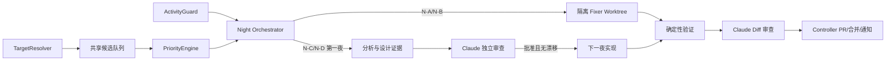

# Sage Loop Engineer Phase 3：夜间深度开发 Lane 设计

> 日期：2026-07-16
>
> 状态：已确认，尚未实施
>
> 前置：Phase 2 完成实施、独立审查和 canary；当前运行状态仍为 Phase 1 `DRY_RUN`

## 1. 设计结论

Phase 3 在小时级前端小修之外增加一条 `01:00-06:00` 夜间深度开发 Lane。两条 Lane
共享候选队列、风险策略和确定性 Controller，但使用独立并发槽位：

- **Fast Lane**：沿用 Phase 2，每小时发现并处理局部前端小问题；
- **Night Lane**：每晚最多选择一个主题，处理前端行为、后端叶子组件，以及经过双夜门禁
  的 Context、Memory、Runtime 纵向切片。

Loop 不自行猜测“最新开发分支”。每轮由 `TargetResolver` 读取 GitHub Repository Variable
`SAGE_LOOP_TARGET_BRANCH`，只接受 `dev/sage-v*`，并把精确 branch 与 SHA 固化到任务。

纯视觉改动经过单独 canary 后可自动合并；涉及行为、状态、API、后端或共享契约的改动只
创建中文 Draft PR，并通过飞书明确说明改了哪里、行为如何变化和如何回滚。安全、数据、
鉴权、迁移、部署和大范围改造永远只报告。

## 2. 与 Phase 2 的关系

Phase 3 是可选扩展，不替换 Phase 2 的安全边界：

- Night Lane 未启用时，Phase 2 的目标分支、单开放 PR 和单日 PR 限制保持原样；
- Night Lane 启用后，动态目标分支同时成为两条 Lane 的事实源；
- Phase 2 的“全局最多 1 个开放 Loop PR”升级为 `fast_slot + deep_slot`，总数最多 2 个；
- 保护路径、clean-room、lease/fencing、中文输出、独立 worktree 和确定性 GitHub 动作继续
  生效；
- 当前 Phase 1 `DRY_RUN` 不因本设计文档发生任何权限、调度或运行状态变化。

## 3. 目标与非目标

### 3.1 目标

- 在不阻塞白天 Codex/Claude 主开发的前提下，利用夜间窗口完成更完整的修复闭环；
- 按正确性、用户影响、证据、依赖阻塞和风险统一排序，而不是按发现顺序开发；
- 允许局部前端视觉改动在成熟 canary 后自动合并；
- 允许前端行为和后端叶子修复形成可审查的中文 Draft PR；
- 通过“双夜门禁”控制 Context、Memory、Runtime 等共享核心改动；
- 让用户在手机飞书中快速看懂结果，不要求逐个处理低风险视觉 PR；
- 每晚最多产出一个开发主题，不按小时制造 Markdown 文档。

### 3.2 非目标

- 不让模型决定目标分支、权限等级、merge、部署或数据库动作；
- 不在同一夜同时开发多个主题；
- 不自动合并任何行为、后端或共享契约改动；
- 不在缺少复现、验收标准或回滚方式时尝试实现；
- 不追求无度量依据的重构和性能优化；
- 不复制 Waku、Claude Code、Hermes 等参考项目的源码、样式、素材或品牌。

## 4. 控制面架构



### 4.1 TargetResolver

每次 Fast Lane 和 Night Lane 启动前必须：

1. 读取 GitHub Repository Variable `SAGE_LOOP_TARGET_BRANCH`；
2. 使用 `^dev/sage-v[0-9]+(?:\.[0-9]+)*$` 校验分支名；
3. 验证 `origin/<branch>` 存在并解析精确 head SHA；
4. 将 `target_branch`、`target_sha` 和解析时间写入 job envelope；
5. push、审查和合并前再次解析并检查漂移。

变量缺失、格式不合法或远程分支不存在时，两条 Lane 均不开发，只发送一次去重告警。模型
不得从分支列表、提交时间或自然语言推断目标分支。

变量变化后，旧候选必须重新评分；旧的分析批准、Claude 结论和测试证据全部失效。不同
Sage 版本之间不得继承实现许可。

### 4.2 PriorityEngine

PriorityEngine 只排序已通过硬门禁的候选。分数用于选择任务，不扩大权限。候选按下面的
100 分正向权重和风险扣分计算：

| 因素 | 分值 |
| --- | ---: |
| 用户影响与正确性 | 0-25 |
| 复现与代码证据 | 0-20 |
| 当期路线或夜间主题 | 0-15 |
| 解除依赖阻塞 | 0-15 |
| 问题复发频率 | 0-10 |
| 可测试性 | 0-10 |
| 等待时长 | 0-5 |
| 改动爆炸半径 | 0 至 -25 |
| 与人工开发的接近或重叠 | 0 至 -30 |
| 需求与实现不确定性 | 0 至 -20 |

总分低于 60 的候选只保留到报告/队列。总分达到 60 只表示可以进入分析；是否实现仍由
权限等级、双夜门禁、活跃开发检查和当夜预算共同决定。同分时依次优先：正确性、证据、
等待时长、较小爆炸半径。

Repository Variable `SAGE_LOOP_NIGHT_THEME` 可设为 `context`、`memory`、`runtime`、
`frontend` 或 `auto`，只影响“当期路线”最多 15 分，不能绕过硬门禁。

### 4.3 ActivityGuard

Night Lane 在开始和每个外部副作用前检查：

- 过去 30 分钟 cc-connect 是否存在活跃 Codex/Claude 开发任务；
- 仓库相关 Codex/Claude 进程是否仍在执行；
- 目标分支或根目录候选路径是否持续发生文件变化；
- 是否存在主开发或 Loop worktree lease；
- dirty path、配对测试和直接 import 依赖是否与候选重叠。

只读取任务状态、时间、路径和 lease 元数据，不读取或复制聊天正文。根目录允许保持 dirty；
只有路径/依赖重叠才跳过候选，Loop 永远不暂存、移动或清理用户修改。

检测到活跃开发时每 30 分钟重试。到 `03:00` 仍活跃则跳过当夜。运行途中人工开发开始
修改候选路径时，立即停止 Worker，不 commit、不 push，并清理未提交临时 worktree。

## 5. 夜间顺序与硬截止

Night Lane 使用 Asia/Shanghai 时区：

| 时间 | 动作 |
| --- | --- |
| 01:00 | 解析目标分支，运行 ActivityGuard，刷新候选 |
| 01:15 | 评分并只选择一个主题 |
| 01:30 | 执行当夜分析，或实现前一夜已批准切片 |
| 02:30 | 定向测试、全量相关门禁或视觉验证 |
| 04:30 | 创建全新 Claude 会话做独立审查 |
| 05:15 | Controller 创建 PR/Issue、发送飞书消息并清理 |
| 06:00 | 硬停止，不允许继续产生外部副作用 |

Night Lane 持有全局 night lease 时，小时 Fast Lane 返回 `BUSY_NIGHT_LANE`，不并行扫描。
06:00 到达时只允许记录状态和保存已有验证证据；不得留下未提交 worktree，也不得为了赶
时间降低测试或审查门槛。

## 6. 候选优先级

候选先按严重度归类，再按分数排序：

| 优先级 | 范围 | 处理方式 |
| --- | --- | --- |
| P0 | 数据破坏、安全问题、严重回归 | 立即报告，不自动修改 |
| P1 | 测试失败、会话恢复、Context/Memory 正确性 | 优先分析，受权限和双夜门禁约束 |
| P2 | 用户可见行为 bug、可访问性问题 | 可进入前端行为或叶子修复 |
| P3 | 前端视觉、布局和体验细节 | 适合 Fast Lane 或 N-A |
| P4 | 无度量重构、猜测性性能优化 | 只报告 |

任何候选评分前必须满足：

- 有稳定复现或明确静态证据；
- 有可执行验收标准和回滚方式；
- 与活跃人工开发路径和直接依赖不重叠；
- 能拆成一个夜间窗口内独立验证的切片；
- 不属于安全、数据、鉴权、迁移、生产配置或部署范围。

未满足时不得用高分补偿，只能拆分、排队或报告。

## 7. 双夜门禁

后端叶子修复（N-C）和共享核心改动（N-D）必须经过两个互相独立的夜晚：

### 第一夜：分析

- 固化目标 branch 与 SHA；
- 输出依赖边界、复现证据、预期行为和最小纵向切片；
- 列出失败测试方案、修改预算、共享契约影响和回滚路径；
- 由全新 Claude 会话给出 `APPROVE`、`REVISE` 或 `BLOCK`；
- 只保存结构化分析记录，不创建实现 commit。

### 第二夜：实现

只有在 Claude `APPROVE`，且目标 SHA、候选路径、直接依赖和验收标准均未变化时才能开始。
任何漂移都使批准失效并返回第一夜。实现后仍需新的 Claude diff 审查，第一夜批准不能替代
代码审查。

N-A 和 N-B 可在同一夜完成；但 N-B 永远只创建 Draft PR，不能自动合并。

## 8. 夜间权限矩阵

| 等级 | 允许范围 | 预算 | 结果 |
| --- | --- | --- | --- |
| N-A | 纯前端视觉、布局、静态展示和无行为变化的可访问性 | 最多 4 个生产文件 + 2 个测试文件，增删不超过 200 行 | 独立 canary 后可自动合并 |
| N-B | 前端事件、状态、store、API 或 router 使用方式 | 最多 4 个生产文件 + 2 个测试文件，增删不超过 250 行 | 中文 Draft PR |
| N-C | 后端叶子组件、局部 bug、独立 service function | 最多 3 个实现文件 + 2 个测试文件，增删不超过 250 行 | 双夜门禁，中文 Draft PR |
| N-D | Context、Memory、Runtime 或共享契约 | 一个纵向切片，最多 6 个实现/测试文件，增删不超过 400 行 | 双夜门禁，中文 Draft PR，人工合并 |
| N-E | 鉴权、迁移、安全、依赖、部署或跨模块大改 | 禁止实现 | 中文报告与拆分建议 |

N-A 只有在以下条件同时满足时成立：

- 不修改 `<script>` 中的状态、事件、API、router、条件逻辑或数据映射；
- 不改变公共 props/emits、store、类型、后端契约和用户操作结果；
- 桌面与手机视口的前后截图可以稳定复现改进；
- 测试、生产构建、secret/symlink/protected path 检查全部通过；
- Claude 对精确 head SHA 给出 `PASS`。

任一条件不满足时至少升级为 N-B。Controller 根据真实 diff 计算等级，Worker 声明不具有
权限效力。后端、行为和共享核心改动永远不得自动合并。

## 9. 验证、审查与合并

每个实现候选至少执行：

1. 先证明失败或记录可独立复核的视觉基线；
2. 对应定向测试；
3. 受影响模块的全量测试；
4. 前端改动执行生产构建；
5. `git diff --check`；
6. 路径、文件数、行数、secret、symlink 和依赖边界检查；
7. Claude 对精确 head SHA 的独立审查。

纯视觉变更必须附桌面和手机前后截图。页面空白、资源加载失败、截图不稳定、测试失败、
构建失败或 Claude 不可用时，一律不自动合并。

N-A 使用独立 `NIGHT_VISUAL_AUTO_MERGE` canary：至少运行 7 天并累积 5 个由用户人工合并
且无回滚的 PR 后，才允许 Controller 配置 squash auto-merge。GitHub required checks、
目标 SHA、路径预算和无人工阻止仍是合并时硬门禁。

Claude 与 Codex 结论冲突、输出无法解析或证据不足时采用更保守结果：保留 Draft 或只报告，
不启动模型之间的无限返工。每个 PR 最多自动返工一次。

## 10. PR 并发和队列

Night Lane 启用后使用两个独立槽位：

- `fast_slot`：最多 1 个 Fast Lane PR，Asia/Shanghai 自然日最多新建 1 个；
- `deep_slot`：最多 1 个 N-B/N-C/N-D PR；未解决超过 3 天时提醒，但不创建第二个；
- 两个槽位总计最多 2 个开放 Loop PR；
- 两个槽位不得修改相同路径、配对测试、直接依赖或同一共享契约；
- 槽位被占用时，新候选继续去重、评分和排队，不重复创建 Issue/PR。

Night Lane 关闭时退回 Phase 2 的全局单 PR 规则。

## 11. 中文 PR 与飞书通知

PR 标题、正文、Claude 结论和飞书消息统一使用简体中文。代码标识符、路径和命令保留
英文。每条结果卡片固定包含：

```text
改了哪里：文件与组件
为什么改：Sage 复现证据 / 参考行为
用户行为变化：无 / 明确列出
数据与后端影响：无 / 明确列出
验证：测试、build、截图、Claude 结论
结果：已自动合并 / 等你看 Draft / 仅报告
```

N-A 自动合并后发送桌面/手机前后对比和回滚 commit。N-B/N-C/N-D 必须列出准确路径、
行为或契约变化、测试和回滚方式，并附 Draft PR。用户不需要批准纯视觉 canary 的每次合并，
但任何行为、后端和共享核心变化都必须可见且不得静默合并。

`NO_OP` 不发消息。每晚最多发送一条结果消息；重复故障合并到每日摘要，避免手机端噪声。

### 11.1 Codex/Claude 返回文案

Codex 和 Claude 只返回 schema 约束的结构化事实，不直接编写最终飞书消息。Controller 使用
固定模板渲染，防止模型输出过长、重复过程说明、夸大完成度或混淆实际权限。

模型摘要统一遵守：

- 先写结论，再写证据、变化、验证和风险；
- 每项只写可核对事实，路径、PR、SHA 和测试结果必须准确；
- 不使用“已解决”“可安全合并”等无门禁依据的判断；
- 不复述 Prompt、思考过程、工具调用和长篇代码说明；
- Codex 说明“发现/修改了什么”，Claude 说明“审查结论与 findings”，两者不能互相代替；
- 单条手机消息默认不超过 12 行，细节放 PR/Issue，不截断安全和行为影响。

### 11.2 触发、暂停与恢复文案

“触发”只表示 Controller 已取得 lease，且对应 Codex/Claude session 已被网关接受。定时器
唤醒、候选排队或准备 worktree 不得写“已触发”。正常定时启动和内部 Codex -> Claude
交接默认静默，仅人工触发、等待超过 10 分钟或用户需要跟踪时发送：

```text
【Loop·已触发】Codex｜Night 分析｜dev/sage-v7@abc1234
范围：Context 压缩恢复；权限：只读分析；下一步：Claude 独立审查

【Loop·已交审】Claude｜PR #123｜head abc1234
范围：前端行为修复；证据：测试与截图齐全；下一步：等待审查结论
```

状态异常必须写清主体、原因、副作用和下一步：

```text
【Loop·已暂停】Night Lane
原因：连续 3 夜基础设施失败；代码影响：无 push；恢复条件：健康检查通过后人工恢复

【Loop·已恢复】Night Lane
已消除：Claude 网关不可用；健康检查：通过；继续位置：重新分析，不复用旧审查

【Loop·已失效】候选 C-123
原因：目标分支 SHA 已变化；代码影响：未合并；下一步：按新 SHA 重新排队
```

“恢复”仅用于已暂停的 Lane 或服务重新达到健康状态。Worker 再跑写“重试”，中断后继续写
“继续执行”，撤销代码写“已回滚”，目标漂移写“已失效并重新排队”，不得统称“恢复”。
任何恢复消息必须说明是否复用候选、测试、Claude 结论和 worktree；默认全部不复用。

## 12. 状态与磁盘

继续使用本机 SQLite，不按小时或按夜生成 Markdown。候选至少记录：

- `candidate_id`、指纹、问题类型、优先级和评分明细；
- `target_branch`、`target_sha`、night theme 和权限等级；
- 路径、直接依赖、dirty path 快照和活跃开发检查结果；
- 第一夜分析版本、Claude 结论和批准所绑定 SHA；
- 实现 head SHA、验证证据、PR/Issue、槽位和通知状态；
- 失效、跳过、回滚和清理原因。

沿用 Phase 2 的日志约 35 MB 上限和证据总计 1 GiB 上限。分析记录作为 SQLite/JSON 结构化
数据保存；只有形成需要团队长期讨论的设计决策时才由人工转为仓库文档。失败证据保留 7 天，
已合并证据保留 14 天，超限先清理再 fail closed。

## 13. 异常处理

| 异常 | 行为 |
| --- | --- |
| 目标分支变量缺失、非法或不存在 | 跳过开发，去重通知 |
| 01:00 检测到人工开发 | 每 30 分钟重试；03:00 仍活跃则跳过 |
| 运行中人工修改候选路径 | 终止 Worker，不 push，清理未提交 worktree |
| 目标 SHA 或依赖漂移 | 旧测试/审查/批准失效，重新分析 |
| 测试、build、截图或 Claude 失败 | 不自动合并，保留 Draft 或报告 |
| Claude/Codex 结论冲突 | 使用更保守结论 |
| 到达 06:00 | 停止副作用，保存证据，清理未提交 worktree |
| 连续 3 夜基础设施失败 | 只暂停 Night Lane，Fast Lane 不受影响 |

暂停后需人工恢复 Night Lane。任何错误不得通过降低权限、跳过审查或绕过 GitHub 保护来
自动恢复。

## 14. 分阶段启用

Phase 3 必须按顺序推进：

1. `SHADOW_NIGHT`：至少 3 个夜晚，只解析目标、检查活跃度、评分和生成本机结构化结果；
2. `NIGHT_PR_CANARY`：允许 N-A/N-B，以及经过双夜门禁的 N-C/N-D 创建 Draft PR，全部
   人工合并；
3. `NIGHT_VISUAL_AUTO_MERGE`：仅 N-A 在至少 7 天、5 个无回滚 PR 后进入自动合并；
4. N-B/N-C/N-D 长期保持 Draft 和人工合并，N-E 长期只报告。

每一阶段都需要独立验证、Claude 审查和用户明确启用。Controller 的配置是权限事实源，
Prompt 中出现更宽权限不得生效。

## 15. 验收标准

实施完成前至少证明：

- 动态目标只接受受控 `dev/sage-v*`，变量变化会使旧批准失效；
- 根目录 dirty 时可避让不重叠路径，重叠时不会写入；
- 30 分钟活跃窗口、03:00 跳过和 06:00 硬停止可确定性复现；
- Fast/Night 槽位总数、路径重叠和 3 天提醒正确；
- N-A 行为检测不能把事件、状态、API 或 router 改动误判为视觉改动；
- N-C/N-D 无法在同一夜绕过分析批准直接实现；
- branch/SHA/依赖漂移会使测试和 Claude 结论失效；
- 自动合并只可能发生在 N-A canary，后端和行为 PR 始终保持人工合并；
- 飞书消息能在手机端一屏内看懂修改范围、行为影响、验证和结果；
- Codex/Claude 返回能由 Controller 稳定渲染，触发、重试、恢复、回滚和失效不会混用；
- `NO_OP` 不产生 Markdown，日志和证据不会无限增长；
- Night Lane 的连续故障不会停止 Fast Lane。

## 16. 参考边界

继续沿用 Phase 2 的 clean-room 参考政策：只借鉴 Waku 的可观测验证、Claude Code 的
worktree/权限机制、Hermes 的定时与会话隔离，不复制源码、CSS、素材、品牌和受限视觉值。
任何参考行为必须先转化为 Sage 自身的问题证据和验收标准；“别的项目这样做”不能单独
成为修改理由。

## 17. 后续实施边界

本设计已通过用户书面复核。实施计划必须拆分 TargetResolver、ActivityGuard、
PriorityEngine、双夜状态机、权限分类、槽位、模型返回文案、通知和 canary，逐项给出测试
与回滚。不得把设计或计划文档的提交视为 Phase 3 已启用。
