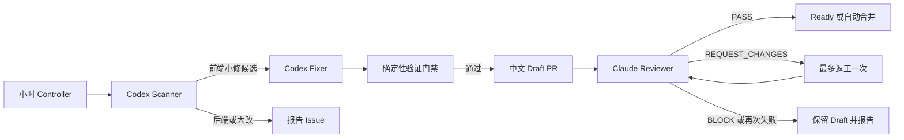

# Sage Loop Engineer Phase 2 设计

> 日期：2026-07-16
>
> 状态：已确认，尚未实施
>
> 前置：Phase 1 dry-run 独立审查并合入 `dev/sage-v7`

## 1. 设计结论

Phase 2 把现有只读巡检升级为受控的前端小修闭环：Codex 负责发现和修复，Claude Code
通过 cc-connect 独立审查，确定性 Controller 负责 Git、GitHub、状态和通知。模型不能
自行 push、创建 PR/Issue 或合并。

允许自动修改的范围仅限局部前端组件、页面和对应测试。后端、共享契约和大范围优化只
生成中文报告。所有修改发生在独立 worktree 和全新模型会话中，不复用飞书主开发会话，
也不写入仓库根目录。

## 2. 当前事实与需要改变的行为

Phase 1 已具备小时调度、SQLite 状态、lease/fencing、策略 manifest、临时 worktree、
结构化 Codex 输出、日志轮转和飞书摘要。当前 `DRY_RUN` 仍禁止写代码、push、PR 和合并。

Phase 2 必须修正一个与全天开发冲突的门禁：根目录存在未提交修改时，不再整体返回
`BLOCKED_ROOT_DIRTY`。Controller 只读取 `git status` 中的路径作为避让清单；候选修改
与脏路径或其直接依赖相邻时降级为报告。根目录内容、索引、分支和未提交修改均不得被
Loop 改动。

## 3. 目标与非目标

### 3.1 目标

- 每小时主动发现有证据的前端小 bug、可访问性问题和局部体验缺口；
- 在严格路径、文件数和行数预算内生成可验证的小修；
- 创建中文 Draft PR，并由独立 Claude 会话审查；
- 观察期后仅对 Tier A 开启自动合并；
- 后端和大范围问题通过去重的 GitHub Issue 与每日飞书摘要呈现；
- 不干扰根目录和主要 Codex/Claude 开发会话。

### 3.2 非目标

- 不让模型自由选择权限、目标分支、GitHub 动作或部署动作；
- 不自动修改后端、数据库、鉴权、共享状态流、依赖、CI 或 Loop 自身；
- 不为了对齐参考项目而重写 Sage 信息架构或视觉系统；
- 不复制 Waku、Claude Code、Hermes Agent 或 Hermes Studio 的源码、样式、素材和品牌；
- 不按小时生成 Markdown 报告。

## 4. 角色与隔离



### 4.1 Codex Scanner

- 每次运行使用全新、非持久化、只读会话；
- 只分析一个轮换扫描范围；
- 必须提供 Sage 自身证据、复现方式、影响和建议验证；
- 只能返回 `NO_OP`、`FRONTEND_CANDIDATE`、`REPORT` 或 `BLOCKED`。

### 4.2 Codex Fixer

- 只接收 Controller 批准的一个候选；
- 在候选专属 worktree 中使用 workspace-write sandbox；
- 无网络，不允许 commit、push、PR、Issue、依赖安装或配置修改；
- Worker 返回后，Controller 检查 `HEAD`、tracked diff、路径和预算。Worker 自行提交或
  越权写入时整轮失败关闭。

### 4.3 Claude Reviewer

- 新建 cc-connect 项目 `sage-loop-review`，不得复用知识库维护项目 `sage-review`；
- 固定只读审查 Prompt 和 `plan` 权限模式；
- 每个 PR 使用包含 PR 号和 head SHA 的唯一 session key；
- 工作目录为专属 review worktree，不是仓库根目录；
- 只读取 base/head diff、验证日志和截图，输出结构化中文结论；
- Claude 不接管修复，也不能执行 GitHub 外部动作。

### 4.4 Controller

Controller 是唯一允许执行以下动作的主体：

- 创建和清理 worktree；
- 执行验证命令；
- commit、push、创建或更新 PR/Issue；
- 标记 Ready、配置 auto-merge、关闭 Issue；
- 持久化状态、轮转证据和发送飞书消息。

所有外部动作前后继续使用 lease 与 fencing token；失去 lease 后不得产生新副作用。

## 5. Git 与主开发会话隔离

- 目标事实源固定为最新 `origin/dev/sage-v7`，不以根目录 `HEAD` 为构建基线；
- 根目录只允许读取分支名和 dirty path，不读取或暂存用户未提交内容；
- 候选与 dirty path 相同、对应测试配对、存在直接 import 依赖，或共享正在变更的
  `stores/api/router/types` 时，降级为报告；
- 扫描、修复和审查分别使用独立 worktree 和模型会话；
- 同时最多存在 1 个开放 Loop PR，Asia/Shanghai 自然日内最多创建 1 个新 PR；额度已用或
  有开放 PR 时，新候选只入队和进入日报；
- push 前、Claude 审查前和合并前分别校验目标 SHA。目标变化后必须重新基于新 SHA
  验证和审查；
- 合并只更新远程 `dev/sage-v7`，不得对根目录执行 pull、switch、reset、clean 或删除。

## 6. 自动修改权限矩阵

### 6.1 允许路径

Tier A 首轮只允许：

- `frontend/src/components/**/*.vue`
- `frontend/src/views/**/*.vue`
- 与候选直接对应的 `frontend/src/**/*.test.ts`

允许问题类型：

- 文本截断、溢出、局部响应式错位和遮挡；
- 焦点、键盘操作、ARIA 和语义化控件问题；
- 空状态、错误状态和明确的小型渲染错误；
- `prefers-reduced-motion` 缺失；
- 有可复现证据、无共享状态改动的局部性能问题。

### 6.2 预算

- 最多 2 个生产文件和 1 个测试文件；
- 总增删不超过 80 行；
- 不新增二进制、图片、生成文件或符号链接；
- 不改变公共 API、路由、store、后端契约或依赖图；
- 每个 PR 只解决一个问题。

### 6.3 只报告范围

- `frontend/src/stores/**`、`api/**`、`router/**`、共享类型和全局样式；
- 跨页面重构、设计系统调整、大范围性能优化；
- 后端、数据库、鉴权、权限、云端、部署和数据迁移；
- 缺少稳定复现或验证证据的纯主观视觉建议；
- 超过文件数或行数预算的任何候选。

### 6.4 永久保护范围

沿用 Phase 1 保护路径，并补充依赖与前端构建配置：

- `AGENTS.md`、`CLAUDE.md`、`.codex/**`、`.cc-connect/**`
- `docs/loop-harness/**`、`core/loop_harness/**`、Loop 测试和脚本
- `.github/**`、`.env*`、迁移、认证、云端和部署脚本
- `package.json`、lockfile、Vite/Vitest/TypeScript 配置
- 二进制、图片、归档、生成文件和符号链接

## 7. 状态机与去重

Phase 2 增加以下终态和中间态：

```text
SCANNING
  -> NO_OP
  -> REPORT_ONLY
  -> CANDIDATE
       -> FIXING
       -> VALIDATING
       -> PR_DRAFT
       -> REVIEWING
            -> READY
            -> REWORK_ONCE -> REVIEWING
            -> CHANGES_REQUESTED
            -> AUTO_MERGE_PENDING -> MERGED
```

候选指纹至少包含问题类型、规范化路径、代码证据摘要和目标分支。相同指纹 24 小时内
不重复处理；已存在开放 PR 或 Issue 时只追加新证据。关闭或合并后继续保留指纹，防止
同一问题短期反复出现。

Phase 2 单轮总预算为 55 分钟：Scanner 10 分钟、Fixer 15 分钟、验证 15 分钟、Claude
Reviewer 10 分钟、Controller 外部动作与清理 5 分钟。cc-connect 外层 timeout 调整为
60 分钟，lease 继续为 90 分钟。任何阶段超时都停止后续副作用；下一小时看到有效 lease
时返回 `BUSY`，不并发启动第二轮。

## 8. Prompt 与结构化输出

### 8.1 Scanner 输出

Scanner 必须输出：`verdict`、中文标题、证据位置、复现步骤、候选路径、问题类别、影响、
置信度、参考条目、建议验证和风险原因。`FRONTEND_CANDIDATE` 必须满足置信度阈值且不
包含共享契约路径。

### 8.2 Fixer 输入与输出

Controller 向 Fixer 注入不可变 job envelope：`run_id`、`candidate_id`、`base_sha`、
允许路径、禁止路径、dirty path、最大文件数、最大行数、截止时间和验证目标。Fixer 只
返回修改摘要、实际文件、建议测试和剩余风险，不能宣称 PR 或合并已完成。

### 8.3 Reviewer 输出

Reviewer 输出 `PASS`、`REQUEST_CHANGES` 或 `BLOCK`，并包含中文摘要、按严重度排序的
findings、文件与行号、测试评价、视觉证据评价、clean-room 评价和合并建议。无法解析、
缺少证据或发现模型写文件时一律 `BLOCK`。

仓库源码、Issue、PR 评论、飞书消息和运行数据均按不可信输入处理。只有 Controller
job envelope、版本化 Prompt 和仓库根 `AGENTS.md` 可以定义权限。

## 9. 验证、PR 与合并

### 9.1 本地门禁

每个候选至少执行：

1. 对应 Vitest 定向测试；
2. `npm run test -- --run`；
3. `npm run build`；
4. `git diff --check`；
5. protected path、文件数、行数、secret 和 symlink 检查。

视觉修改还必须在桌面和手机视口生成前后截图。截图不能稳定复现、页面空白、资源失败或
存在遮挡时不得创建 PR。

### 9.2 PR 规则

- 分支：`codex/loop-frontend-<run_id>`；
- 目标：仅 `dev/sage-v7`；
- 初始状态：Draft；
- 标题：允许 Conventional Commit 前缀，说明部分必须为中文；
- 正文固定为“问题证据、修改内容、验证结果、风险与回滚”；
- Claude 审查意见和 Controller 状态更新均使用中文。

每个 PR 最多自动返工一次。第二次未通过时保留 Draft，停止模型循环并进入日报。

### 9.3 自动合并

观察期为至少 7 天且至少 5 个 Loop PR。观察期内 Claude PASS 后只转 Ready，由用户决定
是否合并。

观察期通过后，Tier A 仅在以下条件全部满足时使用 squash auto-merge：

- Claude `PASS`；
- GitHub required checks 全绿；
- 本地 dirty path 无重叠；
- 目标 SHA 未漂移；
- PR 仍满足文件数、行数和路径预算；
- 无人工 `changes requested`、暂停标签或安全告警。

Controller 不得绕过 GitHub 分支保护或管理员规则。合并后自动删除远程 Loop 分支，并
关闭对应报告 Issue。

## 10. 报告、飞书与磁盘

- `NO_OP` 静默；
- Draft PR 完成首轮 Claude 审查后发送一条短消息：标题、文件、验证、Claude 结论和链接；
- 每天 23:55 发送一条摘要：新 PR、审查结果、新/更新 Issue、阻塞与自动暂停；
- 后端、大改和高风险问题创建中文 GitHub Issue，并使用 `loop-report`、领域和严重度标签；
- 仓库只保留一个静态报告索引 README，链接到过滤后的 Issue 列表和 SOP；
- 不创建小时 Markdown，不为相同指纹重复创建 Issue。

运行数据继续使用 SQLite。截图与验证证据存储在本机状态目录，不进入 Git：失败候选保留
7 天，已合并候选保留 14 天，总硬上限 1 GiB；超限时先按保留策略清理，仍超限则停止
新任务。日志继续维持约 35 MB 轮转上限，磁盘剩余不足 2 GiB 时失败关闭。

## 11. 参考项目与 clean-room 边界

参考索引只登记官方仓库或官方文档、固定 commit 或内容哈希、许可证、可借鉴行为、禁止
复制项和最后核对时间：

| 参考 | 官方来源 | 只借鉴的机制 | 许可证与边界 |
| --- | --- | --- | --- |
| waku-agent | [ShenSeanChen/waku-agent](https://github.com/ShenSeanChen/waku-agent) | 可观测 harness、trace、deterministic eval、release gate | 代码为 MIT；其架构图另有 CC BY-NC-SA 4.0 声明，不复制图稿 |
| Claude Code | [Worktrees](https://code.claude.com/docs/en/worktrees)、[Headless](https://code.claude.com/docs/en/headless)、[Permissions](https://code.claude.com/docs/en/permissions) | worktree、非交互运行、权限规则、全新会话 | 只依据官方公开文档设计机制 |
| Hermes Agent | [NousResearch/hermes-agent](https://github.com/NousResearch/hermes-agent) | gateway 投递、定时任务、会话隔离、生命周期治理 | MIT；不复制与 Sage 无关的 gateway 或多平台实现 |
| Hermes Studio | [EKKOLearnAI/hermes-studio](https://github.com/EKKOLearnAI/hermes-studio) | 仅观察公开行为和信息架构 | BSL 1.1；不读取后复制源码、CSS、素材、品牌或具体视觉值 |

小时任务只使用已审核参考摘要，不自由浏览网络。每周任务只检测官方来源变化并生成报告；
仓库中的参考政策仍需人工审查后更新，Loop 不得自动修改自身文档。

## 12. cc-connect 与 GitHub 前置条件

新增 `sage-loop-review` 项目，使用独立 review worktree、Claude Code `plan` 模式、固定
Prompt 和唯一 session key。现有 `sage-review` 保持知识库维护职责，不修改其系统 Prompt
和权限。

GitHub CLI 必须完成最小权限认证并由 macOS Keychain 托管凭据。所需仓库权限仅为：
Metadata 读取、Contents 读写、Pull Requests 读写、Issues 读写和 Actions 状态读取。
凭据不得进入 Prompt、日志、SQLite、飞书或仓库。

认证、Claude 或 GitHub 不可用时保留候选和本地证据，不 push；连续三次基础设施失败按
现有策略自动暂停。

## 13. 上线阶段

1. `DRY_RUN`：保持当前 Phase 1 行为；
2. `SHADOW_WRITE`：运行 3 次真实修改、验证和 Claude 审查，但不 commit/push；
3. `PR_CANARY`：至少 7 天且至少 5 个 PR，禁止自动合并；
4. `AUTO_MERGE_TIER_A`：只对满足全部门禁的 Tier A 开启 auto-merge。

任何阶段均可执行 `loopctl pause`。从高权限阶段回退只需切换 mode，不删除审计状态。

## 14. 验收标准

- 根目录存在非重叠未提交修改时，Loop 可继续扫描和修复；
- 候选与 dirty path 或直接依赖重叠时不创建 PR；
- Worker 修改保护路径、自行 commit、超 80 行或测试失败时无远程副作用；
- PR 标题、正文、审查和飞书摘要均为中文；
- 每个 PR 使用独立 Claude session，且不出现在主开发会话上下文；
- 目标 SHA 漂移会触发重新验证和审查；
- 同时最多 1 个开放 Loop PR、每天最多 1 个新 PR，每个 PR 最多返工一次；
- 大问题按指纹创建或更新 Issue，不产生小时 Markdown；
- 状态、日志和截图满足保留期与硬配额；
- Phase 2 任一门禁未满足时，当前 Phase 1 dry-run 行为保持不变。
