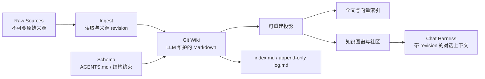

# Sage V7.5.5 知识图谱探索体验设计

## 1. 目标

知识图谱是 Git Wiki 的可重建探索投影，用于观察知识社区的紧密与稀疏、追踪节点的一跳关系并回到来源证据。它不是知识库事实源，也不替代主对话、Wiki 页面或学习 Harness。

本阶段解决三个已验证问题：全局布局挤成一团、标签同时抢占前景、选中节点后仍无法辨认关系。实现继续使用 Sage 既有 Graph API、Louvain 社区、Sigma.js 与 Inspector，不修改 Chat Harness 共享文件。

## 2. 不可偏离的知识架构

- Raw Sources 只读保留，不能被图谱或 LLM 覆盖。
- Wiki 是可审计、可回滚的知识正文，变更形成新的 Git revision。
- 全文、向量和图谱都是投影；投影损坏时必须能从已批准 Wiki 重建。
- 图谱节点和边只有绑定来源 evidence、page revision 与 source revision 后才可用于回答。
- 人负责策展来源、目标与异常；LLM 负责摄取、综合、交叉引用和一致性维护。

## 3. 图谱信息层级

### 3.1 全局态

- 社区感知的确定性初始布局，最大社区位于中心，其余社区按对称同心环分布。
- 来源节点继承其证据页面的社区，不再作为无意义的随机孤点散落。
- 节点大小由连接强度决定并严格限制上限，避免高连接节点遮住邻居。
- 默认只展示来自不同主要社区的少量代表标签；其他标签在悬停或聚焦时出现。
- Wiki 引用边和来源证据边使用不同透明度，背景边不得压过节点。

### 3.2 聚焦态

- 选中节点后只提升中心节点、一跳邻居和直接边。
- 无关节点与边保留空间位置但降低视觉权重，帮助用户理解局部关系在全局中的位置。
- 最多展示六个高价值邻居标签，优先 Wiki 页面，再按边权重和置信度排序。
- 相机平滑移动并缩放到选中节点；点击空白或关闭聚焦恢复全局态。

### 3.3 证据态

右侧 Inspector 负责回答“这条知识从哪里来”：

- 概览：Wiki 路径、所属社区、节点洞察和 revision 绑定；
- 证据：来源文件、关系类型、chunk、Wiki revision、Source revision；
- 连接：一跳邻居、节点类型、关系类型和证据数量。

V7.5.5 不直接在浏览器暴露原始文件内容或绝对路径。后续来源预览必须通过受权 Source API 返回限定片段，并继续保留 revision 与引用定位。

## 4. 与主对话的分工

- 主对话负责学习目标、提问、综合、笔记和受控知识更新。
- 图谱负责选取上下文、发现紧密社区、桥接节点、孤立知识和来源证据。
- Chat Harness 接收 `workspace_id + graph_revision + selected_node + page_revision + source_revision`，不得只传一段无来源文本。
- 图谱选择和 Chat/详情 Dock 的自动切换由 Harness 会话统一接线，本提交不修改另一并行会话维护的共享组件。

## 5. 当前边界与后续

本阶段交付前端表现层，不新增推断关系或图数据库。后续按顺序推进：

1. 社区折叠与社区级聚合节点，解决上千节点全局浏览；
2. 有权限的来源片段预览与 citation 定位；
3. 图谱筛选、桥接节点和知识缺口操作；
4. 与 Agentic RAG 的图遍历检索融合，并以真实检索 benchmark 验证增益；
5. 增量投影和大图谱性能预算。

## 6. 验收

- 171 节点真实工作区中，全局态可辨认多个社区与来源对，不出现大面积标签叠压；
- 选中节点后只突出一跳关系，聚焦终态可退出且不改变图数据；
- Inspector 使用人类可读的来源文件与关系名称，并展示 revision 证据；
- 移动端继续降级为可搜索节点列表；
- 组件测试、`vue-tsc --noEmit`、生产构建、浏览器桌面/平板/移动回归和 `git diff --check` 通过。

## 7. 参考边界

本设计参考 `nashsu/llm_wiki` README 所描述的 Raw/Wiki/Schema、Ingest/Query/Lint、持久队列、图谱社区与来源追溯等产品行为，以及 Obsidian 图谱的聚焦交互；不复制 GPLv3 项目的源码、CSS、资源或品牌。
