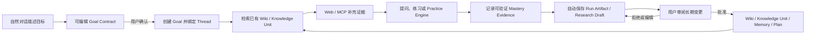
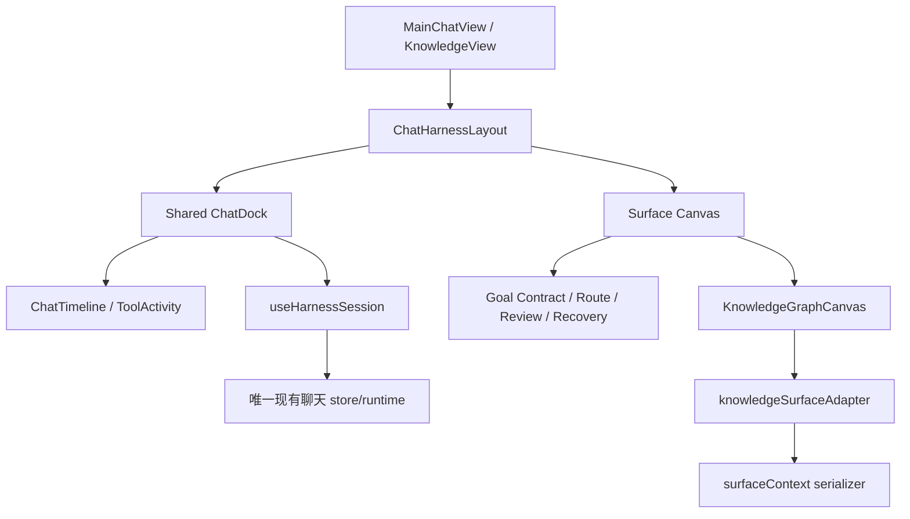

# Sage 目标驱动主对话与知识图谱前端体验设计

> 日期：2026-07-18
> 基线：`dev/sage-v7`
> 状态：方向 C 已确认；前端首批实现已完成本地验收，后端 H2.5C 契约由独立会话推进
> 范围：前端信息架构、视觉系统、交互、组件迁移和验收
> 不在范围：`core/harness/**`、`core/knowledge/**`、`api/**`、`db/**` 与共享后端契约实现

## 1. 设计结论

Sage 的主入口不是 Coding Chat，也不是一个文档搜索框，而是目标驱动的 Personal AI Learning Companion：用户先与 Sage 约定目标，Sage 读取已有知识、按需使用 Web/MCP 补充证据、组织提问与实践、记录可验证掌握度，并把新知识作为可审阅的增量提案沉淀回 Wiki、Knowledge Unit 与 Memory。

前端采用已确认的方向 C：

- 左侧是安静、稳定的全局导航与当前 Goal；
- 主对话中间展示完整目标路径、Harness timeline、工具事实、实践结果与掌握证据；
- Knowledge 中间始终保留知识图谱，节点选择只改变局部聚焦、详情和下一轮冻结上下文；
- 右侧复用唯一的可收起、可调宽 Chat Dock；
- 主对话显示完整运行状态，Knowledge 仅显示紧凑 Run Strip；
- Coding 只作为 Practice Engine 被目标路径调用，不再承担产品总入口。

本设计借鉴 Waku Agent Dashboard 的三栏信息架构、Obsidian Graph View 的图谱探索节奏、DeerFlow 的工具/MCP/Skills/Subagent 展示语义，以及 `llm_wiki` 的 Raw/Wiki/Schema 与可追溯知识组织原则；不复制其源码、品牌或受限制图形资产。

## 2. 产品对象与闭环

### 2.1 三层意图

| 对象 | 生命周期 | 用户问题 | 前端表现 |
| --- | --- | --- | --- |
| `Knowledge Purpose` | 工作区长期稳定 | 这个知识库为什么存在、收什么、不收什么 | Knowledge 左栏的目的说明与治理入口 |
| `Learning Goal` | 数天到数月 | 我希望形成什么可验证能力 | 全局 Goal 切换器、Goal Contract、路线与掌握度 |
| `Node Research Task` | 一轮或数轮对话 | 这个具体学习点还缺什么证据 | 图谱选中态、Context Receipt、研究分支与沉淀提案 |

Wiki 页面是可审计内容载体，标签用于检索、筛选和治理。只有具备明确学习价值、证据引用、关系和可验证产出的概念，才进入 `Knowledge Unit` 图谱。不能把每个标签自动升级为学习节点。

### 2.2 目标学习闭环



目标进度不由模型自评分决定。前端只展示后端返回的能力权重、证据状态和确定性聚合结果；缺少验证证据时使用“尚未验证”，不能显示虚构百分比增长。

## 3. 现状审计

### 3.1 已可复用部分

| 能力 | 当前文件 | 结论 |
| --- | --- | --- |
| 三栏 Harness 布局、Dock 收起/调宽、移动端画布/对话/详情 | `frontend/src/components/harness/ChatHarnessLayout.vue` | 直接复用，作为所有 Surface 的唯一布局壳 |
| 统一 Chat Dock、Run Strip、Context Footer | `frontend/src/components/harness/ChatDock.vue` | 直接复用，增加显示密度与上下文回执展示，不复制组件 |
| 消息、工具活动与时间线 | `frontend/src/components/harness/chat/**` | 直接复用，以 timeline 事实投影展示 |
| timeline 合并与状态投影 | `frontend/src/harness/timelineProjection.ts`、`runVisualState.ts` | 直接复用；缺失状态只列 contract gap |
| Surface context 序列化 | `frontend/src/harness/surfaceContext.ts` | 直接复用；Knowledge 继续冻结 node/page/revision |
| 单一 Harness 会话入口 | `frontend/src/harness/useHarnessSession.ts` | 保留唯一 runtime；当前内部仍依赖 `coding` store，后续只做渐进命名与边界收敛 |
| Knowledge Surface Adapter | `frontend/src/harness/surfaces/knowledge.ts` | 直接复用并补足 Goal/Knowledge Unit 显示投影 |
| Sigma + Graphology + ForceAtlas2 Worker | `frontend/src/components/knowledge/KnowledgeGraphCanvas.vue` | 继续使用，禁止无依据换库 |
| 图谱范围、目标路径、性能 profile | `knowledgeGraphPresentation.ts` | 扩展而非重写 |

### 3.2 明确问题

1. `CodingView.vue` 仍是主对话语义和 `coding` store 的主要承载者，产品心智容易退回 Coding Agent。
2. `KnowledgeView.vue` 同时承担数据请求、模式切换、图谱、列表、导入、审批和 Harness 接线，文件过大，视觉层与数据编排边界不清晰。
3. 当前图谱已经支持聚焦、社区、路径和性能 profile，但 Goal、Knowledge Unit、知识缺口之间的视觉语义不够稳定。
4. 图谱选中态依赖节点颜色与渲染层顺序；需要固定的双层选中环和 `zIndex`，避免深色节点被白色 hover/selection 层覆盖。
5. 当前 Run Strip 能投影 idle/running/tool/approval/failed/completed/recovering，但主画布缺少统一的目标定约、沉淀审批和断线恢复页面语义。
6. Knowledge 对话已经复用 `useHarnessSession`，但 `useHarnessSession` 名称与内部 store 仍带 Coding 历史包袱；不得以此为理由复制第二套 store/runtime。
7. Proposal 已有多类实现，前端缺少一处把自动保存的 Artifact 与需要批准的长期变更明确分开的统一审阅体验。

## 4. 方案比较

| 方案 | 主画布 | 优点 | 风险 | 结论 |
| --- | --- | --- | --- | --- |
| A 对话优先 | 大消息流，状态缩为侧栏 | 上手熟悉 | 目标闭环、知识与实践退化为聊天附件 | 不采用 |
| B 图谱优先 | 所有页面以图谱为中心 | 探索感强 | 目标定约、审批、恢复等任务不适合图谱承载 | 不采用 |
| C Surface 自适应 | 主对话显示完整状态流，Knowledge 保留图谱，右侧共享 Chat Dock | 保留任务与知识各自最合适的主画布，同时维持同一 Thread | 需要严格统一 context 与运行状态语义 | 推荐并已确认 |

## 5. 信息架构与响应式布局

### 5.1 桌面 1440

```text
┌──────────────┬──────────────────────────────────┬──────────────────────┐
│ 全局导航     │ 当前 Surface 主画布              │ Chat / 详情 Dock     │
│ 168-184px    │ minmax(0, 1fr)                   │ 360-520px，可收起    │
│ 当前 Goal    │ 主对话：完整路径与运行事实       │ 紧凑 Run Strip       │
│ Knowledge    │ Knowledge：图谱持续可见          │ 消息 / 审批 / 回执   │
└──────────────┴──────────────────────────────────┴──────────────────────┘
```

- 默认 Dock `420px`，保留现有 `360-520px` 拖动范围。
- 主画布不能因 Dock 内容变化产生宽度跳动。
- 页面区块使用分隔线和全宽区域，不新增卡片套卡片。
- 1440 是默认工作尺寸，必须保证主画布核心信息不出现横向滚动。

### 5.2 宽屏 1728

- 左栏不随屏幕无限放大；新增空间优先给主画布。
- Knowledge 同时保留全局导航、知识目录和默认 `420px` Dock 时，图谱可用宽度不低于 `840px`；收窄或收起 Dock 后新增空间全部交给图谱。
- 主对话路径允许双列展示“运行时间线 + 掌握证据”，不放大字号。
- 内容最大宽度只应用于文本段落，图谱和运行画布保持全宽。

### 5.3 移动端 390

- 使用 `画布 / 对话 / 详情` 底部切换，一次只展示一层。
- 主对话四个旅程页使用单列纵向滚动；页面本身不得横向滚动。
- Knowledge 在当前中小规模数据下继续保留 Sigma 图谱；超过移动端预算或 WebGL/容器异常时才降级为可搜索节点列表，选中后仍冻结相同 context。
- 顶栏只保留菜单、当前页面标题、Goal 进度摘要和更多操作。
- Composer、消息草稿、选中节点和 Thread 不因移动端视图切换丢失。

## 6. 四段旅程视觉

### 6.1 目标定约

自然对话先生成可编辑 `Goal Contract`，不能直接创建长期 Goal。主画布包含：

- 四步进度：目标结果、边界、验证标准、确认；
- 一句可编辑的目标结果；
- 时间、范围、实践方式和排除项；
- 三到五条可验证成功标准；
- 已使用的用户画像/上下文摘要；
- “确认并开始”主操作与“继续对话澄清”次操作。

此时 Run Strip 必须显示“未开始 / Goal 尚未确认 / no run”，六段轨迹均为 pending。

### 6.2 主动学习

主画布以“今天要完成什么”组织，而不是以模型消息组织：

- Goal 标题、进度、证据覆盖率和最近验证时间；
- 当前学习路径：已有知识检索 -> 外部证据 -> 练习/任务 -> 验证 -> 沉淀；
- 完整 Harness timeline，工具调用可下钻但默认折叠；
- Mastery Evidence：能力、权重、验证方式、状态和证据引用；
- 下一步动作必须来自计划或运行事实，不用营销式推荐卡。

### 6.3 沉淀审阅

主画布先区分两类结果：

- 自动保存：Run Trace、Research Draft、Practice Result、Tool Receipt；
- 需要批准：Wiki diff、Knowledge Unit、Mastery 更新、Plan 调整、Memory。

审阅默认打开影响最大的 Proposal，展示来源、目标 revision、diff、证据回执和长期影响。批准、拒绝、编辑是同级明确命令，不允许用模糊“完成”代替。

### 6.4 断线恢复

恢复页只显示已确认事实：

- 最后确认 sequence 与时间；
- 已完成、正在等待、尚未执行的事件；
- 保留的 Goal、Thread、surface context、receipts 与本地草稿；
- 重连倒计时、立即重连和停止重试。

恢复不能创建新的 timeline 事件来伪造“模型仍在思考”，也不能把断线前未确认的工具结果显示为完成。

## 7. Chat Dock 与 Context Receipt

主对话和 Knowledge 共用同一个 `ChatHarnessLayout + ChatDock + useHarnessSession`。

| 场景 | Dock 状态密度 | Context Receipt |
| --- | --- | --- |
| 目标定约 | idle；解释尚未创建 run | `draft_goal_context` |
| 主动学习 | 完整运行状态入口 | Goal、Thread、当前 plan step |
| Knowledge | 紧凑 Run Strip；图谱不被状态面板替换 | graph revision、node、page、page revision |
| 沉淀审阅 | approval；显示长期变更数量 | proposal id、base/target revision、evidence receipts |
| 断线恢复 | recovering；显示最后 sequence | Thread、冻结 context、本地草稿状态 |

选中 Knowledge 节点不会立即重写正在运行的 prompt。只有用户提交下一轮消息时，前端才把当时的 `graph_node / page / revision / graph_revision` 组装为 `surface_context`，由后端校验并冻结。提交前 Dock 显示“提交时冻结”的待提交 context；服务端回显冻结 receipt 后才能显示“已冻结”，避免用户误以为 Sage 能读取任意屏幕状态。

## 8. 运行状态视觉规范

所有状态来自 `timelineProjection + connectionState + operationRef`，动画不代表未被记录的模型思考。

| 状态 | 图标 | 主色 | 动效 | 文案要求 |
| --- | --- | --- | --- | --- |
| 未开始 `idle` | `Circle` | 中性灰 | 无 | 说明缺少哪个开始条件 |
| 运行 `running` | `LoaderCircle` | Sage 绿 | 仅图标匀速旋转；支持 reduced motion | 展示当前 stage 与起始时间 |
| 工具 `tool` | `PlugZap` | Sage 绿 | 仅 operation 存在时脉冲一次或旋转 | 展示真实工具名和 operation ref |
| 审批 `approval` | `PauseCircle` | 琥珀 | 无循环动画 | 展示阻塞原因与待处理数量 |
| 失败 `failed` | `XCircle` | 红 | 无 | 错误摘要、最后 sequence、可恢复动作 |
| 完成 `completed` | `CheckCircle2` | Sage 绿 | 一次性淡入，不庆典化 | 完成时间、证据和产物 |
| 恢复 `recovering` | `RotateCcw` | 证据蓝 | 仅连接重试期间旋转 | 最后 sequence、重试次数、保留内容 |

六段 Run Track 的每段必须对应 definition 中的真实 stage。pending、running、blocked、failed、completed、cancelled 使用稳定颜色；切换 Surface 不能改变已发生事件的状态。

## 9. Knowledge 图谱交互规范

### 9.1 节点语义

- `Knowledge Unit` 是可学习的概念/能力节点，不等于任意 Wiki 标签。
- Page、Source、Concept、Decision、Tool 等既有节点类型继续存在，但只有符合学习条件的节点显示“开始研究/生成练习/加入 Goal”动作。
- 节点详情必须同时显示：所属 Goal/社区、掌握状态、来源证据、Wiki page revision、最近验证和邻接关系。
- 无来源、无 revision 或低置信关系只能作为候选/缺口显示，不能伪装成 verified knowledge。

### 9.2 探索行为

1. 初始布局使用社区感知 seed；缺少缓存时启动 ForceAtlas2 Worker，布局稳定后保存坐标。
2. 拖动画布平移，滚轮/触控缩放，按钮提供放大、缩小和重置。
3. 悬停只提升节点、一跳邻域和高价值标签；其他节点/边渐隐但保持位置。
4. 点击节点后固定选中，平滑相机移动，右侧详情稳定更新；点击空白退出选中。
5. 选中节点与 Goal 之间可显示最短知识路径，路径边使用琥珀色，不与普通社区色混淆。
6. “全局 / 目标 / 局部”是范围分段控制；深度 `1/2/3` 只在局部/目标探索中改变投影。
7. 选中后发起提问会冻结当时 node/page/revision；随后移动图谱不改变正在运行的 context。

### 9.3 选中节点遮挡修复规范

- 节点填充色始终来自节点/社区颜色，不因选中改成黑或白。
- 选中态由两层独立圆环表达：内侧使用当前 Surface 背景色形成间隔，外侧沿用节点/社区色；圆环不得覆盖节点中心。
- 选中节点 `zIndex >= 6`，邻居 `zIndex >= 3`，边低于节点。
- hover 背景只能绘制标签气泡与环，不得在节点填充上方绘制不透明白层。
- 深色和浅色主题都必须用像素截图验证中心填充仍可见；选中、悬停重叠时选中态优先。

## 10. 图谱性能预算与降级

继续使用 `sigma`、`graphology`、`graphology-layout-forceatlas2/worker`。性能策略由节点数、边数和设备能力共同决定，不在主线程运行大图布局。

| 规模 | 默认范围与渲染 | 标签/边策略 | 布局与交互预算 |
| --- | --- | --- | --- |
| 约 200 节点 | 全局图谱完整渲染 | 社区代表标签 + hover/selected；保留 Wiki 主边与证据边 | 首次可交互 <= 1.5s；布局 <= 2.5s；拖拽目标 >= 50 FPS |
| 约 1k 节点 | 默认目标图谱或社区级入口，全局仍可手动进入 | 只显示 selected/hover/Goal path/高中心度标签；移动时隐藏边与标签；边按权重裁剪 | 首次可交互 <= 2.5s；布局 <= 4s；拖拽目标 >= 40 FPS |
| 约 5k 节点 | 默认社区聚合或 Goal 子图，禁止直接铺满全部标签 | 只渲染高价值骨架边；社区展开后增量加载；低价值证据边仅聚焦时出现 | 首次骨架 <= 3s；展开局部 <= 1s；拖拽目标 >= 30 FPS |

通用预算：

- 图谱渲染与布局不能让主线程连续阻塞超过 `50ms`；
- 布局超时后停止 Worker 并保留当前稳定坐标，不无限震荡；
- resize、筛选和选择必须合并刷新，避免反复销毁 renderer；
- `prefers-reduced-motion` 下取消相机惯性与非必要动画；
- 小于 `680px` 时，中小图继续保留 Sigma 探索；紧凑视口超过 `1200` 节点或 WebGL/容器异常时降级为节点列表，不显示空白画布；
- 5k 规模的社区聚合需要后端投影支持，在契约到位前前端只显示明确的“目标/局部范围”，不伪装已完成聚合。

## 11. 组件迁移与文件所有权



### 11.1 保持共享所有权

- `frontend/src/components/harness/**`：Chat Harness 共享展示层；任何 Surface 不得复制。
- `frontend/src/harness/**`：timeline、context、adapter、session 的唯一前端领域层。
- `frontend/src/stores/coding*`：当前真实聊天 runtime；迁移期继续作为唯一 store，不在 Knowledge 新建聊天 store。

### 11.2 建议新增的 Surface 展示组件

```text
frontend/src/components/growth/
  GoalContractCanvas.vue
  GoalRouteCanvas.vue
  MasteryEvidencePanel.vue
  DepositReviewCanvas.vue
  RecoveryCanvas.vue
  ContextReceipt.vue

frontend/src/components/knowledge/
  KnowledgePurposePanel.vue
  KnowledgeUnitShelf.vue
  KnowledgeGraphToolbar.vue
```

这些组件只接收 view model、展示状态并发出 command，不直接请求 API、不持有 session、不读取聊天 store。

### 11.3 建议收敛的页面文件

- 主对话页面只负责选择 Goal/Thread、组装 Surface view model 和提供 canvas/chat/details 插槽。
- `KnowledgeView.vue` 将导入、Wiki、活动、关注事项与图谱各自拆成 Surface 组件；页面保留数据编排和上下文组装。
- `KnowledgeGraphCanvas.vue` 保留 Sigma 生命周期与底层交互；Toolbar、详情和学习动作移出 renderer 组件。
- 不删除旧组件；只有确认无引用且测试覆盖后，才在后续独立提交移除。

## 12. 前端发现的 Contract Gap

以下只交由主 Harness 会话评估，本前端线不实现共享后端契约：

1. Thread 是否具备稳定 `primary_goal_id`，以及切换 Goal 时的显式规则。
2. Goal Contract 的草稿、确认、revision、成功标准和用户画像引用契约。
3. 能力权重、Mastery Evidence、验证状态与目标总进度的确定性聚合契约。
4. Knowledge Unit 与普通 graph node/tag/page 的可判定类型、学习状态和 Goal 关联。
5. 节点 RAG 的 Context Receipt：实际使用的 page/source/chunk/revision、裁剪原因和 token 预算。
6. Run Artifact 与长期 Proposal 的类型、base revision、状态机、批量批准和冲突处理。
7. Research Branch/Node Research Task 与主 Thread、Goal、父 run 的关联。
8. 恢复所需的最后确认 sequence、本地草稿对账和 operation ref 终态。
9. 1k/5k 图谱所需的社区聚合、增量邻域和稳定 graph revision 契约。
10. Goal、Knowledge、Coding Surface 是否共享同一 session API；前端不得通过复制 store 绕过缺口。

## 13. 可操作验收标准

### 13.1 结构与复用

- 主对话和 Knowledge 使用同一 `ChatHarnessLayout`、`ChatDock`、`useHarnessSession` 和消息 timeline。
- 仓库中不存在第二套 Knowledge chat store、WebSocket runtime 或 Composer 状态。
- Knowledge 页面选中节点后，中间图谱不被运行状态或对话替换。
- Dock 在 `360-520px` 可鼠标与键盘调整，并可收起；宽度刷新后恢复。

### 13.2 状态真实性

- 七种视觉状态都可由测试构造的 timeline/connection 输入稳定复现。
- 没有 timeline 事件时不显示“运行中”；没有 operation ref 时不显示工具动画。
- approval 明确显示阻塞项；recovering 明确显示最后 sequence；completed 显示产物与证据。
- `prefers-reduced-motion` 下所有循环动画停止。

### 13.3 Knowledge 交互

- 200 节点真实图谱中可平滑缩放、拖拽、hover、选择、清空选择和显示一跳邻域。
- 选中节点中心填充色在浅色/深色、hover/selected 重叠时始终可见，不被白层覆盖。
- 无关边渐隐，选中边与 Goal path 可区分；详情只随稳定选中变化。
- 下一轮发送前可查看 Context Receipt；发送后移动/切换节点不改变当前 run 的冻结 context。
- 1k/5k fixture 按性能 profile 降级，异常时出现节点列表而非空白画布。

### 13.4 响应式与视觉

- `1440x900`、`1728x1000`、`390x844` 无页面级横向溢出、无文字遮挡、无嵌套卡片。
- 390 下目标定约、主动学习、沉淀审阅、断线恢复均可单列完成主要任务。
- 颜色不是单一绿色：Sage 绿表示运行/确认，蓝表示证据/恢复，琥珀表示审批/路径，红表示失败。
- 控件使用 Lucide 图标、分段控制、复选框、菜单和明确命令；未知图标提供 tooltip/aria-label。

### 13.5 工程验证

- 新增/修改组件具备 Vitest 交互测试；timeline/context 纯函数保留单元测试。
- 在 `frontend/` 执行 `npm run test`、`npm run build`，并在仓库根目录执行 `git diff --check`，全部通过。
- 使用真实浏览器完成三尺寸截图、控制台错误检查、键盘 Tab/方向键和缩放回归。
- Sigma 画布做非空像素检查，并对 selected node 中心色做截图回归。

## 14. 分阶段实施计划

### P0：共享视觉底座

- 固化颜色、间距、边框、Run State 和 Context Receipt 规范；
- 扩展现有 Harness 组件，不改变 store/API；
- 为四段旅程建立纯展示 fixture 和组件测试。

### P1：主对话 Surface

- 将产品入口从 Coding 语义收敛为 Goal 主对话；
- 上线 Goal Contract、Goal Route、Mastery Evidence、Review、Recovery 画布；
- Coding 入口改为 Goal 路径中的 Practice Engine 导航，不删除旧功能。

### P2：Knowledge 联动

- 拆分 `KnowledgeView.vue` 展示组件；
- 将 Knowledge Unit、Context Receipt、紧凑 Run Strip 与共享 Dock 接通；
- 修复选中环、hover 遮挡和详情联动；完成 200 节点性能门禁。

### P3：大图谱降级

- 完成 1k fixture 的标签/边裁剪、Worker 布局和刷新合并；
- 后端社区聚合契约到位后接入 5k 社区级入口与增量邻域；
- 未到位前保持 Goal/Local 范围并显示真实限制。

### P4：闭环审阅与可用性收口

- 接入 Proposal diff、批量审阅、冲突与恢复；
- 完成移动端、键盘、reduced motion、暗色主题和截图回归；
- 更新产品文档与 Obsidian `sage-learning` 收口证据。

每一阶段独立分支、独立验证和少量职责清晰的 commit，通过 PR 合入 `dev/sage-v7`。任何阶段都不得把缺失后端契约用前端假数据长期掩盖。

## 15. 原型与审阅入口

本轮可交互网页原型位于忽略目录，不属于生产代码：

- `.superpowers/brainstorm/88159-1784369786/content/sage-harness-knowledge-prototype.html`
- `.superpowers/brainstorm/88159-1784369786/content/harness-run-state-spec.html`
- `.superpowers/brainstorm/88159-1784369786/content/goal-loop-architecture.html`
- `.superpowers/brainstorm/88159-1784369786/content/knowledge-foundation.html`

主原型提供 Main Chat/Knowledge、四段 Journey 与 `1440/1728/390` 切换，用于确认视觉与交互方向；它不是已交付功能。
