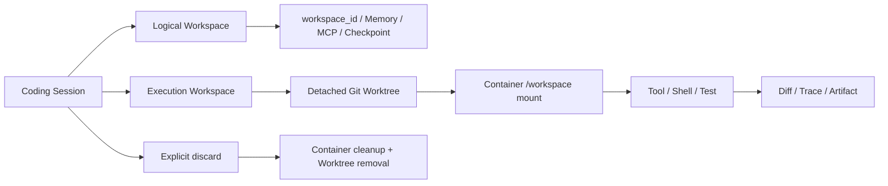

# Sage SEC-02：Disposable Session Workspace + Container 隔离

> 日期：2026-08-05
> 状态：已实现，待合入 `dev/sage-v7`
> 关联：SEC-01 `fix(coding): 主工作区危险 Shell 在 Policy 层拒绝`

## 1. PRD 摘要

### 问题

Container 之前可以把主工作区整体作为可写 mount。直接把 `runtime.workspace.root` 改成临时
worktree 又会让 `workspace_id`、Memory、MCP、Checkpoint 和恢复身份漂移。

### 目标

为一个 Coding Session 提供独立、可复用、可显式销毁的 Git 执行区，同时保持逻辑 Workspace
身份稳定：

- `local_workspace` 保持原有可信本地行为；
- `container` 创建 detached Git worktree，从当前 `HEAD` 开始，不复制主目录脏改动；
- Container 只把执行区挂载到 `/workspace`，不把逻辑主工作区作为可写 mount；
- 跨 Run、Approval interrupt 和进程重启复用同一 worktree；
- 显式 discard 释放 Container 与 worktree，但保留 Session、Diff、Test、Trace、Artifact；
- 任何描述符漂移、目录替换、Git 注册不一致或清理失败都 fail closed。

## 2. 顶层架构



| 面 | 责任 | 典型数据 |
| --- | --- | --- |
| Logical Workspace | 稳定身份与长期状态作用域 | `workspace_id`、Memory、MCP scope、Checkpoint |
| Execution Workspace | 本次 Session 的文件和工具执行根 | Plan、Skill、Worker、Tool、Diff、Container mount |
| Evidence | 保存可复核结果，不随执行区物理删除 | Session、Timeline、Run、Diff、Test、Trace、Artifact |

Runtime 保留兼容字段 `runtime.workspace`，但它只指向 execution workspace；新增代码必须显式
选择 `logical_workspace` 或 `execution_workspace`，禁止用物理路径推导逻辑身份。

## 3. 生命周期

```text
create Session
  -> local_workspace: primary descriptor
  -> container: git worktree add --detach <execution root> <HEAD>
  -> persist descriptor + logical workspace root
  -> run / approval interrupt / resume: restore and reuse same root
  -> explicit discard: active -> discarding -> discarded
  -> cleanup failure: keep discarding for retry, never fall back to primary
```

### 创建

- worktree 位置固定在服务端 `storage_root/execution-workspaces/<session_id>`；
- Session id 只允许有限字符集，Git 命令使用参数数组，不经过 Shell；
- 当前主目录的未提交和未跟踪改动不进入执行区；
- 创建中途异常会尝试移除已创建 worktree，失败也不把执行区标记成可用。

### 恢复

恢复会检查 descriptor 版本、Session 路径、Git 顶层、Git common dir、`.git` 元数据和实际
worktree 注册。执行根丢失、父目录被符号链接替换或注册关系漂移时返回冲突，不回退到主目录。
API 恢复和 `CodingRuntime.resume()` 都经过同一套校验。

### 销毁

销毁先核对 Container 的 Sage ownership label，再通过 `git worktree remove --force` 删除执行区。
`discarding` 是可重试状态；若崩溃发生在 Git 已清理、状态尚未落盘之后，下一次 discard 会安全
完成为 `discarded`。已保存的证据目录不删除。重复 discard 只读返回已落盘状态，不重复创建 Runtime
或销毁容器。

## 4. Container 契约

- mount source = execution workspace root；目标 = `/workspace`；唯一可写 bind mount；
- `network=none`、read-only rootfs、`cap-drop ALL`、`no-new-privileges`、seccomp、CPU/内存/PID/
  ulimit、独立 `/tmp` 和无 Docker socket；
- Container descriptor/name 使用 logical `workspace_id + session/thread` 派生；
- `discard_owned()` 只有在 Sage label 和 `sandbox_id` 完全匹配时才允许 `docker rm -f`；
- Container 不是 OS 安全边界的绝对保证，仍依赖受控 daemon、镜像和宿主配置。

第一版不增加第二个 `.git` mount。因此容器内直接执行依赖宿主 Git metadata 的命令不是本阶段
承诺；宿主侧 Git status/Diff 和执行证据仍可复核。后续如需容器内 Git 完整能力，单独设计最小
只读 metadata/对象访问方案，不把主工作区重新暴露为可写 mount。

## 5. API 变化

`CodingSessionResponse` 新增：

```text
execution_workspace_root
execution_workspace_kind: primary | git_worktree
execution_workspace_status: active | discarding | discarded
```

新增：

```http
POST /api/v1/coding/session/{session_id}/discard
```

仅 disposable Session 可调用；活跃 Run 返回 `409`，清理暂未完成返回 `503`，不允许静默回退或
删除其他 workload 的 Container。

## 6. 验收与证据

- 目标回归：`93 passed, 1 warning`；
- 后端全量：`1759 passed, 11 skipped, 1 warning`；
- Ruff lint、Ruff format、mypy（212 个源文件）、`git diff --check` 通过；
- 前端 Vitest：`505 passed`；
- 前端 `vite build` 与 `vite build --config vite.public.config.ts` 通过；
- 覆盖：跨 Run/重启复用、执行根丢失拒绝、父目录符号链接拒绝、discard 崩溃恢复、重复 discard、
  Container ownership、防止 local primary 回归。

## 7. 明确非目标与下一阶段

本阶段不做：自动 merge、自动 push、自动 `git reset --hard`、Container 销毁后恢复源码、把
worktree 当 OS 安全边界、直接回退 Local、Memory/RAG/Kubernetes/image digest、Claude OS Sandbox
或 OpenClaw `none/ro/rw` 权限模式。

下一阶段建议拆为 SEC-03：Permission 与 OS Sandbox 分离、`none/ro/rw` Workspace access、
Linux bubblewrap/macOS Seatbelt 适配、以及容器内 Git metadata 的最小可用方案。
