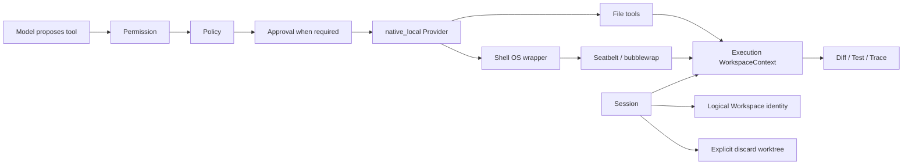

# Sage SEC-03：Native Local Sandbox

> 日期：2026-08-05，2026-08-06 收口  
> 状态：已实现，门禁通过，待 PR  
> 前置：SEC-01 Policy fail closed、SEC-02 disposable session workspace

## PRD 摘要

### 问题

`local_workspace` 当前是可信 Host Adapter。即使 Permission/Approval 通过，Shell 和原生
文件工具仍可能直接作用于 primary workspace；这不满足本地自动运行的安全边界。

### 目标

- 新增 `native_local` Provider，复用现有 `SandboxPort` 契约。
- Session 使用 detached Git worktree 作为 execution root。
- `write_file`、`patch_file` 等文件工具只操作 execution root。
- Shell 在 macOS 使用 Seatbelt (`sandbox-exec`)，Linux 使用 bubblewrap (`bwrap`)。
- 默认拒绝网络和 execution root 外的读写，不具备可用后端时 fail closed。
- 保留 `local_workspace` 作为明确的 trusted 开发兼容模式。

### 与 SEC-02 的区别

| 阶段 | 解决的问题 | 本轮是否新增 |
| --- | --- | --- |
| SEC-02 | 创建、恢复和显式销毁 detached worktree；Container 只挂载 execution root | 否，直接复用 |
| SEC-03 | 本地 Shell 经过 Seatbelt/bwrap；文件工具只拿 execution `WorkspaceContext` | 是 |
| 生产边界 | 生产继续使用 Container，原生沙箱不替代生产隔离 | 是，显式 fail closed |

## 顶层架构

## 责任边界

| 层 | 责任 | 不负责 |
| --- | --- | --- |
| Permission / Policy / Approval | 是否允许执行、是否需要人工确认 | OS 级文件访问 |
| `native_local` Provider | 选择 OS 后端、路由文件工具与 Shell、拒绝 Host fallback | 改变长期 Memory/Checkpoint 身份 |
| WorkspaceContext | execution root containment、protected path、写入 freshness | 进程隔离 |
| Seatbelt / bubblewrap | Shell 子进程的读写、网络和进程边界 | Sage 工具审批 |
| ExecutionWorkspaceManager | disposable worktree 的创建、恢复、discard | OS 内核安全 |

## 外部实现简对比

| 系统 | 简化实现 | Sage 本轮取舍 |
| --- | --- | --- |
| Claude Code | Permission 决定是否调用，Bash OS Sandbox 再限制文件与网络；macOS/Linux 使用平台原生隔离能力 | 采用同样的授权/隔离分层，不推断其未公开内部实现 |
| DeerFlow 2.0 (`99c926b`) | `SandboxProvider.acquire/get/release` + LangGraph middleware；Local 直接映射宿主路径，AIO 使用 Docker/Apple Container，另有 E2B/Kubernetes/microVM provider | 复用 provider port 与 thread/session 复用思路，但保留 Sage 自己的 Approval、Checkpoint、Timeline 和 logical workspace identity |
| Hermes (`9de9c25`) | `BaseEnvironment` 统一 Local/Docker/SSH/Singularity/Modal/Daytona；Shell 与文件工具共用 backend；Docker 可按 task/profile 跨 session 复用 | 借鉴 backend 统一和持久 execution environment；不采用其默认 Local host，也不默认开放网络或挂载 launch cwd |

## 明确边界

- 不把 primary workspace 交给 `native_local`。
- worktree 可以沿用 `.coding/execution-workspaces` 的受控物理布局；Seatbelt 对 primary 使用
  deny 规则后仅重新放行 execution root，bubblewrap 则只把 execution root 映射为 `/workspace`。
- 不把 worktree 当成 OS 安全边界。
- `sandbox-exec` 已被 Apple 标记 deprecated，本 Provider 只用于 development/test；生产继续使用
  Container 或更强的整进程隔离。
- 不自动 merge、push、reset 或恢复源码。
- 不要求跨 Run 保留 Shell 进程；Session worktree 跨 Run 保留即可。
- Git metadata 不作为容器或 native Shell 的完整能力承诺；宿主侧 Diff/Test/Trace 保留证据。
- `local_workspace` 不改成伪装的隔离模式。
- OS Sandbox 约束 Shell 进程树；进程内文件工具依赖 `WorkspaceContext` containment，不能把两者
  混称为整进程隔离。
- Seatbelt 仅重新放行 execution root、临时目录和必要运行时目录；因此“禁止读取 Host”存在
  明确的 runtime allowlist 例外，不使用绝对安全措辞。

## 配置迁移

- `.env.example` 的本地默认 Provider 已切换为 `native_local`。
- `local_workspace` 仍保留为显式的可信开发兼容模式，未宣称具备 OS 隔离。
- 本轮不把 `native_local` 强制切换为所有测试夹具的代码默认值；没有 Git 仓库或没有原生后端时，Session/Run 按设计失败，不回退到 primary Host Shell。

## 验收

- native provider 的文件写入只出现在 execution root。
- primary root 与受保护路径无法通过 native Shell 读取或写入。
- macOS 命令包含 `sandbox-exec`；Linux 命令包含 `bwrap --unshare-all` 和只读系统根。
- 缺少 `sandbox-exec`/`bwrap` 不回退到普通 Host Shell。
- primary execution workspace 被传给 native provider 时立即 fail closed。
- existing container/local contract 与 SEC-01/SEC-02 回归保持通过。

## 验证证据

- SEC-03/生命周期聚焦回归：`135 passed, 1 warning`；包含 nested worktree 的真实 Run 创建路径、
  Approval、execution workspace 与 Sandbox contract。
- 后端全量：`1778 passed, 11 skipped, 1 warning`；Ruff lint、Ruff format、mypy
  （213 个源文件）通过。
- 前端 Vitest：`506 passed`；私有与公开两套 Vite 生产构建通过。
- macOS Seatbelt live：execution 写入通过，primary/任意宿主路径读取拒绝，primary 写入拒绝，
  loopback 网络拒绝，只读模式写入拒绝，不能向沙盒外宿主进程发送信号。
- Linux bubblewrap：本机没有 `bwrap`，仅完成参数契约验证，未宣称 Linux live 通过。

## 关联稳定性修复

- `CodingView` 卸载后不再继续异步恢复路由或访问 `sessionStorage`。
- Approval 等待不再向默认线程池提交最长 300 秒的阻塞任务，应用关停和 checkpoint-backed
  Approval restart 不会因此等待线程池耗尽。

## 遗留边界

- 当前内部能力已有 `rw` 与 `ro`（`allow_writes=False`），但还没有面向配置/API 的
  `none | ro | rw` Workspace access 枚举；`none` 留到独立最小需求再做。
- 代码级兼容默认仍是 `local_workspace`，`.env.example` 推荐 `native_local`；没有 Git 仓库或
  原生后端时保持 fail closed，不自动回退。
- 不要求跨 Run 保留 Shell 进程；只复用 Session worktree 和持久化证据。
