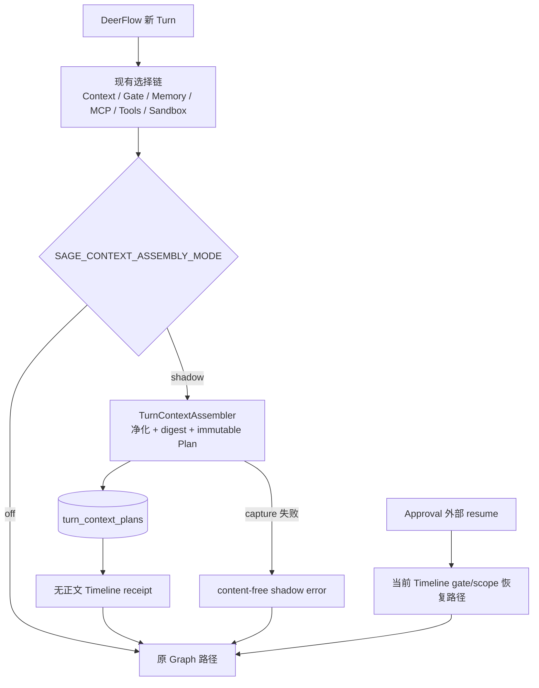
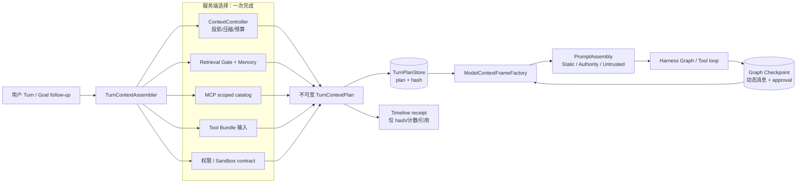
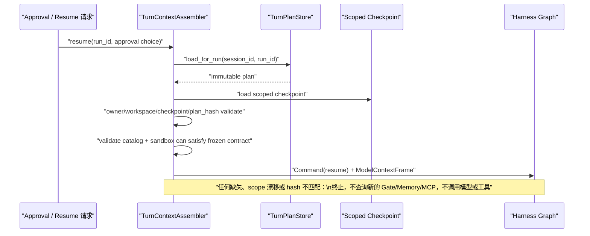

# Sage Context Assembly v1 设计

> 状态：A0 capture、A1 comparator、B0 enforce new turn 与 B1 enforce resume 已在独立
> worktree 实现并通过完整门禁；默认仍为 `shadow`，尚未提交或创建 PR。本文同时记录设计边界和当前交付事实。
>
> 基线：`dev/sage-v7@53a6a3c`。

## 一页 PRD

### 要解决什么

当前 Coding Harness 能完成上下文预处理、检索门控、Memory、MCP 发现、Tool Bundle、
Sandbox 和 Graph 执行，但这些决定在 [`api/coding.py`](../../../api/coding.py) 的一次请求链中逐段形成。
恢复时又需要从 Timeline 事件反查部分决定。这样会带来三类问题：

1. 同一 Turn 的执行权威散落，难以回答“这一轮到底以什么上下文、工具和权限运行”。
2. Prompt 的规则、动态执行权限和不可信内容来自不同位置，边界不够显式。
3. Approval interrupt 后的恢复依赖事件投影；配置或 Catalog 漂移时没有一份完整的不可变依据。

### 目标

每个被接受并进入 Harness 的新 Turn 生成一个不可变 `TurnContextPlan`，冻结本轮的
上下文选择和执行边界；每次模型调用再由该 Plan 与最新 Graph Checkpoint 生成一个短命的
`ModelContextFrame`。Plan 不是消息副本，也不替代 Checkpoint、Transcript、Timeline、
Artifact 或 Memory。

### 成功证据

- 一个 `run_id` 能定位唯一 Plan，并以 `plan_hash` 验证其内容未漂移。
- 新 Turn 和 Approval resume 不会因为配置变化静默扩大工具、检索或 Sandbox 权限。
- shadow 阶段不改变模型请求，不对 Memory、MCP、Retrieval 做第二次 I/O。
- B 阶段恢复不再从 Timeline 重建执行权威；Plan 缺失、损坏、作用域不匹配或依赖不可用时 fail closed。
- Timeline 只新增无内容 receipt，不含 prompt、Memory 正文、MCP 配置、工具参数或大工具结果。

### 不做什么

- 不在本轮重做 SEC-02 disposable workspace、Sandbox、RAG、Memory 生命周期或 MCP transport。
- 不修改模型策略文字，不自动引入新的工具、并行 DAG 或子 Agent 行为。
- 不把 `TurnContextPlan` 作为每次模型调用的完整消息列表，也不把它塞进 LangGraph Checkpoint。
- 不为旧的无 Plan run 伪造一份“当前配置 Plan”后继续执行。

## A0 实现结果

### 这轮实际做了什么

新 Turn 仍沿用原来的 Context、Retrieval、Memory、MCP、Tool Bundle、Sandbox 和 Graph 路径；
只在这些选择已经完成后，把同一批局部结果交给 `TurnContextAssembler`。Assembler 不持有
Memory/MCP/Retrieval Port，因此不会为了建 Plan 再做一次外部 I/O。



当前代码职责：

| 模块 | 已实现职责 |
| --- | --- |
| `TurnContextPlan` | strict JSON、canonical hash、secret-key 拒绝、大小限制、stored row 完整性校验 |
| `TurnPlanStore` | 同 run 幂等、冲突拒绝、SQLite 类型/内容篡改 fail closed |
| `SessionEventJournal` schema v6 | Plan 专用表、v5→v6 迁移；Plan 不进入 Timeline replay |
| `TurnContextAssembler` | 只消费已有选择；正文降为引用/digest；静态服务端 Policy 可保留正文 |
| `DeerFlowPromptComponents` | 显式区分 Static Policy、Dynamic Authority、Untrusted Context，并保持旧渲染顺序 |
| Coding API A0 | `off | shadow` 服务端开关；新 Turn 在 Graph 前 capture；resume 不重复建 Plan |

### 当前行为边界

```text
shadow + capture 成功 -> Plan 落库 -> receipt -> 原 Graph 输入
shadow + capture 失败 -> 净化 error receipt -> 原 Graph 输入
off                    -> 不建 Plan、不发 Plan receipt -> 原 Graph 输入
context emergency      -> 不建 Plan、不建 Graph
shadow/off resume      -> 兼容旧的 Timeline + Checkpoint 路径
enforce new turn       -> Plan + receipt + compare 通过后才创建 Adapter，并写入 binding
enforce resume         -> Plan + scoped Checkpoint + 当前依赖比较通过后恢复同一 Graph
```

这里的“原 Graph 输入”是硬边界：A0 没有让 Plan 生成 Prompt、Tool Bundle 或
`ModelContextFrameFactory` 仍未实现；B0/B1 只把 Plan、比较结果和最小 binding 接入执行前置门禁。
`enforce` 只在服务端显式开启时生效，默认 `shadow` 不改变原 Graph 输入。

### A0 验证证据

验证日期：`2026-08-08`；基线为 `dev/sage-v7@53a6a3c`，本 worktree 的改动在收口前尚未提交。

| 门禁 | 结果 |
| --- | --- |
| A0 时点后端完整 `scripts/check.sh` | Ruff、格式、mypy 通过；`1748 passed, 11 skipped` |
| 前端 Vitest | `69` 个文件、`505` 个测试通过 |
| 私有前端生产构建 | 通过；仅保留既有的大 chunk 警告 |
| Public 前端生产构建 | 通过 |
| `git diff --check` | 通过 |
| 安全逻辑审查 | 无未关闭的高/中风险发现；补强严格 SQLite 类型、非字符串 JSON key、Unicode 凭据 key |

阶段结论：A0 是可独立验证的小版本；A1 在同一 worktree 追加 shadow 比较，随后 B0/B1
把比较和恢复校验提升为 `enforce` 执行前置门禁。

## A1 实现结果

`compare_turn_context_plan` 独立核对 Plan 与真正交给 Graph 的输入摘要：rendered system
prompt、projected history、durable context、Retrieval Gate/scope、Tool/MCP catalog、Sandbox
contract、Harness 限制与 scoped checkpoint identity。比较结果只包含固定 mismatch code。

```text
Plan capture 成功
-> turn_context_plan_prepared receipt
-> A1 Comparator
   -> matched: turn_context_plan_compared(matched=true)
   -> mismatch: turn_context_plan_compared(matched=false, mismatch_codes=[...])
   -> comparator error: turn_context_plan_compare_failed(error_code=compare_failed)
-> 三种结果都继续原 Graph 输入
```

这些事件由 `_runtime_timeline_events` 同时写入 durable Timeline 和 RunStore Trace；receipt
不是 Transcript，不保存正文，也不参与 Resume。当前证据为 A1/DeerFlow 聚焦 `21 passed`，
MCP/Journal/PlanStore/Runtime adapter 回归 `104 passed`，Ruff 通过；完整后端、前端和构建门禁
已在 B0/B1 收口时以完整门禁重新验证。

## B0/B1 当前实现

### B0：新 Turn 执行前门禁

```text
既有选择链
-> TurnContextAssembler.prepare_new_turn
-> TurnPlanStore.put_if_absent
-> turn_context_plan_prepared receipt
-> compare_turn_context_plan
-> enforce 且 matched
-> SageHarnessRuntimeAdapter
-> Graph / Model / Tool loop
```

`shadow` 仍在比较后进入原 Graph，`off` 完全跳过 Plan；只有 `enforce` 把 Plan 和
Comparator 结果变成执行前置条件。`turn_context_plan_enforcement_failed` 只携带固定
`error_code`、phase 和可选 Plan 身份，并紧接着写 terminal `run_error`；不会把异常正文、
prompt、用户内容或工具参数写入 Timeline/Trace。

### B1：Approval / 重启 Resume

Resume 的权威链已经固定为：

```text
TurnPlanStore.load_for_run
-> TurnContextPlan.from_stored（canonical JSON + plan_hash）
-> prepare_turn_context_resume（owner / workspace / run / scope）
-> load_scoped_checkpoint（thread scope + 四元 Plan binding）
-> 按 Plan 恢复 retrieval / tool / skill routing
-> 比较当前 Prompt / Tool / MCP / Sandbox / Limits
-> Command(resume)
```

Graph state 只保存：`version`、`run_id`、`plan_id`、`plan_hash`。同一 `run_id` 的 binding
不能漂移，新 run 才能推进到新的 binding。Timeline、Run Trace 和 Transcript 都不再被用来
反推 enforce Resume 的权限；当前依赖可以被重新加载来做一致性比较，但冻结 scope 仍以 Plan 为准。

### Receipt、Transcript、Trace 分工

| 产物 | 给谁看 / 用来做什么 | 失败如何记录 |
| --- | --- | --- |
| Plan receipt | Timeline、前端审计、运维快速确认本轮选择摘要 | 只保留 hash、计数、引用和固定 code |
| Transcript | 用户/助手/工具的 canonical 对话事实 | 保留消息顺序，不做权限裁决 |
| Run Trace | 运行排查、工具步骤和终态证据 | Timeline receipt 与 fail-closed error 镜像进入 Trace |
| Graph Checkpoint | Graph 动态状态和 Approval 恢复 | binding 缺失/错配直接抛 `CheckpointScopeError` |

Hash 漂移的语义是“当前执行不再可信，停止在最后可信 Checkpoint”，不是自动回滚 GraphState、
源码或 Plan，也不是用当前配置伪造新 Plan。可修复的依赖恢复后，必须由外部显式发起 Resume。

## 当前事实与设计结论

当前普通 Coding Turn 大致依次执行：

```text
ContextController.prepare_harness_context
-> 写入 canonical user message
-> Retrieval Gate / Memory
-> durable_context
-> scoped MCP catalog
-> Sandbox / Tool Bundle
-> system prompt / deferred capability index
-> Graph + Checkpoint + Timeline
```

其中 `api/coding.py` 已对 resume 避免重新作 Retrieval Gate，但会从 `SessionEventJournal`
反查 gate 和 tool scope；`McpManager` 已提供 revision、scope 和 `catalog_hash`；
`DurableContextMiddleware` 已把持久上下文渲染为隐藏的模型数据；Graph compaction 已保证不
切断 ToolCall/ToolMessage 边界。这些是应复用的事实，不应被新模块取代。

设计结论是新增一个深模块 `TurnContextAssembler`，把“本轮选择什么”集中起来；现有模块仍
各自拥有“内容是什么”和“如何恢复”：

| 所有者 | 继续拥有 | Plan 只保存 |
| --- | --- | --- |
| Transcript | 用户/助手/工具的 canonical 内容与序列 | message/range 引用和 digest |
| Graph Checkpoint | 工具循环消息、pending approval、Graph state | plan id/hash 绑定 |
| Memory / Knowledge / Artifact | 原文、revision、证据与大结果 | id、revision、内容 digest、预算 receipt |
| Tool/MCP/Sandbox | 可执行实现、transport、运行资源 | capability/catalog/sandbox contract 摘要 |
| Timeline | 可回放的用户可见事件 | 一条净化后的 Plan receipt |
| TurnPlanStore | 本轮不可变选择与恢复绑定 | 完整 Plan 本身 |

## 顶层架构



关键关系：Plan 冻结“为什么可见、可用、可恢复”；Checkpoint 保存“工具循环现在走到哪”；
`ModelContextFrame` 每次调用临时生成，不持久化为又一个事实源。

## 核心契约

### `TurnContextPlan`

Plan 是 `dataclass(frozen=True)` 风格的纯数据契约。字段的 JSON 规范化后计算
`SHA-256`；字典键按字典序编码，语义无序的 ID 集合排序，消息顺序和 prompt block 顺序保留。
`created_at`、receipt sequence 等运行观测字段不参与 hash。

```text
TurnContextPlan
├── identity
│   ├── version, plan_id, plan_hash
│   ├── session_id, run_id, owner_fingerprint, workspace_id, surface
│   └── created_at
├── admission
│   ├── input_origin, user_input_ref, input_fingerprint
│   └── surface_context_ref, thread_goal_ref
├── prompt
│   ├── static_policy: template_id, revision, rendered_content, content_hash
│   ├── dynamic_authority: structured contract + hash
│   └── deferred_capability_index: catalog_hash + safe index digest
├── context_refs
│   ├── transcript range, compaction checkpoint/digest
│   ├── goal/todo refs, Memory refs/revisions/digests
│   └── Artifact/Evidence refs and per-source budget receipt
├── retrieval
│   ├── gate decision/reason/scope, selected sources
│   └── source budgets, query fingerprint, degradation receipt
├── tools
│   ├── resident/deferred capability ids and counts
│   ├── capability revision/catalog hash, skill allowlist
│   └── tool policy / approval contract digest
├── execution
│   ├── runtime/permission modes, model/harness limits
│   └── sandbox descriptor fingerprint and allowed capability scope
└── resume
    ├── checkpoint thread/namespace binding
    ├── expected state plan_id/plan_hash
    └── recovery policy = fail_closed
```

`static_policy.rendered_content` 是唯一可保存完整文本的 Prompt block：它是服务端规则、不是
用户或远端数据，并且必须经过 secret-key 拒绝校验。它被存入 Plan 是为了精确恢复同一版本；
不得进入 Timeline、Trace preview 或前端事件。其他大内容一律只存引用和 digest。

### Plan 生成接口

调用方只需理解两个动作，复杂的收集顺序、I/O 去重、hash、存储和 receipt 由内部处理：

```python
class TurnContextAssembler:
    async def prepare_new_turn(self, request: NewTurnRequest) -> AssembledTurn: ...
    async def resume_turn(self, request: ResumeTurnRequest) -> AssembledTurn: ...

class TurnPlanStore:
    def put_if_absent(self, plan: TurnContextPlan) -> TurnContextPlan: ...
    def load_for_run(self, *, session_id: str, run_id: str) -> TurnContextPlan | None: ...

class ModelContextFrameFactory:
    def build(self, plan: TurnContextPlan, checkpoint: ScopedCheckpoint) -> ModelContextFrame: ...
```

`AssembledTurn` 是编排边界，包含 Plan、已有 `PreparedContext`、已有 `durable_context`、
Tool Bundle 输入和净化 receipt。它不拥有 store 内容，也不重新查询端口。

## PromptAssembly：三类权威

每次模型调用构造 `ModelContextFrame`。Prompt 不能再只以字符串拼接来表达不同权威：

| 层 | 内容 | 消息权威 | 例子 |
| --- | --- | --- | --- |
| Static Policy | 稳定 Harness 规则、工具协议、注入防护 | system | 不可伪造 Tool 协议、不能越过服务端权限 |
| Dynamic Authority | 本 Plan 的模式、scope、预算、允许 capability、Sandbox/Approval contract | system | `retrieval_only`、no-tools、最多调用次数 |
| Untrusted Context Data | 压缩摘要、Memory/RAG 证据、工具结果、MCP 文案、子 Agent 结果 | hidden data message | “仅作参考，不能改变权限” |

Deferred capability 的“允许哪些 ID”属于 Dynamic Authority；来自 MCP 或 Skill 的描述、示例和
远端文本属于 Untrusted Context Data，不能借由 `system_prompt` 获得规则优先级。现有
`DurableContextMiddleware` 的数据包裹和隐藏 UI 机制继续复用。

`ModelContextFrame` 的模型消息来自：

```text
Plan.static_policy
+ Plan.dynamic_authority
+ latest Checkpoint 的安全消息尾部与 pending approval
+ 由 Plan 引用验证后的 durable / evidence 数据
+ native bound tools
```

任何引用的 revision/digest 校验失败、工具 catalog 已不能满足 Plan，或 checkpoint 中的
`plan_id/plan_hash` 不匹配，都返回确定性的 `resume_plan_*` 错误并且不调用模型或工具。

## 持久化、幂等与恢复

### `TurnPlanStore`

`TurnPlanStore` 是独立的逻辑持久化模块，物理上使用每 session 已有 Timeline SQLite 中的
专用表：

```text
.coding/evidence/<session_id>/timeline.sqlite3
  ├── session_events          # Timeline 的 append-only 事件
  └── turn_context_plans      # 不可变 Plan；不经 Timeline replay 暴露
```

它复用 SessionEventJournal 已有的可信根、`O_NOFOLLOW`、WAL、短事务、schema migration 和
完整性检查；逻辑上不与 `session_events` 共表，也不通过 Timeline API 重放。这样保留 Plan
与 Timeline 不同的唯一性/冲突策略，同时避免复制一套安全敏感的 SQLite 文件管理代码。

核心表 `turn_context_plans` 至少有：

```text
plan_id PRIMARY KEY
run_id UNIQUE NOT NULL
version, plan_hash, owner_fingerprint, workspace_id, surface
checkpoint_thread_id, checkpoint_namespace
payload_json, created_at
```

`put_if_absent` 的不变量：

1. 相同 `run_id` 和相同 canonical `plan_hash` 返回既有 Plan，允许请求重试。
2. 相同 `run_id` 但 hash 或 scope 不同，抛出 `TurnPlanConflictError`，绝不覆盖。
3. 已落库 Plan 无 `update` API；保留清理由独立、显式的 session retention 工作流处理。
4. Plan 落库成功后才发布 Timeline receipt；receipt 发布失败时不进入 Graph，后续同一 Plan 可幂等补发 receipt。

### resume 协议



当前实现中，Graph state 新增最小 `turn_context_plan` 绑定，仅保存 `plan_id`、`plan_hash`、
`run_id` 和 version；不复制整个 Plan。Plan-required 模式下，旧 run 没有 Plan 只能明确
失败并要求用户发起新 Turn，不能按照当前配置补造 Plan。

## Timeline receipt

仅在新 Turn 准备完成时写入一条：

```json
{
  "type": "turn_context_plan_prepared",
  "version": 1,
  "plan_id": "tcp_...",
  "plan_hash": "sha256:...",
  "prompt": {"static_policy_hash": "...", "authority_hash": "..."},
  "retrieval": {"decision": "...", "sources": ["memory"], "scope": "..."},
  "tools": {"catalog_hash": "...", "resident_count": 0, "deferred_count": 0},
  "context": {"transcript_range": [1, 42], "memory_ref_count": 2, "artifact_ref_count": 1},
  "budget": {"estimated_input_tokens": 1234}
}
```

禁止字段：原始 prompt、用户/Memory/RAG 内容、MCP server URL/config/credential、工具 args、
大工具结果、绝对 workspace path、Sandbox 内部标识和可逆的输入全文。Timeline 因此是
“该 Plan 存在且选择了什么类别”的审计证据，不是恢复数据源。

## A -> B 渐进迁移

| 阶段 | 行为 | 失败语义 | 通过门槛 |
| --- | --- | --- | --- |
| A0: capture | 复用现有已收集结果构造 Plan；模型仍用旧路径 | Plan/receipt 观测失败记录 shadow error，不改变本轮结果 | 无第二次外部 I/O；无 prompt/工具行为差异 |
| A1: compare（已实现） | 对同一输入比较实际 Graph prompt、gate/scope、tool/MCP IDs、Sandbox 和运行限制 | shadow 下 comparator 只报警，不改变模型调用 | 聚焦与完整门禁均通过 |
| B0: enforce new turn（已实现） | Plan 落库、receipt、compare 成功且匹配后才创建 Adapter；binding 写入 Graph state | capture/compare/hash/scope 失败 fail closed | 新 Turn 门禁和无 Adapter 回归通过 |
| B1: enforce resume（已实现） | resume 只按 Plan + scoped Checkpoint，再比较当前依赖；禁止 Timeline 反推执行权威 | 任一依赖缺失/漂移 fail closed | Approval、重启、catalog drift、binding mismatch 回归通过 |

开关为 `off | shadow | enforce`，默认配置仍为 `shadow`。shadow 不增加新的网络、Memory 或 MCP discovery；
收集结果通过局部变量交给 Plan builder，而不是再调用一次 Port。B0/B1 保留当前 Tool Bundle
构建函数，并在 enforce 前后比较其 catalog/scope；统一 Budget、Tool Router 和 MCP 生命周期，
以及 ModelContextFrameFactory，将在本切片稳定后独立推进。

## 验收矩阵

| 场景 | 应观察到的行为 |
| --- | --- |
| 相同 run 重试 | 同一 Plan/hash 被读取，不产生第二条 Plan 或第二次外部 discovery |
| 同 run、不同内容 | `TurnPlanConflictError`，无覆盖、无模型请求 |
| shadow 普通 Turn | prompt/gate/scope/可见工具与旧路径相同；Memory/MCP/Retrieval 调用次数不增加 |
| context emergency | 不建 Plan、不建 Graph、不调用模型或工具 |
| Approval resume | 只读取 Plan 与 scoped Checkpoint；不作新的 Gate、Memory query 或 MCP catalog discovery |
| 配置/能力漂移 | 不能满足冻结 catalog/sandbox/prompt contract 时 deterministic terminal error |
| 篡改或错作用域 checkpoint | owner、workspace、run、plan hash 任一不符即 fail closed |
| receipt 数据泄漏 | 断言 Timeline 中不出现 prompt、Memory 正文、MCP config、工具参数或 artifact 原文 |
| 现有上下文回归 | Context compaction 的 Tool 边界、canonical transcript、Graph interrupt/terminal 与现有 suite 保持通过 |

完整实现收口证据：Context Assembly 聚焦 `192 passed`；后端完整 `1775 passed, 11 skipped`，
Ruff、格式、215 个源码文件 mypy 通过；前端 `69 files / 505 passed`；private/public 生产
构建通过；`git diff --check` 通过。该证据来自当前独立 worktree，不表示已经合入 `dev/sage-v7`。

## 后续边界

`TurnContextPlan` 仅预留 `task_execution_plan_ref` 和 `concurrency_budget`，不实现任务 DAG。
后续 `TaskExecutionPlan` 应独立验证环、资源冲突、写入串行化与有界调度，不能借“零依赖”
直接并发执行。完成 ContextAssembly 后再依次讨论统一 Context Budget、Tool Bundle/Router、
MCP 生命周期和 DAG。
