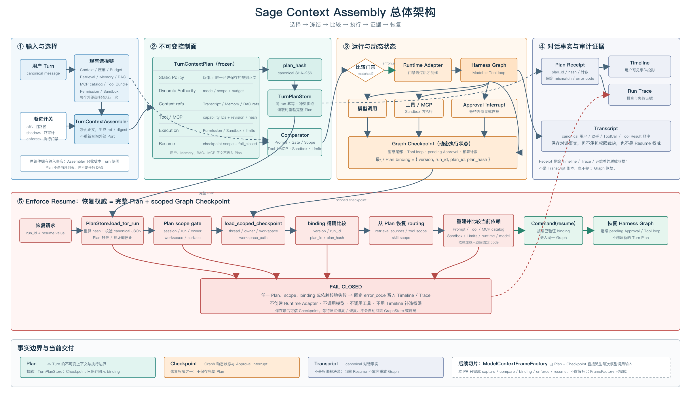

# Sage Context Assembly 总 PRD

> 状态：A0 capture、A1 compare、B0 enforce new turn、B1 enforce resume 与 F1
> `ModelContextFrame` 已实现；F2 ToolBundleSnapshot、F3 MCP/Skills 生命周期已合入
> `dev/sage-v7`；F4 TaskIntentEnvelope 已通过 PR #136 合入，merge commit
> `09a175b1d9ac87164a2a2b098792df7463f3fc39`。默认仍为 `shadow`，需显式开启 `enforce`。
> 目标：把一次 Turn 的上下文选择和执行边界收敛为可验证的不可变快照，让新一轮执行和 Approval 恢复都能回答“本轮依据什么运行”。

## 1. 一句话目标

```text
一次用户 Turn
→ 现有模块完成选择
→ Context Assembly 生成不可变 TurnContextPlan
→ 以 plan_hash 固化和审计
→ Graph 在受控上下文中执行
→ 恢复时校验 Plan/Checkpoint/依赖；不一致就 fail closed
```

`TurnContextPlan` 是“本 Turn 的上下文与执行边界快照”，不是任务 DAG，也不是完整 Prompt
副本。`ModelContextFrameFactory` 已用 Plan 校验并生成短命模型输入；它不持久化完整 Prompt，
也不取代 Plan、Checkpoint 或 Transcript 的事实职责。

## 2. 顶层执行链



> v3 同时提供确定性的 SVG/PNG，总体图的文字和箭头可审查、可复现；精确结构源文件为
> [`context-assembly-architecture-v3-zh.svg`](../../assets/context-assembly/context-assembly-architecture-v3-zh.svg)。

### 新 Turn

1. 请求进入 Coding API，形成 canonical user input，并沿用已有 Context、Retrieval Gate、Memory、MCP、Tool Bundle 和 Sandbox 选择链。
2. `TurnContextAssembler` 只消费这些已经完成的选择，不重新查询外部 Port。
3. Assembler 把大正文净化为 ref/revision/digest，把静态服务端 Policy 作为唯一可保存的规则正文，构造 frozen `TurnContextPlan`。
4. `TurnPlanStore` 以 `run_id` 幂等落库；canonical JSON 的 SHA-256 为 `plan_hash`。落库后写一条不含正文的 Timeline receipt。
5. A1 Comparator 核对真正交给 Graph 的 system prompt、Gate/scope、Tool/MCP catalog、Sandbox 和运行限制；只产出 mismatch code，不改变本轮执行。
6. `shadow` 继续走原 Graph 输入；`enforce` 新 Turn 只有 Plan、receipt、Comparator 和
   `ModelContextFrameFactory` 都成功且匹配后才创建 Runtime Adapter，并把四元 binding 写入
   Checkpoint。Resume 同样先完成 Plan/依赖比较，再生成 Frame。

### Approval / 重启恢复

```text
PlanStore.load_for_run
→ 校验 plan_hash、owner、workspace、checkpoint binding
→ 按 Plan 恢复 retrieval/tool/skill scope
→ 加载当前依赖做 Prompt/Tool/MCP/Sandbox/Limits 比较
→ 全部满足：显式 resume 同一 Graph
→ 任一不满足：返回 deterministic resume_plan_* 错误，不创建 Adapter、不调用模型或工具
```

fail closed 的含义是“执行停止在最后可信 Checkpoint，等待修复后显式恢复”，不是自动把源码、Plan 或 GraphState 回滚到更早版本，也不是用当前配置补造新 Plan。当前依赖加载用于比较，不会取代 Plan 的冻结权限。

## 3. 组件职责

| 组件 | 负责什么 | 不负责什么 |
| --- | --- | --- |
| `ContextController` | 投影、压缩、预算和上下文状态 | 不拥有 Plan 持久化 |
| `Retrieval Gate / Memory` | 决定是否检索，返回来源、revision、证据引用 | 不把原文写进 Plan |
| `MCP scoped catalog` | 给出本轮可见的 server/tool catalog 和 revision/hash | 不授予越过服务端权限的规则优先级 |
| `Tool Bundle` | 描述 resident/deferred capabilities、工具契约和调用限制 | 不保存工具实现或参数 |
| `Sandbox / Permission` | 给出运行模式、可用能力和 Sandbox contract fingerprint | 不把容器或 worktree 当作 OS 安全边界 |
| `TurnContextAssembler` | 汇总选择、净化正文、计算 digest、构造 Plan 和 receipt | 不重新做 Memory/MCP/RAG I/O |
| `TurnContextPlan` | 提供 frozen、strict JSON、canonical hash 的数据契约 | 不充当消息列表或任务计划 |
| `TurnPlanStore` | 同 run 幂等写入、冲突拒绝、读取完整性校验 | 不更新已存在的 Plan |
| `SessionEventJournal` | 维护 Plan 专用表和 schema 迁移；提供 Timeline receipt | 不用 Timeline replay 重建执行权威 |
| `Graph Checkpoint` | 保存工具循环、pending Approval、动态状态和最小四元 Plan binding | 不保存整份 Plan |
| `SageHarnessRuntimeAdapter` | 通过 enforce 门禁后创建 Graph Adapter，把 Frame 与 binding 传入 Graph | 不自行放宽 Plan scope |
| `ModelContextFrameFactory` | 校验 Plan 与 Prompt 三层 digest，生成一次模型调用的短命 Frame | 不持久化完整 Prompt，不授予新的权限 |

## 4. Plan 保存的边界

```text
保存正文：Static Policy 的 template_id/revision/rendered_content/content_hash
保存契约：Dynamic Authority、Tool/MCP catalog、Permission、Sandbox contract 摘要
保存引用：Transcript range、Context/Memory/RAG/Artifact ref、revision、digest、budget receipt
禁止保存：用户全文、Memory/RAG/MCP 正文、凭据、工具参数、大工具结果、绝对 workspace 路径
```

Plan 的 hash 只覆盖 canonical payload；时间戳、receipt sequence 等观测字段不参与 hash。语义无序的 ID 集合排序，消息和 Prompt block 顺序保留。

## 5. Prompt 与上下文的权威层次

每次模型调用应形成三层 `ModelContextFrame`：

| 层 | 典型内容 | 作用 |
| --- | --- | --- |
| Static Policy | 稳定 Harness 规则、工具协议、注入防护 | system，定义不可越过的规则 |
| Dynamic Authority | 本 Plan 的 mode、scope、预算、允许 capability、Approval/Sandbox contract | system，定义本轮允许做什么 |
| Untrusted Context Data | 压缩摘要、Memory/RAG 证据、MCP 描述、工具结果 | hidden data，仅供参考，不能改变权限 |

现有 `DurableContextMiddleware` 的隐藏数据包装继续复用；不要把远端 MCP 文案或检索正文拼进 system prompt。

## 6. Receipt、Transcript 与 Trace

| 产物 | 给谁看 | 保存什么 | 不保存什么 |
| --- | --- | --- | --- |
| `turn_context_plan_prepared` receipt | Timeline、前端审计视图、运维排查 | `plan_id/hash`、来源类别、计数、预算摘要 | 用户正文、Prompt、Memory/RAG/MCP 正文、凭据、工具参数 |
| `turn_context_plan_compared` receipt | Timeline、Trace、A1 comparator | 是否匹配、检查数量、固定 `mismatch_codes` | 期望值/实际值、正文和异常堆栈 |
| `turn_context_plan_shadow_failed` / `compare_failed` | Timeline、Trace、告警检索 | `error_code`、run/plan identity | 原始异常消息、输入内容、敏感路径 |
| Transcript | 用户对话和消息事实 | canonical 消息顺序和工具消息 | 不承担权限裁决；当前 Resume 不靠 Transcript 重放 Graph |
| Run Trace | 运行证据和失败分析 | 有界事件、receipt、工具结果引用、终态 | 不作为恢复权威，不反推新的 scope |

Receipt 是“发生过什么选择/比较”的脱敏收据，不是 Transcript 副本，也不是 Resume 数据源。A1 mismatch 或 shadow error 会继续由 `_runtime_timeline_events` 镜像到 RunStore Trace；B0/B1 的 fail-closed 错误会在 Graph Adapter 创建前终止本轮，因此没有 Runtime `ToolCallEvent`、模型调用或工具调用。

## 7. 关键函数索引

| 函数 | 作用 |
| --- | --- |
| `TurnContextAssembler.prepare_new_turn` | 汇总一次新 Turn 的既有选择并生成/持久化 Plan |
| `TurnContextPlan.create` | 构造严格数据契约并计算 canonical `plan_hash` |
| `TurnContextPlan.from_stored` | 校验 stored payload、hash、敏感键和大小限制 |
| `TurnPlanStore.put_if_absent` | 同 run 幂等写入；hash/scope 冲突即拒绝 |
| `TurnPlanStore.load_for_run` | 按 session/run 读取并执行存储完整性检查 |
| `build_turn_context_plan_receipt` | 生成脱敏 Timeline receipt |
| `SessionEventJournal.put_turn_context_plan` | 写入 Plan 专用 SQLite 表，不进入 Timeline replay |
| `SessionEventJournal.load_turn_context_plan` | 读取 Plan row，供恢复阶段校验 |
| `build_deerflow_prompt_components` | 保持旧 Prompt 顺序，同时显式区分三类权威 |
| `DeerFlowPromptComponents.render` | 将已分类 Prompt block 渲染为模型系统上下文 |
| `normalize_context_assembly_mode` | 约束 `off | shadow | enforce`，默认配置仍为 `shadow` |
| `_deerflow_timeline_events` | 编排新 Turn capture/compare/enforce 与 Resume Plan/checkpoint gate |
| `compare_turn_context_plan` | A1 核对实际 Graph 输入，返回固定 mismatch code |
| `TurnContextComparison.to_receipt` | 生成无正文的比较收据，供 Timeline/Trace/UI 使用 |
| `prepare_turn_context_resume` | 只从 Plan 恢复冻结 routing 和 checkpoint binding |
| `compare_turn_context_plan_resume` | 比较 Resume 当前依赖与冻结 Plan，只返回固定 mismatch code |
| `load_scoped_checkpoint` | 校验 thread scope，并在 Resume 精确匹配四元 binding |
| `merge_turn_context_plan` | 同 run binding 不允许漂移，新 run 才能推进 binding |

## 8. 当前交付与后续阶段

| 阶段 | 当前行为 | 失败语义 |
| --- | --- | --- |
| A0 capture（已完成） | 建 Plan、算 hash、落库、发脱敏 receipt；shadow 仍消费旧输入 | capture 失败只记录 shadow error，不改变 Graph |
| A1 compare（已完成） | 比较实际 Graph 的 Prompt、gate/scope、tool IDs、MCP/Sandbox 和运行限制 | mismatch/compare error 只报警，不改变模型调用 |
| B0 enforce new turn（已完成） | Plan/receipt/compare 成功后才创建 Adapter；binding 随 Graph state 持久化 | capture、compare、hash 或 scope 失败即 fail closed |
| B1 enforce resume（已完成） | Resume 先读 Plan + scoped Checkpoint，再按 Plan routing 比较当前依赖 | 缺失、篡改、错作用域、依赖漂移返回 `resume_plan_*`，不创建 Adapter、不调用模型/工具 |

最终交付证据：F4 受影响回归 `21 passed, 1 warning`；后端完整门禁 `1803 passed, 11 skipped,
1 warning`；Ruff、格式、mypy（218 个源码文件）、`git diff --check` 通过；前端 Vitest
`69 files / 505 passed`；private/public production build 通过。PR #136 的四个 GitHub checks
（`python`、`backend-quality`、`frontend-quality`、`public-release`）全部通过，并以
`09a175b1d9ac87164a2a2b098792df7463f3fc39` 合入 `dev/sage-v7`。warning 为既有 LangChain
GPT-2 fallback tokenizer 提示。

## 9. 设计结论

这次改造的核心不是再增加一个“大上下文字符串”，而是建立清晰的事实边界：选择模块产生局部结果，Assembler 负责一次性收敛，Plan 负责不可变和可验证，Frame 负责一次模型调用的三层投影，Checkpoint 负责动态执行状态，Transcript 负责对话事实，Timeline/Trace 负责观察。B0/B1 已把 Plan 和 scoped Checkpoint 变成执行前置条件；F1-F4 已补齐 Frame、ToolBundle、MCP/Skills 生命周期和任务意图 admission。后续再独立推进 Context Budget 的更细粒度治理与 Task DAG。
