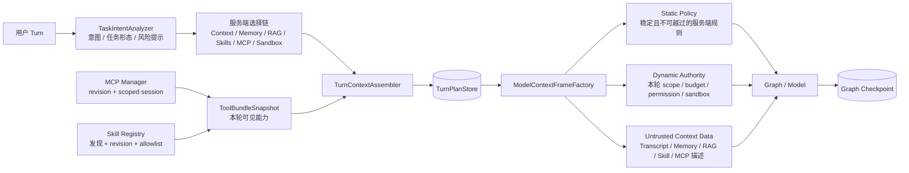

# Sage Harness 输入分层与扩展底座 PRD

> 状态：总体设计冻结；第一切片实现 `TurnContextPlan -> ModelContextFrame`。ToolBundle、MCP/Skills
> 生命周期与任务意图分析按独立小版本继续，不在一个 PR 中同时改完。

## 1. 一句话目标

把一次用户输入从“API 中逐段拼装”收敛为四个职责明确的阶段：

```text
用户输入
-> TaskIntentEnvelope（结构化意图，不保存 CoT）
-> TurnContextPlan（不可变选择与权限快照）
-> ModelContextFrame（三层短命模型输入）
-> Graph / Tool loop
```

Tool、MCP 和 Skills 通过同一份 Capability/ToolBundle 契约进入 Plan，但执行实现、连接和 Skill
正文仍由各自生命周期所有者管理。

## 2. 顶层架构



## 3. 关键边界

### TaskIntentEnvelope

这是 Plan 之前的结构化 admission 输入，不是模型私有思维链。

保存：

- `intent_kind`：回答、研究、改代码、审查、教学等；
- `task_shape`：直接、顺序、可并行候选；
- `requested_effects`：只读、写文件、执行、外部副作用；
- `capability_hints`：文件、Shell、Knowledge、Memory、Web、MCP、Skill；
- `risk_hints`、显式用户约束和分类器版本。

不保存：自由文本推理过程、隐式 CoT、模型草稿。它只能帮助选择上下文和能力，不能扩大
Permission、Policy、Approval 或 Sandbox 权限。

### TurnContextPlan

继续作为一轮 Turn 的不可变决策快照，保存引用、revision、digest、scope 和预算，不保存
Memory/RAG/MCP/Skill 正文。Plan 是恢复权威，不是模型消息列表。

### ModelContextFrame

每次模型调用前临时生成，不持久化完整正文：

| 层 | 内容 | 模型消息语义 |
| --- | --- | --- |
| Static Policy | Harness 基础规则、注入防护、工具协议 | system authority |
| Dynamic Authority | Plan 冻结的 retrieval/tool/skill scope、预算、Permission、Sandbox contract | system authority |
| Untrusted Context Data | 压缩摘要、Memory/RAG 证据、Skill 正文、MCP 描述、工具结果 | hidden data message |

Factory 必须校验 `plan_id / run_id / plan_hash`，并对三层分别执行大小限制和 digest。失败时不
创建 Runtime Adapter，不调用模型。

### ToolBundle + MCP/Skills

```text
SkillRegistry / McpManager / Local Tool Registry
-> CapabilityRegistry
-> ToolBundleSnapshot（catalog hash + resident/deferred IDs + scope）
-> TurnContextPlan
-> Runtime ToolBundle（真实 wrapper / session / executor）
```

- `ToolBundleSnapshot` 负责“本轮看见什么”，不持有连接和执行闭包；
- Runtime ToolBundle 负责 LangChain tool wrapper、deferred selection 和 ToolExecutor 适配；
- `McpManager` 继续负责 config revision、scope catalog、session 重连和关闭；
- `SkillRegistry` 继续负责发现与覆盖顺序；Skill activation 只在当前调用注入正文，并执行
  allowlist；
- Plan 只冻结 catalog revision/hash、Skill revision 和 allowlist，不复制 Skill/MCP 正文。

## 4. 接口方案比较

### 方案 A：继续由 API 拼字符串

改动小，但 API 必须知道三层顺序、deferred prompt、Skill 隐藏消息和安全边界；恢复比较继续
散落。删除模块后复杂度不会增加，属于浅接口，不采用。

### 方案 B：ModelContextFrameFactory 深模块（采用）

```python
frame = frame_factory.create(plan=plan, runtime_inputs=inputs)
adapter = SageHarnessRuntimeAdapter(model_context_frame=frame, ...)
```

Factory 隐藏 Plan 校验、分层、预算、隐藏数据包装和 digest；API 只负责调用顺序和错误投影。
第一版内部仍复用现有 Prompt 与 middleware，避免同时重写 LangGraph。

### 方案 C：立即改成通用 Block DSL

扩展性最高，但会同时修改 Prompt、middleware、ToolBundle、MCP、Skill 和所有模型调用测试，
迁移风险过大。本阶段不采用；只有出现第二种稳定 Frame consumer 后再评估。

## 5. 交付切片

### F1：ModelContextFrame

- 新增不可变 `ModelContextFrame` 与 `ModelContextFrameFactory`；
- 从完整 `TurnContextPlan` 和本轮已选择输入生成三层；
- `SageHarnessRuntimeAdapter` 改为消费 Frame；
- shadow 保持现有模型输入字节级兼容，enforce 校验失败时 fail closed；
- 用契约测试固定层级、hash、scope、大小和敏感内容边界。

### F2：ToolBundleSnapshot

- 把 `CodingToolBundle` 的快照与执行对象拆开；
- 统一 local/MCP/Skill/subagent/web capability revision；
- Plan、Comparator、Resume 只依赖快照，不穿透 deferred 内部实现。

### F3：MCP/Skills 生命周期

- MCP：固定 `config revision + scope + catalog hash`，明确 session acquire/reuse/close；
- Skills：固定 discover precedence、revision、activation 和 tool allowlist；
- catalog 漂移在 Resume 前拒绝，不在工具调用时才发现；
- Tool/MCP/Skill 正文继续作为不可信数据，不进入 Static Policy。

### F4：TaskIntentEnvelope

- 先用确定性规则覆盖显式 slash skill、只读问答、代码修改、审查和危险副作用；
- 不确定时允许受限结构化模型分类，输出固定 schema，不返回 CoT；
- 意图结果进入 Plan admission，并影响 Retrieval/ToolBundle 候选选择；
- 权限仍由 Permission/Policy/Approval/Sandbox 最终裁决。

## 6. 核心函数

| 函数 | 职责 |
| --- | --- |
| `ModelContextFrameFactory.create` | 校验 Plan binding，生成三层短命 Frame |
| `ModelContextFrame.render_system_prompt` | 只渲染 Static + Dynamic authority |
| `ModelContextFrame.untrusted_message` | 生成隐藏、不可信数据消息 |
| `ToolBundleSnapshot.from_runtime_bundle` | 从执行 Bundle 提取不可变 catalog 契约 |
| `TaskIntentAnalyzer.analyze` | 输出固定 schema 的任务意图，不输出 CoT |

## 7. 验收标准

- API 不再直接拼接三层 Prompt；
- Static/Dynamic 与 Untrusted data 在类型和消息层都可区分；
- Plan hash/scope 错配时不创建 Adapter、不调用模型或工具；
- shadow 模式不改变现有模型可见内容；
- ToolBundle、MCP、Skills 的 catalog revision 可在 Plan/Resume 中精确比较；
- 意图分析不能授予权限，任何隐式 CoT 不进入 Store、Timeline、Trace 或 Transcript；
- 每个切片独立完成定向测试、完整门禁、中文 PRD/收口与 PR。

## 8. 当前不做

- AgentOps 全链路、Provider 指标平台；
- 自动任务 DAG、线程池或并行执行器；
- 自动 Skill 生成、自动安装第三方 MCP；
- 把所有上下文改成新的通用 DSL；
- 保存或展示模型私有思维链。
