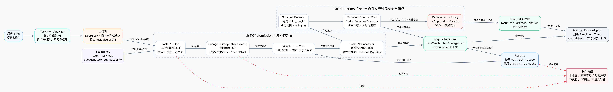

# Sage Task DAG V1 阶段 PRD

> 状态：V1 已通过 [PR #138](https://github.com/ZeroMadLife/sage-agent/pull/138) 合入 `dev/sage-v7`。本文只描述这一阶段已经落地的边界；Context Budget 是下一阶段决策，不在本次代码中重构。

## 1. 一句话目标

让主模型可以提出一个小而明确的任务依赖图，由服务端完成校验、预算、并行调度和恢复绑定；每个子任务仍走 Sage 原有 Permission / Policy / Approval / Sandbox 闭环。

## 2. 当前入口判断

入口已有 `TaskIntentAnalyzer`，当前是确定性正则/规则分类器，不调用小模型，也不复用 DeepSeek 做第二次判断。它输出 `TaskIntentEnvelope`，只用于收窄 Retrieval / ToolBundle 候选；它不能授予 Permission、Policy、Approval 或 Sandbox 权限。

因此当前链路是：

```text
用户输入 → deterministic TaskIntentEnvelope → 主模型提出 task_dag JSON → 服务端校验
```

第一版不增加“意图小模型”。等真实样本证明规则分类无法覆盖时，再增加一个可关闭的 advisory classifier；即使增加，也只能给 admission 提示，不能直接改变授权。

## 3. 顶层架构



可编辑源文件：[`task-dag-architecture-v1-zh.dot`](../../assets/task-dag/task-dag-architecture-v1-zh.dot)。

## 4. 组件职责

| 组件 | 做什么 | 明确不做什么 |
| --- | --- | --- |
| `TaskDAGPlan` | 规范化节点、校验依赖、自依赖和环、计算 canonical hash | 不执行节点，不授予权限 |
| `SubagentLifecycleMiddleware` | 在 Tool 执行前预约整图 child 数量、token、model/tool calls 和实践节点约束 | 不执行模型，不修改权限 |
| `TaskDAGScheduler` | 按 ready wave 调度，独立分支继续，失败后继阻断；`practice` 独占 wave | 不创建线程池，不支持递归 DAG |
| `task_dag` Tool | 从 frozen plan 生成稳定 `SubagentRequest`，收集结果和证据引用，返回一个 Tool Result | 不绕过现有 child executor |
| `SubagentExecutorPort` | 复用真实 child runtime、结果缓存、child trace | 不接受模型自定义 tool scope 或预算 |
| `TaskGraphEntry` | Checkpoint 中保存 `dag_id/hash`、节点状态、child id、result ref 和用量 | 不保存节点 prompt 或结果正文 |
| `HarnessEventAdapter` | 只公开 DAG 身份、节点状态和计数到 Timeline / Trace | 不公开 prompt、节点 args 或私有 CoT |
| `ToolBundle` | 注册 `task_dag` 为 `subagent:task-dag` capability | 不把 DAG 变成新的权限来源 |

## 5. 执行链与失败语义

```text
task_dag ToolCall
  → schema / profile / dependency / cycle validation
  → whole-graph budget reservation
  → canonical hash + immutable plan
  → ready wave asyncio bounded execution
  → child Permission / Policy / Approval / Sandbox
  → TaskGraphEntry + delegations + evidence refs
  → sanitized Timeline / Trace
```

以下情况在 child executor 前结束：

- 非法节点、缺依赖、自依赖、环、未注册 profile：返回 `task_dag_invalid`。
- 整图预算不足：Middleware 删除该 ToolCall，不进入 Tool、Approval 或 Sandbox。
- Resume 的同一 `tool_call_id` 使用不同 `dag_hash`：返回 `task_dag_resume_hash_mismatch`。
- 没有服务端 child reservation：返回 `task_dag_reservation_missing`。

节点运行失败只阻断它的后继节点，独立分支继续；最终 DAG 状态为 `succeeded / partial / failed / cancelled`。同一 `thread_id + run_id + tool_call_id + dag_hash` 生成稳定 `child_run_id`，Resume 优先复用 child result cache。

## 6. 关键函数

| 函数 | 核心作用 |
| --- | --- |
| `TaskDAGPlan.create` | 服务端 canonicalize、依赖校验、拓扑排序和 SHA-256 |
| `SubagentLifecycleMiddleware._after_model_task_dag` | 原子预约整图预算，避免 DAG 绕过现有总量门禁 |
| `build_task_dag_tool` | 将节点转成稳定 `SubagentRequest` 并汇总终态 |
| `_execute_subagent_request` | 统一 child 超时、取消、profile 和脱敏事件 |
| `TaskDAGScheduler.run` | ready-wave 有界并行调度与失败传播 |
| `merge_task_graphs` | 以 DAG id/hash 幂等合并，终态不可降级 |
| `HarnessEventAdapter._task_dag_events` | 生成不含 prompt 的公开事件 |

## 7. Context Budget 折中决策（下一阶段）

当前有两套预算，不能混称：

- `ContextPolicy` 是模型输入窗口预算：`context_window_tokens - output_reserve_tokens`，默认阈值为 50%（budget）、60%（snip）、65%（compact）、70%（high）、85%（emergency）。模型显式能力或 `SAGE_MODEL_CONTEXT_WINDOWS` 决定窗口，未知窗口不猜厂商上限。
- `RunBudgetMiddleware` 是一次执行安全预算：默认 `24` 次 model call、`64` 次 tool call、`250000` run tokens；它限制执行总量，不等于一次 prompt 可用窗口。

下一阶段采用混合方案：

| 借鉴对象 | 采用点 | 不照搬 |
| --- | --- | --- |
| Claude Code | 分层压缩、工具大结果外置、保留近期对话 | 不把 OS sandbox/permission 规则混进 Context Budget |
| DeerFlow / LangGraph | middleware、state、checkpoint、compaction 接入点 | 不把所有历史塞进一个万能 state |
| Pi | 按模型实际窗口动态计算，消息组装简单可预测 | 不牺牲 Sage 的 immutable `TurnContextPlan` 和 fail closed resume |

最终目标是：静态规则、动态 authority、非可信 context data 三层组装成短命 `ModelContextFrame`；压缩只生成摘要和 artifact 引用，Transcript 仍是对话权威，Checkpoint 只保存恢复所需状态。

## 8. 非目标

- 不引入小模型意图判断、线程池、递归子 DAG 或动态增图。
- 不自动 merge、push、reset 或把 worktree 当 OS 安全边界。
- 不把 DAG 当成 Permission / Policy / Approval / Sandbox 的新授权层。
- 不混入 AgentOps 闭环、Memory/RAG 生命周期或 Kubernetes/image digest。

## 9. 验收证据

定向验证覆盖：DAG schema/hash/拓扑/环检测、ready wave、失败传播、父级取消、practice 串行与 Resume、整图预算预约、旧 reservation 升级、非法图零 executor、稳定 child id、终态 Resume 幂等、ToolBundle capability 兼容和 Timeline prompt 脱敏。

最终交付证据：

- Source commit：`ff5348ab587f7a96352fcae969e8ca96a985124b`。
- Merge commit：`34e4171f14b68d71e784781dd39a2216b20eb0fe`。
- GitHub CI：`python`、`backend-quality`、`frontend-quality`、`public-release` 共 4 项通过。
- DAG / Subagent / Runtime / Capability 定向回归：`123 passed`。
- `scripts/check.sh`：`1824 passed, 11 skipped`；Ruff、Ruff format、Mypy（`218` 个源码文件）全部通过。
- Harness package 额外 Mypy：`63` 个源码文件通过。
- `git diff --check`：通过。

事实边界：`TaskGraphEntry`、Tool Result 元数据和公开 Timeline / Trace 不保存节点 prompt；但 LangGraph 的原始 `AIMessage.tool_calls` 仍属于 message checkpoint，可能包含模型最初提出的节点参数。若要求整个 Checkpoint 都不含 prompt，需要后续增加服务端 Task DAG PlanStore，仅在 message 中保存短命 plan ref。本 V1 不虚假声明已完成这层外置。
