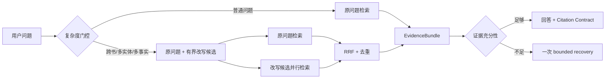

# Sage 长书 RAG 查询改写与 ANN 门禁 PRD

> 状态：完成离线验证，默认策略不变
> clean source：`e187cea9`
> 机器摘要：`evals/reports/book_learning_query_rewrite_hnsw_v1_2026-08-10.json`

## 产品决策

Sage 继续采用 PostgreSQL 作为知识索引承载：

```text
GIN + ts_rank_cd sparse
        + pgvector exact cosine dense
        -> 应用层 RRF
        -> EvidenceBundle / Sufficiency Gate
        -> LLMWiki answer 或 bounded recovery
```

本阶段没有切换到 Milvus、Qdrant 或 Pinecone。当前 Sage 需要全文检索、citation 事务一致性、
本地可部署和较低运维复杂度，PostgreSQL 已能把这些边界放在同一个可备份的数据层；专用向量库
只有在规模或稳定 P95 通过门禁后才值得拆分。

## 查询改写策略

“先把用户问题改写一次再检索”有可能提高召回，但不应对每个问题强制调用模型。离线消融比较：



在 4 个已知困难 case 的人工审计上界中，首轮 Claim Evidence Coverage `0.4444 -> 0.8333`，
Recall@10 `0.6111 -> 0.8889`。但原问题加改写的串行检索 P95 上界从 `11.40s` 增到 `20.86s`，
且 `oracle_manual` 不代表模型真实改写质量。因此当前只保留为候选：真实模型 rewrite 必须在
相同 Gold 上证明净收益、意图漂移率和延迟预算后，才可接线上复杂度门控。

## HNSW 门禁

豆包当前是 2048 维。pgvector 普通 `vector` HNSW 的维度上限为 2000，所以实验使用临时
`embedding::halfvec(2048)` + `halfvec_cosine_ops` 表达式索引；这是有损 cast，不能把它描述为
当前 exact 列已经有 HNSW。

真实两本公共领域长书、5,220 chunks、同一 Top-10 查询上：

| 路线 | Recall@10（exact oracle） | P50 | P95 | 门禁结论 |
| --- | ---: | ---: | ---: | --- |
| exact vector cosine | 1.0000 | 66.759 ms | 101.878 ms | 参考基线 |
| HNSW ef=40 | 1.0000 | 120.630 ms | 1,387.516 ms | 不合格 |
| HNSW ef=80 | 1.0000 | 103.838 ms | 143.909 ms | 不合格 |
| HNSW ef=120 | 1.0000 | 88.831 ms | 183.491 ms | 不合格 |
| HNSW ef=200 | 1.0000 | 184.703 ms | 235.452 ms | 不合格 |

门禁要求 Recall@10 `>=0.98`、P95 `<=100ms`、相对 exact 至少快 20%。四档没有一档同时满足，
最终为 `keep_exact_hnsw_not_eligible`。HNSW 只在随机 workspace 的临时索引中运行，评测后已删除，
运行时 `knowledge_index_chunks` 没有新增 ANN 索引。

## Chunk 与 Passage

`chunk` 是实际写入 sparse/dense 索引的物理切片，一个 chunk 对应一个 embedding 和一个 citation。
`passage` 是评测与 Gold 使用的稳定语义定位，通常由 `source_relative_path + heading path` 构成；
多个 child chunk 可以投影到同一个 passage。因而 Gold Claim 绑定 passage，检索返回 chunk 后再投影
到 passage 判断覆盖，避免 chunk 重新切分后评测 ID 失去解释性。

## 结果边界

- 本阶段只验证检索、改写上界和 ANN 规模门禁，不重新声称 Answer Correctness、Faithfulness 或拒答率。
- Gold 仍是 `seed_manual`，需要扩大到 30-50 条并独立 review 后才可激活线上 Gate。
- 简历可讲“为 exact/HNSW 建立了可复现门禁，并基于真实长书保留 exact”，不能讲“HNSW 已上线”。
