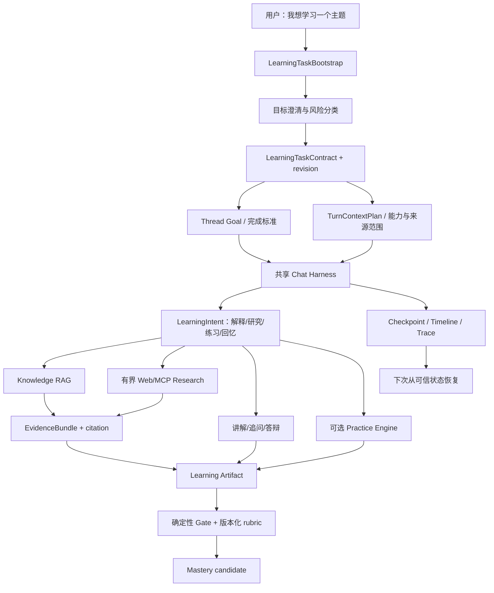

# Sage 可恢复学习任务 V1 PRD

> 日期：2026-08-13
>
> 基线：`dev/sage-v7 @ 4f934b87eb16d189802d7b08059aa15315fe341d`
>
> 状态：历史设计输入；当前事实与分段命名以 2026-08-24 桌面学习产品设计及实施计划为准
>
> 产品定位：Sage 是 Personal AI Learning Companion；Coding Runtime 是按需使用的 Practice Engine
>
> 实现边界：L0 只迁移 Learning Task 草稿和 activation bootstrap。本文的 Learning Map、Research、Artifact、Mastery 与运行中 Resume 均是后续目标，不是 L0 已实现能力。

## 1. 决策摘要

Sage V1 不再从 Coding Agent 继续扩展产品表面，而是交付一个真正可用的**可恢复学习任务**：用户可以用自然语言提出“我想系统学习金融基础”“我想理解阳明心学”或“我想学会 RAG Eval”，Sage 先明确目标和边界，再按个人知识、公开资料和可用工具补齐证据，形成可调整的学习地图，执行讲解、追问或练习，并在中断后从最后可信状态继续。

本阶段采用“两条入口、一套底座”：

1. **自由主题学习地图**：面向任意知识领域，完成目标澄清、来源规划、证据研究、能力依赖图、首个学习任务和恢复摘要；它提供真实用户价值，但不因生成计划就宣称用户已经掌握。
2. **RAG Eval 决策评审**：使用 Sage 当前真实 Eval 文档和实验 Artifact，完成带引用的技术决策、针对性答辩和认知证据候选；它是首个冻结样板和自动化验收 Gold。

二者复用同一个 Chat Harness、Thread Goal、TurnContextPlan、RAG、Web/MCP、Task DAG、Checkpoint、Timeline、Artifact 和 Mastery Ledger。金融、阳明心学、投资、编程不是四套 Agent；它们只更换学习能力契约、来源策略、风险规则和验证任务。

## 2. 用户问题

普通对话模型可以解释一个概念，却无法稳定承担长期学习任务：

- 一个领域的必要知识不可能全部常驻上下文；模型参数中的知识也没有来源 revision、时效和授权边界；
- 用户一句“我想学投资”没有说明起点、目标、期限、风险承受能力或成功标准；
- 只生成课程目录不能证明资料可靠、用户理解或下一次能够继续；
- 长任务会被 Provider 失败、网络中断、审批等待和上下文压缩打断；
- 聊天次数、阅读时长、选择题分数或模型自评都不能单独代表掌握；
- Coding Agent 默认提供文件、Shell 和写入能力，不适合作为哲学、金融等只读学习任务的默认权限面。

Sage 要解决的不是“多回答几个领域问题”，而是把一次学习活动变成具有目标、来源、状态、证据和恢复点的任务。

## 3. 目标与非目标

### 3.1 V1 目标

- 用户从 Assistant 主入口直接创建学习任务，不需要理解 Coding、RAG、MCP 或 Harness。
- 学习任务在第一次模型调用前，服务端已经冻结学习目标、来源策略、Runtime capability 范围和恢复绑定。
- 自由主题至少产出一份有引用的 `LearningMapArtifact`，包含前置能力、阶段路径、来源缺口、首个任务和下一恢复点。
- RAG Eval 样板至少产出 `ClaimTableArtifact`、`DecisionMemoArtifact` 和 `DefenseReceipt`，并生成尚未自动晋级的 `CognitiveEvidenceCandidate`。
- 中断、断线和进程重启后，系统按已生成的 `learning_plan_hash`、`turn_context_plan_hash`、`dag_hash` 和 Checkpoint 分别校验，不重新猜测用户目标或扩大权限。
- 没有足够来源时诚实标记 `source_gap` / `unverified`，不能凭模型参数伪造已验证课程事实。
- 所有领域共用现有 Harness；Coding 只在用户进入实践任务并经过能力选择、Policy/Approval/Sandbox 后启用。

### 3.2 非目标

- 不在 V1 建课程市场、完整书架、社交排行、直播课堂或多租户教育 SaaS。
- 不复制 DeepTutor 的 UI、Agent 数量、多 RAG 引擎矩阵或三层 Memory 实现。
- 不训练新的意图模型，不新建第二套 Agent Runtime、Checkpoint、Artifact Store 或 Mastery Ledger。
- 不在自由主题计划生成后自动写入 `demonstrated`；长期保持和迁移需要延迟复测。
- 不提供个性化证券推荐、买卖点、收益承诺或替代持牌金融服务。
- 不把联网搜索结果自动沉淀为长期 Knowledge；只能在当前 Turn 使用，或产生待用户批准的 Source Proposal。

## 4. 已实现底座与新增边界

| 能力 | 当前事实 | V1 使用方式 |
|---|---|---|
| `LearningIntentRoute` | 已区分 explain、compare、plan、practice、recall、research，含知识范围和阶段 | 作为每轮动作路由，不负责授予权限 |
| `LearningGoal` / `LearningCapability` | 已有 Git-backed 目标和能力定义 | 增量增加版本化任务模板引用，不复制能力表 |
| `ThreadGoalService` | 已有 CAS revision、完成标准、bounded follow-up 和学习目标绑定 | 作为一次可恢复学习任务的主状态入口 |
| `TurnContextPlan` | 已冻结 admission、来源、工具、预算和 resume binding | 首轮启动前写入学习任务约束；Resume 不重新分类 |
| `KnowledgePort` / `EvidenceBundle` | 已有 token-bounded citation、source/page revision 和 content hash | 作为解释、计划和答辩的证据输入 |
| Web Search / Research child | 已有有界只读搜索和 Evidence Bundle 汇总 | 只在 Knowledge 不足且策略允许时触发 |
| `CapabilityRegistry` | 已登记 Tool、Skill、MCP、Research、Practice 等 Runtime 能力 | 从目录中选择本任务可用能力，不代表用户掌握度 |
| Task DAG / Checkpoint / Timeline / Artifact | 已有有界编排、恢复、事件事实和大结果外置 | 组织研究步骤并保存恢复所需状态 |
| `MasteryLedger` | 已有认知/实践证据类型、固定 rubric、幂等、失效和 projection | 接受服务端审核后的证据；模型不能直接写入掌握度 |
| Assistant / Coding Workbench | Assistant 已是统一入口，实际会话仍落到 `/coding/session` | V1 保留底层路由兼容，对用户统一显示“学习任务/实践”语义 |

当前缺口不是再造底座，而是：

1. 缺少把自由主题转换为版本化学习任务的服务端控制面；
2. 首轮消息可能先发送、Goal 后绑定，无法保证从第一轮开始可恢复；
3. 当前会话固定以 `surface="coding"` 建 Plan，非 Coding Turn 仍可能看到过宽的 Coding 工具目录；V1 不迁移共享 surface 枚举，而是以服务端冻结的 `task_kind="learning"` 和 capability allowlist 收窄权限；
4. 缺少领域无关的学习地图 Artifact 和来源缺口合同；
5. 缺少认知答辩 candidate 进入现有 Mastery 审核链的受控入口；
6. 前端已有学习路径投影，但没有清晰的“开始学习任务”和恢复摘要交互。

## 5. 借鉴 DeepTutor 的边界

本节原先混入了另一个 DeepTutor 项目的产品声明，不能作为当前设计事实。批准规格只参考 `jackley-dev/deeptutor_skills@f2721313875a8ecfca9b11ea5386be6e96cfde59` 的“先规划知识点、再按单元生成、最后总结”结构。该参考没有可验证的 Runtime、RAG、Memory、Checkpoint、Resume 或评测实现，也未发现明确许可证文件；Sage 不复制其 Prompt、HTML、CSS、JS 或素材。

## 6. 产品架构



### 6.1 三种能力不能混淆

| 名称 | 回答的问题 | 示例 |
|---|---|---|
| `LearningCapability` | 用户想掌握什么 | 财务报表分析、知行合一、RAG Eval |
| `Runtime Capability` | 系统目前有哪些方法可用 | Knowledge Search、Web Search、Skill、Research child、Practice child |
| `AllowedCapabilitySet` | 本次任务实际允许使用哪些方法 | 只读 Knowledge + Web；禁止 Shell、Patch 和写型 MCP |

意图识别只能建议动作，`CapabilityRegistry` 只能描述目录。真正的本轮权限由服务端根据任务类型、风险和用户约束生成 `AllowedCapabilitySet`，再进入 Permission、Policy、Approval 和 Sandbox。V1 为兼容既有 Checkpoint 和前端合同，`HarnessRunContext.surface` 仍可保存 `coding`；该字符串不授予 Coding 工具，`task_kind`、冻结 allowlist 和后续安全链才是 authority。是否新增 `learning` surface 留到独立 API 迁移，不阻塞首版。

## 7. 两条用户流程

### 7.1 自由主题学习地图

示例输入：“我想系统学习阳明心学，每周大约能投入 4 小时。”

```text
创建 draft task
  -> 诊断目标、起点、期限、可投入时间和希望产生的能力
  -> 用户确认任务摘要
  -> 服务端原子冻结 LearningTaskContract / Thread Goal / capability scope
  -> 检索个人 Knowledge
  -> 证据不足时执行有界 Research
  -> 按来源生成能力依赖图和阶段计划
  -> 明确 source_gap、争议与未知
  -> 生成首个学习任务
  -> 保存 LearningMapArtifact 和 ResumeSummary
```

V1 的“可用”定义不是一次生成完整课程，而是用户关闭页面再回来时，仍然能看到：

- 我在学什么、目标 revision 是什么；
- 哪些能力已有来源，哪些只是待验证计划；
- 上一次完成到哪里、为什么停下；
- 下一个最小任务是什么；
- 继续后使用的来源和能力范围没有被悄悄扩大。

### 7.2 RAG Eval 决策评审

冻结问题：“Sage 是否应该默认开启 LLM Query Rewrite？”

```text
读取已授权 Eval 报告及 revision
  -> 提取 required claims 和 hard negatives
  -> 用户形成 Claim Table 与 Decision Memo
  -> Agent 只追问缺失引用、错误归因和未权衡代价
  -> 用户纠正或明确未知
  -> 生成 DefenseReceipt
  -> 服务端确定性门禁检查 citation、required/forbidden claim
  -> 语义 Judge 只评估论证、不确定性和纠错
  -> 生成 CognitiveEvidenceCandidate，默认 pending-review
```

首个 Gold 必须能识别以下关键边界：

- `oracle_manual` Query Rewrite 是理想上界，不是线上 LLM 稳定效果；
- Claim Coverage / Recall 上升伴随串行 P95 明显增加；
- 没有 Provider 稳定性与扩大 Gold 前，不应默认开启；
- `1956 passed` 是代码回归，不是回答准确率或线上 SLA；
- 用户若把 Parent-Child、Embedding Provider 或 Query Rewrite 的收益混为一谈，不能通过 attribution gate。

## 8. 领域模型

### 8.1 `LearningTaskContract`

```json
{
  "version": 1,
  "task_id": "ltask_...",
  "task_revision": 1,
  "template_id": "freeform-learning-map-v1",
  "topic": "阳明心学",
  "desired_outcome": "能解释核心概念并比较主要争议",
  "learner_profile": {
    "starting_level": "beginner",
    "time_budget_minutes_per_week": 240,
    "target_date": null
  },
  "source_policy": {
    "knowledge": "preferred",
    "web": "allowed_when_insufficient",
    "domains": [],
    "freshness": "all"
  },
  "risk_class": "general_education",
  "learning_goal_ref": {
    "goal_id": "...",
    "goal_revision": "..."
  },
  "status": "draft|active|blocked|completed|archived",
  "created_at": "...",
  "updated_at": "..."
}
```

约束：

- Contract 是版本化控制对象，不保存大段来源、模型回复或秘密；
- `active` 后修改目标、来源策略或风险类别必须 CAS 生成新 revision；
- 每个 Run 绑定一个确切 `task_revision`，Resume 只接受匹配 revision；
- `completed` 表示任务完成，不等于能力已掌握。

### 8.2 `LearningMapArtifact`

```json
{
  "artifact_type": "learning_map",
  "schema_version": 1,
  "task_id": "ltask_...",
  "task_revision": 1,
  "capabilities": [
    {
      "capability_id": "...",
      "label": "...",
      "prerequisites": [],
      "stage": "discover|understand|apply|assess",
      "source_refs": [],
      "status": "grounded|source_gap|unverified"
    }
  ],
  "next_task": {
    "kind": "explain|compare|research|recall|practice|decision_review",
    "title": "...",
    "completion_criteria": []
  },
  "open_questions": [],
  "generated_at": "..."
}
```

计划节点没有引用时只能是 `source_gap` 或 `unverified`。计划本身不是 Mastery Evidence。

### 8.3 `LearningTaskCheckpointRef`

Checkpoint 继续由 LangGraph saver 管理；学习领域只保存引用：

- `task_id`、`task_revision`；
- `thread_id`、`run_id`，以及当阶段已生成的 `learning_plan_id/hash`、`turn_context_plan_id/hash`、`dag_hash`；
- 当前 phase、pending user question、pending approval；
- Artifact refs、Evidence refs 和 next action；
- 来源/能力目录 revision 指纹。

不得把完整课程、网页正文、Skill prompt 或工具大结果复制进 Checkpoint。

## 9. API 与事件合同

### 9.1 创建与确认

```http
POST /api/v1/learning/tasks/draft
```

输入自由主题和可选约束，返回 draft、仍需澄清的问题和浏览器安全的风险提示。首版澄清问题由确定性必填项和风险规则产生；此接口不启动模型工具循环，不创建掌握证据。用户回答后通过同一 draft 的 CAS revision 更新，不允许模型在激活前暗中补全目标。

```http
POST /api/v1/learning/tasks/{task_id}/activate
If-Match: <task_revision>
```

服务端按以下顺序完成一个**对外原子、内部可恢复**的语义操作：

1. 校验用户确认的目标和来源策略；
2. 创建或复用共享 Harness session；
3. 创建 `ThreadGoal` 并绑定当前 `LearningGoal` / capability criteria；
4. 保存 `LearningTaskContract(active)`；
5. 生成首轮 kickoff 引用和 `AllowedCapabilitySet`；
6. 返回 `session_id`、`task_revision`、`thread_goal_revision` 和首轮 surface context。

现有 Session JSON、Journal 和 Learning SQLite 不共享事务，因此 V1 明确采用 durable bootstrap state machine，而不伪称数据库原子性：`draft -> activating -> active | activation_failed`。客户端必须提交 idempotency key；服务端先持久化 activation intent，再幂等创建 Session 和 Thread Goal，最后提交 active receipt。失败时 draft 对用户仍可编辑，孤立 Session 标记 archived，启动时 reconciliation 根据 receipt 完成或补偿。不得仅靠前端依次调用多个接口。

### 9.2 查询与恢复

```http
GET /api/v1/learning/tasks
GET /api/v1/learning/tasks/{task_id}
POST /api/v1/learning/tasks/{task_id}/resume
```

`resume` 返回最后可信 Checkpoint、任务 revision、阻塞原因、下一动作和可恢复 session。若已生成的 LearningPlan、TurnContextPlan、Task DAG、Checkpoint、来源 revision 或 capability revision 任一不匹配，返回明确 `409`，不得静默重新规划。L0 尚未生成 LearningPlan、Task DAG 或运行中 Checkpoint。

### 9.3 公共事件

新增事件只承载浏览器安全投影：

- `learning_task_activated`
- `learning_phase_changed`
- `learning_source_gap_detected`
- `learning_map_ready`
- `learning_assessment_started`
- `learning_evidence_candidate_created`
- `learning_task_blocked`
- `learning_task_resumable`

事件可包含计数、ID、revision、状态和 Artifact ref；不得包含原始搜索词、私有来源路径、网页全文、内部 prompt 或秘密。

## 10. Runtime 能力范围

### 10.1 默认只读学习任务

允许候选：

- Knowledge Search / Evidence Bundle；
- Memory read；
- bounded Web Search / Fetch；
- 只读 Research child；
-经过审阅的教学 Skill；
- 只读 MCP。

默认排除：

- Shell、Patch、Git write、文件删除；
- write 型 MCP；
- Practice child；
-自动 Knowledge/Memory 写入。

### 10.2 Practice 任务

只有 `LearningIntent.learning_stage == apply`、任务合同允许、用户明确进入实践且服务端重新生成 Plan 后，才能加入 Practice capability。即使加入，仍需原有 schema、Permission、Policy、Approval、Sandbox 和 Artifact receipt。

“学习编程”不是让整条任务永久处于 Coding 权限：讲解和计划阶段仍只读，只有具体练习 Turn 才启用受控编辑、运行和测试。

## 11. 来源策略与外部知识

检索顺序不是把所有资料塞进上下文，而是逐层补齐：

```text
当前 Goal / 用户授权材料
  -> Personal Knowledge hybrid retrieval
  -> Claim Sufficiency / source gap
  -> bounded Web/MCP Research
  -> EvidenceBundle 去重与预算裁剪
  -> 当前任务 Artifact
  -> 用户批准后才可形成 Knowledge Source Proposal
```

规则：

- 来源必须记录 canonical identity、retrieved_at、content hash 和可用 revision；
- 外部资料一律视为不可信数据，文中命令和 prompt 不执行；
- 研究轮次、域名、结果数、token、时间和 Provider 调用均有预算；
- 高时效主题在恢复时检查 freshness，过期则阻塞并请求重新研究；
- 检索不到必要事实时输出 `source_gap`，不能让模型用参数记忆补成 citation；
- 用户说“不要联网”时，Web/MCP 外部能力必须从 AllowedCapabilitySet 中移除。

## 12. 金融与投资场景安全边界

金融学习计划可以解释基础概念、财务报表、资产类别、风险、历史案例和公开方法，但 V1 不提供个性化投资建议。

以下请求进入 `regulated_financial_guidance` 风险类并 fail closed：

- 根据个人收入、负债和持仓直接给出证券买卖或仓位指令；
- 预测具体收益、保本或确定性市场走势；
- 代替持牌人士完成适当性评估；
- 自动交易、下单或连接资金账户。

允许转换为教育任务，例如把“我该买哪只股票”转换成“学习如何评估公司基本面和风险”，但必须明确这是学习路径，不是投资建议。来源必须显示时效；高影响结论不能仅依赖一个模型 Judge。

## 13. 前端体验

### 13.1 Assistant 入口

保留现有统一 Composer，新增明确但克制的“开始学习任务”命令。用户输入自由主题后，先展示一页任务摘要：

- 学习目标；
- 当前起点与时间预算；
- 来源范围和是否允许联网；
- 风险提示；
- 第一阶段完成条件。

用户确认后再进入共享会话。不能先乐观发送首轮消息，再异步补 Goal。

### 13.2 会话工作台

现有 Conversation + Facts Rail 继续使用；非 Coding 学习任务默认隐藏 Files/Diff/Git 等 Practice 面板。事实栏优先显示：

1. 当前学习目标和 revision；
2. 当前 phase 与来源状态；
3. 待回答的诊断/答辩问题；
4. Evidence 与 Artifact；
5. 阻塞原因和恢复动作；
6. 能力证据候选及其 pending/accepted/rejected 状态。

不新增独立聊天流，不在 Knowledge 页面运行模型回复，不用百分比伪造掌握度。

## 14. 失败与恢复

| 失败 | 行为 |
|---|---|
| Knowledge 不可用 | 若策略允许，降级到有界 Web；否则 `source_gap` |
| Web Provider 失败 | 保留已有 Knowledge evidence，任务进入 `blocked/provider_unavailable` |
| 来源冲突 | 同时展示冲突来源和 revision，不自动选一方 |
| 检索证据不足 | 停止事实性生成，给出缺口和可选择的补充动作 |
| 模型/Judge 失败 | 不生成通过证据；保留 Artifact 并允许重试 |
| 浏览器断线 | Run 继续，Timeline 重连；断线不等于取消 |
| 进程重启 | Hydrate Session + scoped Checkpoint + Plan binding |
| Goal revision 漂移 | `409 learning_task_revision_conflict`，用户确认新旧目标如何处理 |
| capability/provider revision 漂移 | 阻塞恢复，重新 admission 后生成新 Plan，不沿用旧权限 |
| 用户改变学习主题 | 创建新 task revision 或新 task，不篡改旧 Evidence provenance |

## 15. Eval 与成功标准

### 15.1 分层指标

| 层 | V1 关键问题 | 指标 |
|---|---|---|
| Admission | 是否正确识别学习动作和硬约束 | intent/stage/source constraint accuracy |
| Retrieval | 必要来源是否找到 | Recall@K、MRR、NDCG、source freshness |
| Evidence | 计划/结论是否有当前 revision 支持 | claim coverage、citation support、correct abstention |
| Learning Map | 前置依赖、阶段和下一任务是否完整 | required node coverage、invalid prerequisite、source-gap precision |
| Cognitive Review | 用户是否正确归因并能纠错 | attribution、uncertainty、defense correction |
| Harness E2E | 是否可控、可恢复、可审计 | completion、policy compliance、resume、artifact completeness、P95 |
| Outcome | 是否保持和迁移 | delayed recall、independent application；V1 只采集，不宣称提升 |

### 15.2 两套数据集

1. `learning-map-contract-v1`：覆盖金融基础、阳明心学、Java 并发、RAG Eval 等不同领域，主要验证合同、来源缺口、权限和恢复，不把模型生成质量压成单一准确率。
2. `rag-eval-decision-review-v1`：使用冻结 Sage 报告，覆盖正确归因、hard negative、证据缺失、冲突、延迟权衡、候选能力误写为默认能力和 Provider failure。

最终测试集在 corpus、case schema、leakage group、rubric、provider 和 prompt revision 冻结后才运行。deterministic fixture 只验证合同和恢复，不能包装成真实学习效果。

### 15.3 V1 验收场景

- 用户输入“我想学阳明心学，不要联网”，激活后的首轮 Plan 不包含 Web/MCP 外部能力；没有本地来源时返回 source gap，而不是编造引用。
- 用户输入“我想系统学习金融基础，每周 4 小时”，系统生成带来源状态的学习地图；不会给出具体买卖建议。
- 用户输入“学习 Python 并做练习”，讲解阶段无写权限；进入明确 Practice Turn 后才出现受控编辑和测试能力。
- RAG Eval 样板能阻止把 `oracle_manual` 写成线上默认收益，并能针对错误归因发起有界追问。
- 任务在诊断、Research、答辩和 Approval 等阶段中断后均能恢复，且 Goal/Plan/capability revision 不匹配时 fail closed。
- 任何 `CognitiveEvidenceCandidate` 未通过服务端 Gate 前都不能升级 Mastery；只有认知证据也不能满足要求双证据的 capability contract。

## 16. 纵向切片

### Slice A：Learning Task Bootstrap

- 增加 LearningTaskContract repository 和 draft/activate/read/resume API；
- 通过幂等 bootstrap state machine 对外原子绑定共享 Session、Thread Goal、Learning Goal 和首轮只读 capability scope；
- Assistant 增加学习任务摘要与确认流程；
- 验证 CAS、幂等、用户约束、断线前创建和空数据状态。

### Slice B：自由主题 Learning Map

- 增加来源策略、Knowledge-first + conditional Research；
- 生成版本化 `LearningMapArtifact` 和 `ResumeSummary`；
- 前端显示阶段、来源缺口、下一任务和继续动作；
- 以金融基础、阳明心学、Java 并发做跨领域合同测试。

### Slice C：RAG Eval 决策评审

- 冻结 required/forbidden claims 和真实来源 revision；
- 实现 Claim Table、Decision Memo、bounded Defense 和 Artifact；
- 增加 deterministic gate + versioned semantic Judge；
- candidate 默认 pending-review，不直接写 Mastery。

### Slice D：认知证据审核与恢复

- 把 accepted candidate 接入现有 Mastery outbox/Ledger；
- 支持 reject/invalidate/revision conflict；
- 验证答辩中断恢复、Judge failure 和来源失效。

### Slice E：可选 Practice 轨

- 为需要实践的能力动态加入 Practice child；
- 复用 Sandbox、测试 receipt 和现有 practice evidence；
- 实现认知/实践双证据晋级，不扩展为通用 Coding 首页。

每个切片独立 worktree、短期职责分支和 PR 合入 `dev/sage-v7`。Slice A-B 形成首个可用产品，Slice C-D 形成首个可评测认知闭环，Slice E 验证 Coding 作为 Practice Engine。

## 17. 文件所有权建议

| 范围 | 建议文件 |
|---|---|
| 领域合同 | `core/learning/tasks.py`、`core/learning/artifacts.py` |
| Repository | `core/learning/task_repository.py`，优先 SQLite，不塞入 Mastery Ledger |
| API | 新建 `api/learning.py`；共享 Session 构造提取为应用服务，不调用 HTTP 路由函数 |
| Harness admission | `core/harness/turn_context_plan.py`、新增 learning scope adapter；不改通用 package 的领域语义 |
| Runtime capability | `core/harness/capability_adapter.py`、ToolBundle selection；Registry 仍是目录 |
| Artifact / Evidence | 复用现有 Artifact Store、`EvidenceBundlePort`、Mastery outbox |
| 前端 | `AssistantHomeView.vue`、新增轻量任务确认组件、复用 `CodingView.vue` / Facts Rail |
| Eval | `evals/learning/`、`tests/evals/`、版本化 case/report |

不要把 `LearningTaskContract` 放进 `packages/sage_harness`。通用 Harness 只提供 ports、middleware、state、capability 和恢复机制，学习业务属于 Sage 产品层。

## 18. 收口结论

Sage 的核心产品叙事由此变成：

> 用户提出想掌握的能力，Sage 在受控来源和权限下形成可引用的学习路径，按需要调用 RAG、Search、MCP、Skills、Research 与 Practice Engine；每一步产生可审计 Artifact，并能从 Checkpoint 恢复。系统只依据版本化认知/实践证据更新掌握状态，不依据模型自评。

这条主线既能服务金融、哲学、投资教育和编程学习，也能解释现有 Harness、Agentic RAG、Sandbox 与 Eval 为什么需要存在。

## 19. 参考资料

- Sage 当前产品和运行链：`README.md`
- Sage 学习意图：`core/harness/learning_intent.py`
- Sage Thread Goal：`core/harness/thread_goal.py`
- Sage Mastery Ledger：`core/learning/mastery.py`
- Sage Evidence Bundle ports：`packages/sage_harness/sage_harness/ports.py`
- 现有长书设计：`docs/superpowers/specs/2026-08-05-sage-book-learning-rag-design.md`
- DeepTutor 官方仓库：https://github.com/HKUDS/DeepTutor
- DeepTutor 论文入口：https://arxiv.org/abs/2604.26962
