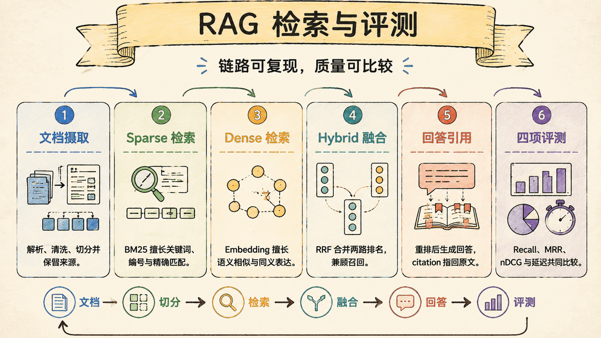

# 16 - RAG Benchmark v2：指标必须绑定当前语料与 Provider

> Last verified against: `codex/rag-graph-v3@937ff70` (2026-07-27)

RAG 评测最容易犯的错误，是拿旧语料、旧映射和旧 Provider 产生的数字描述当前系统。
Benchmark v2 首先解决证据可复现，再比较检索策略。



## RAG 在 Sage 中解决什么问题

Sage 的 Knowledge 不是把全部文档塞进 prompt，而是把来源 revision、chunk、检索、引用和
回答组装拆成可追溯链路：

```text
source snapshot
  -> parse + section-preserving chunk
  -> FTS5 BM25 / pluggable embedding
  -> RRF fusion
  -> version-bound relevance gate
  -> optional citation-bound 1-hop relation expansion
  -> token-bounded context
  -> citation_id + source revision
```

HashingEmbedding 是可离线运行的确定性基线，不支持语义召回。只有 Provider 明确声明
`supports_semantic_recall=true`，才能把 dense 路径称为语义检索。

## v1 为什么不能继续作为简历证据

旧评测只有 50 条文档级 `relevant_sources`，并且从 V6 结构映射到 V7 时只剩 35 条可用。
旧报告还引用了不在当前分支中的 Provider 脚本和缓存路径。

这些数字可以作为历史实验记录，但不能证明当前 16 份语料、当前 chunk 和当前检索代码的
效果。Benchmark v2 因而 fail closed：数据集、文件集合或任一语料 SHA 漂移，运行器直接
终止，不静默重算标签。

## 200 条固定查询

| 类别 | 数量 | 主要验证 |
| --- | ---: | --- |
| 旧查询迁移 | 50 | 保留历史 smoke 回归 |
| 真实用户式问题 | 60 | 避免标题复制式查询 |
| 改写与中英文混合 | 30 | 验证语义召回 |
| hard negative | 20 | 区分相似概念 |
| 多文档问题 | 20 | 验证跨来源召回 |
| 无答案问题 | 20 | 验证 abstention |

每条记录保存 split、provenance、section 级 graded qrels、required claims 和 forbidden claims。
本阶段只评 retrieval；claims 为后续 generation evaluation 预留，不能提前当成回答正确率。

## 指标口径

- `Recall@10`：相关 passage 有多少被找回；
- `Precision@10`：前 10 个结果中有多少相关；
- `MRR`：第一个相关结果是否足够靠前；
- `NDCG@10`：结合位置与 1-3 级相关性的排序质量；
- `HitRate@10`：可回答查询是否至少命中一次；
- `unanswerable_accuracy`：无答案查询是否返回空结果；
- P50/P95：同一机器上 search 调用耗时，不包含首次远程 embedding 预热。

## 2026-07-25 clean semantic baseline

固定输入为 16 份白名单 Markdown、879 active chunks、180 条可回答查询和 20 条无答案查询。
本章是评测报告，不进入被评索引，避免答案和指标泄漏进语料。

| 配置 | Recall@10 | MRR | NDCG@10 | HitRate@10 | P50 |
| --- | ---: | ---: | ---: | ---: | ---: |
| FTS5 + Hashing + RRF | 0.578 | 0.409 | 0.444 | 0.611 | 42.2 ms |
| FTS5 + text-embedding-v4 + RRF | 0.814 | 0.668 | 0.695 | 0.850 | 217.7 ms |

语义双路相对 Hashing 基线：Recall@10 提升 40.9%，MRR 提升 63.3%，NDCG@10 提升
56.3%。30 条改写题的 Recall@10 从 0.433 提升到 0.833，说明提升主要来自真实语义能力，
不是把确定性哈希重新命名。

第 09 章机制文档在下一 revision 更新，因此上表是上一冻结语料的 clean 历史证据。本轮没有
真实语义 Provider 凭据，不能把这组数字标成当前 corpus 的重新运行结果。

## 2026-07-27 校准拒答：收益必须连同代价报告

在 `2026-07-27.1` manifest 上，Hashing raw retrieval 仍会对无关问题固定返回 top-k。新的
`KnowledgeRelevancePolicy` 只使用 dev split 选择绝对 sparse threshold，再在 untouched test
split 验收：

| Test 配置 | Recall@10 | MRR | NDCG@10 | 无答案准确率 |
| --- | ---: | ---: | ---: | ---: |
| 无 gate | 0.660 | 0.444 | 0.484 | 0.00 |
| 校准 gate | 0.620 | 0.451 | 0.482 | 0.50 |

这说明拒答从 0 提升到 0.50，但付出了 0.04 Recall@10；项目不能只写前者。Policy 还绑定
corpus/provider/top-k，语料或模型漂移后必须重校准。

## Relation v1：先证明显式一跳，再谈完整 GraphRAG

新增 14 条受控 relation slice：12 条可回答题要求同时找回目标 source 并命中 gold
`WIKILINK` path，2 条为无答案题。结果如下：

| 配置 | AllRecall@10 | Gold path recall | Path precision |
| --- | ---: | ---: | ---: |
| Hybrid seed | 0.250 | - | - |
| + evidence-bound 1-hop | 1.000 | 0.917 | 0.289 |

这个切片证明显式 Markdown/Obsidian 链接能补足纯内容相似度，但样本由项目维护者构造且只有
14 条。它不能证明实体关系抽取、2-hop/PPR 或 community GraphRAG 已经有效。

## 复现

```bash
# 无远程凭据的离线基线
python scripts/benchmark_knowledge_retrieval_v2.py \
  --top-k 10 \
  --output tmp/knowledge-benchmark-v2-hashing.json

# 只在 dev split 校准，输出可部署 policy 与独立 test 报告
python scripts/calibrate_knowledge_abstention.py \
  --report tmp/knowledge-benchmark-v2-hashing.json \
  --output tmp/knowledge-abstention.json \
  --policy-output tmp/knowledge-relevance-policy.json

# 对比 hybrid seed 与 citation-bound 显式一跳扩展
python scripts/benchmark_knowledge_relations.py \
  --policy tmp/knowledge-relevance-policy.json \
  --output tmp/knowledge-relation.json

# 显式注入真实 Provider
DASHSCOPE_API_KEY=... python scripts/benchmark_knowledge_retrieval_v2.py \
  --provider-factory scripts.benchmark_providers.dashscope:create_provider \
  --top-k 10 \
  --output tmp/knowledge-benchmark-v2-dashscope.json
```

数据清单：`evals/knowledge_benchmark_v2_manifest.json`。机器摘要：
`evals/reports/knowledge_benchmark_v2_2026-07-25.json`、
`evals/reports/knowledge_abstention_v1_2026-07-27.json` 与
`evals/reports/knowledge_relation_v1_2026-07-27.json`。完整 passage 逐 case 原始报告约 1.8 MB，
仍由命令生成，不提交仓库。

## 当前边界

- 数据集来自项目维护者构造和复核，不是独立外部用户流量；
- 当前数字只证明 retrieval，不证明最终回答 faithful 或 complete；
- 当前 Hashing test 无答案准确率只有 0.50，仍会召回部分相似但无关内容；
- 真实语义 Provider 尚未按 `2026-07-27.1` corpus 重新校准；
- relation slice 只有显式一跳和 14 条查询，不代表实体、多跳或 community GraphRAG；
- 真实语义 Provider P50 高于离线基线，质量与延迟需要一起展示；
- 语料规模是 16 文件 / 879 chunks，不得扩写为企业级知识库规模。

## 面试里可以这样收束

Sage 冻结 200 条分层查询、section 级 qrels 和 16 份语料 SHA，并把语义检索、拒答和关系
扩展拆成独立证据。上一语料 revision 中真实 embedding 将 Recall@10 从 0.578 提升到 0.814；
当前 revision 的 dev-only gate 将 test 无答案准确率从 0 提升到 0.50，同时如实记录 Recall@10
从 0.66 降到 0.62。显式一跳关系切片的 AllRecall@10 从 0.25 到 1.00，但完整 GraphRAG 仍是
下一阶段，而不是已完成标签。
