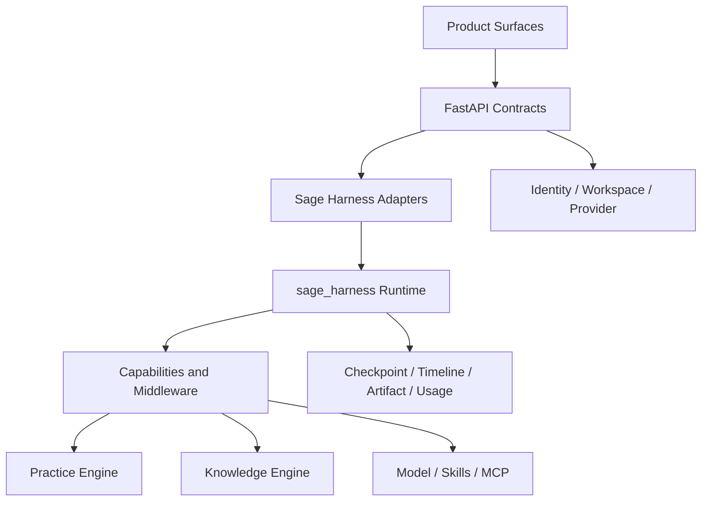

# V7 Beta Architecture Review

> Last verified against: `dev/sage-v7@7a26197` (2026-07-24)

## 评审结论

V7 Beta 已形成一条可运行的本地产品主线：用户从 Assistant 进入统一 Harness，在
Knowledge 中获得带来源的上下文，在 Practice 中用真实执行验证理解，并由 timeline、
artifact、citation、diff 和测试留下证据。

当前结论是：**受控公开资料 Agent 已可公网访问，私人 Harness 仍只适合本地使用与受控
私测**。公开门面依靠独立资料包、凭据、容器、预算和路由隔离；生产 Sandbox admission、
云端 Knowledge tenant scope 与正式 HTTPS 域名仍未闭合，因此不能扩大成公网私人 Agent。

## 分层结构

### 1. Product Surfaces

Vue 3 + Pinia 负责 Assistant、Knowledge、Practice、Evolution、Public Profile 和 Settings。
页面复用同一套会话、timeline 与 adapter，不各自维护第二套 chat runtime。

### 2. Harness Runtime

`packages/sage_harness/` 只依赖通用端口。Sage 产品层在 `core/harness/` 完成身份、工作区、
Knowledge、Sandbox、MCP、Memory 和前端事件协议的适配。package boundary 测试用于阻止
通用层反向依赖产品模块。

### 3. Practice And Knowledge

Practice Engine 对代码和工作区产生可审查的副作用；Knowledge Engine 对来源、提案和
已批准知识维护不同事实层。两者通过 capability 接入 Harness，但写入策略彼此独立。

### 4. State And Evidence

| 数据 | 职责 | 不能替代 |
| --- | --- | --- |
| Checkpoint | 恢复 Agent 运行状态 | 完整用户可见历史 |
| Timeline | 回放用户可见事件与终态 | 模型上下文 |
| Transcript | 构造会话输入与压缩 | 长期知识库 |
| Artifact | 保存长工具结果与运行证据 | 已批准事实 |
| Knowledge | 保存来源、提案、Wiki 与 citation | 私有运行轨迹 |
| Memory Proposal | 候选长期偏好或经验 | 未经确认的事实写入 |

## 关键设计判断

### 默认使用 Harness 2.0

配置中 `sage_deerflow_v2_enabled=true`，新会话默认 profile 为 `deerflow_v2`。旧文档中
“默认门仍关闭”的描述已经失效。双轨 profile 仍用于回归与迁移，不代表两个产品入口。

### 写入必须经过能力边界

文件和 Shell 工具受 Workspace、permission mode、fresh-read 与 approval 约束；Knowledge
和 Memory 的长期写入通过 proposal/approval 流程。模型输出本身不构成授权。

### 本地默认不等于生产安全

`local_workspace` 是可信开发机默认值。production/staging 使用 Harness 2.0 时必须配置
Container Sandbox；是否“实现了容器类”与是否“完成公网 admission”是两个不同结论。

### 公开主页与私有 Harness 隔离

公开主页只读取精选展示数据；独立 Public Agent 根据当前激活的不可变 PublishedPackage
回答，返回 citation、revision 与 receipt。它不复用主账号的私有文件权限，也不接入私人
Harness、Knowledge、Memory、Workspace 或工具；限流、预算和审计记录独立维护。

## 风险审查

| 优先级 | 风险 | 当前控制 | 发布前要求 |
| --- | --- | --- | --- |
| Critical | 公网任务访问宿主机工作区 | 本地/容器 provider 分离 | 强制 container，验证挂载、禁网、资源和清理 |
| High | Knowledge 跨租户读取 | 云端来源功能未开放 | source、metadata、retrieval 全链路 owner scope |
| High | 长运行重复执行或终态漂移 | run lease、fencing、timeline 恢复 | 故障注入与恢复演练 |
| High | 公开问答泄露私有上下文 | 独立 PublishedPackage、容器、凭据、同源路由与拒绝测试 | 持续执行敏感信息扫描、越权拒绝与公网 404 smoke |
| Medium | 文档将设计误写为交付 | source ref 与测试门禁 | 发布评审逐项复核 |

## 验证证据

- 后端质量入口：`bash scripts/check.sh`
- Harness/Coding 回归：`tests/core/coding/`、`tests/core/harness/`、`tests/harness/`
- Knowledge 回归：`tests/core/knowledge/`、`tests/api/test_knowledge*.py`
- Cloud ownership：`tests/api/test_cloud_*`、`tests/core/cloud/`
- 前端组件与产品壳：`frontend/src/**/*.test.ts`
- 生产构建：`cd frontend && npm run build`

具体命令与人工场景见 [TESTING](TESTING.md)。测试数量会随代码变化，本评审不把某个瞬时
计数写成长期质量结论。

## 决策

- **本地开发与受控私测**：可继续。
- **受控公开资料 Agent**：可继续；ICP备案前使用临时 HTTP IP，并保持独立公开数据边界。
- **公网开放私有 Harness**：暂缓，直到 Critical/High 发布门禁关闭。
- **合入 `main`**：必须以当次 release candidate 的完整 CI、迁移和人工场景为准。
