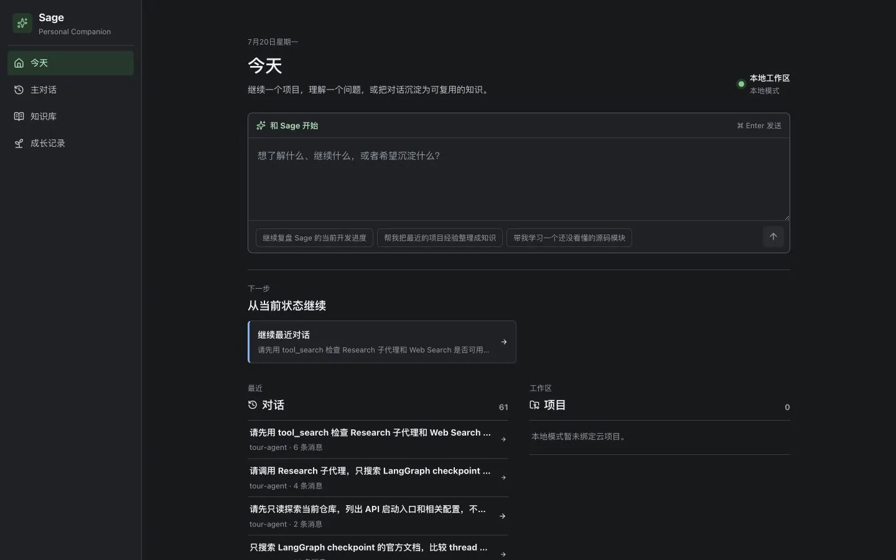
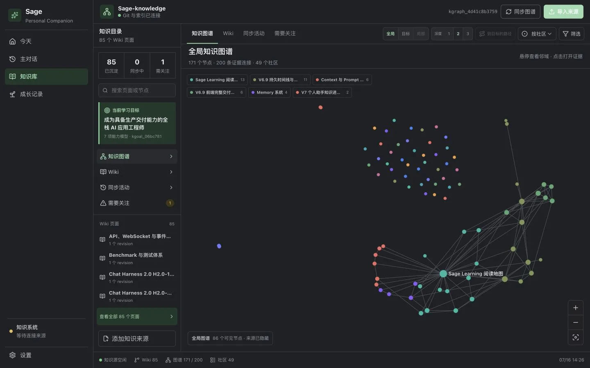
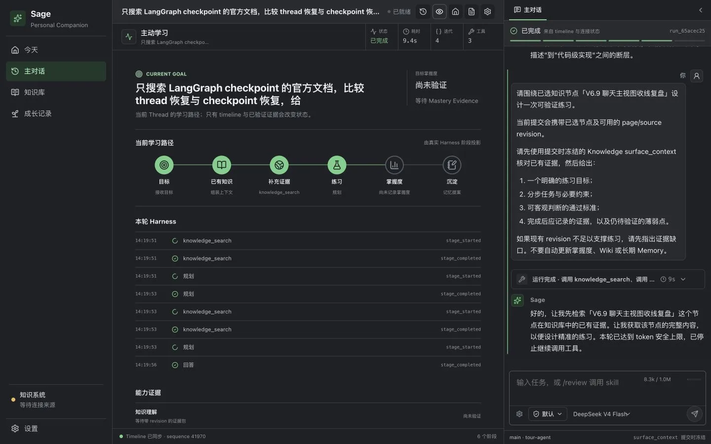

# Sage V7 Beta Showcase

> Last verified against: `dev/sage-v7@9f9843e` + PR #70 `d36e90b` (2026-07-21)

**Sage 是一个本地优先的 Personal AI Learning Companion，把目标、知识、真实实践与可复核证据组织进同一套 Agent Harness。**

> 封面展示的是下一阶段五层目标架构，不是当前完成度清单。V7 Beta 当前适合本地使用、
> 架构研究与受控私测；生产 Sandbox、云端 Knowledge 租户隔离和公网发布门禁仍未闭合。

## 5 个核心技术亮点

### 1. 控制面、状态面、证据面彼此分离

一次请求沿 Vue、FastAPI、Runtime、Engine 与 Tool 边界推进；Session、Knowledge、Checkpoint
保存可恢复状态，Timeline、Run trace、Diff 与 Benchmark 保存可复核证据。入口见
[`api/coding.py`](../../api/coding.py)、[`core/harness/runtime_adapter.py`](../../core/harness/runtime_adapter.py)
与 [`core/coding/persistence/`](../../core/coding/persistence/)；完整边界见[总体架构](learning/01-overall-architecture.md)。

### 2. 双轨 Runtime 保留历史语义

新会话默认使用 `deerflow_v2`，通过 LangChain `create_agent`、LangGraph checkpointer 和
middleware 运行；历史会话继续按 `legacy` 的 XML 协议回放，避免静默迁移改变 trace 与 diff
的解释。实现集中在 [`core/coding/runtime.py`](../../core/coding/runtime.py)、
[`packages/sage_harness/sage_harness/agents/factory.py`](../../packages/sage_harness/sage_harness/agents/factory.py)
和 [`packages/sage_harness/sage_harness/runtime/`](../../packages/sage_harness/sage_harness/runtime/)；职责拆分见 [Runtime 与 Engine](learning/03-runtime-engine.md)。

### 3. Tool 不是函数列表，而是受控执行管线

工具从 schema 校验、workspace 语义检查进入 permission、policy 与 approval，再把失败归一为
可供 Agent 修正的 `ToolResult`；deferred tool 只在需要时提升完整 schema。代码入口是
[`core/coding/tools/registry.py`](../../core/coding/tools/registry.py)、
[`core/coding/tool_executor/executor.py`](../../core/coding/tool_executor/executor.py) 与
[`core/harness/tools_adapter.py`](../../core/harness/tools_adapter.py)，详见[工具执行管线](learning/05-tools-execution-pipeline.md)。

### 4. Knowledge 以来源、提案和引用治理长期事实

授权来源先固化 revision 与 snapshot，解析结果形成 proposal，批准后才投影到 Wiki；检索 hit
携带 page/source revision、content hash 与稳定 citation。当前默认后端是 SQLite FTS5 +
deterministic hashing baseline，不把 pgvector 依赖误写成已上线的完整语义检索；实现见
[`core/knowledge/store.py`](../../core/knowledge/store.py)、[`core/knowledge/retrieval.py`](../../core/knowledge/retrieval.py)
和 [`core/knowledge/sources/filesystem.py`](../../core/knowledge/sources/filesystem.py)，边界见[Knowledge 与 RAG 检索](learning/09-knowledge-rag-retrieval.md)。

### 5. 五层目标把生成结果接回学习闭环

目标架构把规范输入、Harness 约束、外部数据、外部能力、生成与反馈分为五层，用于指导
后续的 Spec 门禁、工具治理、可验证取数和 Evaluator；它明确区分“已有基础”与“下一阶段目标”。
现状与完成度以[五层目标架构](learning/15-sage-five-layer-target-architecture.md)中的逐层表格为准，
不能把目标图当作发布能力声明。

## 工程规模与技术栈

以下数字来自当前分支的物理行数与测试文件统计，不等同于有效代码行或测试用例数：

| 指标 | 实测结果 | 复核口径 |
| --- | ---: | --- |
| 后端与 Harness Python | 65,847 行 | `api core packages agents db mcp_servers` 下的 `*.py` |
| Vue 3 / TypeScript 前端 | 31,271 行 | `frontend/src` 下的 `*.vue` 与 `*.ts` |
| 自动化测试资产 | 192 + 64 个文件 | 后端 `test_*.py` + 前端 `*.test.ts` / `*.spec.ts` |

核心依赖为 Python 3.12、FastAPI 0.115.6、LangChain 1.2.15、LangGraph 1.1.9、Vue 3、
PostgreSQL/pgvector 与 Redis。pgvector 当前属于本地依赖和生产检索契约方向；Knowledge 默认
检索仍是 SQLite baseline。

## 产品界面

### 从目标进入统一 Harness

### 从来源形成可引用知识

### 用真实执行验证理解

## 技术决策与权衡

### 双轨运行时：迁移速度换历史可解释性

直接替换 legacy 可以减少代码面，但会改变已有会话、trace 和 diff 的解释。Sage 将 runtime
profile 固化到 session：新会话走 v2，旧会话保留 legacy，并用对等回归承担双轨维护成本。

### 三层事实边界：减少耦合，接受多存储复杂度

Checkpoint 服务 graph resume，Timeline 服务用户审计，Transcript、Knowledge、Artifact 等
各自保存不可互换的事实。稳定引用代替完整对象复制，代价是需要更严格的 revision、终态和
一致性测试。

### Proposal-only 写入：降低自动化速度，保护长期事实

模型可以提出 Memory 或 Knowledge 变化，但不能把生成内容直接升级为长期事实；写入必须
经过 proposal、policy/approval 与 provenance 校验。这个选择增加一次审阅，却避免一次
幻觉或越权操作静默污染个人知识资产。

## 运行与验证

最短启动路径见根目录 [README](../../README.md)，完整验收命令与八个必跑场景见
[TESTING](TESTING.md)。发布边界、已知限制和风险结论分别以 [README](README.md)、
[CHANGELOG](CHANGELOG.md) 与 [REVIEW](REVIEW.md) 为准。
