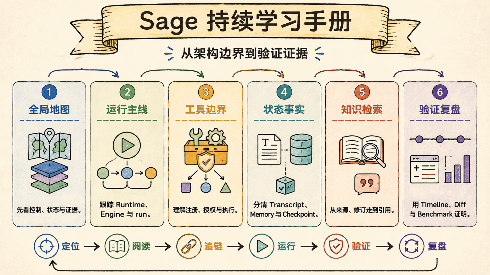

# Sage 持续学习手册

> Last verified against: `dev/sage-v7@1009e53` (2026-07-20)

这套手册不是宣传稿，也不是源码的逐行翻译。它的目标是建立一种可重复的学习方法：
从产品问题进入架构，沿真实调用链找到状态与证据，再用测试校正自己的理解。



阅读时始终把 Sage 看成一个 **Personal AI Learning Companion**：

```text
目标与个人材料
  + 可恢复的 Chat Harness
  + 工具执行与受控实践
  + 上下文、记忆与知识检索
  + 权限、审批与沙盒
  + Timeline、Artifact、Citation 与测试证据
= 一套可持续复盘的个人学习系统
```

## 如何使用这套文档

| 文档 | 目的 | 读法 |
| --- | --- | --- |
| [CHANGELOG](../CHANGELOG.md) | 版本变化摘要 | 先看本版改变了什么 |
| [REVIEW](../REVIEW.md) | 架构与风险评审 | 核对设计判断和发布边界 |
| [TESTING](../TESTING.md) | 可执行验证 | 复现自动化与人工场景 |
| `learning/` | 深入模块与调用链 | 建立可以被源码推翻或确认的理解 |

`CHANGELOG` 回答“发生了什么”，本手册回答“为什么这样设计、代码如何实现、应该怎样
验证”。当二者和当前源码不一致时，以当前 source ref、实现和测试为准。

## 事实标记

| 标记 | 含义 |
| --- | --- |
| **已实现** | 在当前源码和测试中都有对应行为 |
| **部分实现** | 主路径存在，但能力、交互或正确性尚未闭合 |
| **设计目标** | 设计稿明确描述，但不能当作当前交付 |
| **待验证** | 存在实现线索，仍需测试或运行证据确认 |
| **当前边界** | 已知不支持、被关闭或不应对外承诺的部分 |

每章的 `Last verified against` 表示最近一次事实校正所依据的代码版本。后续学习不是在
目录里不断追加碎片，而是修改对应主题，并同步 source ref、测试证据和边界。

## 源码地图

- 通用 Harness：`packages/sage_harness/`
- Sage Harness 适配层：`core/harness/`
- Practice Engine 与 legacy runtime：`core/coding/`
- Knowledge Platform：`core/knowledge/`
- 身份、Workspace 与 Provider：`core/cloud/`
- FastAPI 边界：`api/`
- Vue 产品界面：`frontend/src/`
- 验证入口：`tests/harness/`、`tests/core/`、`tests/api/`、`frontend/src/**/*.test.ts`

## 推荐阅读路径

### 第一遍：建立全局地图

1. [总体架构：Sage 是学习工作台，不是聊天壳](01-overall-architecture.md)
2. [三层架构与事实边界](02-three-planes-fact-boundary.md)
3. [Runtime 与 Engine](03-runtime-engine.md)

这一遍只回答三个问题：请求从哪里进入，谁推进任务，状态和证据最终落在哪里。

### 第二遍：理解 Harness 为什么可控

4. [Context 组装与成本治理](04-context-cost-governance.md)
5. [工具注册与执行管线](05-tools-execution-pipeline.md)
6. [权限、审批与沙盒](06-permissions-approval-sandbox.md)
7. [Skills 与命令系统](07-skills-commands.md)
8. [长短记忆与 Dream](08-memory-dream.md)

这一遍重点检查边界：模型输出不等于授权，工具不能绕过 Workspace 和 policy，Memory
不能无来源注入，反思结果不能静默写入长期事实。

### 第三遍：理解知识与并行能力

9. [Knowledge 与 RAG 检索](09-knowledge-rag-retrieval.md)
10. [受限子代理](10-subagents-research.md)
11. [持久 Timeline 与断线重连](11-timeline-reconnect.md)

这一遍要能解释 citation、proposal、child evidence 和 user-visible timeline 各自解决什么
问题，以及为什么它们不能共用一个模糊的“记忆”概念。

### 第四遍：完成风险审查

12. [安全审计与防注入](12-security-audit.md)
13. [模块速查表](13-module-map.md)

重点判断哪些入口必须 fail closed、哪些风险已有测试、哪些仍是生产发布阻断项。

### 第五遍：理解底层框架

14. [create_agent 与 LangGraph](14-create-agent-langgraph.md)

用本章建立 LangChain 抽象、LangGraph state/checkpointer 和 middleware 的协作模型，再回到
Sage adapter 验证这些框架概念如何映射到真实产品运行时。

### 第六遍：目标架构与团队 Harness

15. [Sage 五层目标架构](15-sage-five-layer-target-architecture.md)
16. [RAG 检索全链路与多模型评测](16-rag-eval-benchmark.md)

重点看规范输入、Harness 约束、数据/能力、生成与反馈回写如何组成闭环，以及如何对齐
CodeBuddy / WorkBuddy 的分层思路；再用第 16 章的真实评测数据检查检索取舍。

## 一条主调用链

```text
Vue Product Surface
  -> Pinia store / API adapter
  -> REST or CodingStream(WebSocket)
  -> FastAPI route
  -> CodingRuntime (legacy) or SageHarnessRuntimeAdapter (deerflow_v2)
  -> Engine or create_agent
  -> ToolExecutor / Middleware / Capability Adapter
  -> typed RunEvent
  -> SessionEventJournal + RunStore + Artifact
  -> frontend event reducer
  -> reply / approval / diff / citation / run trace
```

这条链路是阅读导航，不是所有请求都必经的唯一流程。例如 Knowledge ingest job 和 Cloud
控制面有独立入口；进入对应章节后应以 import、route、adapter 和测试确认实际调用关系。

## 每章的学习动作

1. 打开章节列出的第一入口，不从目录树顺序浏览。
2. 只跟一条调用链，记录输入、输出、状态所有者和副作用。
3. 找到状态落点：内存、数据库、checkpoint、timeline、artifact 或 Git workspace。
4. 打开对应测试，观察它如何制造失败、断线、越权或终态冲突。
5. 运行最小验证，用自己的话回答章末问题。
6. 如果文档与源码冲突，直接修改本章并更新 source ref，而不是另写一篇“补充说明”。

## 容易混淆的事实层

| 系统 | 回答的问题 | 主要信任边界 |
| --- | --- | --- |
| Working Context | 当前这一轮模型应该看到什么 | 可压缩、可重建 |
| Checkpoint | Agent 运行如何继续 | 运行状态，不是完整展示历史 |
| Timeline | 用户看到了哪些事件与终态 | 可回放，不直接等于模型上下文 |
| Durable Memory | 用户确认要长期记住什么 | 显式写入或批准 proposal |
| Knowledge | 当前问题可以引用哪些来源 | 来源、revision、proposal 与 citation |
| Learning Evidence | 哪次实践支持了什么判断 | 必须指向可复核产物 |

Memory 不是 RAG，RAG 不是知识图谱，Context Summary 也不是 Timeline。名字相似不代表
生命周期、信任等级和写入语义可以合并。

## 外部参考的使用边界

Claude Code、Hermes、DeerFlow、Pico 等项目可以提供交互或架构启发，但本手册不依靠
“对方没有、Sage 独有”来证明设计。涉及外部项目时，应重新查阅其当前一手文档或源码，
标注版本和验证方法；没有完成复核的内容只记录为设计参考。

## 维护入口

- 版本索引：`release/v7-beta/README.md`
- 架构设计：`docs/superpowers/specs/`
- 实施计划：`docs/superpowers/plans/`
- 开发协作与收口：`AGENTS.md`
