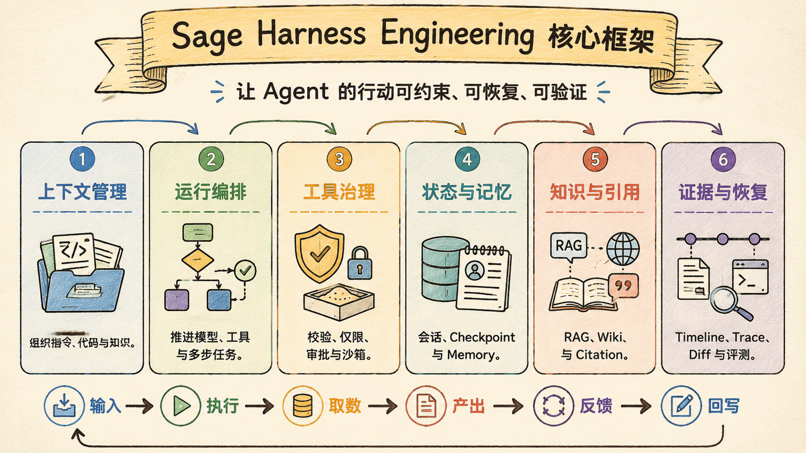
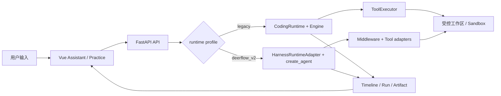

# 总体架构：Sage 是本地优先的学习工作台，不是聊天壳

Sage 的主线可以先压成一句话：它把模型、知识、实践、记忆、工具、审批和证据组织成一条可恢复的学习执行链，让一次对话能成为可追溯的学习与实践记录，而不是一次性的回答。

> Last verified against: `dev/sage-v7@79a99c8` (2026-07-23)



这里最关键的不是模型，而是执行链。模型只负责生成下一步；系统还要决定一次任务在哪里开始、允许接触什么、怎样留下状态、怎样让用户看见、怎样在失败后解释发生过什么。

## Sage 的三层

```text
控制面：Vue 3 -> FastAPI -> Runtime -> Engine / LangGraph -> ToolExecutor / Middleware
状态面：Session -> Memory -> Knowledge -> Checkpoint -> Subagent -> Todo
证据面：Timeline -> RunStore -> Diff / Artifact -> Benchmark
```

控制面决定任务怎样推进。前端把用户输入、实时事件和审批操作送到 FastAPI；API 按 session 的 `runtime_profile` 选择 legacy runtime 或 `SageHarnessRuntimeAdapter`；两条路径分别经 `Engine` 或 LangGraph `create_agent` 推进模型与工具回合。工具不能绕过执行边界直接触碰工作区、网络或持久化状态。

状态面决定任务能不能接着干。session 保存会话身份与 runtime profile，checkpoint 保存图执行状态，Memory 和 Knowledge 保存不同类型的长期事实，Todo 与受限 subagent 保存当前任务的可继续状态。它们共享引用，不把所有对象塞进一个万能记录。

证据面决定结果能不能复盘。Timeline 面向用户重放，RunStore 面向调试和验收保存 run 级 trace 与 diff，ArtifactStore 把大工具输出转成引用，benchmark 再检查同一类行为有没有回归。没有这一层，所谓“完成”只是一段模型文本。

## 一条请求怎么走



这条链里有三个不能混淆的判断。

第一，`Runtime` 是运行现场，`Engine` 是推进器。Runtime 负责装配工作区、模型、存储、审批、run lease 和事件出口；Engine 或 graph 只负责将本轮输入推进到模型调用、工具调用和终态。把两者合并，生命周期和循环策略会互相污染。

第二，实时 UI 不是事实源。WebSocket 负责增量展示，`SessionEventJournal` 负责可重放的用户可见 timeline，`trace.jsonl` 负责诊断。它们服务不同受众，因此不能用“前端已收到”代替“运行已持久化”。

第三，Sage 保留双轨不是为了炫技。历史 session 的 legacy XML 协议与证据语义不能被静默改写；新建 session 默认选择受部署安全门禁约束的 `deerflow_v2`。迁移中的兼容性，是产品事实的一部分。

## 为什么不是最小 ReAct

最小 ReAct 示例通常只有 context、LLM、tools 和一个循环。它很适合解释“模型怎样思考后行动”，但没有回答“这次行动是否可以继续、撤销、审计和验证”。

Sage 解决的是更靠后的工程问题：

- 长任务的上下文如何有预算，而不是把 transcript 无限塞回 prompt。
- 工具失败、重复、越权或等待审批时，run 如何保持可解释状态。
- Knowledge、Memory、Transcript 和压缩摘要怎样各自保存事实，避免长期污染。
- 子任务怎样限制工具与资源，不把主 session 的边界打穿。
- 断线、异常或用户停止后，谁负责写终态、释放 lease 并留下证据。
- 版本是否真的变好，怎样由 contract test、trace 和 benchmark 证明。

因此模块更多不是功能堆砌，而是把最小 loop 外最容易失控的因素收进显式边界。Sage 的差异也不是“比聊天多几个按钮”，而是把学习、实践和证据做成同一条链的不同阶段。

## 和 Claude Code / CodeBuddy 的对标

Claude Code 是产品级 coding agent 的参照，CodeBuddy 是 AI 原生研发团队实践的参照。两者帮助提出问题，但不应被用来替代 Sage 的源码证据。

| 维度 | Sage | 对标系统 |
| --- | --- | --- |
| 产品主线 | 个人学习、知识沉淀与受控 Practice Engine | Claude Code 以通用 coding agent 为主；CodeBuddy 关注团队研发流程 |
| 请求推进 | legacy `Engine` 与 v2 LangGraph graph 并存，session 固定 profile | Claude Code 具备更成熟的产品级 query、stream、IDE 与远程协同链路 |
| 工具边界 | ToolExecutor / middleware、approval、workspace 与 sandbox 适配 | Claude Code 的工具、MCP、插件、bridge、remote 覆盖面更完整；CodeBuddy 强调统一研发环境与护栏 |
| 长期事实 | proposal-first Knowledge、显式 Memory、append-only transcript、运行证据分层 | 成熟系统通常拥有更长期运行的记忆治理、遥测与组织级数据能力 |
| 验证 | timeline、run artifact、profile parity 与专项 benchmark | Claude Code 有更完整的产品运营与实验体系；CodeBuddy 的优势在流程和组织实践 |
| 当前缺口 | 生产 sandbox admission、租户级 Knowledge 隔离、完整公网运维仍未收口 | 对标系统的生产化、插件生态、远程协作和规模化经验更成熟 |

这个表的重点不是证明 Sage 已经等同于成熟产品。Sage 目前更适合本地优先、受控私测和架构学习；把未完成的云隔离或生产运维写成“能力”会破坏 release 文档最重要的可信度。

## 现在的架构判断

Sage 已经具备一个学习 harness 的骨架：用户通过 Assistant 进入统一任务入口，Knowledge 提供受控来源与引用，Practice Engine 让模型在受限工作区中阅读、修改和验证，Evidence 再把过程反馈给下一轮学习。

```text
用户目标
  -> Explore：对话、网页、代码、资料
  -> Knowledge：来源、proposal、revision、retrieval、citation
  -> Practice：工具、审批、工作区、测试、diff
  -> Evidence：timeline、artifact、trace、benchmark
  -> Evolve：记忆、复盘、下一轮目标
```

这不是一条严格串行的业务流水线。用户可以从 Practice 回到 Knowledge，也可以从失败证据回到目标重写。但每次跨越都应保留来源、权限或运行证据，而不是由模型在隐藏上下文里自行判断。

### 系统边界

从架构上看，Sage 应坚持四句话：

- `api/coding.py` 是产品接入层，不是 agent loop。
- `SageHarnessRuntimeAdapter` 是应用适配层，不是业务状态的唯一真相。
- `create_sage_agent` 是框架装配入口，不是权限与产品策略的替代品。
- Timeline、RunStore、ArtifactStore 是证据面，不是顺手写出的日志。

这四句约束可以防止常见的责任漂移：前端不重写运行逻辑，agent factory 不决定 workspace ownership，工具适配器不偷偷写长期知识，日志系统不被拿来反向承载业务状态。

### 设计目标

作为一个本地优先的学习工作台，Sage 的架构至少要满足五个目标：

1. 一条请求能被还原为可读的模型、工具、审批和终态事件。
2. 每个外部动作都经过路径、权限、策略或 sandbox 边界。
3. 长期事实写入有清楚的所有者和可回滚语义。
4. 长输出与长历史有预算，不能无限膨胀上下文。
5. 版本改动能由测试、工件和评测证明，不只依赖人工印象。

Sage 不是要求所有任务都使用所有模块。普通问答可以不进入 Practice，纯本地开发也可能暂时使用 `local_workspace`。架构价值在于边界可见、可以按风险启用，而不是每次都走最重路径。

### 当前分层

```text
用户表面
  Vue Assistant / Knowledge / Practice / Public

控制层
  FastAPI routes / runtime profile / run coordinator / event adapter

执行层
  Engine or LangGraph / middleware / tool registry / approval / sandbox

状态层
  Session / Transcript / Memory / Knowledge / Checkpoint / Todo / Subagent

证据层
  Timeline / RunStore / Diff / Artifact / Evaluation
```

目录会持续变化，以上职责不能随意交换。例如 `core/harness/` 可以新增 adapter，但 adapter 不应成为绕过 `core/coding/persistence/` 的第二套事实库；`frontend/` 可以改变展示，却不应重新定义 terminal event 的完成语义。

## 失败模式

最危险的不是“模型回答不够聪明”，而是下面这些系统性失败：

- 模型产生了越权写入，用户却只看到一段自然语言总结。
- run 在异常后没有终态或没有释放 lease，后续任务被永久卡住。
- Timeline、trace 与 UI 各自表达不同的事实，重连后无法解释哪一个可信。
- compact 改写了 canonical transcript，关键上下文和审计依据一同丢失。
- Knowledge 或 Memory 被模型直接写入，下一次 session 从被污染的长期事实开始。
- 工具大输出回灌 prompt，吞掉预算后促使模型在错误上下文中继续行动。
- 部署把 `local_workspace` 当作公网 sandbox，浏览器入口扩大成宿主机权限入口。

这些失败不会靠“换一个更强模型”消失。它们要求 runtime lifecycle、事实边界、审批与 sandbox、artifact offload、部署门禁同时成立。

## 设计文档级补充：什么算交付

总体架构不是目录说明书，它定义的是一项改动怎样才算完成。新增一个工具、一个 Memory 入口或一个 runtime profile 时，至少应回答：

- 它从哪个控制面入口被创建，谁拥有其配置。
- 它读写哪一个事实源，是否会改变长期状态。
- 它以什么事件让用户看见，断线后怎样重放。
- 它在什么权限、workspace 和 sandbox 条件下可用。
- 它会留下哪些 run 或 evaluation 证据。
- 它的失败会得到明确终态，还是可能卡住 session。

这也是“本地优先”与“只在本机跑”不同的地方。前者要求先把可信工作区、来源和运行状态收在本机可控边界内；后者若没有事实、权限和证据治理，仍然只是一个脆弱的聊天壳。

## 最小验收清单

| 验收点 | 应有证据 |
| --- | --- |
| 请求走到可选 runtime | session 固化 `runtime_profile`，路由测试覆盖可用 profile 与默认回退 |
| 运行可结束 | 正常与异常 run 都有 `run_finished`，lease 在 `finally` 后释放 |
| 工具有边界 | ToolExecutor 或 middleware 经过策略、审批、workspace/sandbox 适配 |
| 状态可继续 | session、checkpoint、timeline 与长期事实各自有稳定职责 |
| 历史可复盘 | Timeline、trace、diff 与 artifact 能通过 run/session 引用关联 |
| 版本可回归 | API、runtime lifecycle、agent factory 与 profile parity 测试可独立运行 |

## 源码第一入口

按下面顺序阅读，比从目录树随机跳转更容易建立对象图：

1. `api/coding.py::_resolve_new_runtime_profile`：新 session 如何选择并约束 runtime profile。
2. `api/coding.py::coding_stream`：请求如何进入实时事件链。
3. `core/coding/runtime.py::CodingRuntime.run_turn`：legacy run 的 lease、终态和清理。
4. `core/harness/runtime_adapter.py::SageHarnessRuntimeAdapter.stream_turn`：v2 graph 如何被装配到 Sage 事件契约。
5. `packages/sage_harness/sage_harness/agents/factory.py::create_sage_agent`：LangGraph `create_agent` 与 middleware 链的框架入口。
6. `core/coding/tool_executor/executor.py::ToolExecutor.execute`：legacy 工具执行边界。

对应验证入口是 `tests/api/test_coding_routes.py`、`tests/core/coding/test_runtime_run_lifecycle.py` 和 `tests/harness/test_agent_factory.py`。它们证明的不是完整生产部署，而是关键架构契约仍能由可重复测试约束。

## 面试里可以这样收束

Sage 的架构重点不是“我接了 LangGraph 和很多工具”，而是把本地 AI 学习系统最容易失控的部分拆成控制面、状态面和证据面：Runtime 推进任务，长期事实分库治理，工具和 sandbox 约束行动，Timeline 与 run artifact 让过程可恢复、可复盘、可验证。它离 Claude Code 的产品化覆盖面还有距离，但已经把学习工作台需要的核心工程边界落成了可读、可测的 harness。
