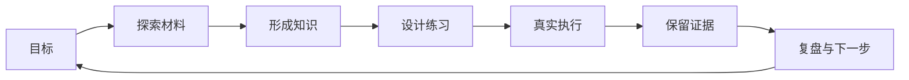

# 01 - 为什么做 Sage

> Last verified against: `dev/sage-v7@1009e53` (2026-07-20)

> 本章目标：解释 Sage 解决的问题、学习闭环、Practice Engine 的位置，以及当前产品边界。

## 问题：个人材料很多，学习过程却无法连续

一个开发者在学习技术和维护项目时，信息通常散落在不同位置：

- 本地与远程代码仓库；
- Markdown、Obsidian 或其他笔记；
- 网页、论文、文档和收藏；
- 讨论记录、运行日志、测试结果与历史决策；
- 已经完成但很难再次解释的代码。

这些材料之间存在真实联系，但普通对话很难持续保留来源、实践过程和验证结果。每次重新
粘贴上下文既昂贵，也无法区分“模型推测”“原始来源”和“已经验证的个人经验”。

Sage 的产品问题因此不是“再做一个聊天框”，而是：

> 如何把个人材料、AI 对话和真实实践组织成一条可恢复、可引用、可审查的成长路径？

## 产品回答：从问题到证据的闭环



这个闭环包含三个不能被模型话术替代的约束：

1. **回答必须可以回到来源。** Knowledge citation 指向实际 revision 或来源片段，而不是
   由模型临时编造一个看起来像引用的字符串。
2. **理解必须可以经过实践。** Practice Engine 能读源码、运行命令、修改文件和执行测试，
   其结果以 tool event、artifact、diff 和 run trace 保存。
3. **长期写入必须受控。** Memory、Wiki 和其他长期事实通过显式命令或 proposal/approval
   写入，反思结果本身不能静默成为事实。

## 为什么 Coding 是 Practice Engine

Sage 保留完整 Coding Runtime，但它服务于学习闭环，而不是成为产品唯一入口：

```text
Sage Product Shell
  ├── Assistant：目标、对话与任务入口
  ├── Knowledge：来源、Wiki、检索与引用
  ├── Practice Engine：阅读、修改、执行与验证
  ├── Memory：经过确认的长期信息
  ├── Evidence：timeline、artifact、citation、diff、usage
  └── Public Profile：经过筛选的项目与成长记录
```

因此首页是 `/#/assistant`，而不是直接进入某个代码 session。用户可以先从目标和知识出发，
需要验证时再进入 Practice；Practice 产生的证据又能回到后续学习，而不是留在孤立终端里。

## 为什么使用统一 Chat Harness

Assistant、Knowledge 和 Practice 都需要流式输出、工具状态、审批、恢复和上下文管理。
如果每个页面各写一套 chat loop，会出现事件语义、重连、终态和权限规则逐渐分叉的问题。

Sage 将通用能力抽离到 `packages/sage_harness/`，再通过 `core/harness/` adapter 接入产品
事实。这样可以同时保持：

- 通用 runtime 不依赖 Sage 的用户、知识或页面模型；
- 产品层可以统一身份、Workspace、Knowledge 和 Sandbox；
- 前端复用 typed events，不需要猜测后端字符串状态；
- legacy runtime 仍可用于迁移回归，但新会话默认进入 `deerflow_v2` profile。

## 为什么选择 Web 产品壳

Web 形态让 Assistant、Knowledge 图谱、Practice Diff、审批和公开成长主页共享同一套界面，
也便于桌面与手机访问。它同时引入了必须正视的成本：

- 浏览器不能自然获得本机目录权限，必须经过 Workspace 或后续本地 companion；
- 公网运行需要身份、租户隔离、Sandbox、限流、备份和故障恢复；
- 网络断线不能等同于取消任务，因此需要 durable timeline 和服务端 run ownership。

当前本地开发路径已经可用，但这些成本尚未全部完成生产验证。Web 是产品选择，不是“天然
多用户安全”的证明。

## 公开成长主页为什么独立

`/#/public` 面向外部读者展示经过筛选的项目、笔记和成长轨迹。它与主对话必须保持权限
隔离：

- 当前问答只使用限定公开 corpus，并返回可点击的公开来源回执；
- 不读取私有 Workspace、Memory 或 timeline；
- 不把本地主 Harness 描述成已经部署的公网 Agent；
- 未来如接入动态公开问答，应使用独立 corpus、tool allowlist、预算和审计。

这让“展示成长”可以成为产品的一部分，同时不把私人学习系统的权限直接暴露给访问者。

## 如何评价 Sage 的差异

Sage 的价值不依赖“其他产品一定没有某个功能”的结论，而在于这些能力是否形成一致的
本地工作流：

```text
个人材料 -> 可引用知识 -> 统一对话 -> 受控实践 -> 可复核证据 -> 下一轮学习
```

外部 Agent、编码工具和知识产品可以作为设计参考，但比较必须重新基于它们当前的一手
文档、源码和版本。未完成复核时，本手册只陈述 Sage 自身已经可以由代码和测试证明的
行为。

## 当前实现

- Harness 2.0 已是新会话默认 runtime profile。
- Assistant、Knowledge、Practice 和 Public Profile 已有可运行界面。
- 本地 Workspace 工具、审批、Diff、timeline、checkpoint 和 artifact 已有测试覆盖。
- 本地 Knowledge 来源、Wiki proposal、混合检索和 citation 已形成主路径。
- Cloud 已有身份、Workspace ownership 和 Provider 基础。

## 当前边界

- `docker-compose.yml` 是本地依赖编排，不是生产部署栈。
- `local_workspace` 只适合可信开发机；公网必须强制 Container Sandbox。
- Knowledge 的云端 tenant-scoped 来源与元数据工作流尚未开放。
- 公开主页不是公网 Harness，也没有主账号的私有工具权限。
- Loop Engineer 自动扫描服务暂停，不属于当前运行能力。

## 第一入口

1. `frontend/src/views/AssistantHomeView.vue` - 产品首页
2. `frontend/src/views/KnowledgeView.vue` - Knowledge 工作台
3. `frontend/src/views/CodingView.vue` - Practice 工作台
4. `api/coding.py::coding_stream` - WebSocket 边界
5. `core/harness/runtime_adapter.py` - Sage 到 Harness 的适配
6. `packages/sage_harness/sage_harness/agents/factory.py` - `create_agent` 工厂

## 测试证据

- `frontend/src/views/AssistantHomeView.test.ts`
- `frontend/src/views/ProductShellViews.test.ts`
- `tests/api/test_coding_routes.py`
- `tests/core/harness/test_harness_runtime_adapter.py`
- `tests/harness/test_agent_factory.py`
- `tests/core/knowledge/`

## 理解检查

1. Sage 的产品问题为什么不是“如何做更强的聊天 UI”？
2. Citation、Practice artifact 和 Memory proposal 分别解决什么信任问题？
3. 为什么 Coding 适合成为 Practice Engine，而不是消失或占据全部产品叙事？
4. Web 产品壳带来了哪些必须由后端和运维承担的新边界？
5. 公开主页为什么不能直接复用主账号 Harness 的权限？

下一章：[总体架构](02-overall-architecture.md)
