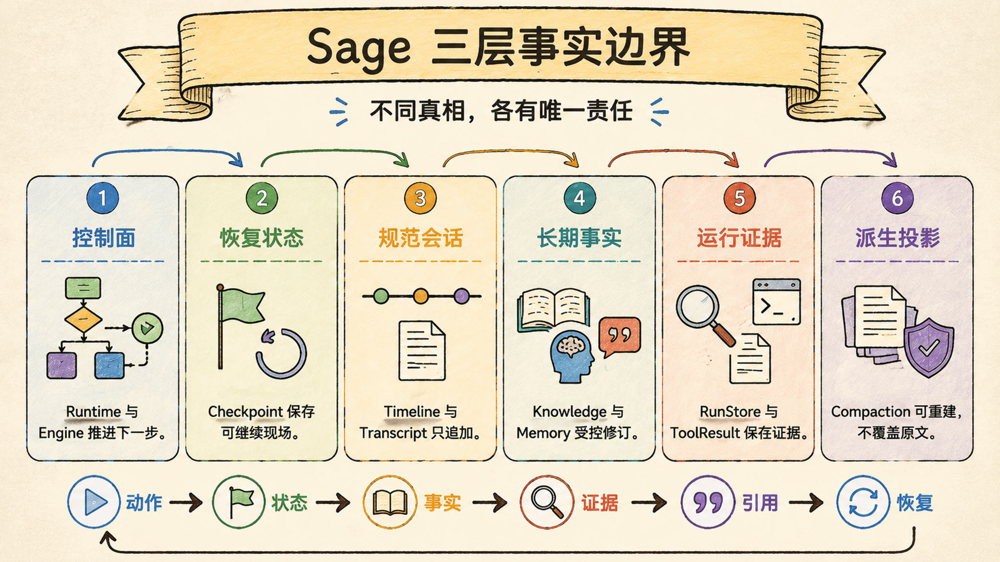
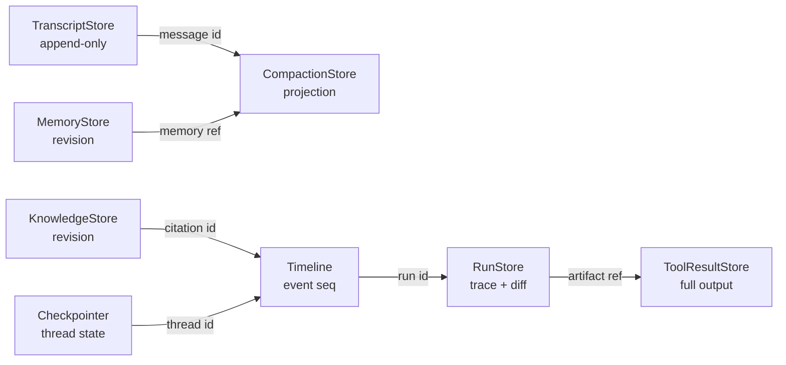

# 三层架构与事实边界：8 个存储各守一类真相，不合并成大数据库

Sage 的状态治理可以压成一句话：控制面推进任务，状态面保存可继续的事实，证据面保存可复盘的过程；8 个存储分开，是为了让恢复、审计和长期知识不互相改写。

> Last verified against: `dev/sage-v7@79a99c8` (2026-07-23)



## 三层各自回答一个问题

```text
控制面：下一步做什么，谁可以执行
状态面：任务怎样继续，长期事实是什么
证据面：刚才发生了什么，结果怎样复核
```

控制面可以重试，但不能偷偷重写历史。Runtime、Engine、ToolExecutor 和 middleware 只推进动作，事实必须落到有明确职责的 store。

状态面可以被后续任务读取，但不能把临时模型输出自动升级成长期真相。Session、Memory、Knowledge、Checkpoint 和 Todo 的寿命不同，写入门槛也不同。

证据面可以用于重放、诊断和评测，但不能反过来承担业务对象的全部语义。Timeline 是用户可见事件，RunStore 是运行工件，二者都不是 Knowledge 的替代品。

存储之间通过 `session_id`、`run_id`、`artifact_ref`、`revision` 等稳定引用关联，不复制一份“万能对象”到每个数据库。

## 8 个存储分别守什么

| 存储 | 唯一事实职责 | 不能替代 |
| --- | --- | --- |
| LangGraph checkpointer | graph channel、interrupt 与 resume 状态 | 用户可见 timeline 或 canonical transcript |
| `SessionEventJournal` | 用户可见事件、顺序、run lease 与重连游标 | 工具大输出或完整业务对象 |
| `TranscriptStore` | 规范化、append-only 的会话消息 | compact 后的投影或 UI 临时状态 |
| `KnowledgeStore` | Source、Revision、Wiki、proposal 与 citation | 未审批的模型记忆或运行日志 |
| `MemoryStore` | 经确认、可修订的个人稳定事实 | Knowledge 原文、临时 todo 或模型猜测 |
| `RunStore` | run 级 trace、diff、summary 与终态证据 | session timeline 的实时重放 |
| `ToolResultStore` | 大工具输出与 `artifact_ref` | prompt 中的全文历史 |
| `CompactionStore` | 压缩 checkpoint、投影边界与 HMAC 锚点 | canonical transcript |

这张表最重要的是“唯一”和“不能替代”。一个 store 即使技术上能多放几个字段，也不代表应该扩大事实职责。

## 稳定引用怎样连接存储



引用比复制更可靠。Timeline 可以说某次工具调用产生了 `artifact_ref`，但不必把几十万字符的输出再写一遍；citation 可以指向 Knowledge revision，而不是把来源片段改写成新的“事实副本”。

引用也让删除和校验更明确。一个 artifact 不存在时，系统能报告引用失效；若把全文复制到 timeline、transcript 和 prompt，三份内容发生分叉时反而无法判断哪份可信。

## 三条不可破坏的约束

### Knowledge 只能 proposal-first 写入

模型可以提出 Knowledge proposal，但 `KnowledgeStore.approve()` 才是把提案变为已批准知识的入口。`expected_revision` 让并发审批必须面对版本冲突，而不是后写覆盖先写。

这不是 UI 约定。即使调用来自工具或后台任务，也要经过 store 的状态机。否则任何 prompt injection 都可能把一段远程文本变成下一次检索的长期事实。

### Transcript 只追加，不被压缩修改

`TranscriptStore` 保存 canonical message。压缩只改变模型下一轮看到的 projection，不删除、重排或覆盖原始 transcript。

因此“上下文更短”不等于“历史被改写”。需要恢复、审计或重新投影时，系统仍能回到原始消息和稳定序号。

### Compaction 保存的是投影证据

`CompactionStore` 记录 compact checkpoint 和锚点，HMAC 用于发现摘要边界被篡改。它证明“这一版 projection 从哪里来”，但不能自称新的 transcript。

摘要可以错，canonical history 不能被摘要覆盖。这个区分给后续重新压缩、审查和丢弃错误摘要留下了空间。

## 为什么不是一个 SQLite

“既然大部分都能放 SQLite，为什么不合成一个库”是最常见的追问。问题不在数据库引擎，而在事实生命周期。

- checkpointer 服从 LangGraph graph 语义，timeline 服从用户重放语义。
- transcript 只追加，Memory 和 Knowledge 必须允许受控修订。
- run artifact 可能按运行清理，长期知识不能跟着 run 一起过期。
- tool output 体量很大，timeline 只需要引用和摘要。
- compact projection 可以重建，canonical transcript 不允许被重建逻辑替换。
- Knowledge 需要 proposal/approve，普通事件追加不需要同样状态机。

物理上可以共享一个数据库服务，逻辑上仍必须保留独立 schema、owner 和写入入口。把“一个 SQLite 文件”误写成“一个事实模型”，才是真正危险的简化。

## 和 Claude Code / CodeBuddy 的对标

| 维度 | Sage | 对标系统 |
| --- | --- | --- |
| 会话事实 | append-only transcript 与 timeline 分离 | Claude Code 的 transcript、SDK message、task state 与 UI state 更成熟 |
| 长期知识 | Knowledge proposal/approve、revision、citation | Claude Code 侧重项目与自动记忆；CodeBuddy 强调代码即配置和文档驱动 |
| 大输出 | `artifact_ref` 指向独立工具结果 | 成熟 coding agent 普遍需要 tool result offload 与 compact |
| 恢复 | checkpointer 管 graph，timeline 管用户重放 | Claude Code 的长期任务、remote 与 handoff 产品链更完整 |
| 组织治理 | 当前以本地单用户边界为主 | CodeBuddy 更强调统一环境、组织流程和工程护栏 |
| 当前缺口 | store 多但跨库一致性、清理策略和云租户隔离仍需生产验证 | 对标系统已有更长期的规模化运行经验 |

Sage 的优势不是“数据库更多”，而是事实职责在源码中可见。缺点也同样明显：跨 store 的引用完整性、迁移顺序、备份恢复和租户级隔离比单库 CRUD 更难，需要额外测试与运维门禁。

## 失败模式

最危险的不是某次查询慢，而是事实源在长期运行中系统性分叉：

- compact 直接覆盖 transcript，恢复时只剩不可验证摘要。
- timeline 内嵌全部工具输出，数据库体积和重连延迟一起失控。
- Knowledge 工具绕过 `approve()`，远程内容静默污染长期检索。
- Memory 自动吸收临时偏好，后续 session 把一次性状态当稳定事实。
- checkpointer 被当成用户审计，graph 内部状态变化破坏可读历史。
- `run_finished` 只写 RunStore、不写 timeline，UI 永远认为任务仍在运行。
- artifact 被清理却没有失效标记，引用仍存在但证据已经消失。

这些问题往往不会立即报错。它们会在重连、复盘、再次检索或跨版本迁移时出现，因此必须由边界测试提前发现。

## 设计文档级补充：事实所有权

设计一个新持久化字段前，不应先问“加到哪张表”，而应先回答四个问题：

1. 这是 canonical fact、runtime state、projection，还是 evidence？
2. 谁拥有唯一写入口，写入是否需要 approval 或 revision check？
3. 记录的寿命跟 session、run、workspace 还是 user 绑定？
4. 其他模块需要内容副本，还是一个稳定引用就够？

若这四个问题没有答案，新字段很可能落入“顺手保存”的灰区，最终让两个 store 同时宣称自己是真相。

### 分层设计目标

```text
Canonical facts
  Transcript / approved Knowledge / approved Memory

Recoverable runtime state
  Session / LangGraph checkpoint / Todo / Subagent

Derived projections
  Compaction summary / UI reducer state / retrieval bundle

Evidence
  Timeline / Run trace / Diff / Tool artifact / Benchmark
```

上层可以从下层或 canonical facts 派生，但派生结果不能反向覆盖来源。比如 UI reducer 可以由 timeline 重建，timeline 不应由当前 UI DOM 反推；compact 可以由 transcript 重建，transcript 不应由 compact 摘要恢复。

### 一致性策略

Sage 当前不是跨 8 个 store 的全局事务系统，所以设计必须接受部分失败，并给出补偿与可诊断语义：

- 先写 canonical 还是先写 evidence，要由调用链明确规定。
- 重复 append 需要稳定 id 或唯一键，重试不能制造两条事实。
- 跨 store 写失败要产生可见 error/terminal event，不能静默吞掉。
- 重建 projection 时必须保留 source revision 或 sequence boundary。
- 清理 artifact、run 和 checkpoint 时要检查保留期与引用关系。

## 最小验收清单

| 验收点 | 证据 |
| --- | --- |
| Transcript 不被改写 | append-only、并发追加与重开测试 |
| Knowledge 写入受控 | proposal 状态机、`approve()` revision conflict 测试 |
| Timeline 可重放 | sequence、lease、subscriber 与 reopen 测试 |
| Run 证据独立 | trace、diff、summary 与 session partition 测试 |
| 大输出不回灌 | `ToolResultStore.archive()` 返回有界 preview 和 `artifact_ref` |
| Compact 可校验 | checkpoint boundary、anchor 与 HMAC 篡改测试 |
| Checkpoint 有 scope | owner/workspace/thread 不匹配时 fail-closed |

## 源码第一入口

1. `core/coding/persistence/session_event_journal.py::SessionEventJournal`：timeline、序号与 run lease。
2. `core/coding/persistence/transcript_store.py::TranscriptStore`：canonical append-only 消息。
3. `core/knowledge/store.py::KnowledgeStore.approve`：长期知识的唯一批准入口。
4. `core/coding/persistence/memory_store.py::MemoryStore`：用户稳定事实与 revision。
5. `core/coding/persistence/run_store.py::RunStore`：run trace、diff 与 summary。
6. `core/coding/persistence/tool_result_store.py::ToolResultStore`：大输出归档与引用。
7. `core/coding/persistence/compaction_store.py::CompactionStore`：投影 checkpoint 与 HMAC。
8. `packages/sage_harness/sage_harness/runtime/checkpoint.py::load_scoped_checkpoint`：graph scope 校验。

优先验证 `tests/core/coding/test_transcript_store.py`、`tests/core/coding/test_run_coordinator.py`、`tests/core/coding/test_tool_result_store.py`、`tests/core/coding/test_compaction_store.py`、`tests/core/knowledge/`、`tests/harness/test_runtime_manager.py` 和 `tests/core/harness/test_harness_runtime_adapter.py`。

## 面试里可以这样收束

Sage 没有把 8 个存储合成一个大数据库，因为它们承载的是不同寿命、不同写入门槛和不同恢复语义的事实。核心原则是 canonical fact 不被 projection 覆盖，长期知识必须审批，运行证据只通过稳定引用连接。这样做增加了跨 store 一致性成本，却换来了可恢复、可审计和可回滚的系统边界。
