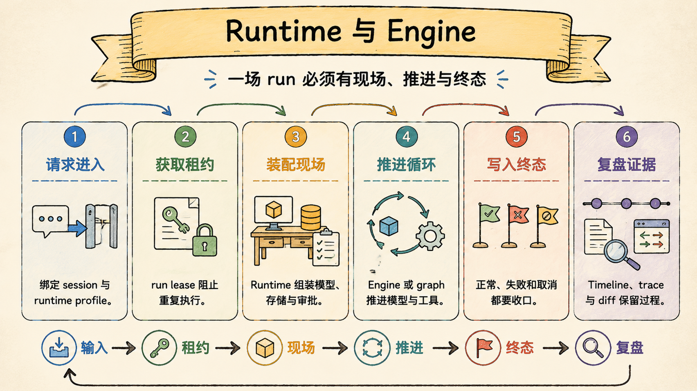
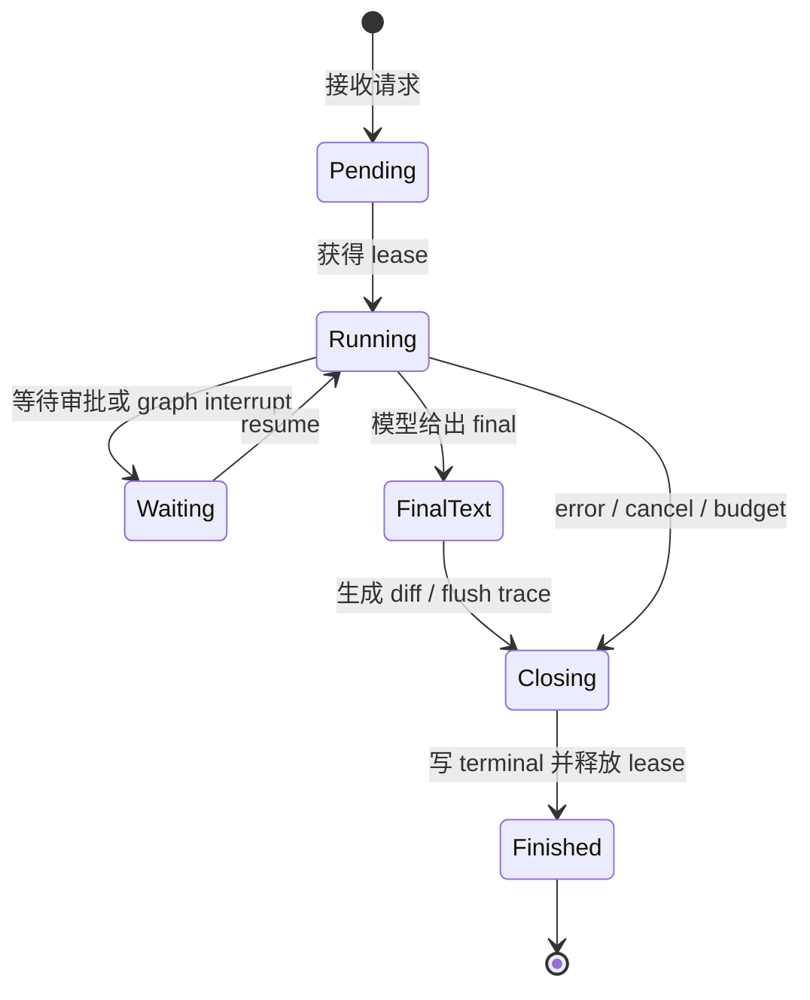

# Runtime 与 Engine：一个 run 要能开始、结束，也要能被复盘

Sage 的运行时主线可以压成一句话：Runtime 负责一场 run 的现场与收口，Engine 或 LangGraph graph 负责把本轮请求向前推进，两者分开才能让异常、断线和取消仍然留下明确终态。

> Last verified against: `dev/sage-v7@79a99c8` (2026-07-23)



## 四句话压住边界

```text
RunCoordinator：抢占并持有 session 级运行租约
Runtime：装配现场，连接 workspace、store、approval 与事件
Engine / graph：推进 model -> tool -> model，直到停止条件
Evidence：在终态前收齐 timeline、trace、diff 与状态
```

`Runtime` 不是模型 wrapper。它持有运行身份、工作区、上下文、审批、停止信号、存储和事件出口，负责开始前与结束后的工作。

`Engine` 不是整个产品。legacy `Engine.run_turn()` 只处理模型文本协议和工具回合；v2 由 LangGraph `create_agent` 编译出的 graph 与 `HarnessRunManager` 承担推进职责。

`RunCoordinator` 不是普通内存锁。它把 active run lease 写入 durable timeline，跨 coordinator 实例仍能拒绝同一 session 的并发 run，并用 owner/fence 防止过期执行者继续写入。

`run_finished` 不是模型回答。它表示外层生命周期已经完成终态持久化；模型的 `final` 只能说明“模型不再请求工具”。

## 一个 run 怎样走完



这里最容易误读的是 `FinalText --> Closing`。final text 出现后，Runtime 还要生成 workspace diff、汇总工具步数、确定 status、持久化 terminal，并释放 lease。前端若在 final 时就刷新 run history，看到的可能仍是半成品。

异常路径也必须走 Closing。模型超时、工具抛错、WebSocket 断开、async generator 被 `aclose()`，都不能成为“没有终态”的理由。

## Runtime 和推进器为什么分开

| 责任 | Runtime / Coordinator | Engine / graph |
| --- | --- | --- |
| run 身份 | 分配并稳定传播 `run_id` | 消费上下文中的 `run_id` |
| 并发 | 获取、续持、释放 lease | 不决定 session 是否可并发 |
| 工作区 | 前后快照、diff、sandbox binding | 通过工具端口访问 |
| 推进 | 选择 profile、装配依赖、接收事件 | 调模型、处理 tool call、判断循环停止 |
| 终态 | 归一 status、写 terminal、清理现场 | 产生 final/error/budget 等推进信号 |
| 证据 | 写 timeline、trace、diff、artifact 引用 | 产生可记录的细粒度事件 |

这个拆分让 legacy Engine 可以用脚本模型独立测试，也让 v2 graph 可以替换内部推进机制而不改产品的 session、workspace 和 timeline 契约。

若把两者合成一个 `while` 循环，模型调用、租约、文件快照、WebSocket 和持久化会共享一套异常处理。任何一个 `return` 都可能跳过另一层的收尾。

## 双轨运行时不是两套产品

```text
legacy
  CodingRuntime -> Engine -> XML parse -> ToolExecutor

deerflow_v2
  SageHarnessRuntimeAdapter -> HarnessRunManager
  -> LangGraph create_agent -> native tool calling + middleware

共同出口
  RunEvent -> Timeline / RunStore / WebSocket / Frontend reducer
```

legacy 依赖模型输出 `<tool>` / `<final>` 文本协议，兼容只会生成文本的 provider；代价是要处理格式纠正、可见文本过滤和重复工具调用。

v2 使用 LangChain/LangGraph 原生 tool calling，把横切逻辑拆到 middleware，并由 checkpointer 支持 graph resume；代价是 provider、middleware 顺序与 graph state contract 更复杂。

新 session 的默认配置是 `deerflow_v2`，但部署不满足 sandbox 门禁时会安全回退到可用 profile。已有 legacy session 不静默迁移，因为 profile 决定历史消息、工具协议与 checkpoint 的解释方式。

## 为什么不是一个最小 agent loop

最小 loop 只关心“模型是否还要调用工具”。Sage 还必须回答：

- 同一 session 的第二个请求何时应被拒绝。
- 用户停止旧 run 时，怎样避免误伤已经开始的新 run。
- WebSocket 消失后，服务器上的 run 是继续、取消还是中断。
- 模型 final 之后，diff 与 trace 何时才完整。
- 进程重启时，活跃 lease 是真实运行还是孤儿记录。
- 上游重复发 terminal 时，哪一个终态被接受。
- 预算耗尽是 error、cancel，还是可解释的独立停止原因。

这些都属于模型外的生命周期语义。把它们交给 prompt 提醒，无法处理并发、崩溃和重连。

## `final` 不等于 `run_finished`

| 信号 | 表示什么 | 不能证明什么 |
| --- | --- | --- |
| `final` | 模型给出用户可见回答 | diff 已完成、trace 已关闭、lease 已释放 |
| `workspace_diff_ready` | 当前 run 的文件变化可读取 | terminal 已持久化 |
| `run_finished` | run status、duration、tool steps 已收口 | 前端一定已经消费完事件 |
| `turn_finished` | legacy turn 级兼容边界结束 | 它不是新的业务成功定义 |
| coordinator `terminal` | durable 事件流的唯一终态 | 模型一定返回了自然语言答案 |

正常 legacy 路径的尾部顺序是 `final -> workspace_diff_ready -> run_finished -> turn_finished`。异常路径可以没有 final，但必须有 error 与 run terminal。

v2 的 graph item 会先归一成 Sage `RunEvent`，再由外层 coordinator 持久化 terminal。内部事件名不同，外部“只能有一个 durable terminal”的约束不变。

## Lease 是生命周期的骨架

active run lease 解决的不是性能问题，而是事实竞争：两个 run 同时修改 workspace、写 timeline、等待审批时，用户无法判断哪个事件属于哪个现场。

当前 lease 至少要满足四个性质：

1. 同一 session 同时只有一个 owner 能进入 Running。
2. stop 必须携带目标 `run_id`，旧请求不能取消新 run。
3. terminal 与 release 要形成一个持久化边界，不能先放锁再补终态。
4. 死进程 lease 可被受控恢复，活进程 lease 不能被另一 owner 抢走。

legacy `CodingRuntime` 仍维护进程内 `active_run_id`，API 侧 `RunCoordinator` 再用 `SessionEventJournal` 提供 durable lease。两层存在是迁移现实，文档不能把它们误写成已经完全统一的单一实现。

## 和 Claude Code / CodeBuddy 的对标

| 维度 | Sage | 对标系统 |
| --- | --- | --- |
| 生命周期 | durable lease、typed event、terminal、trace 与 diff | Claude Code 的 query lifecycle、stream、handoff 与 remote 产品链更成熟 |
| 推进机制 | legacy Engine 与 LangGraph v2 双轨 | Claude Code 内部 query engine 更统一；CodeBuddy强调 Agent 端到端研发流程 |
| 终态 | final 与 run terminal 明确分开 | 成熟 agent 同样需要区分回答、工具收尾和任务状态 |
| 恢复 | timeline replay、checkpoint、stale-owner recovery | Claude Code 的长任务、后台与跨端恢复覆盖面更完整 |
| 工程方法 | profile parity 与 lifecycle tests | CodeBuddy 强调搭护栏、统一环境和文档驱动 |
| 当前缺口 | 双轨职责仍有重复，公网断线与进程故障需更多真实演练 | 对标系统拥有更长时间的生产运行与遥测积累 |

Sage 的价值是把生命周期约束写进 store 和测试，而不是声称双轨比单轨先进。双轨本身是迁移成本，只有在历史兼容和对等验证成立时才值得保留。

## 失败模式

最危险的不是一次模型超时，而是 run 永远停在无法解释的中间态：

- final 一出现就释放 lease，后续 diff 和 terminal 被新 run 交叉覆盖。
- 异常路径只发 error 不写 terminal，重连后 UI 一直显示 running。
- async generator 提前关闭时没有执行 cleanup，session 永久被占用。
- stop 不校验 `run_id`，延迟到达的旧请求取消了新的 run。
- 两个 coordinator 各持有内存锁，却同时写入同一 durable timeline。
- stale owner 恢复后仍可追加事件，产生两个互相冲突的终态。
- graph 达到 recursion/time budget 后被误标 completed，掩盖未完成任务。

这些失败都要求并发与持久化测试，不能靠阅读 happy path 证明不存在。

## 设计文档级补充：Run Contract

每个 runtime profile 都应满足同一组外部 Run Contract：

- 输入：稳定的 `session_id`、`run_id`、owner、workspace、surface 与用户内容。
- 事件：具有顺序、类型、run 归属和可见性规则。
- 动作：所有工具调用经过同一 workspace、权限和证据边界。
- 终止：completed、error、cancelled、interrupted 或 budget exhausted 可区分。
- 清理：无论退出原因，lease、approval waiter 和临时资源都被处置。
- 证据：terminal 前后能定位 timeline、trace、diff 与 artifact。

Run Contract 比内部类名更稳定。未来删除 legacy 或替换 LangGraph 时，只要外部契约保持，前端、评测和历史证据就不必跟着重写。

### 恢复不是继续调用模型

恢复至少分三类：

- UI 重连：从 timeline cursor 重放，不重新执行 run。
- graph resume：从 scoped checkpoint 与 interrupt value 继续。
- orphan recovery：确认旧 owner 已死亡，将 run 标记 interrupted 或安全接管。

把三者都叫“resume”会掩盖风险。UI replay 是读，graph resume 会继续产生动作，orphan recovery 会改变 ownership，它们需要不同权限和证据。

## 最小验收清单

| 验收点 | 证据 |
| --- | --- |
| 正常收口 | final、diff、run terminal 顺序测试 |
| 异常收口 | error 后仍持久化唯一 terminal |
| 提前关闭 | `aclose()` 后 lease 释放并保存终态 |
| 并发互斥 | 多 coordinator 竞争只有一个 owner 成功 |
| 精确取消 | 旧 `run_id` stop 不影响当前 run |
| stale recovery | 死 owner 可恢复，活 owner 不被抢占，旧 fence 失效 |
| profile 对等 | legacy 与 v2 的 read/tool/error 场景满足共同契约 |

## 源码第一入口

1. `core/coding/run_coordinator.py::RunCoordinator`：durable lease、stream 与唯一 terminal。
2. `core/coding/runtime.py::CodingRuntime.run_turn`：legacy 运行现场与收尾。
3. `core/coding/runtime.py::CodingRuntime._persist_run_terminal`：断线与异常的幂等终态。
4. `core/coding/engine/engine.py::Engine.run_turn`：legacy 模型与工具推进循环。
5. `core/harness/runtime_adapter.py::SageHarnessRuntimeAdapter.stream_turn`：v2 应用适配。
6. `packages/sage_harness/sage_harness/runtime/manager.py::HarnessRunManager.stream`：graph stream、递归与时间预算。

对应验证从 `tests/core/coding/test_runtime_run_lifecycle.py`、`tests/core/coding/test_run_coordinator.py`、`tests/core/coding/test_agent_loop.py`、`tests/core/harness/test_harness_runtime_adapter.py` 和 `tests/evals/test_profile_parity.py` 开始。

## 面试里可以这样收束

Sage 把 Runtime 与 Engine 分开，是为了让“模型怎样推进”不污染“任务怎样活着和死掉”。Engine 或 graph 负责 model-tool 循环，Runtime 与 coordinator 负责 lease、workspace、终态和证据。最关键的判断是 final 不等于 run_finished：只有 diff、trace、terminal 和 lease 都收口，一次 run 才真正结束并且可复盘。
