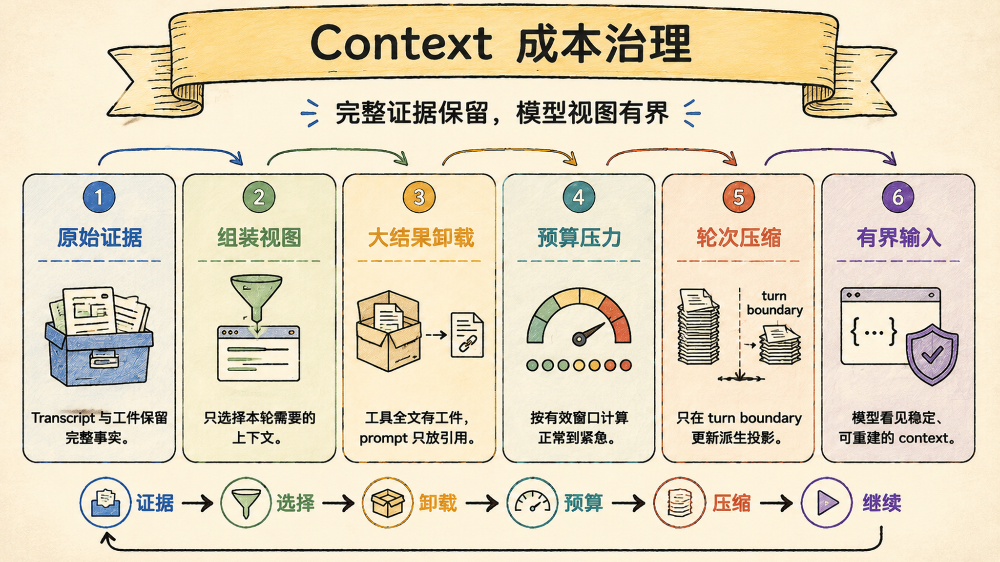
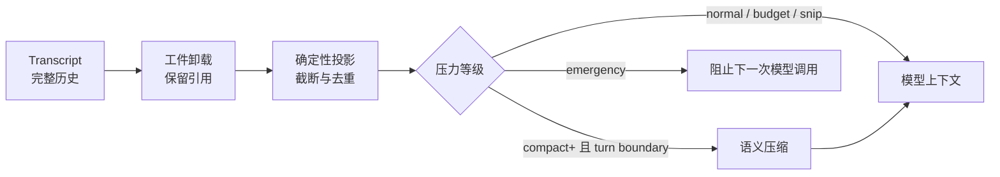

# Context 组装与成本治理：长任务不能靠无限 context 续命

> Last verified against: `codex/release-v7-rewrite@179516d` (2026-07-23)

Context 治理不是把聊天记录尽量塞进模型窗口，而是让完整证据、当前任务视图和成本压力各自有明确边界。

## 先建立结论：窗口大小不是可靠性

最小 Agent 常把 context 当成一条不断增长的 `messages` 列表。

这在短对话里足够，在长任务里却会同时遇到三个问题：

1. 工具输出增长速度远高于用户消息；
2. 模型窗口必须为本轮输出预留空间；
3. 早期事实、近期动作和当前请求的重要性并不相同。

Sage 因此把 Context 做成一条治理链：

这条链路的核心不是“删掉多少”，而是“哪一层有权改变什么”。

## 三层边界：证据、投影与摘要不能混为一谈

### 第一层：Transcript 保存原始事实

Transcript 是用户消息、模型输出和工具结果的规范历史。

投影与压缩都不能原地修改它。

这样才能回答两个关键问题：模型当时看到了什么，以及完整工具结果原本是什么。

### 第二层：ContextProjector 生成有界视图

投影是纯函数式、可重复的确定性变换。

它会限制工具输出长度，并在 `snip` 及更高压力下移除旧的重复读取结果。

最近三个工具结果受到保护，旧结果即使被替换，也会留下 `artifact_ref`。

不同压力等级对应的单条工具输出上限为：

| 等级 | 输出上限 | 额外动作 |
| --- | ---: | --- |
| `normal` | 50,000 字符 | 不去重 |
| `budget` | 30,000 字符 | 不去重 |
| `snip` | 30,000 字符 | 去重旧 read/search/list |
| `compact` | 30,000 字符 | 去重旧 read/search/list |
| `high` | 15,000 字符 | 更强截断与去重 |
| `emergency` | 15,000 字符 | 阻止下一次模型调用 |

### 第三层：CompactManager 生成语义交接

压缩把较老的完整 turn 总结为结构化交接，同时保留近期完整 turn。

它只作用于模型投影，不回写或删除 Transcript。

摘要携带目标、用户约束、决策、完成工作、文件、测试、错误、工件引用和下一步。

因此摘要是“历史交接”，不是新的事实源，更不能覆盖最新用户消息。

## 成本控制从有效窗口开始

模型标称窗口不能全部用于输入。

`ContextPolicy` 先扣除默认 20,000 token 的输出预留，再以有效窗口计算压力比例。

| 压力等级 | 默认阈值 | 系统行为 |
| --- | ---: | --- |
| `normal` | `< 50%` | 保留较宽工具视图 |
| `budget` | `>= 50%` | 将工具输出上限降至 30,000 字符 |
| `snip` | `>= 60%` | 去重较老的重复读取结果 |
| `compact` | `>= 65%` | 在新 turn 开始前尝试语义压缩 |
| `high` | `>= 70%` | 将工具输出上限降至 15,000 字符 |
| `emergency` | `>= 85%` | 不允许继续请求模型 |

Token 计数优先使用模型提供的计数器。

计数器不可用时，Sage 以 UTF-8 字节数估算，并把 `estimated` 暴露给 usage 事件。

这个标记很重要：估算值适合触发保守治理，不适合伪装成精确账单。

## 为什么语义压缩只能发生在 turn boundary

新用户 turn 开始、第一次模型调用之前，是安全的语义压缩点。

此时上一轮工具链已经结束，可以按完整 turn 选择旧历史与近期尾部。

同一 turn 中，`before_model_request` 只能重新计数并做确定性投影。

否则模型刚读完文件、正准备修改时，摘要可能截断因果链，使后续工具调用失去依据。

`emergency` 也不是“再赌一次模型能处理”，而是明确停止，等待下一轮边界恢复空间。

## 大工具结果应该变成工件，而不是聊天正文

`ToolResultStore` 对超过 16 KiB 的结果进行外置归档。

模型视图只保留最多 200 行、12,000 字符的头尾预览，以及稳定的 `sage://` 工件引用。

完整结果仍按 session 与 run 隔离保存，可以由授权路径重新读取。

这解决的是存储位置问题，不能替代 Context 投影：

- 工件层保证全文可恢复；
- 投影层决定本轮模型可见多少；
- Transcript 记录当时发生过什么；
- 审计层据此重建证据链。

## Prompt 稳定性是优化，不是事实保证

Legacy `ContextManager` 把 system prompt 分成 stable、context 和 volatile 三层。

`SYSTEM_PROMPT_DYNAMIC_BOUNDARY` 让稳定前缀与每轮变化内容分离。

Skill 指令和 memory block 每轮重新注入，不写入历史，避免旧指令反复膨胀。

但 provider 是否命中 prefix cache、如何计费，仍由外部模型和 SDK 决定。

Sage 能保证的是边界与顺序稳定，不能把“可能命中缓存”写成运行时事实。

## 为什么不是最小 messages 截断器

最小截断器通常只保留最后 N 条消息，既不知道 turn，也不知道工具结果是否可恢复。

Sage 多出的结构分别处理证据完整性、当前视图、压力反馈和失败停止。

| 维度 | Sage | 对标系统 |
| --- | --- | --- |
| 事实保存 | Transcript 追加保存，投影不改源历史 | Claude Code、CodeBuddy 的内部持久化细节未完全公开，不能据外观断言 |
| 大结果处理 | `ToolResultStore` 外置全文，视图保留预览与引用 | Claude Code 常见 compaction 与工具摘要体验；CodeBuddy 有长任务上下文能力，工件协议不可验证 |
| 压力反馈 | 六级压力、usage 事件、估算标记 | 对标产品会展示上下文或压缩反馈，但阈值与停止策略不是公开契约 |
| 压缩时机 | 自动语义压缩限制在 turn boundary | 对标系统的精确时机不可从 UI 行为可靠推出 |
| 失败策略 | 无效压缩断路、emergency 拒绝模型调用 | 对标系统通常会重试或压缩，内部断路规则不透明 |
| 当前差距 | Legacy 与 v2 路径仍需持续收敛，provider cache 不是可控保证 | 成熟产品在多模型适配与长期运行经验上更完整 |

比较的价值不在宣布“谁没有某功能”，而在明确 Sage 可以由源码和测试证明什么。

## 系统级失败模式

### 1. 把投影结果写回 Transcript

最危险的不是少了几行输出，而是规范证据被不可逆地替换，审计再也无法还原原文。

### 2. 在 mid-turn 做语义压缩

最危险的不是摘要质量一般，而是正在执行的 read-to-edit 因果链被拦腰切断。

### 3. 工件引用不绑定 session 与 run

最危险的不是读取失败，而是跨会话读取到另一任务的私有工具结果。

### 4. 压缩失败后继续使用未受控视图

最危险的不是多花 token，而是 emergency 状态仍发起模型调用，触发截断或不可预测失败。

### 5. 连续压缩却没有实质节省

最危险的不是一次额外调用，而是系统陷入压缩循环；Sage 连续两次低于 10% 节省时打开自动压缩断路器。

### 6. 把估算 token 当精确计数

最危险的不是显示误差，而是阈值判断和成本解释建立在虚假精度上。

### 7. 把 provider cache 当成本承诺

最危险的不是一次缓存未命中，而是容量规划依赖外部实现细节，供应商变化后整体预算失真。

## 设计文档补充：Context 治理契约

### 目标

- 完整历史可审计，模型视图有界；
- 新 turn 可以压缩，当前 turn 不被语义改写；
- 大结果可恢复，引用受 session/run 边界保护；
- 压力与估算状态对运行时和前端可观察。

### 非目标

- 不保证 provider prefix cache 命中；
- 不把摘要升级为事实源；
- 不允许靠扩大窗口绕过工件与投影治理；
- 不承诺 Legacy 与 v2 已完全统一。

### 分层责任

| 层 | 责任 | 不应承担 |
| --- | --- | --- |
| Transcript | 保存规范历史 | 为模型裁剪内容 |
| ToolResultStore | 保存大结果全文 | 决定模型预算 |
| ContextProjector | 生成确定性有界视图 | 改写源历史 |
| CompactManager | 生成旧历史语义交接 | 在 mid-turn 自动运行 |
| ContextController | 计数、分级、编排、停止 | 猜测 provider 计费 |

### 验收清单

- [ ] 六个压力等级的边界值均有测试；
- [ ] 投影不会修改输入 history；
- [ ] 最近三个工具结果不会被旧重复去重规则误删；
- [ ] 截断结果始终保留可追溯的 `artifact_ref`；
- [ ] 自动语义压缩只在 turn start 发生；
- [ ] `emergency` 明确阻止模型请求；
- [ ] 连续无效压缩可以打开断路器，成功后可以复位；
- [ ] 大工具结果的路径隔离与元数据读取均有测试。

## 第一入口

按这个顺序读源码：

1. `core/coding/context/budget.py::ContextPolicy.usage`：有效窗口与六级压力；
2. `core/coding/context/projection.py::ContextProjector.project`：不可变投影与输出上限；
3. `core/coding/context/controller.py::ContextController.on_turn_start`：turn boundary 压缩；
4. `core/coding/context/controller.py::ContextController.before_model_request`：mid-turn 确定性治理；
5. `core/coding/context/compact.py::CompactManager.compact`：结构化摘要与断路器；
6. `core/coding/persistence/tool_result_store.py::ToolResultStore.archive`：大结果归档；
7. `core/coding/context/manager.py::ContextManager.build`：Legacy prompt 组装边界。

验证证据集中在 `test_context_budget.py`、`test_context_projection.py`、`test_context_controller.py`、`test_context_compactor.py` 与 `test_tool_result_store.py`。

## 面试里可以这样收束

Sage 没把长任务可靠性押在更大的模型窗口上，而是把完整 Transcript、大结果工件、确定性投影和 turn-boundary 语义压缩拆开治理。六级压力控制模型视图，emergency 会停止调用，无效压缩会触发断路器；因此上下文缩短不等于证据丢失，成本优化也不会越过事实边界。

下一章：[工具执行链路：Registry、搜索与结果闭环](05-tools-execution-pipeline.md)
