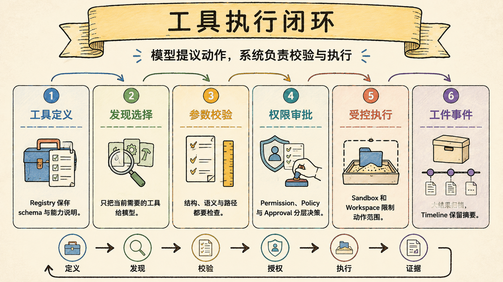
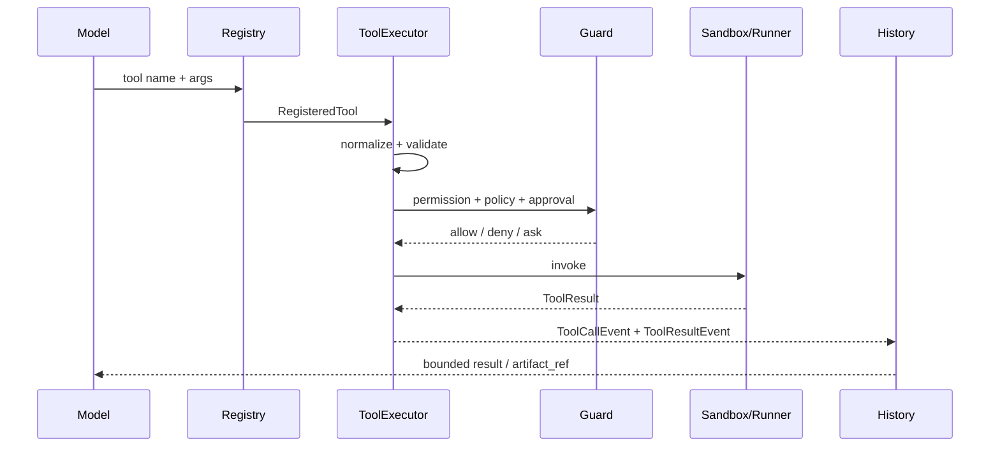

# 工具注册与执行管线：模型不能直接碰外部世界

> Last verified against: `codex/release-v7-rewrite@d646d5d` (2026-07-23)

工具系统的价值不是让模型“会调用函数”，而是把一次外部动作变成可验证、可授权、可追踪、可恢复的运行时事务。

## 先看完整闭环

模型只负责提出结构化意图，真正的副作用必须经过宿主系统。

这条管线把“模型建议做什么”与“系统真的做了什么”分开。

## 四层边界：定义、发现、执行、证据

### 第一层：Registry 声明工具契约

`register_tool` 把名称、说明、schema、风险、类别、超时和 deferred 标记绑定到 handler。

`build_tool_registry` 再为具体 workspace 构造 `RegisteredTool`，注入受限的 `ToolContext`。

Registry 解决的是“这个能力是什么”，不负责决定本次调用是否允许。

### 第二层：Deferred discovery 控制暴露面

常驻工具直接向模型暴露 schema，领域型工具可以延迟发现。

Legacy 路径按名称、说明或类别搜索并激活匹配工具。

Harness 路径更严格：先返回有界 capability 元数据，再要求使用稳定 `capability_id` 明确选择。

选择结果与 catalog revision/hash 绑定，旧 checkpoint 不能静默授权新 schema。

### 第三层：ToolExecutor 编排副作用

`ToolExecutor.execute` 依次完成：

1. 停止状态检查；
2. payload 归一化与工具查找；
3. schema 和 workspace 语义验证；
4. permission 检查；
5. policy 检查；
6. 必要时等待审批；
7. 发出 `ToolCallEvent`；
8. 经 sandbox 或本地 runner 执行；
9. 将结果归一为 `ToolResultEvent`。

顺序本身就是安全契约：拒绝必须发生在副作用之前，调用事件必须先于结果事件。

### 第四层：结果进入证据闭环

成功、业务失败、超时、拒绝和取消都被表示为有类型的运行事件。

Agent loop 不依赖 Python 异常猜测状态，而是读取 `is_error`、`error_code`、`retryable` 和安全元数据。

大结果随后可由 `ToolResultStore` 外置，模型只消费预览和引用。

## 参数验证不是一层 schema 就结束

Pydantic schema 只回答类型、必填项和字段约束。

Workspace-aware preflight 还要确认路径没有逃逸工作区。

执行前语义验证再检查当前文件状态，例如目标是不是文件、patch 的旧文本是否恰好出现一次。

这三类判断不能混在模型 prompt 里：prompt 是提示，host validation 才是执行门禁。

| 验证层 | 典型问题 | 失败结果 |
| --- | --- | --- |
| Schema | `path` 是否存在、类型是否正确 | `invalid_arguments` |
| 路径边界 | 是否逃逸 workspace | 可恢复的参数错误 |
| Workspace 语义 | patch 是否唯一、目录类型是否正确 | 工具错误事件 |
| Permission | 当前模式是否允许副作用 | 带 security metadata 的拒绝 |
| Policy | 是否先读后写、调用顺序是否合法 | 带 policy reason 的拒绝 |

## Deferred tool 省的不只是 token

把全部 schema 常驻在模型上下文会增加三种成本：

- 输入 token 持续增长；
- 相似工具争夺模型注意力；
- 未授权或当前不可用的能力过早暴露。

Deferred discovery 把工具使用拆成“发现”和“选择”。

Harness 每次搜索最多返回有界结果，query 也有长度上限。

只有显式选择的精确 schema 才会在下一轮模型请求中提升。

因此 deferred 不只是压缩 prompt，也是在缩小每轮的能力面。

代价是多一次工具往返，并要求 checkpoint 正确保存选择状态。

## Permission、Policy 与 Approval 各管一件事

Permission 判断主体与模式是否有权调用，例如 plan mode 禁止写。

Policy 判断动作是否符合工作流，例如修改前是否已经读取目标。

Approval 把高风险但可允许的动作交给用户做即时决定。

三者不能合成一个布尔值，否则拒绝原因、审计语义和重试策略都会丢失，第 06 章会继续展开这条边界。

## Sandbox 是执行适配器，不是工具定义

文件、搜索、写入和 shell 等操作，在配置 sandbox 时通过 `SandboxPort.invoke`。

未配置 sandbox 或不属于沙盒操作集合的工具，才走 `RegisteredTool.execute`。

Sandbox policy 错误会被归一为普通工具失败；意外异常不会把底层细节直接暴露给模型。

因此同一个工具契约可以对应不同执行环境，Registry 不需要知道容器或本机细节。

## 超时意味着停止等待，不等于停止世界

本地 runner 在线程池中执行，默认超时为 30 秒。

超时会尝试取消 future，并返回 `tool_timeout`、`retryable=True`。

但已经开始的线程或其启动的子进程不一定真正终止。

这是当前实现的重要边界：调用方看到超时，不代表外部副作用已经停止。

需要强终止保证的命令，应由可管理进程生命周期的 sandbox 承担。

## 为什么不是最小函数映射表

最小实现通常是 `name -> callable`，解析参数后直接执行。

它没有能力面治理，也没有副作用前门禁和统一事件语义。

| 维度 | Sage | 对标系统 |
| --- | --- | --- |
| 工具发现 | 常驻 + deferred；Harness 用 capability id 精确提升 | Claude Code 支持工具与 MCP；CodeBuddy 提供插件/工具能力，内部提升协议未公开 |
| 参数边界 | Schema、路径和 workspace 语义分层验证 | 对标系统也会做 schema 校验，宿主语义规则不可直接验证 |
| 执行门禁 | Permission、Policy、Approval 顺序固定 | 成熟产品有审批与权限设置，精确判定链属于内部实现 |
| 执行适配 | SandboxPort 或本地 runner | 对标系统支持本地/隔离执行，隔离粒度依产品配置而变 |
| 结果协议 | 所有结局归一为 typed event | 对标产品 UI 会展示工具状态，底层事件契约通常不公开 |
| 当前差距 | 本地线程超时不能强杀；Legacy 与 Harness discovery 仍有两套语义 | 成熟产品在远程工具生态与跨平台隔离上经验更完整 |

对标只能说明问题空间相似，不能用界面表现推断对方的内部安全顺序。

## 系统级失败模式

### 1. 未验证参数就进入 handler

最危险的不是一次类型错误，而是模型构造的路径或命令越过宿主边界。

### 2. Permission 与 Policy 顺序倒置

最危险的不是错误文案，而是 policy 检查触碰了本不应暴露给该主体的状态。

### 3. 审批后重新解释参数

最危险的不是重复解析，而是用户批准的动作与最终执行的动作不再相同。

### 4. Deferred schema 版本漂移

最危险的不是工具不可用，而是旧 checkpoint 的名称自动授权了新版、更高风险的 schema。

### 5. 工具异常逃出事件管线

最危险的不是单次 run 失败，而是缺失 `ToolResultEvent` 后，Transcript 和 UI 对运行状态产生分歧。

### 6. 把超时等同于进程终止

最危险的不是多占一个线程，而是后台命令继续写文件或监听端口，系统却已向模型报告结束。

### 7. 结果只返回模型、不进入持久化

最危险的不是无法重播，而是最终答案引用了一个审计层从未记录的外部事实。

## 设计文档补充：工具事务契约

### 目标

- 模型只提出意图，host 保留最终执行权；
- 每次副作用前完成验证、授权与审批；
- 工具成功与失败共享稳定的事件协议；
- Deferred 选择与精确 schema 版本绑定；
- 大结果可归档、可引用、可审计。

### 非目标

- 不让 prompt 取代 host validation；
- 不承诺线程池超时可以强杀外部进程；
- 不让工具 handler 直接决定用户授权；
- 不用注册工具数量衡量 Agent 能力。

### 分层责任

| 层 | 负责 | 不负责 |
| --- | --- | --- |
| Registry | 工具定义与 workspace 绑定 | 本次授权 |
| Discovery | 控制模型可见 schema | 执行副作用 |
| ToolExecutor | 验证并编排一次调用 | 保存完整历史 |
| Sandbox/Runner | 执行具体动作 | 修改审批语义 |
| Event/Artifact | 回传与保存证据 | 决定动作是否合法 |

### 验收清单

- [ ] 未知工具和非法参数都产生 `ToolResultEvent`；
- [ ] Permission、Policy、Approval 均在 `ToolCallEvent` 之前；
- [ ] 拒绝调用不会触发 handler 或 sandbox；
- [ ] `ToolCallEvent` 与 `ToolResultEvent` 保持顺序；
- [ ] Deferred 搜索结果有界，选择使用稳定 capability id；
- [ ] catalog hash 变化时旧提升状态 fail closed；
- [ ] 超时、异常、取消均有明确 error/retry 语义；
- [ ] 大结果写入成功后才生成可见预览。

## 第一入口

按这个顺序读源码：

1. `core/coding/tools/registry.py::register_tool`：工具元数据注册；
2. `core/coding/tools/registry.py::build_tool_registry`：workspace 级实例化；
3. `core/coding/tools/registry.py::validate_tool`：schema 与 workspace 验证；
4. `core/coding/tool_executor/executor.py::ToolExecutor.execute`：完整执行管线；
5. `core/coding/tools/base.py::RegisteredTool.execute`：线程池、超时与失败归一；
6. `packages/sage_harness/sage_harness/deferred_tools.py::build_tool_search_tool`：Harness 两阶段发现；
7. `core/coding/persistence/tool_result_store.py::ToolResultStore.archive`：结果工件化。

验证证据集中在 `test_tools.py`、`test_tool_executor.py`、`test_events.py`、`test_tool_result_store.py` 和 Harness deferred tools 测试。

## 面试里可以这样收束

Sage 把工具调用设计成宿主控制的事务：Registry 定义能力，Deferred discovery 收窄暴露面，ToolExecutor 在副作用前完成验证、权限、策略与审批，再通过 sandbox 或 runner 执行，最终用 typed event 和 artifact 进入证据链。模型可以建议动作，但不能越过这条边界直接碰外部世界。

下一章：[权限、审批与沙盒：安全不是一句 allow/deny](06-permissions-approval-sandbox.md)
