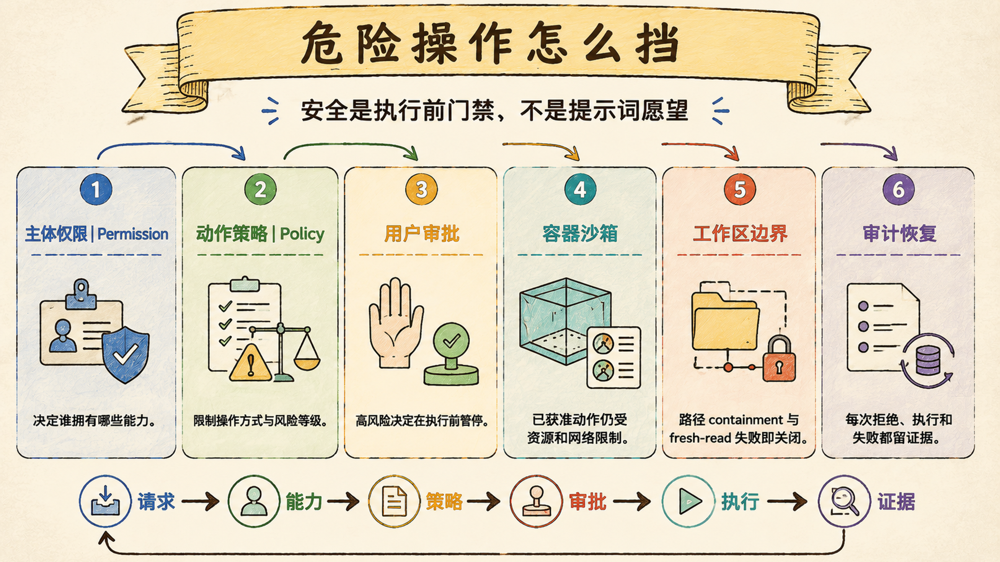
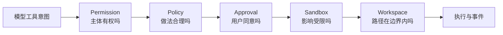

# 权限审批与沙箱：危险操作必须在执行前被挡住

> Last verified against: `codex/release-v7-rewrite@8ac5dea` (2026-07-23)

安全不是 system prompt 里的一句“请谨慎”，而是模型无法绕过的执行前门禁与执行后证据。

## 五道门回答五个不同问题

任何一层拒绝，都应在副作用发生前返回可解释的工具错误。

把它们合并成一个 `allowed` 布尔值，会丢掉责任边界和审计原因。

## 第一层：Permission 决定主体能力

`PermissionChecker` 根据运行模式、工具风险和调用者范围做原始授权。

| 模式 | 文件编辑 | 普通 Shell | 危险 Shell |
| --- | --- | --- | --- |
| `default` | 请求审批 | 请求审批 | 请求审批 |
| `accept_edits` | 自动允许 | 请求审批 | 请求审批 |
| `auto` | 自动允许 | 自动允许 | 仍请求审批 |
| `plan` | 禁止 | 禁止 | 禁止 |

只读工具通常直接允许，但 `plan` 的只读不是 prompt 约定，而是 host 强制检查。

子 Agent 还可以携带 `write_scope`，写入目标必须落在允许的子树内。

`approval_policy=never` 是硬拒绝，优先于自动模式。

`knowledge_learn` 和 `remember` 会改变用户拥有的长期状态，即使自动模式也必须审批。

## 第二层：Policy 约束动作方式

Permission 回答“能不能做”，Policy 回答“现在这样做是否合规”。

`ToolPolicyChecker` 当前包含几类关键规则：

- 修改已有文件前必须有新鲜读取；
- 普通 workspace 读取应使用结构化工具，不借 shell 绕行；
- 禁止从 shell 扫描文件系统根目录；
- `curl`、`wget` 必须带连接与总超时；
- 当前 turn 没选择 Web retrieval 时，shell 不能偷开网络通道。

新鲜读取由 workspace 指纹跟踪。

文件被外部修改或时间戳变化后，旧读取不再足以授权写入。

这会带来额外重读，但比基于陈旧内容盲改更安全。

## 第三层：Approval 把高风险决定交给用户

需要审批的调用会进入 `ApprovalManager` 队列，并发出 `ApprovalRequiredEvent`。

执行端等待最长 300 秒，每秒检查取消状态。

用户可以选择：

| 选择 | 当前语义 |
| --- | --- |
| `once` | 只批准这一次 |
| `session` | 当前 session 内复用同一 pattern |
| `always` | 当前实现仍等同于 session，不跨 session 持久化 |
| `deny` | 拒绝并返回工具错误 |

`knowledge_learn` 与 `remember` 的 `session/always` 会被降级为 `once`。

这是刻意的 durable-state 防线，不能被一次宽泛批准永久放开。

普通工具的 session pattern 通常绑定工具名；shell 则绑定规范化命令的摘要。

因此批准一条 shell 命令，不会自动批准参数不同的另一条命令。

## 危险命令识别是加固层，不是完整 shell 解析器

当前内置模式覆盖递归删除、硬重置、强推、`chmod 777`、远程脚本管道、`sudo`、写入 `/etc` 或 SSH 目录、停止 compose、强杀进程等 11 类动作。

即使 `permission_mode=auto`，命中这些模式也会回到审批。

正则识别适合拦截已知高危形态，却不能证明未命中命令一定安全。

所以它必须与 sandbox、workspace path 和最小权限共同工作。

## 第四层：Sandbox 限制已经获准的动作

审批回答“用户是否同意”，沙箱回答“同意后最多能影响哪里”。

`SandboxPort` 是 host 与执行环境之间的小契约。

`LocalWorkspaceSandbox` 适合可信开发环境，仍直接使用宿主机资源。

`ContainerWorkspaceSandbox` 则以容器隔离文件与进程边界：

- root filesystem 只读；
- workspace 是唯一可写 bind mount；
- network 关闭；
- PID、内存与 CPU 有上限；
- 容器使用后负责终止和回收。

容器实现存在不等于生产门禁已经完成。

目标环境仍需验证 Docker 权限、并发隔离、资源限制、残留清理和逃逸测试。

## 第五层：Workspace 与持久化路径 fail closed

`WorkspaceContext.path` 会解析绝对路径、`..` 和符号链接，再要求结果仍在 workspace root 内。

持久化层还使用目录 fd、`O_NOFOLLOW`、regular-file 检查和 hardlink 拒绝。

SQLite 等关键文件会核对设备号与 inode，防止打开过程中的替换竞态。

这些检查解决的是不同攻击面：

| 防线 | 主要风险 |
| --- | --- |
| root-relative path | `../../` 路径逃逸 |
| `O_NOFOLLOW` | 符号链接指向敏感文件 |
| `st_nlink == 1` | 硬链接复用外部 inode |
| device/inode 复核 | 检查后、使用前被替换 |
| 安全目录权限 | 其他本机用户篡改运行数据 |

## 为什么不是最小 allow/deny

最小门禁只在工具上标一个 `risky`，然后询问用户。

它无法表达 plan mode、子 Agent scope、先读后写、命令级批准与容器影响范围。

| 维度 | Sage | 对标系统 |
| --- | --- | --- |
| 权限模式 | default、accept_edits、auto、plan | Claude Code、CodeBuddy 都提供授权模式，命名和精确语义不同 |
| 工作流策略 | 新鲜读取、结构化搜索、网络选择门禁 | 对标系统有宿主策略，但内部规则通常不可验证 |
| 审批复用 | once/session；always 暂等同 session | 成熟产品常支持规则化批准，持久范围依产品配置 |
| 执行隔离 | Local 与 Container 通过统一 port | 对标系统有本机或隔离执行，具体隔离强度取决于环境 |
| 路径防护 | resolve、nofollow、hardlink、inode 多层校验 | 对标产品不会完整公开本地持久化防护细节 |
| 当前差距 | Container 仍需目标环境生产验证；always 未持久化 | 成熟产品在跨平台 sandbox 运维上经验更充分 |

安全比较必须落到可验证的威胁模型，不能只比较“是否弹审批框”。

## 系统级失败模式

### 1. 只靠 prompt 约束 plan mode

最危险的不是模型偶尔忘记，而是注入内容可以直接说服模型越过只读承诺。

### 2. 审批发生在参数归一化之前

最危险的不是展示格式不同，而是用户看到的参数与 host 最终执行的参数不一致。

### 3. Session approval 绑定过宽

最危险的不是少弹一次框，而是批准一条无害命令后，参数变化仍继承授权。

### 4. 把危险正则当完整安全证明

最危险的不是漏掉一个别名，而是未命中被解释为“命令安全”，绕过其他防线。

### 5. Local sandbox 被当成生产隔离

最危险的不是性能下降，而是任意命令仍拥有宿主进程能访问的资源。

### 6. 容器结束但资源没有回收

最危险的不是留下容器名称，而是残留进程、挂载或磁盘持续影响后续用户。

### 7. 路径校验与文件打开分离

最危险的不是一次失败，而是攻击者在检查后替换链接或 inode，形成 TOCTOU 绕过。

## 设计文档补充：危险操作防线

### 目标

- 所有副作用都在 host 边界接受检查；
- 批准对象与最终执行对象稳定绑定；
- 即使用户批准，执行影响仍被 sandbox 与路径边界限制；
- 所有拒绝、超时、取消都进入事件与审计链。

### 非目标

- 不把危险命令正则当 shell 形式化验证；
- 不宣称 Local sandbox 提供生产隔离；
- 不宣称 `always` 已跨 session 持久化；
- 不允许 durable learning 使用 session 级宽泛授权。

### 验收清单

- [ ] 四种 permission mode 的风险矩阵均有测试；
- [ ] plan mode 与 write scope 在 host 层拒绝；
- [ ] auto 模式仍拦截危险 shell；
- [ ] 新鲜读取失效后写操作被拒绝；
- [ ] shell 批准绑定精确规范化命令；
- [ ] 停止 session 会唤醒并拒绝待审批项；
- [ ] Container 默认无网络、只读 root、资源受限；
- [ ] symlink、hardlink 与 inode 替换均 fail closed。

## 第一入口

按这个顺序读源码：

1. `core/coding/tool_executor/permissions.py::PermissionChecker.check`：主体与模式授权；
2. `core/coding/tool_executor/policy.py::ToolPolicyChecker.check`：工作流策略；
3. `core/coding/tool_executor/approval.py::ApprovalManager`：审批生命周期；
4. `core/coding/tool_executor/approval.py::check_dangerous_command`：已知高危模式；
5. `core/coding/tool_executor/executor.py::ToolExecutor.execute`：门禁顺序；
6. `core/harness/container_sandbox.py::ContainerWorkspaceSandbox`：容器执行边界；
7. `core/coding/context/workspace.py::WorkspaceContext.path`：工作区路径边界。

验证证据集中在 `test_permissions.py`、`test_policy.py`、`test_approval.py`、`test_tool_executor.py`、Container sandbox 与持久化安全测试。

## 面试里可以这样收束

Sage 用 Permission、Policy、Approval、Sandbox 和 Workspace 五道门把模型意图与真实副作用隔开。批准只解决用户意愿，不能替代路径、资源和进程隔离；危险命令即使在 auto 模式也要回到审批，长期记忆写入更只能逐次批准。安全因此是执行边界的可验证行为，不是 prompt 里的自律要求。

下一章：[Skills 与命令系统：经验沉淀为可复用能力](07-skills-commands.md)
