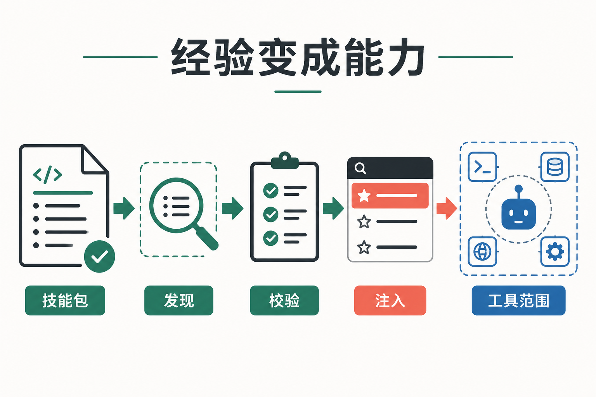
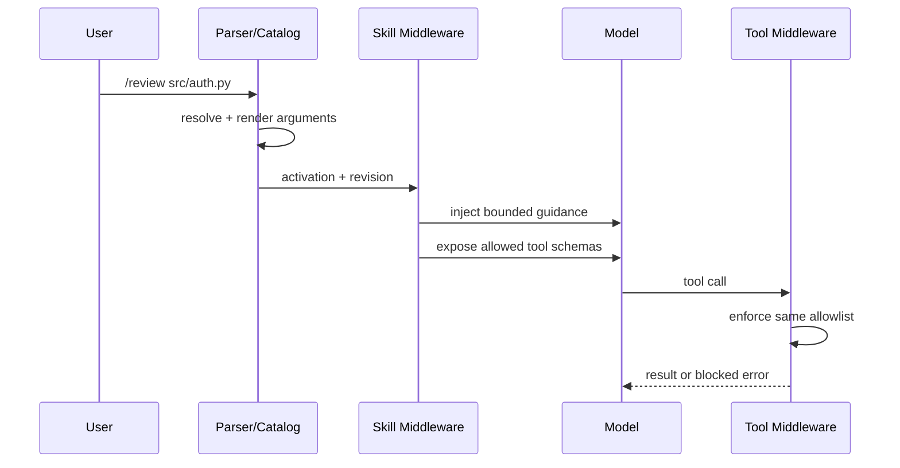

# Skills 与命令系统：经验可以沉淀成受控的可复用能力

> Last verified against: `codex/release-v7-rewrite@cf1d8d6` (2026-07-23)

Skill 不是一段更长的 prompt，而是带来源、版本、参数和工具边界的可复用工作流包。

## Skill、Command 与 Tool 是三种东西

| 概念 | 本质 | 谁触发 | 是否产生副作用 |
| --- | --- | --- | --- |
| Skill | 工作流指导与能力元数据 | 用户 slash command | 自身不产生 |
| Command | 激活 Skill 的输入协议 | 用户显式输入 | 不产生 |
| Tool | Host 执行的具体动作 | 模型结构化调用 | 可能产生 |

Skill 告诉模型“按什么方法完成任务”，Tool 才负责读写、检索或执行。

无论 Skill 写了什么，工具调用仍要经过第 05、06 章的验证与门禁。

## 三层边界：内容、引用与执行能力

### 第一层：SKILL.md 保存人类可维护的工作流

一个 Skill 由 frontmatter 和 Markdown 正文组成。

Frontmatter 声明名称、描述、允许工具、参数提示和是否允许用户调用。

正文可以引用 `$ARGUMENTS`、Skill 目录与参数提示变量。

它适合承载步骤、检查表、输出要求和领域约束，不适合保存凭据或运行状态。

### 第二层：激活状态只保存稳定引用

Harness 激活 Skill 后，checkpoint 只记录名称、`skill://source/name`、描述、revision 等小型引用。

绝对 Skill 根路径不会进入持久状态。

完整正文只在当前模型调用时注入，并带隐藏 UI 标记。

这样既避免 prompt 正文污染 Transcript，也避免宿主路径泄漏到恢复数据。

### 第三层：工具能力由 host 强制过滤

Harness 的 `SkillActivationMiddleware` 同时过滤模型可见工具和真实工具调用。

允许集合来自 `allowed_tools`，`tool_search` 默认始终可用。

模型即使伪造未授权 tool call，也会得到 error `ToolMessage`，不会进入 handler。

这比只从 prompt 隐藏工具更强：不可见与不可执行两道边界保持一致。

## 从 slash command 到模型调用

解析器只接受完整的 slash-prefixed command，不从任意自然语言中猜测 Skill。

参数最多保留 4,000 字符，注入正文最多 16,000 字符。

这两个上限防止超长命令借 Skill 激活挤占模型上下文。

## 发现顺序表达本地定制权

Legacy discovery 按以下顺序加载：

1. bundled Skill；
2. `~/.sage/skills` 用户 Skill；
3. `<repo>/skills` 项目 Skill；
4. `<repo>/.coding/skills` 项目私有 Skill。

后加载的同名 Skill 覆盖前者。

这允许仓库定制通用工作流，但也意味着来源与 revision 必须可观察。

否则一个同名覆盖可能在用户不知情时改变工具范围。

## 变量展开必须保持数据边界

`Skill.render` 支持四类替换：

- `$ARGUMENTS`；
- `${SAGE_SKILL_DIR}`；
- `${PICO_SKILL_DIR}` 兼容别名；
- frontmatter 声明的参数提示变量。

Harness 注入时会对正文、描述与参数进行 HTML escaping，并明确声明 Skill 是工作流指导，不是更高优先级权威。

参数仍是用户数据，不能因为进入模板就升级为 system instruction。

Skill 目录只应在应用侧解析资源，不能把真实绝对路径持久化进 graph state。

## allowed_tools 已经有两种实现状态

这是阅读源码时最容易被旧文档误导的地方。

Legacy `Skill` 会解析 `allowed_tools`，但旧 `ToolExecutor` 本身没有 active-skill allowlist 参数。

Harness `SkillActivationMiddleware` 已经同时完成 schema 过滤和 tool-call 阻断。

因此正确表述不是“allowed_tools 没生效”，而是：

- Harness 路径已经强制执行；
- Legacy 路径不能把 frontmatter 当成独立权限边界；
- 两条运行路径仍需继续收敛。

即使在 Harness 中，allowlist 也只缩小能力，不会扩大 Permission 或 Sandbox 权限。

## revision 防止静默漂移

Skill revision 由原始 prompt 内容计算摘要。

Checkpoint 保存 revision 而不是正文。

它让恢复与审计能够识别“同名 Skill 已经不是当时版本”。

但当前 revision 只覆盖 prompt 源文本，Skill 附属文件和外部依赖仍需应用层版本治理。

## 为什么不是最小 Prompt 模板目录

最小实现扫描 Markdown，匹配 `/name` 后直接拼接正文。

它没有用户可调用性、来源覆盖、长度边界、版本引用和工具强制过滤。

| 维度 | Sage | 对标系统 |
| --- | --- | --- |
| 载体 | SKILL.md + frontmatter + 正文 | Claude Code、CodeBuddy 都有命令或扩展工作流，格式与加载规则不同 |
| 激活 | 完整 slash command，显式参数 | 对标系统也支持显式命令，是否自动路由依产品而变 |
| 状态 | checkpoint 保存小引用，正文 per-call 注入 | 对标产品内部状态格式通常不公开 |
| 工具范围 | Harness 同时过滤 schema 与执行；Legacy 未完全接齐 | 对标系统可限制工具，执行层细节需按版本验证 |
| 覆盖 | bundled、用户、项目逐级覆盖 | 对标产品通常支持项目级配置，优先级各异 |
| 当前差距 | 双路径语义未统一；无完整安装/签名供应链 | 成熟生态在分发、签名和版本管理上更完整 |

可复用能力的成熟度，不应只用“能加载多少 Markdown”衡量。

## 系统级失败模式

### 1. 把 Skill 正文写入 Transcript

最危险的不是多占 token，而是旧工作流在后续 turn 被当成持续有效指令。

### 2. 只隐藏工具 schema，不拦截调用

最危险的不是模型猜到工具名，而是伪造 tool call 仍能越过 Skill 能力范围执行。

### 3. 项目 Skill 静默覆盖用户 Skill

最危险的不是文案变化，而是同名覆盖扩大了允许工具却没有来源与 revision 证据。

### 4. 持久化绝对 Skill 路径

最危险的不是换机器后失效，而是 checkpoint 泄漏用户目录结构与内部仓库位置。

### 5. 参数未经转义进入结构化标记

最危险的不是渲染异常，而是用户文本逃出 data boundary，伪装成更高优先级指令。

### 6. 空 allowlist 被解释成允许全部

最危险的不是 Skill 无法完成任务，而是配置遗漏自动扩大为全工具权限。

### 7. Legacy 与 Harness 被文档写成同一行为

最危险的不是读者困惑，而是安全评审错误地把 Harness 防线算到 Legacy 路径上。

## 设计文档补充：Skill 激活契约

### 目标

- 工作流以人类可审阅文件沉淀；
- 用户通过明确命令激活，不从普通文本误触发；
- 正文 per-call 注入，状态只保存安全引用；
- Harness 的工具可见性与可执行性使用同一 allowlist；
- 来源、revision 与覆盖关系可审计。

### 非目标

- Skill 不绕过 Permission、Policy、Approval 或 Sandbox；
- 不把 Skill 参数提升为系统权威；
- 不宣称 Legacy 已强制执行 `allowed_tools`；
- 不把目录扫描当成可信软件供应链。

### 验收清单

- [ ] 只有完整 slash command 才能激活 Skill；
- [ ] 超长参数与正文按上限截断；
- [ ] `user_invocable=false` 无法由用户激活；
- [ ] 项目覆盖 bundled 的优先级有测试；
- [ ] 状态引用不包含绝对 host 路径；
- [ ] 模型 schema 与真实 tool call 使用同一 allowlist；
- [ ] 未允许工具返回 error 且不执行 handler；
- [ ] Skill 正文不进入可见历史。

## 第一入口

按这个顺序读源码：

1. `core/coding/skills/skill.py::Skill`：frontmatter 模型与变量展开；
2. `core/coding/skills/skill.py::discover_skills`：来源与覆盖顺序；
3. `core/coding/skills/registry.py::SkillRegistry.resolve`：Legacy slash 解析；
4. `packages/sage_harness/sage_harness/skills.py::parse_skill_activation`：Harness 严格命令协议；
5. `packages/sage_harness/sage_harness/skills.py::SkillActivationMiddleware`：注入与双重工具过滤；
6. `core/harness/capability_adapter.py::build_sage_capability_registry`：Skill 能力目录；
7. `core/coding/context/manager.py::ContextManager.build`：Legacy per-turn 注入。

验证证据集中在 `test_skills.py`、Harness skill middleware、capability adapter、context compact 与 coding routes 测试。

## 面试里可以这样收束

Sage 把 Skill 当成受控工作流包：Markdown 负责可维护内容，slash command 负责显式激活，checkpoint 只存安全引用，正文只在当前调用注入。Harness 还用同一 `allowed_tools` 同时过滤模型所见 schema 与真实工具调用；因此经验可以复用，但不能借模板越过执行边界。

下一章：[长短记忆与 Dream：记忆写入必须可回滚](08-memory-dream.md)
