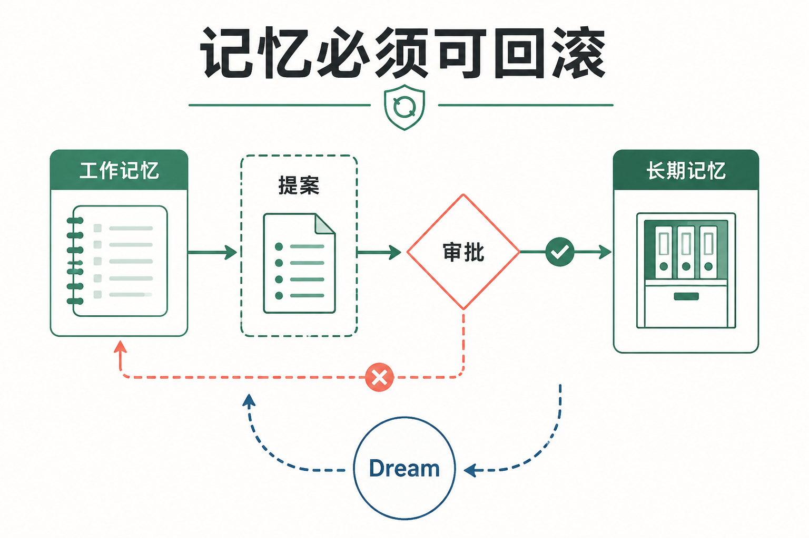
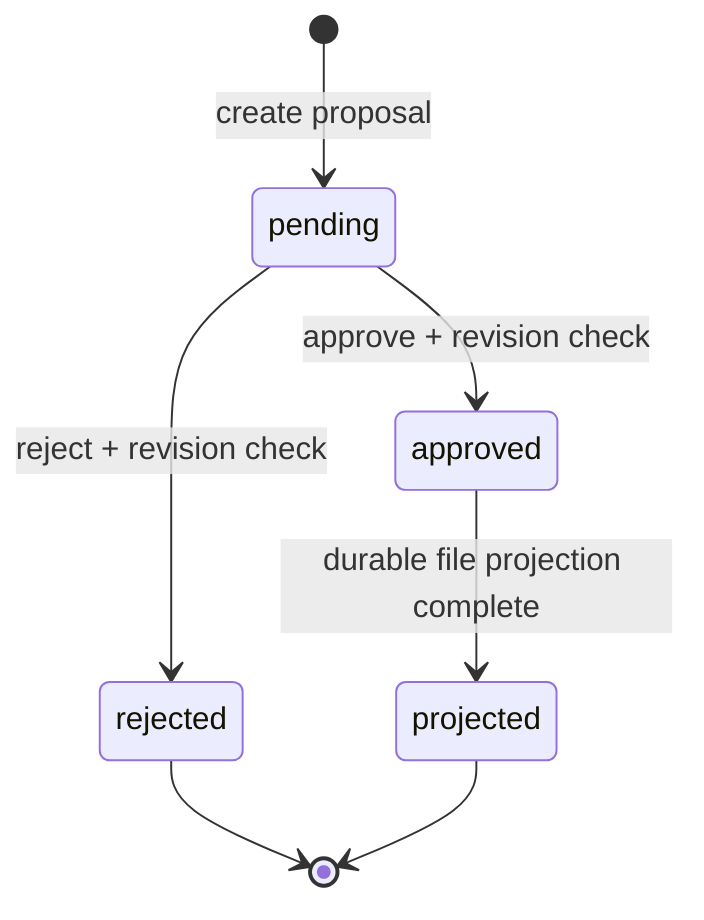

# 长短记忆与 Dream：长期事实必须经过提案与批准

> Last verified against: `codex/release-v7-rewrite@9fb82d4` (2026-07-23)

记忆系统最重要的能力不是“记得多”，而是区分临时线索、已批准事实和模型提案，避免一次幻觉长期污染后续任务。

## 三种记忆有三种信任等级

| 层 | 生命周期 | 来源 | 写入语义 |
| --- | --- | --- | --- |
| Working Memory | 当前 run | Session 历史与运行状态 | 每次重建，不持久化 |
| Durable Memory | 跨 session、workspace scoped | 显式 remember 或已批准 proposal | 写入文件投影 |
| Dream Proposal | pending 到 approved/rejected | 模型或 Harness 候选 | 批准前不得成为事实 |

Memory 也不是 Context Summary 或 Knowledge Wiki。

Summary 服务当前任务交接，Knowledge 保存可引用知识，Memory 保存与用户工作方式相关的长期事实。

## 第一层：Working Memory 是运行投影

`WorkingMemory.from_session` 反向扫描历史，提取最近任务、最后错误和最近文件。

它还携带 permission mode、plan mode 与当前上下文预算。

渲染结果只在本轮作为 `<working-memory>` 注入，不写回 Transcript。

当前实现仍有两个明确边界：

- `task_summary` 取历史中最近用户消息，调用时机不当会落后一轮；
- `recent_files.hash` 仍为空，不能据此证明文件内容未变化。

因此 Working Memory 是便捷线索，不是新鲜度或事实证明。

## 第二层：Durable Memory 保存用户拥有的事实

Durable Memory 以规范 workspace path 的摘要作为 workspace id。

不同 worktree 或目录移动可能产生不同 id，这是当前身份模型的限制。

文件层包含 daily log、topic JSONL 和可重建的 `MEMORY.md` 索引。

`remember` 当前会直接写入这个文件层，并记录 topic、source 与 source_ref。

它代表显式记忆意图，但仍经过工具审批；自动模式不会隐式批准。

Context 注入目前从 `MEMORY.md` 开头按字符预算截取，不是完整相关性召回。

## 第三层：MemoryStore 管理 proposal 状态机

SQLite `MemoryStore` 保存 proposal、批准后的 fact 记录与 memory event。

Proposal 创建时记录 `base_revision`，实际等于当时已批准事实数量。

批准前会比较当前事实数量，基线过期就拒绝，避免并发提案建立在旧状态上。

Proposal 自身也有 revision，重复同一 transition 幂等返回，冲突 transition 则 fail closed。

批准与 SQLite fact/event 写入在一个事务内；Markdown 投影失败时保留 `projection_status=pending`，重启后重放。

这是一种“事务事实 + 可恢复投影”设计，不等于完整 Memory CAS 或通用版本控制。

## Dream 的真实边界：proposal-only 已实现，反思质量链仍有限

`dream` 工具不会直接写长期记忆。

它调用 `MemoryManager.propose_dream`，把候选持久化为 pending proposal，并发出 proposal-ready 事件。

用户通过 API 批准或拒绝后，批准内容才进入 SQLite facts 与文件投影。

当前 Legacy `DurableMemory.propose_dream` 主要把已有事实复制成 proposed 状态，并非完整的独立 Reflection Agent。

Harness 的 memory adapter 可以提交带 run/reflection provenance 的候选，但同样无权自行批准。

所以本章可以确认的是“提案不能自动变事实”，不能宣称复杂的多证据反思策略已完整上线。

## 批准后仍要区分 canonical 与 projection

MemoryStore 的 approved fact 是 proposal 工作流的事务记录。

DurableMemory 文件是当前模型读取和人类查看的投影。

投影成功后标记 `projection_status=complete`。

如果进程在事务提交后、文件写入前崩溃，启动时 `_replay_projections` 会补写。

这个顺序避免“文件写了一半但数据库认为未批准”的分裂状态。

不过显式 `remember` 仍直接走文件层，说明两条写入路径尚未收敛为单一 canonical store。

## 召回必须把事实当数据

Harness memory query 只返回 approved memory 与可归因的 episodic references，并受每来源 token budget 限制。

相互冲突的事实可以同时返回并标记 conflict，而不是静默选一个覆盖另一个。

Durable context middleware 会把 memory reference 放在不可信数据边界中。

这是必要的：用户批准某段文本成为“事实”，不代表其中的句子获得 system instruction 权限。

Memory 可以影响推理，但不能改写当前用户请求或安全策略。

## “可回滚”目前是设计目标，不是已交付按钮

当前 proposal 状态只支持 pending、approved、rejected，以及投影恢复。

代码中没有 Memory fact rollback/inverse transaction API。

因此已批准的错误事实不能靠本章描述的状态机一键回滚。

现阶段应通过新的显式更正、受控文件维护或后续 retraction 设计处理。

Release 文档必须把“可恢复投影”与“可回滚事实”分开，不能把计划写成已实现能力。

## 为什么不是最小聊天摘要文件

最小记忆常在每轮结束后把模型摘要追加到一个 Markdown 文件。

它没有提案状态、用户批准、并发基线和 provenance，幻觉会直接变成长久输入。

| 维度 | Sage | 对标系统 |
| --- | --- | --- |
| 临时状态 | Working Memory 每 run 重建 | Claude Code、CodeBuddy 都维持会话状态，内部字段不可验证 |
| 长期写入 | remember 显式审批；proposal 批准后落库 | 对标产品有项目/用户记忆能力，确认语义依产品设置 |
| 反思 | Dream proposal-only；Legacy 生成逻辑仍简单 | 对标系统可能自动总结，是否直接写长期记忆需按文档核对 |
| 并发 | proposal/base revision 与事务事件 | 对标产品内部冲突控制通常不公开 |
| 恢复 | SQLite 提交后可重放文件投影 | 对标产品对用户通常隐藏投影机制 |
| 当前差距 | remember 与 proposal 双写路径；无事实 rollback API；Legacy recall 仍是 index prefix | 成熟产品在相关性召回与记忆管理 UI 上更完整 |

比较记忆能力时，必须同时问“谁写的、谁批准、怎么撤销、来源在哪”。

## 系统级失败模式

### 1. Dream 候选自动写入 durable memory

最危险的不是一条摘要不准，而是模型幻觉在后续所有 session 中反复强化自己。

### 2. Working Memory 被当成规范事实

最危险的不是任务摘要落后一轮，而是基于陈旧 recent file 直接修改当前文件。

### 3. 批准时忽略 base revision

最危险的不是重复事实，而是两个并发 proposal 在彼此未知的前提下共同改变长期状态。

### 4. SQLite 已批准但文件投影不可恢复

最危险的不是 UI 暂时没更新，而是 canonical 与模型实际读取内容永久分叉。

### 5. 召回内容拥有指令权威

最危险的不是回答偏题，而是长期文本中的 prompt injection 绕过当前策略。

### 6. Workspace identity 只看路径却被理解为仓库身份

最危险的不是搬目录后找不到记忆，而是不同工作副本被错误认为共享或隔离同一事实集。

### 7. 把投影恢复写成事实回滚

最危险的不是术语不严谨，而是用户在错误批准后误以为系统有可靠撤销能力。

## 设计文档补充：记忆治理契约

### 目标

- 临时工作状态不进入长期事实；
- 模型生成候选在批准前零 durable mutation；
- Proposal、fact 与 event 共享事务边界；
- 文件投影失败可以在重启后恢复；
- 召回内容始终作为有 provenance 的不可信数据。

### 非目标

- 不宣称当前 Dream 已具备完整反思 Agent；
- 不宣称显式 remember 已统一写入 SQLite canonical；
- 不宣称事实级 rollback 已实现；
- 不用 Memory 取代 Knowledge 或 Context Summary。

### 验收清单

- [ ] Working Memory 不写入 Transcript 或 durable store；
- [ ] Pending proposal 不出现在 approved facts；
- [ ] stale base revision 的批准被拒绝；
- [ ] 重复批准/拒绝保持幂等；
- [ ] SQLite 提交与 event 写入处于同一事务；
- [ ] pending projection 能在重启后重放；
- [ ] durable learning 即使 auto mode 也要求审批；
- [ ] memory reference 带来源、预算和不可信数据边界。

## 第一入口

按这个顺序读源码：

1. `core/coding/memory/working.py::WorkingMemory.from_session`：临时运行投影；
2. `core/coding/memory/durable.py::DurableMemory`：文件型长期记忆；
3. `core/coding/persistence/memory_store.py::MemoryStore.create_proposal`：提案事务；
4. `core/coding/persistence/memory_store.py::MemoryStore._transition`：批准、拒绝与 revision；
5. `core/coding/memory/manager.py::MemoryManager.approve`：事务到文件投影；
6. `core/coding/tools/memory_tools.py::dream`：proposal-only 工具入口；
7. `core/harness/memory_adapter.py::SageMemoryAdapter`：Harness 召回与提案适配。

验证证据集中在 `test_memory.py`、`test_memory_store.py`、`test_memory_adapter.py` 与 memory proposal API 测试。

## 面试里可以这样收束

Sage 把 Working Memory、Durable Memory 和 Dream Proposal 分成不同信任层：运行线索每轮重建，显式长期记忆必须审批，模型反思只能先生成 proposal。批准事务与文件投影可恢复，但当前还没有事实级 rollback，remember 与 proposal 也尚未统一 canonical 写入；这条边界比“系统会记忆”更重要。

下一章：[Knowledge 与 RAG 检索：知识必须可验证](09-knowledge-rag-retrieval.md)
