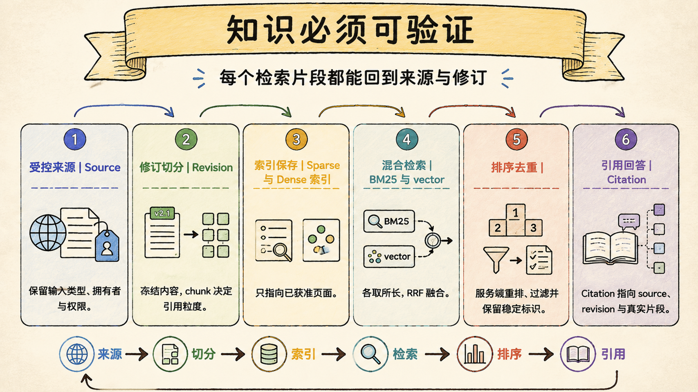
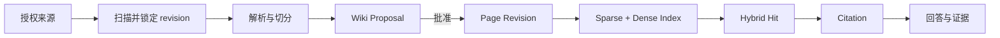

# Knowledge 与 RAG 检索：知识只有带来源与修订才可验证

> Last verified against: `codex/release-v7-rewrite@b1cc150` (2026-07-23)

Knowledge 的核心不是“接一个向量库”，而是让每个检索片段都能回到获准来源、页面修订和实际内容。



## 一条知识链必须同时保留内容与 provenance



链上任何一步只剩“文本”，后面的引用就无法证明自己来自哪个版本。

## 四层事实边界：Source、Proposal、Page、Index

### 第一层：Source 是不可变输入版本

`KnowledgeSourceRoot` 限定服务端可以读取的目录。

Filesystem adapter 扫描时不跟随 symlink，并限制路径、文件大小和批次数量。

`SourceDescriptor` 保存 source key、media type 与基于内容的 revision。

Scan 与 fetch 分离；fetch 时再次核对 revision，文件被替换就拒绝。

当前默认 connector 是受控文件系统。

`source_kind=web` 也可能只是本地 HTML，不代表已开放任意 URL 抓取。

### 第二层：Proposal 是待审阅变化

解析器把 Markdown、HTML 或受限 PDF 转成规范文档和 parse artifact。

结果不会直接覆盖 Wiki，而是创建 `KnowledgeProposal`。

Proposal 绑定 source revision、parse provenance、目标路径与 base page revision。

Policy 可以自动应用低风险本地私有来源，其余来源、综合与 rollback 通常要求审阅。

### 第三层：Page Revision 是获准知识

批准后产生新的 page revision，并写入 Git-backed Wiki 投影。

页面文件方便人工审查，SQLite 保存 proposal、revision、policy、artifact、索引与事件状态。

Git commit、content hash 与数据库 revision 共同连接人类可读投影和事务元数据。

页面变化后，基于旧 `base_page_revision` 的 proposal 会冲突，而不是静默覆盖。

### 第四层：Index 是可重建检索投影

`LocalKnowledgeIndex` 从获准 page revision 构建 chunk 与索引。

索引丢失可以由 canonical page/revision 重建，它不是知识事实源。

每个 chunk 保留 heading/page 定位、content hash、source revision、page revision 和 proposal id。

检索结果因此不仅有分数，还有稳定 provenance。

## 切分策略决定引用粒度

`chunk_document` 按 heading-aware 结构切分，稳定输入应产生稳定 chunk id。

Chunk 太大，引用虽完整但上下文成本高；太小，句子会失去前后因果。

Sage 的测试关注三个属性：

- 同一 revision 重复切分结果稳定；
- chunk 保留原始 block evidence；
- citation 能回到 source/page 双 revision。

Chunking 不是预处理杂务，而是 citation 的最小审计单位。

## 当前 Hybrid Retrieval 是本地基线

默认 backend id 是 `sqlite-fts5+hashing`。

它组合 SQLite FTS5 sparse ranking、确定性 hashing embedding 与 Reciprocal Rank Fusion。

```text
RRF score = Σ 1 / (k + rank_i)
```

RRF 使用名次融合，避免把 FTS 分数与 dense 相似度直接相加。

Sparse 擅长路径、函数名和精确术语；dense 分支补充相近表达。

但 hashing embedding 不是生产语义模型。

当 `supports_semantic_recall=false` 时，dense 主要在 sparse 候选中辅助排序，不能宣称实现了完整语义召回。

PostgreSQL/pgvector 是可替换后端方向，不是当前默认事实。

## Citation 必须由服务端命中生成

稳定 citation 至少关联：

- `citation_id` 与 `chunk_id`；
- `content_hash`；
- `page_id` 与 `page_revision`；
- `source_id` 与 `source_revision`；
- 相对路径、heading 或 PDF page；
- visibility 与 proposal/artifact 关联。

回答中手写一个 `[source]` 字符串不会自动成为有效引用；服务端必须能把 citation id 解析回当前索引中的真实 hit，并保留取回时的 revision。

Retrieval bundle 还受 token budget 限制，截断不能丢掉 citation identity。

## Source Proposal 与 Wiki Proposal 不能合并

Source Proposal 回答“这份外部材料能否成为受控来源”。

Wiki Proposal 回答“从材料解析出的内容能否改变长期页面”。

前者绑定 owner、workspace、thread、run、artifact hash 和目标 root。

后者绑定 source revision、parse artifact 和 page base revision。

如果合并，一次“允许读取材料”会被错误升级为“允许修改长期知识”。

## Rollback 也是新 proposal

Knowledge 已实现 page rollback proposal。

它指定目标 revision，并要求当前 page revision 匹配预期值。

批准后不是删除历史，而是追加一个 `change_kind=rollback` 的新 page revision。

这样当前内容恢复到旧版本，历史与审计链仍完整保留。

这与第 08 章尚未实现的 Memory fact rollback 不同，不能跨模块借用结论。

## Knowledge、Memory 与 Learning Evidence 不互相自动升级

| 事实层 | 保存内容 | 进入方式 |
| --- | --- | --- |
| Knowledge | 可引用来源与获准页面 | source + parse + proposal + approval |
| Memory | 用户偏好与长期工作事实 | 显式记忆或 memory proposal |
| Learning Evidence | 一次实践对掌握度的证据 | run/artifact/citation |
| Context Summary | 当前任务交接 | 运行时投影与压缩 |

一次检索命中不证明用户学会，一次练习通过也不应自动改写 Knowledge。

跨事实层变化必须有明确 proposal 与 provenance。

## 为什么不是最小向量库问答

最小 RAG 把文件切块、生成 embedding，然后返回 top-k 文本。

它通常没有来源批准、页面修订、rollback 和稳定 citation 身份。

| 维度 | Sage | 对标系统 |
| --- | --- | --- |
| 来源 | 授权 root、不可变 revision、fetch 复核 | Claude Code 可读取项目文件，CodeBuddy 有知识/代码检索；长期来源治理细节不同 |
| 写入 | Source 与 Wiki 两级 proposal | 对标产品可能自动索引，审批与页面投影不一定同构 |
| 检索 | FTS5 + hashing + RRF 本地 baseline | 成熟产品常使用生产 embedding/reranker，召回质量通常更强 |
| 引用 | chunk/source/page 多 revision provenance | 对标产品会展示文件引用，稳定 revision 契约需按产品核对 |
| 回滚 | 追加 rollback page revision | 对标知识库通常有版本历史，具体事务语义不公开 |
| 当前差距 | 默认非 pgvector；任意 Web/Git connector 未开放；质量仍需 benchmark | 成熟产品在语义模型、连接器和大规模索引上更完整 |

Sage 的优势是事实边界可审计，不能因此掩盖当前检索模型仍是本地基线。

## 系统级失败模式

### 1. Scan 后不复核 source revision

最危险的不是解析旧文件，而是 proposal 声称来自一个 hash，实际读取了另一个版本。

### 2. 允许来源等同于允许写 Wiki

最危险的不是页面变多，而是未审阅的模型总结直接进入长期知识事实。

### 3. Chunk 丢掉 page/source revision

最危险的不是 citation 显示不全，而是答案无法证明命中的是哪个历史版本。

### 4. 手写引用被当成服务端证据

最危险的不是格式伪造，而是模型可以凭空创造看似可信的 citation。

### 5. Hashing dense 被宣传成完整语义检索

最危险的不是指标一般，而是产品决策基于不存在的召回能力。

### 6. Index 被当成 canonical store

最危险的不是重建慢，而是索引损坏后连获准页面与 revision 也无法恢复。

### 7. Rollback 覆盖或删除旧 revision

最危险的不是少一版内容，而是审计链失去“为什么恢复、从哪恢复”的证据。

## 设计文档补充：可验证检索契约

### 目标

- 来源读取受 root 与 revision 约束；
- 未批准解析结果不能改变长期 Wiki；
- Index 可重建，Citation 可回到双 revision；
- 检索 bundle 有预算但不丢 provenance；
- Rollback 追加新 revision，不改写历史。

### 非目标

- 不把 `web` source kind 写成任意 URL connector；
- 不把 hashing embedding 写成生产语义检索；
- 不让 Knowledge 自动修改 Memory 或掌握度；
- 不把手写 citation 当服务器命中证据。

### 验收清单

- [ ] Source path、symlink、size 和 count 均受限；
- [ ] Fetch revision 与 scan revision 不一致时拒绝；
- [ ] Proposal stale base page revision 时冲突；
- [ ] 稳定输入产生稳定 chunk/citation id；
- [ ] Hit 保留 source/page revision 与 content hash；
- [ ] RRF 对 sparse+dense 双命中给出稳定排序；
- [ ] Retrieval bundle 严格执行 token budget；
- [ ] Rollback 产生新 revision 并保留历史。

## 第一入口

按这个顺序读源码：

1. `core/knowledge/store.py::KnowledgeStore.ingest`：来源到 Wiki proposal；
2. `core/knowledge/sources/filesystem.py::FilesystemKnowledgeSourceAdapter`：受控来源；
3. `core/knowledge/parsing/registry.py::KnowledgeParserRegistry`：解析器选择；
4. `core/knowledge/retrieval.py::chunk_document`：稳定切分与 provenance；
5. `core/knowledge/index.py::LocalKnowledgeIndex.search`：本地混合检索；
6. `core/knowledge/store.py::KnowledgeStore.propose_rollback`：版本恢复；
7. `core/harness/knowledge_adapter.py::SageKnowledgeAdapter.search`：Harness evidence 适配。

验证证据集中在 Knowledge store、retrieval、filesystem source、jobs、source proposal 和 Harness adapter 测试。

## 面试里可以这样收束

Sage 的 Knowledge 链把授权来源、不可变 source revision、解析 proposal、获准 page revision、可重建索引和稳定 citation 串在一起。默认检索只是 FTS5 + hashing + RRF 的本地基线，但每个命中都能回到来源与页面版本；因此系统可以诚实评估召回质量，也能在页面回滚时保留完整历史。

下一章：[受限子 Agent：委派不能等于复制全部权限](10-subagents-research.md)
