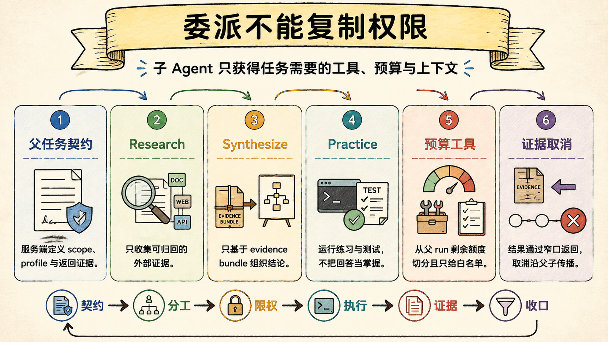
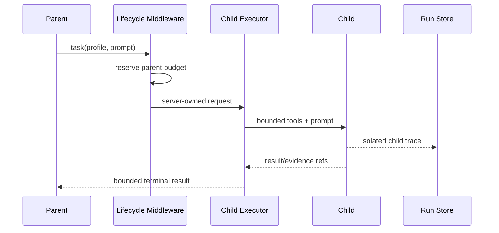

# 受限子 Agent：委派不能复制父任务的全部权限

> Last verified against: `codex/release-v7-rewrite@1e9828d` (2026-07-23)

子 Agent 的价值是拆分认知工作，不是再造一个拥有父 Agent 全部工具、预算和上下文的副本。

## 委派是一份服务端契约

父模型只能请求 `subagent_type`、任务描述和问题。

真正的工具范围、token、步骤、超时、深度和 child id 由 host 决定。

模型不能通过 tool args 自行扩大 profile。

Executor 会再次验证请求工具是否是服务端 allowlist 的子集，并要求 `depth == 1`。

## 三类专用 profile

| Profile | 工具范围 | Token / Step / Timeout | 主要产物 |
| --- | --- | --- | --- |
| Research | 本地只读 + 可用的 Knowledge/Web ports | 24k / 16 / 180s | evidence refs 与简报 |
| Synthesize | 仅 `read_evidence_bundle` | 16k / 8 / 90s | 有引用的综合 |
| Practice | 读、搜、写、patch、shell | 24k / 20 / 300s | 测试 receipt 候选 |

Profile 是否暴露取决于真实 port 可用性。

没有 Knowledge 和 Web 时不暴露 Research；没有 EvidenceBundlePort 时不暴露 Synthesize。

Practice 可用不代表自动写入：它仍经过 Permission、Policy、Approval、Sandbox 和取消检查。

## 第一层边界：父子状态隔离

Child 有独立的 `child_run_id`、trace 和 result artifact。

ID 由 thread、parent run 和 tool call id 稳定推导，不接受模型自定义。

父 timeline 接收状态、简报、usage、result ref 与 evidence refs。

Child 的完整 prompt、网页正文、工具参数和中间 history 不应平铺进父 context。

这既控制 token，也避免把不可信网页内容直接升级到父 Agent 指令空间。

隔离不是隐藏所有证据；父 Agent通过稳定引用按需读取受控 bundle。

## 第二层边界：预算来自父 run 的剩余额度

`SubagentLifecycleMiddleware` 在执行前预留 child token、model call 和 tool call。

默认一个 parent graph 最多并发 3 个 child、每 run 最多 6 个、最大深度 1。

如果父 run 有显式总限额，child profile 预算还会被剩余额度压低。

多 child 同批请求时，预算按剩余 slot 分配；低于最小 reservation 的任务被丢弃。

这防止父模型用并行委派绕过总预算。

Provider 未返回 usage 但已经发生模型调用时，child 按预留 token fail closed 结算。

## Research：只收集服务端可归因证据

Research 固定为只读 workspace 工具，并按 port 可用性增加 `knowledge_search`、`search_web`、`fetch_web`。

它不能写文件、运行 shell、写 Memory/Knowledge 或再次委派。

Evidence ref 只从指定成功工具结果中提取。

Query 与 source fingerprint 绑定 parent run，用于跳过同一父任务里的重复检索。

新 parent run 可以重新检索时效性证据，不被旧 fingerprint 永久抑制。

Web 内容仍是不可信数据，Research 只能引用工具实际返回的 citation id。

## Synthesize：没有 bundle 就不能综合

Synthesize 只有一个工具：`read_evidence_bundle`。

请求必须携带成功 Research child ids 和 evidence refs，并属于同一 parent thread/run。

EvidenceBundlePort 负责验证引用、按来源去重并执行 token budget。

Child 必须成功读取非空 bundle，否则终态为 `evidence_bundle_not_read`。

这条 fail-closed 规则阻止模型根据 brief 或裸 citation 编造综合结论。

Synthesize 没有网络、文件、shell、持久化或递归委派能力。

## Practice：模型回答不是掌握证据

Practice 可以在既有 workspace 策略下完成小型代码练习并运行确定性测试。

只有服务端记录的 test command receipt 才能产生 `MasteryEvidenceCandidate`。

候选当前只支持 `code_test`，结果为 pass 或 fail，source ref 使用 `subagent://`。

命令用 `|| true` 掩盖退出码、后台运行或缺少可验证结果时，不产生 mastery evidence。

模型说“测试通过”或“用户已掌握”都不算证据。

候选仍等待未来 Mastery Ledger 决策，不直接提高学习状态。

## 取消必须沿父子关系传播

父 run 取消或 child 超时会设置 child cancel event。

Child 的 ToolExecutor 在每次动作前后检查 stop 状态。

终态归一为 `cancelled` 或 `timed_out`，携带明确 error code。

这是一种同进程协作取消，不是操作系统级强杀。

已进入不可中断底层调用的动作可能延迟响应，Sandbox 仍需负责资源终止。

## 为什么不是最小并行模型调用

最小实现用 `gather` 并行调用多个 LLM，再拼接字符串结果。

它没有独立 run、预算 reservation、工具 scope、证据 bundle 与取消传播。

| 维度 | Sage | 对标系统 |
| --- | --- | --- |
| Profile | Research/Synthesize/Practice 服务端固定 | Claude Code、CodeBuddy 有子任务/Agent 能力，profile 细节依版本而变 |
| 权限 | 工具 allowlist + 既有执行门禁 | 对标系统通常限制子 Agent 工具，是否双重校验不公开 |
| 预算 | 父 run 预留 token/model/tool，限制并发与总数 | 对标系统会管理并行与成本，内部 reservation 契约不可验证 |
| 证据 | child trace 隔离，父只收 bounded refs/result | 对标系统会回传摘要，证据 provenance 粒度不同 |
| Practice | 仅服务器 test receipt 产生候选 | 对标系统可执行测试，但“掌握证据”是 Sage 特定领域模型 |
| 当前差距 | 同进程取消可能延迟；无持久后台 child；跨 child 文件协调有限 | 成熟产品在长时后台任务与分布式调度上更完整 |

并发数不是能力指标；权限和证据边界才决定委派是否可靠。

## 系统级失败模式

### 1. 模型可自定义 child tool scope

最危险的不是多用一个工具，而是父 Agent 借委派绕过自身 Permission 或 retrieval gate。

### 2. Child 正文直接进入父 timeline

最危险的不是 context 膨胀，而是不可信网页 prompt injection 跨越子任务隔离。

### 3. Child 预算不计入 parent run

最危险的不是账单偏高，而是无限并行委派使总步骤与 token 门禁失效。

### 4. Synthesize 在空 bundle 上继续

最危险的不是答案笼统，而是模型把裸 citation 和 child brief 伪造成证据综合。

### 5. Practice 使用模型自评

最危险的不是分数乐观，而是学习状态与任何可复现结果脱钩。

### 6. 父取消不传播

最危险的不是 UI 还显示运行，而是 child 继续访问网络、写文件或消耗预算。

### 7. 多个 Practice child 同时修改同一文件

最危险的不是 merge 冲突，而是各自验证的测试结果对应不同中间状态。

## 设计文档补充：受限委派契约

### 目标

- Profile、工具与预算由 server 所有；
- Child trace 与父 context 隔离，证据通过稳定引用回传；
- 子预算计入父 run 总额；
- Research/Synthesize 在证据边界上 fail closed；
- Practice 只产出可复现测试候选。

### 非目标

- 不支持递归 child 委派；
- 不把同进程取消描述成强杀；
- 不把模型结论升级为 mastery evidence；
- 不承诺后台 child 跨进程持久运行。

### 验收清单

- [ ] 请求工具必须是 server profile 的子集；
- [ ] `depth != 1` 被拒绝；
- [ ] 并发、每 run 总数和父预算均受限；
- [ ] Child id 对同一 tool call 稳定；
- [ ] 父 timeline 不包含 child 原始网页正文；
- [ ] Synthesize 必须读取非空授权 bundle；
- [ ] 掩盖退出码或后台测试不生成 mastery candidate；
- [ ] 父取消与 timeout 产生明确 child 终态。

## 第一入口

按这个顺序读源码：

1. `packages/sage_harness/sage_harness/subagents/contracts.py::SubagentProfile`：服务端 profile；
2. `packages/sage_harness/sage_harness/subagents/middleware.py::SubagentLifecycleMiddleware`：预算与生命周期；
3. `packages/sage_harness/sage_harness/subagents/tool.py::build_task_tool`：父任务入口；
4. `core/harness/subagent_adapter.py::build_coding_subagent_config`：动态能力；
5. `core/harness/subagent_adapter.py::CodingSubagentExecutor.execute`：child 执行；
6. `core/harness/evidence_bundle.py::CodingEvidenceBundlePort.read`：受控证据；
7. `core/harness/subagent_adapter.py::_practice_evidence_candidate`：测试 receipt 候选。

验证证据集中在 subagent executor、adapter、evidence bundle 与 profile parity 测试。

## 面试里可以这样收束

Sage 的子 Agent 是受限委派，不是父 Agent 克隆：profile、工具、预算和深度由服务端固定，child 有独立 trace，父任务只接收有界结果和证据引用。Research 只收集可归因证据，Synthesize 无 bundle 就失败，Practice 只有服务器记录的测试 receipt 才能形成掌握证据候选。

下一章：[持久 Timeline 与断线重连：连接断开不等于任务消失](11-timeline-reconnect.md)
