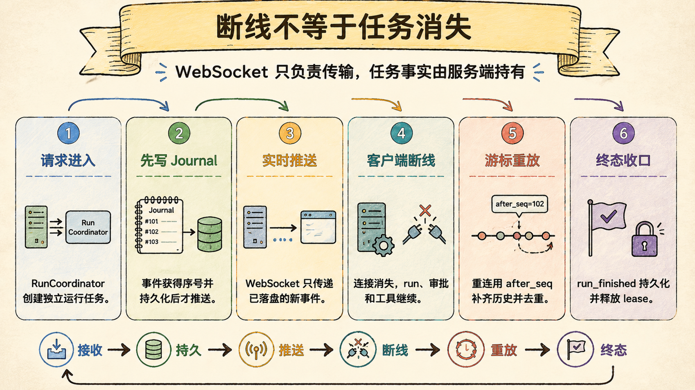
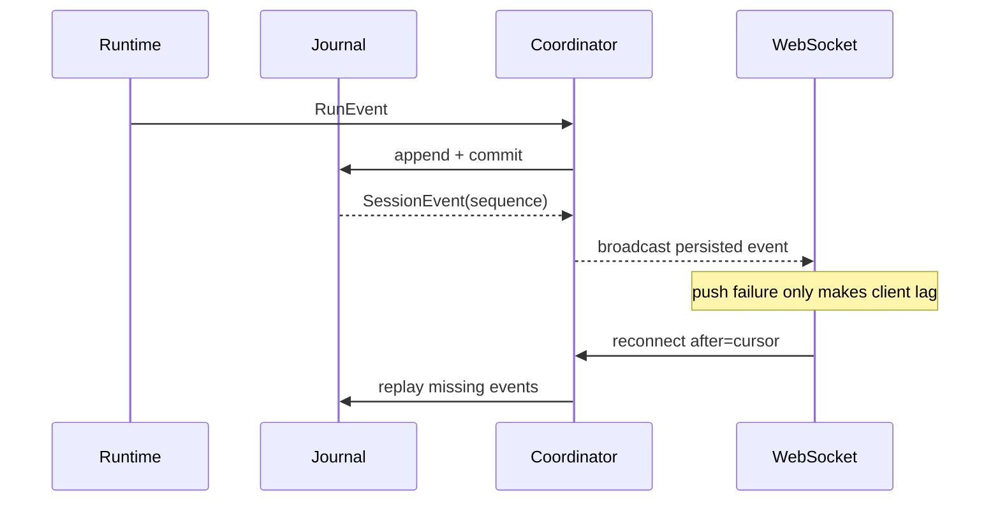

# 持久 Timeline 与断线重连：连接断开不能带走任务事实

> Last verified against: `codex/release-v7-rewrite@0d56d91` (2026-07-23)

WebSocket 只是事件传输通道，run、审批和工具证据必须由服务端持有并先写入持久 Timeline。

## 先分清三个生命周期

| 对象 | 生命周期 | 断线后的行为 |
| --- | --- | --- |
| WebSocket subscription | 一次连接 | 结束，可重新建立 |
| Run task | 服务端运行 | 继续执行，除非显式取消或进程退出 |
| SessionEventJournal | Session 持久事实 | 保留，可按 cursor 重放 |

把三者绑在一起，用户切换页面就等于取消任务；把它们拆开，UI 只是事实的一个观察者。

## 第一层：Journal 是 Timeline 事实源

`SessionEventJournal` 使用 SQLite 保存完整 typed event。

每条事件至少有 `sequence`、`event_id`、session、run、kind、status、timestamp 与 payload。

三个数据库约束承担核心可靠性：

- `sequence` 单调递增，作为 replay cursor；
- `event_id` 唯一，重复投递保持幂等；
- 每个 run 的 terminal 唯一，不能既 completed 又 cancelled。

Journal 还保存 active run lease、fencing token、pending approval、Thread Goal 与后续回执。

这些都不是 WebSocket 内存状态。

## 第二层：RunCoordinator 独立持有执行

`RunCoordinator.start_run` 先取得数据库 lease，再创建消费 event stream 的 asyncio task。

Subscriber 可以有零个、一个或多个，不影响 active task 所有权。

显式 `cancel(run_id)` 才会取消匹配任务，并持久化 terminal。

取消 subscriber 只从集合移除队列，不取消 run。

这条边界保证切换 session、浏览器休眠或短暂网络故障不会改变任务语义。

## Persist-then-push 是不可反转的顺序

如果先 push 后 persist，客户端可能看见一个数据库中不存在的工具结果。

刷新后事件消失，用户会看到历史倒退。

先持久化则把网络失败降级为客户端暂时落后，重连仍能补齐。

## 无缝重放要同时解决漏与重

`subscribe(after)` 不是简单“查数据库再监听队列”。

Coordinator 在 `publish_lock` 内读取 high-water sequence 并注册 subscriber。

然后按页重放 `(after, high_water]`，最后切到 live queue。

Live event 若 `sequence <= cursor` 就去重。

若 sequence 跳跃或 queue 溢出，Coordinator 从 Journal 补读到目标 sequence。

空闲轮询也会检查最新 sequence，确保没有广播的已提交事件仍可被发现。

因此 correctness 来自 Journal + cursor，queue 只是低延迟通知。

## Lease 与 fencing 阻止幽灵写入

每次开始或恢复 run 都取得 owner-bound lease 和递增 fencing token。

后续 append 必须匹配 owner 与 token。

假设旧 task 在取消后迟到返回工具结果，新 owner 已经恢复 session。

没有 fencing，旧 task 仍可能污染新状态；有 fencing，过期 writer 会被拒绝。

Terminal append 与 lease release 在同一数据库事务中完成。

这样终态可见时，run 所有权也同步结束，不留下可争抢的中间窗口。

## 进程重启有两种恢复语义

普通未完成 run 在进程重启后不会假装继续执行。

`recover_interrupted_runs` 释放废弃 lease，并追加 retryable `interrupted` terminal。

这是诚实失败：用户可重试，但系统不伪造已经恢复的工具栈。

带 durable pending approval 的 graph run 是例外。

Journal 能恢复审批 payload，应用重新构造 runtime，并通过 `start_existing_run` 从 checkpoint 继续。

Terminal run 不会再暴露 stale recoverable approval。

这修正了旧文档“服务器重启一定丢 pending approval”的过时结论，但恢复仍依赖可用 checkpoint。

## Timeline API 同时支持前进与历史浏览

前进重放使用 `after` cursor，适合重连追新事件。

历史浏览使用 `before` 或 `tail`，适合长 session 的首屏和向上翻页。

三种 pagination mode 互斥，limit 上限为 500。

响应同时返回 next、older 与 latest cursor，前端不需要用数组长度猜位置。

Messages API 只是 user/assistant 投影，完整工具与审批 UI 必须使用 Timeline API。

## Event idempotency 不等于业务幂等

相同 `event_id` 重写不会产生第二条记录。

但若调用方为同一业务动作生成两个不同 id，数据库仍会把它们当作两件事。

关键事件因此使用可推导 ID，例如 run terminal、workspace diff、goal follow-up。

业务幂等必须由稳定 identity 与唯一约束共同保证，不能只依赖客户端不重试。

## 为什么不是最小 WebSocket 消息缓存

最小实现把事件保存在前端数组，断线后重新请求聊天消息。

它恢复不了工具、审批、usage、子 Agent 与 terminal 的精确顺序。

| 维度 | Sage | 对标系统 |
| --- | --- | --- |
| Run ownership | 服务端 task 与 DB lease，不依赖连接 | Claude Code 以进程/终端为主；CodeBuddy 的后台任务模型依产品形态而变 |
| Replay | 单调 cursor + persist-then-push + gap repair | 对标产品会恢复历史，底层游标与竞态算法通常不公开 |
| 幂等 | event id、terminal unique、稳定业务 id | 对标系统内部事件约束不可从 UI 推断 |
| 旧写防护 | owner lease + fencing token | 分布式系统常用 lease/fencing，对标实现细节不公开 |
| 审批恢复 | Durable approval + graph checkpoint 可恢复 | 对标产品是否跨重启恢复审批需按版本验证 |
| 当前差距 | 普通中断 run 不续跑；长 Timeline 性能仍需压测；多进程部署门禁需持续验证 | 成熟后台任务平台在跨进程调度与运维上更完整 |

可靠性比较应以断线、进程崩溃和重复投递测试为准，而不是“页面看起来还在”。

## 系统级失败模式

### 1. WebSocket disconnect 自动取消 run

最危险的不是用户要重试，而是网络抖动悄悄改变了任务业务语义。

### 2. Push 先于 persist

最危险的不是少一条日志，而是客户端看见过的事实在刷新后从历史中消失。

### 3. 重放与订阅之间有竞态窗口

最危险的不是重复渲染，而是某个 tool result 永远既不在 replay 也不在 live queue。

### 4. Terminal 可以写入两次

最危险的不是状态闪烁，而是 completed 与 cancelled 同时成为规范事实。

### 5. 旧 owner 没有 fencing token

最危险的不是迟到事件，而是已取消 task 在新 run 开始后继续写入同一 session。

### 6. Pending approval 与 checkpoint 分离

最危险的不是审批卡片丢失，而是恢复时对另一个 tool call 应用了旧决定。

### 7. 前端只用 messages API 重建界面

最危险的不是工具折叠状态丢失，而是用户看不到审批、错误和实际执行证据。

## 设计文档补充：持久 Timeline 契约

### 目标

- Run 与连接生命周期解耦；
- 所有可见非流式事实先持久化再广播；
- 重放与实时切换不漏、不重，可修复 gap；
- Run terminal 唯一，过期 owner 无法写入；
- 可恢复审批与 graph checkpoint 保持同一 run identity。

### 非目标

- 不承诺普通进程中断后自动续跑；
- 不用 subscriber queue 作为事实源；
- 不让 messages 投影代替完整 Timeline；
- 不把 event-id 幂等夸大为所有外部副作用幂等。

### 验收清单

- [ ] 重启后 sequence 与 event id 保持稳定；
- [ ] 重复 event id 不产生重复行；
- [ ] 同一 run 只能有一个 terminal；
- [ ] subscribe 能覆盖 replay/live 交界事件；
- [ ] queue gap 可从 Journal 补读；
- [ ] 旧 fencing token 写入被拒绝；
- [ ] WebSocket 关闭不取消 active run；
- [ ] Terminal 后 stale approval 不可恢复。

## 第一入口

按这个顺序读源码：

1. `core/coding/persistence/session_event_journal.py::SessionEventJournal`：事件与 lease 事实；
2. `core/coding/run_coordinator.py::RunCoordinator.start_run`：服务端持有 run；
3. `core/coding/run_coordinator.py::RunCoordinator.subscribe`：replay/live 桥接；
4. `core/coding/run_coordinator.py::RunCoordinator._persist`：persist-then-push；
5. `core/coding/run_coordinator.py::RunCoordinator.recover_interrupted_runs`：重启收口；
6. `api/coding.py::coding_timeline`：分页 API；
7. `api/coding.py::coding_timeline_websocket`：cursor 订阅入口。

验证证据集中在 session event journal、run coordinator、runtime lifecycle、timeline routes 与 coding route 重连测试。

## 面试里可以这样收束

Sage 把 WebSocket 降级为观察通道，把 Journal 作为 Timeline 事实源，把 run 所有权交给服务端 Coordinator。事件先持久化再广播，重连用 high-water、cursor 和 gap repair 衔接历史与实时；lease 与 fencing 拒绝过期写入，普通崩溃诚实标记 interrupted，而 durable approval 可依 checkpoint 恢复。

下一章：[安全审计与防注入：不可信内容必须被当成数据](12-security-audit.md)
