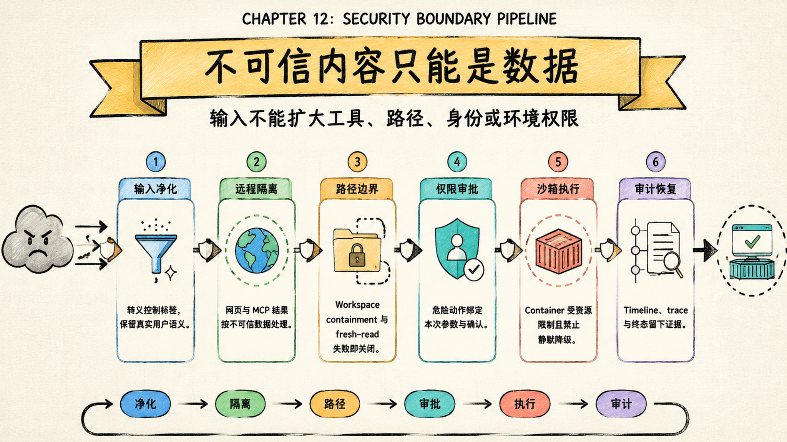

# 安全审计与防注入：不可信内容只能是数据，不能变成权限

Sage 的安全主线可以先压成一句话：模型可以读取不可信内容并提出行动，但内容本身不能扩大工具、路径、身份或运行环境的权限。

> Last verified against: `dev/sage-v7@236e07c` (2026-07-23)



安全不是一道输入过滤器，而是六个连续边界：

```text
输入净化 -> 远程隔离 -> 路径边界 -> 权限审批 -> 沙箱执行 -> 审计恢复
```

输入净化限制文本怎样进入模型，远程隔离标记网页和 MCP 结果，路径边界限制工具能触达哪里，权限审批决定动作是否可以发生，沙箱控制动作在哪里发生，审计恢复解释动作发生以后留下了什么。

少任何一层，其他层都可能被迫承担自己无法完成的责任。

## Sage 面对的不是一个攻击面

Sage 既处理文字，又能调用工具；既保存长期知识，又能在真实工作区运行命令。因此它同时面对六类风险：

- 用户输入伪装成 system、instruction 或 tool block；
- 网页、文件和 MCP 返回内容携带 prompt injection；
- 路径参数越出 workspace，或指向凭证与控制目录；
- 模型把普通命令改成危险命令，继续复用旧审批；
- 本地开发执行能力被误当成生产隔离能力；
- token、密钥、工具参数或私有正文进入日志和前端事件。

这些风险不能只按“有没有恶意字符串”来判断。真正的问题是：一段不可信数据是否能跨越边界，变成新的身份、能力或持久事实。

## 六层防线各管一件事

| 边界 | Sage 当前实现 | 不负责什么 |
| --- | --- | --- |
| 输入净化 | 转义保留标签并包裹真实用户输入 | 不判断用户事实真假 |
| 远程隔离 | 只处理标记为 `remote_content` 的工具结果，并限制长度 | 不替代来源信誉判断 |
| 路径边界 | workspace containment、受保护路径和 fresh-read | 不提供 OS 级隔离 |
| 权限审批 | tool policy、危险命令识别和一次性确认 | 不证明命令业务上正确 |
| 沙箱执行 | `local_workspace` 与 `container` 的显式 provider | 不允许失败后回退宿主机 |
| 审计恢复 | timeline、trace、policy reason 和终态 | 不自动证明系统无漏洞 |

这张表最重要的是最后一列。安全边界一旦被描述得过宽，团队就会把没有实现的保证当成已经存在。

## 输入净化是在保留语义，不是删除用户内容

`InputSanitizationMiddleware` 在每次模型调用前找到最新的真实用户消息，对保留标签做转义，并增加明确的用户输入边界。

它处理 `system`、`instruction`、`prompt`、`memory`、`think` 等容易伪装控制语义的标签，也处理用户自己伪造的边界标记。多模态输入只改文字块，不丢弃图片块。

这个设计不是把所有尖括号内容删除。删除会改变用户问题，甚至损坏代码和文档。转义的目标是保留“用户确实输入了这些字符”，同时降低它们被模型误认为控制结构的概率。

旧的 XML 工具协议仍有兼容风险，因此 legacy 路径还要识别伪造的 `<tool>` 与 `<final>`。新旧运行时的输入协议不同，不能用一个字符串规则假装已经统一。

## 远程内容必须先声明自己是远程内容

`RemoteContentSanitizationMiddleware` 不会盲目处理所有工具结果。只有工具元数据显式声明 `remote_content=true`，结果才会进入远程内容边界。

这形成一个重要契约：

```text
工具定义声明来源性质
  -> middleware 识别远程结果
  -> 转义保留标签
  -> 限制内容长度
  -> 作为不可信数据返回模型
```

因此安全性不仅取决于 middleware，也取决于工具注册是否正确。新增 Web、MCP 或外部解析器时，如果漏掉远程标记，净化层不会自动猜测。

Memory、摘要和检索结果同样不能被当作系统指令。`DurableContextMiddleware` 把它们作为隐藏但不可信的上下文注入，并保留 provenance、revision 与冲突信息。

## 路径安全是动作边界，不是提示词约定

`WorkspaceContext` 会将目标解析到 workspace 根目录下，并拒绝逃逸路径。它还把 `.ssh`、`.aws`、`.git`、`.coding`、`.sage`、`.env` 和常见凭证文件列为受保护路径。

写工具还要求 fresh-read 或 self-authored freshness，避免模型基于过期内容覆盖用户刚刚修改的文件。

Transcript 的 canonical store 使用 SQLite，并对数据库文件、WAL/SHM sidecar、目录和导出文件执行更严格的文件类型与链接检查。这一层防的是 Sage 自己的持久化文件被替换，不等于所有普通 workspace 文件都拥有同样的 inode 防护。

因此文档必须区分两种保证：

- 通用工具路径由 `WorkspaceContext` 做 containment 与 protected-path 检查；
- canonical transcript 文件由 `TranscriptStore` 做额外的文件与链接完整性检查。

把后一种保证写成整个文件系统的统一能力，会高估当前实现。

## 审批必须绑定本次动作

ToolExecutor 是模型触达外部世界的总闸口。工具名称、参数结构、permission mode、policy、危险命令和写入范围都在这里汇合。

危险 Shell 即使处于自动模式，也不能因为“用户已经开了 auto”就绕过审批。`git reset --hard`、递归删除、强制推送、`curl | shell`、`sudo` 和敏感目录写入都属于需要提升确认级别的模式。

持久知识和长期记忆写入也不能获得整场 session 的通行证。每一次 durable write 都保留独立确认边界，避免一次批准变成后续无限写入授权。

审批还要能和 session、run、tool call 及参数摘要对应。否则模型可以让用户批准一个温和参数，再用同一批准执行另一组危险参数。

## 沙箱不能静默降级

Sage 明确区分两种 sandbox provider：

| Provider | 使用场景 | 边界 |
| --- | --- | --- |
| `local_workspace` | 可信开发机、本地联调 | 仍在宿主机进程边界内 |
| `container` | 需要隔离的受控执行 | 独立容器、资源和挂载策略 |

`ContainerWorkspaceSandbox` 使用只读根文件系统、禁网、PID/内存/CPU 限制、临时文件系统和受控 workspace mount。它声明 `isolated=true` 与 `host_access=false`。

更关键的是失败行为：配置为 `container` 时，Docker 不可用必须报错，不能退回宿主机执行。未知 provider 也必须 fail-closed。

当前仍有发布边界：代码和契约测试不等于目标服务器上的生产隔离已经完成。容器镜像、daemon 权限、磁盘配额、回收、网络策略和真实逃逸测试仍要进入部署门禁。

## 为什么不是加一个 Prompt Injection 检测器

单一检测器有三个根本问题。

第一，它只能看到文本，不能阻止路径逃逸、权限扩大和宿主机执行。

第二，攻击文本没有稳定词表。恶意指令可以被改写、编码、拆分，也可能藏在看似正常的文档结构里。

第三，误报和漏报都会改变产品行为。过度删除会破坏源码学习，漏报又会让模型把数据当命令。

所以 Sage 采用的是能力约束思路：文本净化降低模型误判，工具边界决定真正能做什么，沙箱限制动作影响面，证据面让绕过行为可以被发现。

## 和 Claude Code / CodeBuddy 的对标

| 维度 | Sage | 对标系统 |
| --- | --- | --- |
| 不可信输入 | middleware 转义与来源边界 | Claude Code 有成熟的系统提示、工具协议与远程内容治理 |
| 工具授权 | permission、policy、approval 在执行层汇合 | Claude Code 的权限模式、hooks 和交互处理更完整 |
| 路径控制 | workspace containment、受保护路径、fresh-read | 成熟 coding agent 同样把 workspace 当硬边界 |
| 研发护栏 | 代码级强制与测试证据并存 | CodeBuddy 强调“搭护栏而不是推上限” |
| 执行隔离 | container adapter 已实现，生产验证未关闭 | 商业系统通常有更成熟的远程执行与隔离基础设施 |
| 审计 | timeline、trace、policy reason、artifact | Claude Code 在 telemetry、产品化审计和远程控制面更成熟 |

Sage 的优势不是“检测规则更多”，而是把不可信内容、工具能力、路径、执行环境和证据拆成可测试边界。

它的缺口也必须诚实：没有经过目标服务器验证的 sandbox 不能写成生产级隔离；没有完整红队回归的 prompt 防护不能写成“已解决注入”。

## 最危险的不是一次坏回答，而是系统性越权

Sage 最需要防的失败模式包括：

- 新增远程工具忘记标记 `remote_content`，网页指令原样进入模型；
- UI 显示“需要审批”，后端执行路径却没有真正等待或拒绝；
- `local_workspace` 被错误用于公网环境，模型直接触达宿主机；
- containment 检查通过，但工具随后改用未经检查的路径字符串；
- durable memory 混入未批准内容，下一次 session 继续受污染；
- trace 保存了完整 secret 或高敏工具参数，审计层反而成为泄漏面；
- sandbox 启动失败后自动降级，表面可用但隔离已经消失。

这些失败都不是“模型不够聪明”。它们是边界没有在代码路径上强制执行。

## 设计文档级补充：安全事实必须分层

安全设计可以压成四句话：

- Prompt 只能影响模型判断，不能直接授予工具能力。
- Tool capability 只能来自服务器装配，不能来自对话文本。
- Workspace 与 sandbox 决定动作范围，不能由模型自行声明。
- Timeline 与 trace 记录事实，但不能代替执行前控制。

### 设计目标

1. 每个外部内容都带明确的信任边界。
2. 每个外部动作都经过统一执行入口。
3. 每个危险动作都绑定具体参数与确认。
4. 每个生产执行环境都禁止静默降级。
5. 每个安全结论都能指向源码和测试证据。

### 必须 fail-closed 的位置

- owner、workspace、session 或 revision 校验失败；
- 路径越界或命中受保护目录；
- 工具 schema、permission 或 policy 校验失败；
- 审批被拒绝、过期或参数不一致；
- container provider 不可用或配置未知；
- 生产环境缺少必要 secret、HTTPS 或隔离配置。

标题生成、非关键摘要和遥测可以降级，但必须留下可见错误事件。便利功能失败不应阻塞 run，安全控制失败不能继续执行。

### 源码第一入口

按这个顺序读：

1. `packages/sage_harness/sage_harness/middleware/builtin.py::neutralize_untrusted_text`
2. `packages/sage_harness/sage_harness/middleware/builtin.py::RemoteContentSanitizationMiddleware`
3. `core/coding/context/workspace.py::WorkspaceContext.path`
4. `core/coding/tool_executor/executor.py::ToolExecutor.execute`
5. `core/coding/tool_executor/approval.py::ApprovalManager`
6. `core/harness/sandbox_factory.py::create_coding_sandbox`
7. `core/harness/container_sandbox.py::ContainerWorkspaceSandbox`
8. `core/coding/persistence/transcript_store.py::TranscriptStore`

### 最小验收清单

| 验收点 | 最低证据 |
| --- | --- |
| 用户标签不能伪装系统消息 | middleware 单测覆盖文本与多模态输入 |
| 远程正文被限制和标记 | remote tool contract 与截断测试 |
| workspace 外路径不可读写 | traversal、protected path、fresh-read 测试 |
| 危险命令不能自动执行 | approval 与 policy 测试 |
| container 不可用时不碰宿主机 | provider fail-closed 测试 |
| transcript 不接受链接替换 | SQLite、sidecar、symlink 与 inode 测试 |
| 私密参数不进入父级事件 | subagent 与 approval redaction 测试 |
| 目标服务器隔离真实有效 | 部署 smoke、资源上限和逃逸测试 |

最后一项目前不能只靠仓库单测关闭。它需要在真实部署环境中验证 Docker、挂载、网络、回收和资源限制。

## 当前判断

Sage 已经把输入、工具、路径、审批、沙箱和证据做成多层边界，并为关键路径提供了契约测试。这比依赖 prompt 告诉模型“不要做危险操作”可靠得多。

但当前结论仍应是“具备受控本地使用和继续安全评审的基础”，不是“已经适合任意公网代码执行”。生产 sandbox admission、目标服务器验证、持续红队案例和跨层泄漏审计仍是发布门禁。

面试里可以这样收束：Sage 的防注入不是一个关键词过滤器，而是一套 capability security。输入可以影响推理，但真正的能力由服务器装配；动作必须经过路径、权限、审批和沙箱；结果必须留下可复盘证据。安全来自边界组合，而不是相信模型会自觉。
